# ARC-07 · DEFINITIVO #4 — IL VIAGGIO A 1.000 ANNI FA
## Il Portale della Forgia Eterna — Hammerfist ≈372 DR, il duello con Skullcrusher, il Rubino

> ⭐ **MASTER DEFINITIVO — fast-play cinematografico (D1: una sessione).** Non
> un dungeon completo: una **sessione-leggenda** a montaggio, con **un solo
> scontro tattico** (il duello con Skullcrusher) reso a qualità AP. Benchmark di
> craft: il **Palio di Channathgate** (`09_.../…PALIO-DM-MASTER-REFERENCE.md`)
> — matrice di conseguenze, asse temporale, spotlight per PG.
> **Sostituisce e fonde**: `_ARCHIVIO/PortaleForgia-P5-FASTPLAY.md` (master da tavolo B3),
> `PortaleForgia-P5-DEFINITIVO-PARTE1/2.md` (prosa e dialoghi estesi),
> `PortaleForgia-P5-B4-CARRYOVER-Forgia-Ricorda.md` (il ponte «la Forgia
> ricorda le ferite», valori DM-approved), `Bestiario/villain/Salvatore/Salvatore.md`
> (**Vatore**, Sal a −1000), MAP 7 di `Mappe/_ARCHIVIO/TACTICAL-GRIDS-COMPLETE.md`.
> Deprecati a valle: `P5-RICALIBRATO`, la sezione «battaglia antica» di `P6`.
>
> **Sistema: D&D 3.5 SRD** (max PF1e), MAI 5e. Italiano, **CD** non DC. Il
> viaggio è a **1.000 anni prima ≈372 DR** (D7). Scala mappe **1,5 m/quadretto**.
>
> **Stato al tavolo**: si gioca **dopo** la resurrezione di Hella (master #3):
> il party è di **4 PG** (Hella tornata), **APL 13 pieno**. Alla vittoria il
> **Rubino** si accende e riporta i PG al 1372 → **master #5** (raccordo al
> Cuore della Montagna). **Canone**: la Corona ha Topazio + Smeraldo (aprono il
> portale del Tempo); il **Rubino si accende SOLO alla vittoria antica** (D5/D16).
>
> <!-- storico -->
> 🧭 **Riordinato il 2026-09-25, su richiesta del DM.** Il corpo segue l'ordine
> in cui si gioca, dal tramonto all'alba, in tre atti e tredici scene. Ogni PNG
> entra nella scena in cui i PG lo incontrano, con la sua **scheda d'entrata**.
> Le statistiche, l'artefatto di Vatore, le versioni veloci e le mappe stanno
> nelle **Appendici A-D**, su pagine A4 a una colonna. Nella stesura di prima le
> sezioni aggiunte a ogni revisione erano in coda (Balvar, il duello, il
> Rituale, Zog'tar, Vatore), e il consiglio di guerra era un paragrafo dentro la
> pattuglia. Nessun contenuto di gioco è stato tolto. Dieci passi della prosa
> si contraddicevano con l'ordine degli eventi o col canone, e sono stati
> corretti: l'elenco è in §9, «Cosa è cambiato nel riordino».
> <!-- /storico -->

---

## INDICE DEL MODULO

| § | Sezione | Contenuto |
|---|---|---|
| §0 | **Quickstart DM** | dove siete, come si gioca, chi c'è nell'ordine in cui entra, cosa stampare |
| §0-bis | **Quick-Reference** | le CD delle prove, il giro di Skullcrusher, box PF1e |
| §0-ter | **Idee che non sono scritte qui** | assorbi e rilancia; il finisher al giocatore |
| §1 | **Highlight per PG** | il beat di ciascuno dei quattro |
| §2 | **Le zone di Hammerfist ≈372 DR** | atlante: fortezza giovane, mare di tende, mura all'alba |
| §3 | **Atto I · Il tramonto** | Scena 1 il portale e il bosco · 2 la pattuglia di Durin · 3 la porta e la targa · 4 il consiglio di guerra |
| §4 | **Atto II · La notte** | l'orologio della notte · Scena 5 la notte nella fortezza · 6 il mare di tende · 7 la tenda del comando · 8 Zog'tar · 9 Vatore |
| §5 | **Atto III · L'alba** | Scena 10 le mura · 11 il duello con Skullcrusher · 12 il Rituale della Forgia Eterna · 13 il Rubino e il ritorno |
| §6 | **Contingenze & sconfitta** | «se i PG fanno X»; il paradosso; una sconfitta nel passato |
| §7 | **Echo Ledger** | carry-over B4, Vatore→Sal, tono del Rubino |
| §8 | **Avanzamento** | budget PX per scena, tesoro pregenerato |
| §9 | **Ponte + Handout & Asset** | le Cronache, il piano di battaglia, immagini, musica<!-- storico -->, cosa è cambiato<!-- /storico --> |
| App. A | **Statistiche** | Skullcrusher, Zog'tar e le guardie, Durin, Balvar, le creature del campo |
| App. B | **Il Sigillo di Ossidiana** | l'artefatto che Vatore ha appena rubato |
| App. C | **Le versioni veloci** | le stesse scene a montaggio, per chi ha poco tempo |
| App. D | **Mappe** | M7-A Hammerfist · M7-B il cortile · M7-C la tenda del comando |

---

## §0 — QUICKSTART DM

**Dove siete.** La Corona (Topazio + Smeraldo) ha aperto il portale del Tempo
(affresco A6). I **quattro** Custodi — Hella di nuovo tra loro — precipitano
attraverso mille anni e atterrano a **Hammerfist ≈372 DR**: la fortezza è
giovane, le mura nuove, e un'orda primitiva la assedia sotto le ali di un drago
nero. Su una targa di bronzo alle porte, una profezia già incisa parla di
**«Quattro Eroi dal futuro»**. Quei Quattro siete voi: la leggenda che avete
sempre creduto passato è il vostro presente. **Paradosso bootstrap.**

**Come si gioca** *(decisione DM 2026-09-25)*. Il corpo di questo master è
scritto **a scene complete**, nell'ordine in cui si giocano. Gli scontri si
fanno su griglia: la tenda del comando (Scena 8, mappa **M7-C**) e il cortile
del duello (Scena 11, mappa **M7-B**). Le scene senza scontro hanno una prova di
gruppo a CD fissa per un party di 4 all'APL 13: se **almeno due** PG la superano
la scena riesce, altrimenti riesce lo stesso ma con una **complicazione**. Ogni
scena registra un **esito** (► Esito), e gli esiti alimentano il carry-over B4
verso Fauci di Palude (§7).

> 🎚️ **Se hai poco tempo**, ogni scena lunga ha la sua **versione veloce in
> Appendice C**: è la stessa scena a montaggio, in 10-15 minuti. Si possono
> mescolare, scena per scena.

**Chi c'è, nell'ordine in cui entra.** Durin Rocciadura (Scena 2) · Re Thorek I
e Thorgrim Barbadiferro (Scena 4) · Mastro Costruttore Zeth (Scena 5) · Balvar
Fuocospento e Zog'tar Deatheye, nella stessa tenda (Scene 7 e 8) · Vatore
(Scena 9) · Skullcrusher il Nero (Scena 11). Ognuno ha una **scheda d'entrata**
nella sua scena; le statistiche sono in **Appendice A**.

**Cosa stampare.** La Quick-Reference (§0-bis); il **piano di battaglia** di Re
Thorek, da dare al consiglio (Scena 4, handout in §9); l'**Appendice A**; le
**mappe** dell'Appendice D; la tabella **B4** (§7). Le **Cronache dei Quattro
Eroi** i giocatori le hanno già in mano: si consegnano alla soglia, prima di
partire (`DEF-3` §8-ter).

**Come si chiude.** Vinta la battaglia antica, il **Rubino** si accende («Cuore
della Leggenda»): la profezia è compiuta — era sempre stata vostra. La luce vi
strappa al passato. → **master #5: il ritorno a Hammerfist** (riemersione al
Cuore della Montagna, Giorno 3 dell'assedio del 1372).

---

## §0-bis — QUICK-REFERENCE DM (una pagina)

### Le prove di gruppo delle scene a montaggio (party 4, ≥2 successi)
| Scena | Prova | CD |
|---|---|---|
| 3 — la targa | Conoscenze (storia)/Sapienza, o una delle sei porte | 18 |
| 4 — il consiglio | Diplomazia/Intimidire | 20 (16 se hanno il Nome) |
| 6 — il campo | Muoversi Silenz./Nascondersi/Osservare | 20 (−2 se gli aiuti sono dimezzati) |
| 9 — Vatore | Intuizione/Raggirare/Furtività (a seconda dell'approccio) | 18-22 |
| 10 — le mura | Forza / Diplomazia-Guarire / Disattivare (scelta collettiva) | 18 / 18 / 20 |

### Il giro di Skullcrusher (boss, Scena 11) — 3.5, niente 5e
- **Soffio acido** cono 18 m, 12d4, Riflessi CD 24 ½, **ricarica 1/1d4 round**.
- **Full-attack** (se a terra/quota bassa): morso +26, 2 artigli +21, 2 ali +21,
  coda +21.
- **Volo**: resta in quota, picchia e risale (Attacco in Volo) — punisce chi non
  ha gittata/volo.
- **Presenza Terrificante** CD 22 all'ingresso (Volontà o scossi).
- **«La Forgia ricorda»**: CONTA i colpi a segno (ferite ancestrali, N≤3) e
  l'esito → tabella B4 (§7). La Cintura di Tordek **rifiuta** di attivarsi qui.

### 🐾 Supporto Pathfinder 1e (dove il 3.5 è vago) — opzionale, dichiarato
> - **Viaggio nel tempo & paradosso**: il 3.5 non ha regole. Usa il principio
>   **«timeline auto-consistente»** (Novikov): tutto ciò che i PG fanno è
>   *già accaduto* — non possono cambiare che vincono, solo COME. Nessun
>   TS/meccanica: è una **cornice**, non un puzzle da rompere.
> - **Sincronizzazione di Vatore** (Scena 9): danno/marchio inflitto a Vatore a −1000
>   → si manifesta su **Sal nel 1372** (ARC-09). Trattalo come un **legame
>   simpatico** permanente (stile *sympathy/antipathy* narrativo): nessun TS,
>   è un eco garantito. Registra il tipo di segno.

---

## §0-ter — QUANDO UN GIOCATORE HA UN'IDEA CHE NON È SCRITTA QUI

> **Una pagina sola, e serve mentre giochi.** Questo master ha molte vie
> scritte. I giocatori ne troveranno una che non c'è — è quello che si spera —
> e quel momento decide se la serata resta in piedi o si affloscia in un
> «mmh, non credo si possa».

### La regola, dalla skill dello stile: **assorbi, poi rilancia**

`references/style-pillars.md` §Mercer la chiama *«yes-and with teeth»*:
**l'invenzione del giocatore entra nel canone *e* genera una complicazione.**
Non «sì»; non «no». **Sì, e adesso c'è un problema nuovo.**

| Il giocatore dice | ❌ Come si spegne | ✅ Come si assorbe e si rilancia |
|---|---|---|
| *«Conosco un nano di qui — mio bisnonno me ne parlava»* | «Non c'è nessuno così» | «C'è. È il fratello di Durin, e ti riconosce dal naso. **Ma sta sul camminamento est, e stanotte non dovrebbe esserci nessuno lì.**» |
| *«Verso l'olio delle lanterne sulle scale e do fuoco»* | «Non è previsto» | «Funziona: due scale bruciano. **Il fumo sale dritto sul camminamento dove siete voi**, e adesso non vedete chi arriva» |
| *«Grido ai nani che la profezia parla di noi»* | tira Diplomazia | «La linea si rinsalda, +2 morale. **E l'orda sente il nome**: da adesso puntano voi» |
| *«Prendo la lastra di Balvar e la porto via»* | «È troppo pesante» | «Te la carichi. **Pesa, −1 alla DES finché non la posi**, e Balvar adesso sa esattamente dove sei» |

**Il metro, in una riga**: se l'idea è **specifica** e il giocatore accetta che
il mondo reagisca, **funziona**. Se è generica («cerco un modo»), chiedi
*«come, di preciso?»* — e poi funziona.

### Tre cose da non fare, che costano il tavolo

1. **Non chiedere un tiro per dire di no.** Un tiro è una domanda vera solo se
   entrambi gli esiti ti vanno bene. Se l'idea non deve riuscire, dillo e di'
   **perché**, in finzione.
2. **Non far pagare l'ingegno più della forza bruta.** Se spaccare la porta
   costa un round e aprirla con l'astuzia ne costa tre, hai insegnato al tavolo
   a spaccare le porte.
3. **Non salvare la scena scritta.** Se l'idea del giocatore salta un incontro
   che avevi preparato, **è saltato**. Il tempo che avanza lo spendi
   sull'orologio della notte — e i giocatori se ne accorgono, e ti ringraziano.

### 🎁 Il finisher va al giocatore — `[HDYWTDT]`

`style-pillars.md` §Mercer lo chiede per iscritto: al colpo che uccide un boss,
**la narrazione passa a chi l'ha tirato**. In questo master ci sono **due**
punti, e li trovi marcati nel testo:

- `[HDYWTDT — il finisher a chi abbatte Zog'tar]` → Scena 8
- `[HDYWTDT — il finisher a chi abbatte Skullcrusher]` → Scena 11

🔎 **Non è un abbellimento, ed è la quarta cosa dichiarata e mai applicata di
questo repo**: il marcatore `[HDYWTDT]` era a **zero in tutti e nove gli
archi**, benché la skill dica che va scritto *«at boss-death points in
encounter content»*.

⚠️ **Come si fa senza che diventi imbarazzante**: non si dice «descrivi tu».
Si dice **«com'è che lo fai?»**, e si aspetta. Se il giocatore non vuole,
descrivi tu in una riga e vai avanti: è un regalo, non un compito.

---

## §1 — HIGHLIGHT ASIMMETRICI PER PG (i QUATTRO, Hella è tornata)

### 🛡️ THORIK — la profezia fatta carne (Casa di Davide lead)
- È la SUA leggenda: la Corona che porta è la stessa che il nonno di Thorgrim
  perse contro Skullcrusher. Aegis Fang, nelle sue mani e in quelle di Thorgrim,
  **canta la stessa nota** attraverso mille anni. Thorik non compie la profezia:
  **la profezia era sempre stata Thorik.**
- Al duello, **Aegis Fang scaglia la Cicatrice Ancestrale** (Scena 11): è il gesto che
  segna Skullcrusher e, mille anni dopo, Fauci (carry-over B4).

### 🌙 HELLA — la seconda vita alla prova (BG3 lead — il ritorno che conta)
- È il suo **primo scontro da risorta**: Ibrido Treant, Collana, Durik al
  fianco. Il DM lo faccia pesare — la morte l'ha cambiata, e ora combatte in un
  passato dove non è mai esistita.
- ⚠️ **Vulnerabilità al fuoco** (costo del viaggio): Skullcrusher è acido, non
  fuoco — ma l'orda ha incendiari. E se evoca l'**Avatar della Radice** (Enorme),
  diventa un bersaglio: gioca il dilemma.
- 🐾 **Durik c'è, sempre** *(decisione DM 2026-09-24)*: attraversa il portale con
  lei, perché è legato alla Collana. Contro Skullcrusher conta una riga della sua
  scheda: **vulnerabile all'acido, +50%**. Il soffio del drago è l'unica cosa in
  questo viaggio che lo corrode davvero, e la giocatrice lo sa.
- 🌱 **Il dono «a metà»** *(`DEF-3` §9, riga «2 su 3»)*: se al rito i successi
  dello Step 5 sono stati **due su tre**, il PG che ha fallito lo scopre **qui**,
  al primo uso: il seme che porta il suo dono **non risponde al primo
  tentativo**. Risponde al secondo. Dillo in una riga, nel momento peggiore, e
  non spiegarlo.

### ⚒️ TORDEK — il pugno che deve trattenersi (Andor support)
- La **Cintura della Devastazione rifiuta di attivarsi** qui (*«il vero scontro
  appartiene al futuro»*): è coerenza, non nerf — Tordek deve vincere **senza**
  la sua arma migliore, che è riservata a Fauci nel 1372. Beat di disciplina.
- I **Bracieri** (coscienza) riconoscono la fucina antica di Hammerfist: *«Qui
  è dove tutto è cominciato, ragazzo. Batti bene.»*

### 🔮 ARTEMIS — il predone davanti al ladro (Andor lead)
- **Vatore** (Scena 9) è il suo specchio oscuro: un ladro che ruba attraverso il
  tempo. L'Anello lo **percepisce** (aura temporale) prima di chiunque. È il PG
  giusto per fiutare che quel ladro «non è di qui» — e per decidere cosa farne
  (grigio: robarlo? ucciderlo? lasciarlo?). La sua avidità incontra un pari.
- ⚠️ **Il Marchio di Varis non è attivo** `[CANONE GIOCATO 2026-07-31]`: Artemis
  ha preso il Seme senza toccarlo e l'ha fatto mettere nello zaino di Tordek, e
  il Marchio si chiude col tocco. Quindi la risonanza qui sotto **non scatta**.
  Scatta solo se, prima del viaggio, qualcuno ha toccato il Seme: allora la
  sente chi lo ha toccato, anche se è Tordek. *Se scatta*: il marchio
  «riconosce» la firma temporale di Vatore, due fili della **stessa rete**
  (Varis ↔ Il Collezionista, CANONE DM 2026-07-23), mille anni prima che esista.

---

## §2 — LE ZONE DI HAMMERFIST ≈372 DR (Atlante)

> Mappa **M7-A**. Tre ambienti, una notte e un'alba: la fortezza giovane, il
> mare di tende dell'orda, le mura all'assalto.

### 🎚️ Scheda sensoriale delle tre zone — e cosa NON dire

> **Come si usa.** Le prime tre colonne sono quello che i PG colgono **in sei
> secondi** senza tirare. La quarta è **vincolante quanto le altre**
> ([ADR-0057](../plans/adr/ADR-0057-la-quarta-colonna-e-di-tutto-il-repo.md)):
> sono le cose che il tavolo deve **scoprire**, e che l'atmosfera, se ti scaldi,
> racconta al posto loro.

| Zona | Occhi | Orecchie | Pelle / naso | 🚫 Cosa NON dire |
|---|---|---|---|---|
| **1** Fortezza giovane | Pietra bianca, spigoli ancora vivi. **Una** statua di re, non venti | Scalpelli. Di giorno, a quest'ora, in tempo di guerra | Polvere di taglio fresco, che sa di calcare e non di fuliggine | **Che la targa è la profezia su di loro.** Lasciala leggere: è il nodo della Scena 1 |
| **2** Mare di tende | Mille fuochi fino all'orizzonte; una tenda più alta, nera | Un russare che non si interrompe mai del tutto | Grasso bruciato, ferro, bestia | **Quale tenda è quella del generale.** Si deduce da dove *non* passano le pattuglie (Osservare CD 18) |
| **3** Mura all'alba | Scale contro la pietra; nani spalla a spalla che non indietreggiano | Il boato di diecimila gole che diventa **una** | Fumo, sangue di nano (ferro dolce), corda bagnata degli arieti | **Che la linea terrà.** Non lo sai nemmeno tu: dipende dalla prova di gruppo |

⚠️ **Le tre righe «non dire» non sono suggerimenti di stile.** Ognuna protegge
una prova che sta più avanti in questo stesso documento. Dirle in anticipo non
rovina l'atmosfera: rovina **la scena dopo**.

### ZONA 1 — La Fortezza Giovane (Hammerfist appena eretta)

Il read-aloud si legge alla porta, nella **Scena 3**.

**Terreno (callout):** cortili di pietra chiara (movimento normale); la Sala del
Trono di Re Thorek I; la fucina originale (i Bracieri di Tordek la
riconoscono). Zona **sicura** (dentro le mura). Punto d'arrivo del portale.

### ZONA 2 — Il Mare di Tende (l'orda, di notte)

Il read-aloud si legge all'uscita dalla postierla, nella **Scena 6**.

**Terreno (callout):** tende fitte (copertura, difficile in mischia); 4 posti di
guardia (GP1-GP4 agli angoli); la **tenda del comando** (Zog'tar) al centro;
notte = furtività CD 20; ogni fuoco è luce fioca a 3 m. Vedi M7-A zoom.

### ZONA 3 — Le Mura all'Alba (l'assalto)

Il read-aloud apre la **Scena 10**, ed è quello su cui si chiude la prima delle due
sessioni del viaggio<!-- storico --> (la serata del 2026-09-25)<!-- /storico -->.

**Terreno (callout):** camminamenti sopraelevati (+4,5 m); brecce dove gli
arieti mordono; scale d'assedio (Forza per rovesciarle); il cortile interno
dove, alla fine, Skullcrusher cala. Vedi M7-B (arena del duello).

---

## §3 — ATTO I · IL TRAMONTO

> **Il percorso dell'atto.** Dal portale al consiglio di guerra passa circa
> un'ora e mezza del mondo, e al tavolo 50-60 minuti. L'ordine è quello del
> viaggio: il bosco dove il portale li lascia, la pattuglia che li trova, la
> porta della fortezza, la sala del re.

| Scena | Dove | Chi entra | Prova | Al tavolo |
|---|---|---|---|---:|
| **1** · Il portale e il bosco | un bosco a est delle mura, al tramonto | — | TS Volontà **CD 20** | 10 min |
| **2** · La pattuglia di Durin | lo stesso bosco | **Durin Rocciadura** e sei veterani | nessuna, se sono sinceri | 10 min |
| **3** · La porta e la targa | la porta principale | — | nodo d'indizio, sei porte | 15 min |
| **4** · Il consiglio di guerra | la sala del trono | **Re Thorek I**, **Thorgrim Barbadiferro** | Diplomazia o Intimidire **CD 20** | 25 min |

### SCENA 1 — Il portale e il bosco al tramonto

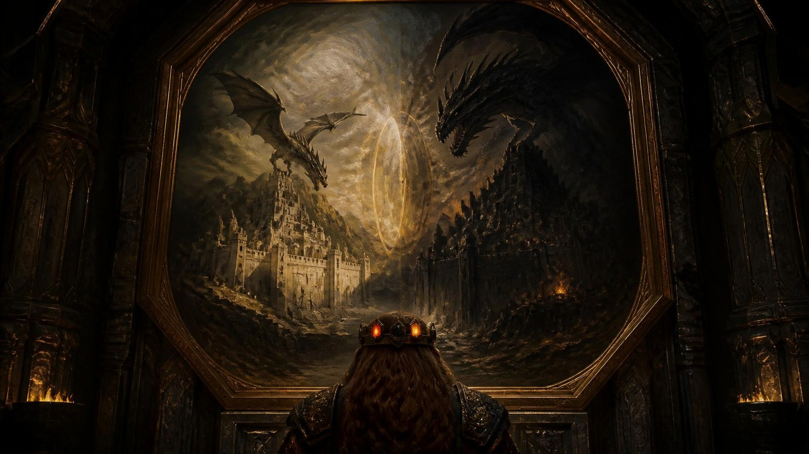

> **Read-aloud (LotR lead) — il passaggio.** *Per un istante lunghissimo i
> colori si rovesciano, e vi passano davanti vite intere di nani: nascono,
> battono il ferro, invecchiano, in un tempo più corto di un respiro. Poi torna
> il peso, e con il peso il freddo.*
>
> *Siete in piedi in un bosco. Gli alberi sono vecchi, le radici grosse come un
> uomo sdraiato, e l'aria sa di foglie marce e di fumo lontano. Il sole è già
> dietro il crinale. Uno di voi ha le ginocchia bagnate e non si ricorda di
> essere caduto.*

- ⚕️ **GUARIGIONE DEL PASSAGGIO (all'arrivo, automatica)** `[CANONE — DM
  2026-07-31]`: attraversare mille anni **rimette in ordine il corpo**. I quattro
  arrivano a **pf pieni**, senza livelli di affaticamento, con danni da
  caratteristica temporanei azzerati e **tutti gli usi giornalieri ricaricati**
  (invocazioni, poteri dei Bracieri, sinergie 1/giorno, incantesimi di Hella).
  **Nessun tiro, nessun costo, non è una scelta.**
  - **Cosa NON guarisce**: i costi **permanenti** di Thorik — **−4 DES** fra Corona
    e rito dello Smeraldo, e il **−1 CA** se al rito di `DEF-3` §5 ha donato il +2 di
    deflessione (sono prezzi pagati, non ferite) — gli oggetti spesi (Cuore di Moradin, Diapason, Rubino
    quando si accenderà) e le condizioni narrative dell'Echo Ledger.
  - **Perché esiste**: senza questa regola il party arriva al duello con
    Skullcrusher con quello che è avanzato da Terros e dal rito — cioè, molto
    probabilmente, **con dei nani mezzi morti**. Il #4 è una sessione-leggenda,
    con due scontri su griglia prima dell'alba: deve partire pulita.
  - **Come si racconta** (mai come una ricarica): *«Il portale non vi trasporta:
    vi RIFÀ. Per un istante lunghissimo siete scomposti nei vostri mille anni —
    e quando vi ricomponete dall'altra parte, le ferite che avevate non ci sono
    più, perché in questo momento della storia non le avete ancora ricevute.»*
  - Il **costo sull'orologio di Hammerfist è zero**: il Rubino riporta i PG
    all'istante esatto della partenza (`ARC07-DEF-5` §Supporto PF1e).
- **Shock temporale (all'arrivo)**: TS Volontà **CD 20** o **confusi 1d4 round**
  (−2 concentrazione/percezione), poi chiarezza. *(È l'unico prezzo del
  passaggio: il corpo torna intero, la testa no.)*
- **Le Cronache dei Quattro Eroi** i giocatori le hanno in mano da prima di
  partire (`DEF-3` §8-ter): non si consegnano qui.

Quando la testa torna a posto, guardano dove sono.

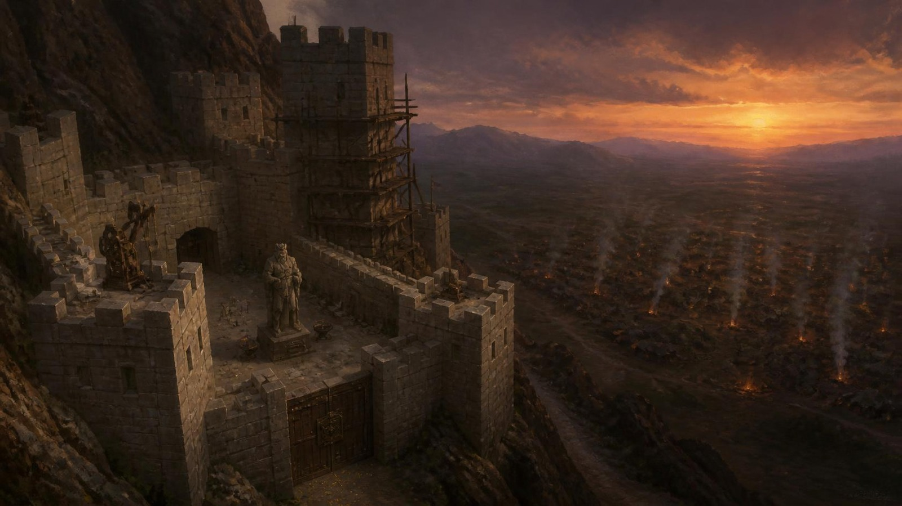

> **Read-aloud (LotR lead) — la fortezza, da lontano.** *A ovest, fra i
> tronchi, si vedono le torri di una fortezza che conoscete, più basse di come
> le ricordate. Più in là, verso sud, i fuochi dell'orda cominciano ad
> accendersi uno alla volta, e non finiscono. Sopra le mura gira un'ombra con le
> ali. Fa un cerchio lento, poi un altro, e non scende.*

**Dati per il DM (non da leggere).** Il portale li lascia **a circa 500 m a est
delle mura**, un quarto d'ora prima del buio. È autunno inoltrato: **5 °C**, il
fiato si vede, una nebbia bassa comincia a salire dal bosco. Dall'arrivo
all'alba mancano **circa dodici ore**; l'orologio della notte (§4) comincia a
contare dopo il consiglio. Il drago è Skullcrusher e **non attacca**: aspetta
l'alba, e i nani lo sanno. Dentro le mura le forge battono giorno e notte, e il
rumore arriva fin qui. *(Ambiente recuperato da
`_ARCHIVIO/PortaleForgia-P5-DEFINITIVO-PARTE1.md`, allineato al canone: mura
bianche, nessun cavaliere sul drago.)*

- ► **Esito**: chi ha fallito il TS arriva alla pattuglia ancora confuso, e Durin
  lo nota.

### SCENA 2 — La pattuglia di Durin

**Scheda d'entrata — Durin Rocciadura, la pattuglia** *(statistiche: Appendice A)*

| | |
|---|---|
| **Aspetto** | veterano, armatura completa e scudo, ascia doppia. Sta davanti ai suoi sei e ha paura. Si vede dal modo in cui tiene l'ascia troppo stretta |
| **Vuole** | riportare a casa i suoi sei. Ha paura e fa il suo lavoro lo stesso |
| **Suona** | la voce gli scappa in alto quando è teso. Ride un attimo prima di dire una cosa seria |
| **Sa** | il bosco a est delle mura, il campo dell'orda visto da lontano |
| **Non sa** | chi siano i PG, finché non vede la Corona o sente il tuono |
| **Eco** | è l'**antenato di Othrek**, a Hammerfist nel 1372. Se muore alle mura, la Cerimonia delle 100 Asce può portarne il nome |
| **Ritratto** | qui sotto. Ai giocatori si mostra dopo l'incontro, non prima |

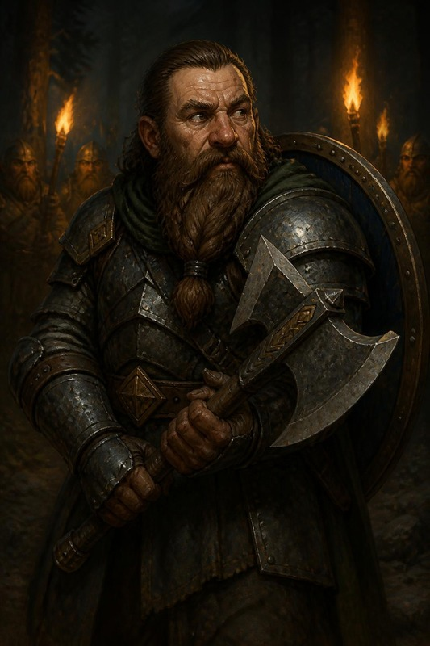

**La pattuglia di Durin (riconoscimento — 3 vie).** Nel bosco a est delle mura,
una pattuglia nanica (6 veterani) li ferma.

**DURIN (teso, voce che gli scappa in alto):** *«FERMI! Chi siete?»* La guida è
**Durin Rocciadura** (Guerriero 6, statistiche in Appendice A), veterano spaventato e
onesto. Fissa la Corona sulla fronte di Thorik.

**DURIN (piano, quasi a sé stesso):** *«Quella cosa… brilla come il sole
forgiato. È… una leggenda?»* **Tre modi di farsi riconoscere** (tutti
funzionano, nessun tiro se sinceri):
- **A — Mostrare la Corona**: Durin cade in ginocchio.
  **DURIN (rotto):** *«La Corona dei Padri. Pensavo fosse un mito.»*
- **B — Invocare Moradin** (preghiera sincera): un **tuono** solo, dal cielo
  sereno. Durin e i suoi si inginocchiano.
  **DURIN (fermo, per la prima volta):** *«Il Padre ha parlato.»*
- **C — Mostrare potere divino** (Benedizione della Forgia, aura dorata su
  Aegis Fang):
  **DURIN (a bassa voce, ai suoi):** *«Dio ha parlato attraverso l'arma.»*
Esito identico: Durin passa da diffidente a **fedele fino alla morte**, li porta
a cavallo al castello. *(Se attaccano la pattuglia: è un tragico
malinteso — i nani che erano venuti a salvare li credono spie; §6 Contingenze.)*

**La cavalcata.** Mezz'ora a cavallo fino alle mura, con i cavalli bassi e
robusti della pattuglia. Durin parla poco, e le cose che dice sono quelle che il
tavolo deve sapere prima del consiglio:

> **DURIN (a mezza voce, senza voltarsi):** *«Attaccano all'alba. Sono
> diecimila. E il drago è tornato da due settimane: qui ha un nome vecchio, e
> non lo diciamo volentieri.»*

- ► **Esito**: *Durin fedele* (qualunque delle tre vie) · *Durin ferito e la
  pattuglia ostile* (se attaccano: §6).

### SCENA 3 — La porta e la targa di bronzo

Durin li porta alla porta principale. Le guardie vedono la Corona e non
toccano nessuno. Prima di entrare c'è la targa.

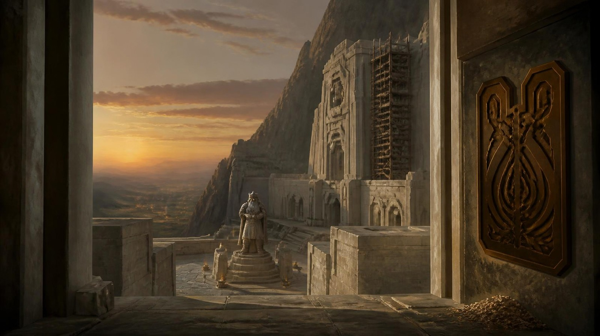

> **Read-aloud (LotR lead) — deep time al contrario.** *Conoscete Hammerfist:
> le sale annerite dai secoli, le statue consumate, i nomi dei re incisi e
> reincisi. Questa Hammerfist non ha ancora storia. Le mura sono bianche di
> pietra appena tagliata, gli spigoli ancora vivi, e nel cortile c'è la statua
> di un re, una sola. Accanto al battente è appesa una targa di bronzo lucida
> come una pentola nuova. Sotto, sul selciato, qualcosa luccica.*

<!-- storico -->
⚠️ *Il box di prima diceva che la targa era la profezia dei Quattro Eroi e che
era stata incisa oggi, cioè dava il **Fatto** e la **Lettura** del nodo qui sotto
prima che qualcuno la guardasse. Adesso la targa si vede e basta; i trucioli sul
selciato sono la porta 👁️ lasciata aperta.*
<!-- /storico -->

#### 🔍 Nodo d'indizio — la targa di bronzo *(Fatto · Lettura · Nome)*

> **Perché è un nodo e non una prova.** Questo master ha un'indagine dentro — i
> PG devono capire **che la profezia parla di loro** — e finora era una prova
> sola, **CD 18**, che si superava o si sbagliava. La skill `rumblingstone-indagine`
> chiede tre strati e **almeno tre porte**, perché un tavolo di picchiatori
> deve poterci entrare lo stesso.

| Strato | Cosa dà | Come si prende |
|---|---|---|
| **Fatto** | *«La targa dice: quattro eroi dal fuoco e dalla pietra.»* | **gratis**, chiunque sappia leggere il nanico. Non si tira |
| **Lettura** | *«L'inchiostro del cesello è fresco. È stata incisa oggi.»* | **una** porta qualsiasi, sotto |
| **Nome** | *«Quei quattro siamo noi, e lo eravamo già prima di partire.»* | **due** porte diverse, o una porta + la Lettura |

**Le sei porte** — tre bastano, e almeno una è fisica, così anche chi non ha
gradi entra:

| Porta | Prova | Cosa vede |
|---|---|---|
| 🧠 Sapere | Conoscenze (storia) **CD 18** | la profezia non è nelle cronache che hanno letto nel 1372: **è stata cancellata** |
| 👁️ Guardare | Osservare **CD 15** | i trucioli di bronzo sono ancora per terra sotto la targa |
| ✋ **Toccare** | **FOR o DES grezza CD 12** — passarci sopra il pollice | il taglio è **vivo**, taglia il polpastrello. Chiunque, nessun grado richiesto |
| 👃 Annusare | Sopravvivenza **CD 14** o un nano, gratis | odore di metallo caldo: il cesello ha lavorato **stamattina** |
| 🗣️ Chiedere | Diplomazia **CD 12** a un qualsiasi nano di guardia | *«L'ha incisa il Re stanotte. Ha detto che gli è venuto in sogno»* |
| ⚒️ Mestiere | Artigianato (fabbro) **CD 15** — Tordek, gratis | riconosce la **mano**: è lo stesso cesello della fucina che userà tra mille anni |

🚫 **Cosa NON dire**: che la profezia parla di loro. Anche se nessuno prende il
**Nome** subito, non si regala: torna al consiglio (Scena 4) quando Thorgrim prende
l'ascia, e alla Scena 13 quando il Rubino si accende. **Un vicolo cieco non
esiste** — l'indizio ripassa, cambiato.

- **Se prendono il Nome alla porta** → arrivano al consiglio di guerra sapendo
  chi sono: Re Thorek I li riconosce **prima** di guardare la Corona, e la
  prova di gruppo della Scena 4 scende a **CD 16**.
- **Se non lo prendono** → non perdono niente. Lo prendono dopo, e la scena in
  cui lo prendono diventa la più forte della serata.
- ► **Esito**: accettano/subiscono il ruolo. Imposta il tono «nessuna pietà» vs
  «misericordia» del Rubino (eco §7).

### SCENA 4 — Il consiglio di guerra di Re Thorek I

Durin li porta dentro per il corridoio principale. La fortezza si prepara
all'assedio: i bambini e i vecchi scendono verso le miniere con un fagotto
ciascuno, le forge delle stanze laterali non si fermano, e dove passano i PG
la gente smette di parlare.

> **Read-aloud (Casa di Davide lead) — il re.** *La sala è lunga quanto una
> strada, e i pilastri sono ancora puliti. In fondo, su un seggio di pietra
> senza cuscino, c'è un nano vecchissimo in armatura, con una grande ascia
> appoggiata al ginocchio: sulla lama c'è un disegno di brina che non si
> scioglie. Si alza piano, un pezzo alla volta, come si carica un carro. Non
> guarda voi: guarda la fronte di chi porta la corona. Accanto al seggio, su una
> panca, un altro vecchio resta seduto e non si alza.*

**Scheda d'entrata — Re Thorek I, il re di una fortezza giovane**

| | |
|---|---|
| **Aspetto** | 182 anni, e li porta come un muro porta la pioggia. Armatura di mithral, l'ascia **Frostcleaver** in pugno anche al tavolo di guerra. Una corona semplice, senza gemme |
| **Vuole** | reggere le mura fino all'alba. Ottocento nani contro diecimila |
| **Suona** | lento, al passato remoto quando cita la profezia. Parla al plurale anche di sé, *«la fortezza pensa»* |
| **Sa** | la profezia, perché l'ha incisa lui: gli è venuta in sogno. Che suo nonno perse la Corona contro Skullcrusher |
| **Non sa** | che la profezia parla di questi quattro, finché non vede la Corona |
| **Non combatte** | Guerriero 16, e nessuno statblocco completo: non serve |
| **Eco** | la prova di fiducia qui sotto, e il **Torque di Thorek I** (§8). Nel 1372 i nani si scoprono il capo davanti a chi lo porta |
| **Ritratto** | qui sotto. Ai giocatori si mostra dopo l'incontro, non prima |

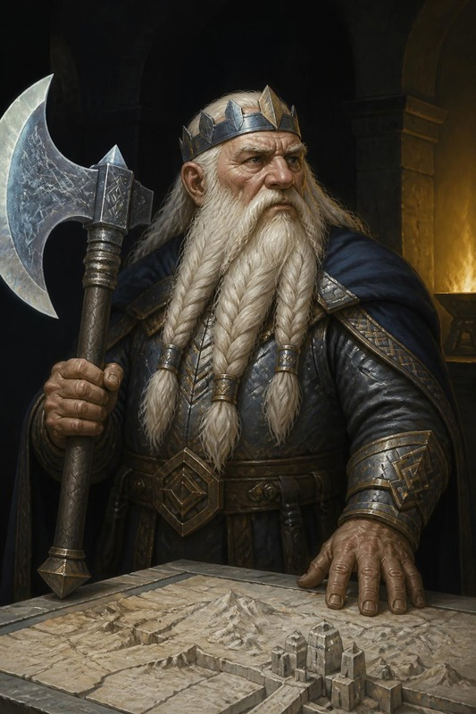

⚠️ A voce **Thorek** e **Thorik** si confondono: di' sempre **«Re Thorek»**.

**Scheda d'entrata — Thorgrim Barbadiferro, l'antenato**

| | |
|---|---|
| **Aspetto** | un vecchio seduto che non si alza. Le mani sulle ginocchia, e il callo nello stesso punto in cui ce l'ha Thorik, perché hanno tenuto la stessa ascia |
| **Vuole** | che l'ascia torni in una mano che sa perché la tiene |
| **Suona** | la voce non trema, gli occhi sì. Nomina il sangue, mai la persona: *«il sangue riconosce il sangue»* |
| **Non combatte** | è una non-creatura: nessuno statblocco esiste, e non va inventato |
| **Eco** | l'affresco A3 (*«Portala bene, fratello. Ora è tua.»*) e la Cerimonia delle 100 Asce in ARC-08 |
| **Ritratto** | qui sotto. Ai giocatori si mostra dopo l'incontro, non prima |

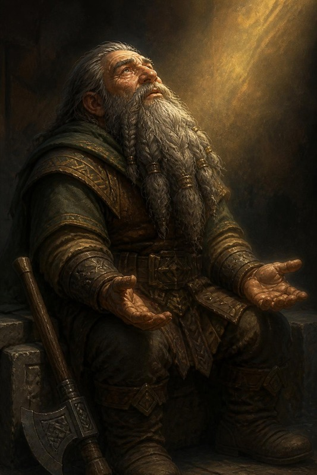

**Il re.** Re Thorek I (Guerriero 16, 182 anni, Frostcleaver in pugno) vuole
vedere da vicino la Corona che suo nonno perse contro Skullcrusher cinquant'anni
fa. La riconosce, e si inginocchia; con lui si inginocchiano le quindici guardie
della sala. Poi, ancora in ginocchio, recita la profezia.

⚠️ **Thorik non si toglie la Corona.** La prima stesura, in
`_ARCHIVIO/PortaleForgia-P5-DEFINITIVO-PARTE1.md`, gliela faceva togliere
davanti al re; ma in `DEF-3` §5 Thorik se la toglie per la seconda volta in vita
sua, sul petto di Hella, e il master lo dice. Il re scende i gradini e la guarda
dov'è: due pietre accese e un incasso vuoto.

**RE THOREK I (lento, passato remoto, come chi cita a memoria):** *«Quattro
eroi dal fuoco e dalla pietra… nella notte più oscura salveranno gli antenati
e i futuri.»*

**Thorgrim.** Mentre il re recita, il vecchio sulla panca guarda l'ascia di
Thorik, e quando il re tace parla lui.

> **Read-aloud (Mercer lead, Casa di Davide support).** *Il vecchio sulla panca
> non si è mosso. Ha le mani appoggiate sulle ginocchia, e sono mani che hanno
> tenuto la stessa ascia che tiene Thorik: si vede dal callo, nello stesso punto.
> Guarda la corona sulla fronte di Thorik per il tempo di tre respiri. Poi gli
> occhi gli si riempiono e lui non se ne accorge, perché sta già parlando.*
>
> **THORGRIM (voce che non trema, occhi che sì):** *«Mio nonno ha perso la
> corona. L'ascia no. Se dite il vero, fatemi tenere la vostra.»*
>
> *Quando l'ascia passa fra le sue dita e le vostre, per un istante le due prese
> si toccano sul legno. E il legno **suona**.*

⚠️ *L'ascia di Thorgrim è appoggiata alla panca: è **Aegis Fang**, mille anni
più giovane. Quando prende quella di Thorik tiene in mano la stessa arma due
volte, e il legno suona per questo (§1: «canta la stessa nota»). Nella stesura
di prima Thorgrim chiedeva la corona e riceveva l'ascia.*

> 🩸 **Re Thorek I e Thorgrim sono cugini** *(decisione DM 2026-09-24)*: nipoti
> dello **stesso re**, quello caduto contro Skullcrusher cinquant'anni prima.
> Per questo dicono tutti e due *«mio nonno»*, e nessuno dei due mente. La
> Corona è il lutto del re; l'ascia, Aegis Fang, è rimasta a Thorgrim.

**La tavola di guerra.** Poi il re li porta alla mappa, e dice i numeri come li
direbbe a un suo capitano:

**RE THOREK I (in piedi, adesso, con le dita sulla mappa):** *«Ottocento
contro diecimila, e il drago. Le mura reggono due ore. Se all'alba Zog'tar guida
ancora l'orda, cadiamo. Se lui non c'è, l'orda è un gregge, e il drago resta
solo.»* L'unica possibilità è **uccidere Zog'tar di notte**, per fiaccare
l'orda, e **affrontare Skullcrusher** all'alba.
- **Handout — il piano di battaglia** (§9): forze, obiettivi, cosa dà il re. Si
  consegna qui, sul tavolo di guerra.
- **Prova di gruppo**: Diplomazia/Intimidire **CD 20** (**CD 16** se alla porta
  hanno preso il **Nome**) → **fiducia piena**: 4 Pozioni di Invisibilità CL 12,
  le Benedizioni di Moradin +2/+2, la mappa accurata del campo. Fallimento:
  aiuti dimezzati, −2 alle prove della Scena 6.

**I numeri del re** *(per il DM; sono anche nel piano di battaglia, §9)*:

| Hammerfist | L'orda della Mano Rossa |
|---|---|
| 800 guerrieri nanici veterani | 7.000 orchi |
| 200 cittadini armati, vecchi e ragazzi | 2.000 goblin |
| 50 chierici di Moradin | 800 hobgoblin |
| Re Thorek I e 15 guardie reali | 200 ogre |
| — | Zog'tar Deatheye e il drago |

Le mura reggono **due ore** dall'inizio dell'assalto. Il piano del re è quello
della prova qui sopra: Zog'tar di notte, il drago all'alba.

- **Gancio**: Thorgrim riecheggerà nella Cerimonia delle 100 Asce (ARC-08).
- **I doni del re** se la fiducia è piena: le pozioni di cura e il **Torque di
  Thorek I** (§8 B).
- ► **Esito**: *aiuti pieni / dimezzati*.

🕯️ **Adesso metti l'orologio della notte sul tavolo** (§4): il consiglio ha già
preso la prima tacca.

---

## §4 — ATTO II · LA NOTTE

> **Il percorso dell'atto.** Dalla fine del consiglio all'alba. I PG scelgono
> cosa fare nella fortezza, poi escono da una postierla, attraversano il campo,
> entrano nella tenda del comando e tornano indietro. Tutto costa tacche.

| Scena | Dove | Chi entra | Tacche |
|---|---|---|---:|
| **5** · La notte nella fortezza | quartieri ospiti, fucina, gallerie | **Zeth** | da 0 a 7, a scelta |
| **6** · Il mare di tende | dalla postierla al centro del campo | — | 2, più 1 per fallimento |
| **7** · La tenda del comando | la tenda di Zog'tar | **Balvar** | 1 se gli parlano |
| **8** · Zog'tar | la stessa tenda | **Zog'tar** | — |
| **9** · Vatore | fra le tende, al ritorno | **Vatore** | — |

### ⏳ L'OROLOGIO DELLA NOTTE — otto ore, e ogni cosa ne costa

> **Perché esiste.** La scelta del riposo della Scena 5 era già un orologio, scritto
> a parole, in ore che non tornavano con queste tacche. Ma un tempo che non si segna non si sente,
> e il tavolo non può *scegliere di correre un rischio* se non sa quanto ha in
> mano.<!-- storico --> Questo è il congegno che i due banchi del repo — il Palio e l'Abbazia —
> usano per reggere la tensione, e questo master ne aveva **una menzione sola**.<!-- /storico -->

**Si segna su un foglio, in vista.** Dal tramonto all'alba ci sono **8 tacche**,
e quando il foglio arriva sul tavolo la prima è già segnata: il consiglio. Ogni
tacca è mezz'ora scarsa di gioco reale.

| Cosa | Tacche |
|---|---:|
| Il consiglio di guerra (Scena 4), già segnato | **1** |
| Riposo **breve** · riposo **lungo** (Scena 5) | **2** · **5** |
| Banchetto e benedizioni (Scena 5, facoltativo, +1 morale 12 h) | **1** |
| Hella veglia i semi della Collana: i Treant dell'alba (Scena 5) | **1** |
| Cercare il Mastro Costruttore Zeth (Scena 5) | **1** |
| Attraversare il mare di tende (Scena 6, skill challenge) | **2** |
| Ogni **fallimento** nello skill challenge | **+1** |
| Parlare con Balvar invece di colpire subito (Scena 7) | **1** |

**Quando le tacche finiscono, sorge il sole.** Non è una punizione: è la Scena 10
che comincia, con i PG dove sono in quel momento.

| Tacche spese all'uscita dalla tenda | Come si arriva alle mura |
|---|---|
| ≤ 6 | in tempo. Si rientra, si schiera, le mura e il duello vanno come scritto |
| 7 | 🟡 si rientra **correndo**: nessun riposo prima del drago, −1 a tutti i TS del primo round del duello (Scena 11) |
| 8 | 🔴 **l'alba vi coglie fuori dalle mura.** Non morite: attraversate un campo che si sta svegliando. Prova di gruppo Muoversi Silenziosamente **CD 20**, poi il duello (Scena 11) comincia con i PG **fuori**, e Skullcrusher li vede per primo |

⚠️ **L'orologio corre sulle SCELTE, non sul tempo reale.** Un tavolo che discute
mezz'ora su cosa fare non spende una tacca; un tavolo che decide di andare a
cercare Zeth sì. È la regola dell'Abbazia (`ADR-10` interno: *l'oppressione
avanza sulle scoperte*), e serve a non punire proprio il comportamento che
questo master vuole ottenere — **guardarsi intorno**.

🔎 **E qui l'orologio dice una cosa<!-- storico --> che il testo prima non diceva<!-- /storico -->**: parlare con
Balvar, cercare Zeth e fare il banchetto costano **3 tacche** in tutto. Sono i
tre pezzi migliori della notte, e sommati sono anche il rischio più grosso. È
il bivio, ed è **vero** — non una finta scelta con una risposta giusta.

### SCENA 5 — La notte nella fortezza

**I quartieri ospiti.** Durin li accompagna, e da qui all'uscita decidono
loro: ogni cosa costa tacche. Nei quartieri ci sono il banchetto (+1 morale 12 h se
mangiano), fabbri che affilano le armi, chierici che benedicono.
- **HELLA — i Treant dell'alba.**<!-- storico --> *(Allineato al rito il 2026-09-24: la prima
  stesura le faceva piantare «i 3 semi di treant», ma al rito di `DEF-3` §7 i
  tre semi sono entrati nella **Collana dei Semi Eterni**, e da qui in poi non
  si piantano più.)*<!-- /storico --> All'alba Hella usa l'**Evocazione dei Guardiani** sui semi
  I e II: **due Treant di Adamantio** (statblock `DEF-3` §7: 90 pf, RD
  10/adamantio, 2 schianti +18, danni doppi alle strutture) che caricano il
  fianco dell'orda. Costa **due** delle tre cariche del giorno, e la tacca della
  notte resta **una**: vegliare i semi che si aprono. È il beat di potere della
  druida risorta, e ha un prezzo: se Durik viene distrutto nel duello, resta
  **una carica sola** per richiamarlo.
  Se al rito Hella ha trovato la **ghianda
  annerita** e non l'ha ancora piantata, «il primo suolo sacro che tocca» è
  questo: niente Treant in più, ma una quercia che fra mille anni sarà
  vecchia di mille anni.

**Scheda d'entrata — Mastro Costruttore Zeth, il seme del Ghostlord** *(nelle
gallerie sotto la fucina; cercarlo costa una tacca)*

| | |
|---|---|
| **Aspetto** | mezz'elfo, occhi febbrili, polvere di roccia fino ai gomiti. Traccia rune sulle pareti dei tunnel. Col gesso, e ne cancella metà col pollice |
| **Vuole** | che le gallerie non cedano. È disposto a legarci l'anima |
| **Suona** | parla mentre lavora. Finisce le frasi degli altri |
| **Sa** | che un chierico incappucciato gli ha dato «i componenti perfetti» |
| **Non sa** | che quei componenti servono a una **lichificazione**, e che la mano è del **Collezionista** attraverso il tempo |
| **Eco** | il **dilemma di Hella su Zeth il Murato** in ARC-09. I PG assistono all'origine del Ghostlord **senza saperlo** |
| **Ritratto** | qui sotto. Ai giocatori si mostra dopo l'incontro, non prima |

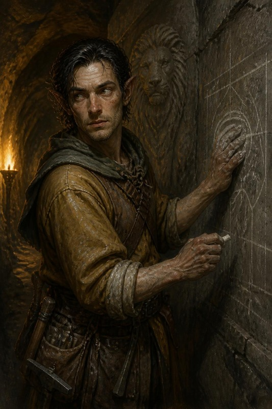

- **⚫ SEME DEL GHOSTLORD (hook a lunghissimo termine — CANONE, DM 2026-07-23).**
  Il party incrocia il **Mastro Costruttore Zeth** nelle gallerie, un mezz'elfo dagli occhi
  febbrili, che traccia rune sui tunnel: *«Le mura di Thorek potrebbero cedere.
  Ma legherò la mia anima alla montagna in una Consacrazione. I miei leoni di
  pietra proteggeranno queste gallerie per sempre. Un chierico incappucciato mi
  ha appena dato i componenti perfetti.»* → **È il futuro Ghostlord / Zeth il
  Murato**: i "componenti" sono in realtà per una **Lichificazione**, inflittagli
  dalla fazione del **Collezionista** che viaggia tra i piani e le epoche. I PG
  seminano (senza saperlo) il dilemma etico di Hella su Zeth in ARC-09. Registra
  nell'Echo Ledger (§7) e in `state.md §7`.
- **Riposo — scelta**: **breve** (2 tacche: metà slot e pf) o **lungo** (5
  tacche: recupero pieno, e poi il campo si attraversa di corsa). Il momentum
  spinge al breve. ⚠️ La guarigione del passaggio (Scena 1) li ha già rimessi in
  piedi: il riposo serve solo a chi ha speso qualcosa da allora.

### SCENA 6 — Il mare di tende

> **Read-aloud (Andor lead) — la postierla.** *Poco prima di mezzanotte si apre
> una porta che non è la porta: una feritoia bassa nella roccia viva, di quelle
> che gli esploratori usano da sempre e che nessun cronista scrive. Durin vi
> accompagna fino all'imboccatura. Il fiato esce bianco. Vi mette una mano
> guantata sul braccio, apre la bocca e la richiude. Poi dice soltanto:*
>
> **DURIN:** *«Tornate. Il Padre non butta via un dono così.»*

**Prima di uscire**, se la fiducia al consiglio è stata piena: ognuno beve la
**Pozione di Invisibilità** (CL 12, 120 minuti), e le **Benedizioni di Moradin**
sono già addosso (+2 morale al colpire e ai danni, 12 ore).

> **Read-aloud (Salvatore — l'infiltrazione).** *Fuori dalle mura, il buio è
> vivo. Diecimila nemici dormono attorno a mille fuochi — orchetti, hobgoblin,
> cose peggiori — e il campo si stende fino all'orizzonte come un mare in cui
> ogni onda è una gola che russa. L'aria sa di grasso bruciato, di ferro e di
> bestia. Da qualche parte, al centro, la tenda del generale. Un passo falso e
> il mare si sveglia tutto insieme.*

#### Lo skill challenge: attraversare il mare di nemici
**Skill Challenge «Attraversare il Mare di Nemici»** (~2 km, a blocchi di 200 m):
- Ogni blocco: **Muoversi Silenziosamente CD 20** + **Nascondersi CD 22**.
  L'invisibilità dà **+20 a Nascondersi** finché non attaccano/lanciano offensivi.
- **3 fallimenti prima di 5 successi = pattuglia** (scontro GS 10, rischio
  allarme locale → malus tattici a Zog'tar/Skullcrusher).
- **Complicazioni (tira 1d6 per blocco):**

| d6 | Complicazione |
|---|---|
| 1-2 | Nessun evento. |
| 3 | **Pattuglia di 4 orchi** (Guerriero 3) passa a 6 m: restare immobili, Muoversi Silenz. **CD 18**. |
| 4 | **Lupo da guerra** (Olfatto acuto, Ascoltare/Osservare +8): un fallimento di Furtività → abbaia, la pattuglia si ferma. |
| 5 | **Falò vicino**: luce intensa, Nascondersi **CD +4** per quel blocco. |
| 6 | **Squadrone hobgoblin (6)** a 24 m: se falliscono >2 prove, mandano un **corridore** alla tenda di comando (Zog'tar sarà pre-allertato). |

**Via B — il corridore che non parte** *(chiunque, e non serve nessun grado)*.
È una delle due vie che non passano dall'iniziativa; l'altra, l'Occhio, è nella
Scena 8.
Se la complicazione **6** dello skill challenge è uscita, c'è un corridore
hobgoblin che sta per andare alla tenda. Fermarlo **non richiede di ucciderlo**:
- **DES grezza CD 14** — sgambetto nel buio, e il ragazzo cade nel fuoco altrui;
- **Raggirare CD 16** in orchesco (chi lo parla) — *«Messaggio già passato, torna
  in fila»*;
- **FOR grezza CD 16** — una mano sulla bocca, e lo si tiene finché non sviene.
- **Riesce** → Zog'tar non è pre-allertato, e il round di sorpresa resta pieno.
- **Fallisce** → il corridore arriva. **Non è la fine**: Zog'tar sveglio è più
  duro, e la Scena 8 ha già la riga per quel caso.

- ► **Esito**: *la tenda raggiunta senza farsi vedere* · *con una pattuglia alle
  calcagna* · *con il campo pre-allertato* (corridore, allarme: +2 nemici sulle
  mura nella Scena 10, e Zog'tar sveglio).

### SCENA 7 — La tenda del comando

> **Read-aloud (Andor lead) — la tenda.** *Al centro del campo c'è una tenda
> più alta delle altre, di pelle nera, con ossa appese ai tiranti che battono
> piano nel vento. Le pattuglie qui non passano. Dentro si ride.*

> **Read-aloud (Salvatore lead) — dentro.** *Fa caldo, e c'è puzza di sangue
> secco e di carne mezza cruda. Una tavola con sopra una mappa di Hammerfist,
> piena di croci rosse. In fondo, su un seggio fatto di vertebre e di teschi
> inchiodati, siede un mezzo-ogre enorme che al posto dell'occhio destro ha una
> pietra nera levigata. Sta raccontando a una guardia come impalerà il re sul
> bastione più alto, e ride da solo. Quattro hobgoblin in armatura nera stanno
> di guardia, le mani sulle armi.*

**Mappa M7-C** (Appendice D). I PG entrano da nord, dalla parte della fortezza.
La soglia è illuminata, il fondo no.

**Come va la scena, in ordine.** Nella tenda ci sono due persone che contano, e
**parla prima quella che non dovrebbe**. Zog'tar è sul seggio con le sue
guardie; **Balvar** è nell'angolo in fondo, dove i bracieri non arrivano. I PG
sono invisibili, ma Balvar li **legge**: il suo *Leggere il Fuori-Posto*
percepisce chi non appartiene a questo secolo. Parla in **nanico antico**, a
voce bassa, e nessuno nella tenda capisce: Zog'tar crede che borbotti sulle sue
rune, come fa sempre. La conversazione con Balvar si fa **a tre passi dal
generale**, ed è questa la tensione della scena. Quando finisce, o quando
qualcuno colpisce, comincia la Scena 8.

<!-- storico -->
⚠️ *La stesura di prima metteva Balvar e Zog'tar nella stessa tenda senza dire
come Balvar potesse parlare con i PG davanti al generale. La percezione viene
dal suo statblocco; la lingua e l'angolo buio sono regia, e non gli danno niente
che non abbia già.*
<!-- /storico -->

**Scheda d'entrata — Balvar Fuocospento, il runaio esiliato** *(statistiche:
Appendice A)*

| | |
|---|---|
| **Aspetto** | nano dello scudo vecchio, grembiule di cuoio, seduto su uno sgabello da bottega. Sulle ginocchia una lastra d'ardesia, in mano una punta di ferro |
| **Vuole** | che Hammerfist cada **in fretta**, perché un assedio lungo è fame, e lui l'ha già vista. E che qualcuno dica che c'era |
| **Suona** | non smette di incidere mentre parla. La punta sull'ardesia continua sotto le frasi |
| **Sa** | **che i PG non sono di questo secolo**, unico in tutta Hammerfist. Dove vanno colpite le mura. La runa-vincolo sulla scaglia del drago, perché l'ha incisa lui |
| **Non dice** | che ha un nipote di diciannove anni sul camminamento. Mai per primo |
| **Ritratto** | qui sotto. Ai giocatori si mostra dopo l'incontro, non prima |

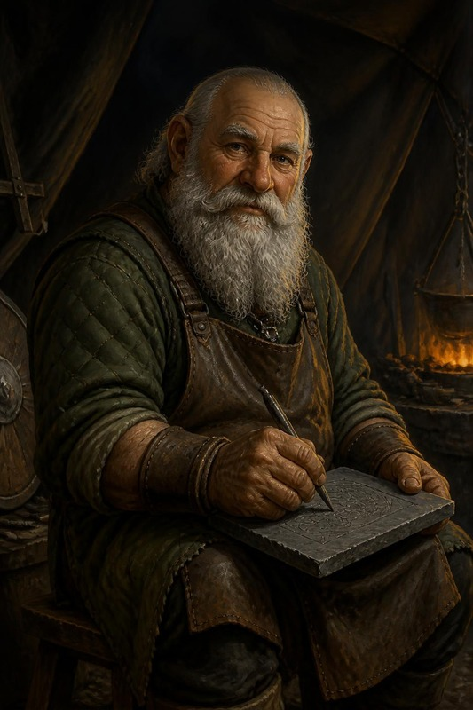

> **Perché esiste.** Due giocatori hanno chiesto la stessa cosa da due lati:
> Artemis non ha mai niente da individuare, Thorik non incontra mai
> incantatori (`DM-CAMPAIGN-PLAYBOOK` §1-bis). Balvar è la risposta — ma non è
> un boss in più appiccicato al modulo: è **il motivo per cui l'orda ha un
> drago**. Toglilo e il duello della Scena 11 cambia. Statblock:
> `Bestiario/villain/balvar-fuocospento-cr13.md`.

#### Chi è

Un **nano dello scudo**, vecchio, esiliato da Hammerfist prima che i PG
nascessero — anzi: prima che nascessero i bisnonni dei nani che i PG hanno
appena conosciuto. Era il **runaio della fortezza**, quello che incideva le
protezioni sulle porte. Adesso incide per Zog'tar, e Abbathor gli tiene la
mano ferma.

Non comanda l'orda. **Consiglia**, e per questo è più pericoloso del generale:
Zog'tar sa uccidere diecimila uomini, Balvar sa **dove** vanno colpite le mura.

#### ⚖️ Il grigio — perché **crede di aver ragione** *(pilastro GoT)*

> <!-- storico -->
> **Aggiunto nella riscrittura del 2026-09-18.** Balvar era già il personaggio
> migliore del master, ma era scritto come **un nemico interessante**, non come
> una fazione. La differenza è che di un nemico interessante si chiede *come lo
> batto*; di una fazione che crede di aver ragione si chiede *cosa vuole, e cosa
> gli costa averlo*. È l'unica riga che il pilastro 5 chiede davvero.
> <!-- /storico -->

| | |
|---|---|
| **Vuole** | che Hammerfist **cada in fretta**. Non per odio: perché un assedio lungo significa fame dentro le mura, e lui l'ha già vista una volta |
| **Crede** | che i re nanici mentano ai loro, e che le sue rune abbiano protetto per trent'anni una fortezza che l'ha esiliato **senza processo** |
| **La leva** | = suo nipote. È dentro le mura, ha diciannove anni, e Balvar sa esattamente su quale camminamento monta la guardia |
| **Ricattabile** | sì, e da nessuno che non gliene parli **per primo**. Se i PG lo minacciano, si chiude; se gli dicono che il ragazzo è vivo, no |
| **Non è un mostro** | e questo è il punto: se il tavolo lo tratta da mostro, lo scontro funziona lo stesso. Se lo tratta da nano, il master cambia forma |

⚠️ **È una fazione recuperabile, non una fazione debole.** Balvar in combattimento
resta un GS 13, e le sue rune fanno male. Recuperarlo **non lo indebolisce**:
gli cambia bersaglio. *(È la stessa regola dell'`ADR-06` interno dell'Abbazia
sui corsari — il banco l'aveva già capito.)*

🚫 **Cosa NON dire.** Che il nipote esiste. Balvar non lo nomina mai per primo:
si arriva al ragazzo solo se qualcuno **guarda** cosa sta incidendo sull'ardesia
(Osservare **CD 20**: è un nome nanico, e sotto una data di nascita), oppure se
un PG nano gli chiede chi ha lasciato a Hammerfist — **Diplomazia CD 18**, e
funziona solo se non l'hanno ancora minacciato.

> **Read-aloud — il primo incontro (dentro la tenda del comando, Scena 7).**
> **Read-aloud (Andor lead) — 1 di 3, poi FERMATI.** *In fondo alla tenda, dove
> la luce dei bracieri non arriva, un vecchio è seduto su uno sgabello da
> bottega. Grembiule di cuoio. Sulle ginocchia una lastra di ardesia che sta
> incidendo con una punta di ferro, piano, come se fuori non ci fossero
> diecimila tende e un drago.*

> **2 di 3 — dopo che qualcuno ha reagito.** *Alza la testa. Vi guarda uno per
> uno, con calma. Quando arriva alla gemma sulla fronte del vostro capo si
> ferma un istante di troppo. Poi torna a incidere. **Non chiama la guardia.***

> **3 di 3 — solo quando il silenzio diventa scomodo.**
> **BALVAR (voce da vecchio artigiano, nessuna minaccia, nessuna fretta):**
> *«Quella corona la finirono con tre gemme. Tu ne hai due.»* — *un colpo di
> punta sull'ardesia* — *«Quindi non è oggi.»*
>
> **Che fate?**

<!-- storico -->
⚠️ **Spezzato in tre il 2026-09-18, e non per pignoleria.** Era **un box da 15
righe**, sopra il tetto di 12 di `read-aloud-adulti.md` §2, e la self-check
della skill dello stile ha una domanda apposta: *«Did any box grow past the
ceiling because the prose got interesting? → cut; the ceiling wins»*. Qui la
prosa **era** diventata interessante, ed è il motivo per cui era cresciuta.
Spezzandolo in tre beat si guadagna anche una cosa che il box unico non aveva:
**Balvar aspetta che i PG reagiscano prima di parlare**, e il suo silenzio
diventa la prima battuta.
<!-- /storico -->

#### La cosa che lo rende memorabile: sa da dove venite

**Leggere il Fuori-Posto** (3/giorno) è l'unica capacità che conta davvero. In
tutta Hammerfist del ≈372 DR, **Balvar è il solo che sa che i PG non
appartengono a questo secolo** — e non lo dice a nessuno, perché
un'informazione che nessuno ha vale più di un'informazione condivisa.

**Non li smaschera. Tratta.** È un mercante di segreti come Varis è un mercante
di merce, e la scena giusta è la stessa: un affare vero con un amo vero.

> **BALVAR:** *«Non chiedo chi siete. Chiedo una cosa sola, e ve la chiedo
> adesso perché fra un'ora saremo tutti occupati. Quando avrete finito quello
> che siete venuti a fare — e lo finirete, lo vedo da come camminate — **dite
> che c'ero**. Non che ho vinto. Che c'ero. La Cronaca scrive solo i nomi che
> qualcuno pronuncia.»*

Questo è il suo prezzo, ed è per questo che ha lasciato passare i PG. Un uomo
cancellato dagli annali che chiede a dei viaggiatori del tempo di **essere
ricordato**. Se accettano, in ARC-08 e ARC-09 gli affreschi della Sala avranno
**un pannello in più**, e nessuno saprà spiegarlo — tranne loro.

#### La Catena: perché il drago combatte per l'orda

Balvar ha inciso una **runa-vincolo** nella scaglia sternale di Skullcrusher.
Non è dominazione: è un **contratto scritto nella carne**, e il drago lo sa,
e lo odia. Questo aggancia direttamente il duello (Scena 11):

| Cosa fanno i PG | Effetto sul duello con Skullcrusher (Scena 11) |
|---|---|
| **Non se ne accorgono** | il duello va come scritto |
| **Individuano la runa** (Sapienza Magica **CD 24**, o Conoscenze storia CD 22 per riconoscere il nanico antico — **è scritta, quindi si legge**) | sanno dove colpire: un colpo mirato alla scaglia sternale (**CA +4**) durante il duello **spezza la Catena** |
| **Spezzano la Catena** | Skullcrusher **smette di combattere per l'orda**. Non diventa alleato — è un drago nero — ma se ne va, e l'assalto alle mura perde le ali. *Esito «FUGGITO» garantito, senza doverlo ridurre a ⅓ pf* |
| **Uccidono Balvar prima dell'alba** | la runa resta (è incisa, non sostenuta), **ma** senza chi la rinnova si indebolisce: Skullcrusher parte con **−2 a tutto** e fugge a **metà** pf invece che a ⅓ |

⚠️ **È qui che il gruppo diventa un gruppo.** Artemis vede l'aura, Thorik legge
il nanico antico, Tordek arriva alla scaglia. Nessuno dei tre ce la fa da solo:
**è esattamente la scena che mancava all'arco.**

#### Come si combatte, se si arriva a combatterlo

**Non ingaggiarlo in campo aperto**: non è un duellante, è un **preparatore**.
Ha **quattro rune già incise** nella tenda del comando, e le ha incise sapendo
che qualcuno sarebbe entrato:

1. sulla **soglia** — *dimensional anchor*: niente *Flee the Scene*, niente
   teletrasporti. **Chi entra, entra e basta.**
2. sul **palo centrale** — *blade barrier*, che scatta a taglio della tenda in
   due, separando il party;
3. **su di sé** — *silence*, che attiva a comando: chi conta sul verbale è
   fuori, lui no (le rune non richiedono componenti verbali);
4. la **quarta è vuota**, e la incide **durante** lo scontro. Falla vedere:
   *«continua a incidere mentre combattete»* è l'immagine che li terrorizza.

**Tattica**: *righteous might* al round 1, poi *blade barrier* e *slay living*
sul più fragile. Se scende sotto **30 pf** non fugge e non implora: **finisce
di incidere la quarta runa** e la lascia lì. `[DM: decidi tu cosa c'è scritto —
è un gancio bianco per ARC-09.]`

#### L'eco a 1372 (il motivo per cui vale la pena)

Balvar è morto da mille anni comunque vada. Ma:

- se i PG hanno **pronunciato il suo nome**, in ARC-08 la Cronaca ha un
  pannello in più — e **Aegis Fang lo riconosce**;
- se hanno **spezzato la Catena**, il carry-over B4 verso **Fauci di Palude**
  cambia di tono: il figlio del drago incatenato ha una ragione in più per
  odiare i nani, o per **non** volere una catena addosso;
- se lo hanno **ucciso senza ascoltarlo**, resta una lastra d'ardesia incisa a
  metà tra le rovine del campo. Qualcuno, in ARC-09, l'ha trovata.

→ Registra l'esito nell'**Echo Ledger** (§7).

### SCENA 8 — Zog'tar

**Scheda d'entrata — Zog'tar Deatheye, il generale** *(statistiche: Appendice A)*

| | |
|---|---|
| **Aspetto** | mezzo-ogre, grande quanto una porta di stalla, armatura completa di piastre annerite. L'ascia a due mani appoggiata alla spalla. Al posto dell'occhio destro, una pietra nera levigata: l'**Occhio di Ossidiana**, un occhio vero *(decisione DM 2026-09-24)* |
| **Vuole** | Hammerfist. Sa uccidere diecimila uomini, non sa dove colpire le mura: per quello c'è Balvar |
| **Suona** | conta, sempre: *«due file», «tre ore», «cento»*. In ira: *«A ME, CANI! ABBATTETE LE OMBRE!»* |
| **Sa** | niente dei PG, a meno che il corridore non sia arrivato |
| **Eco** | come muore decide come comincia il duello. Se viene **umiliato e non ucciso**, la Mano Rossa ha un generale in più nella sua storia |
| **Ritratto** | qui sotto. Ai giocatori si mostra dopo l'incontro, non prima |

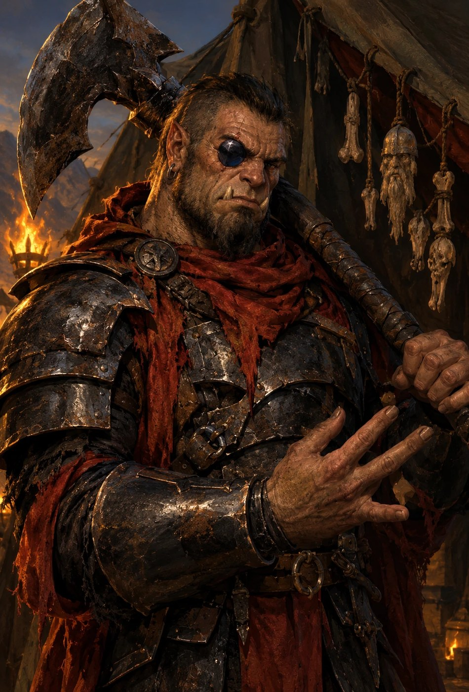

**Il round di sorpresa.** I PG invisibili hanno un **round di sorpresa pieno** se
nessuno ha parlato ad alta voce o lanciato incantesimi che li rivelano. Parlare
con Balvar in nanico, a bassa voce, **non** conta come parlare ad alta voce: è il
motivo per cui la Scena 7 viene prima.

#### Tattiche di Zog'tar — round per round (stile RHoD)
> È un macellaio arrogante che si crede immortale: non conosce la paura finché
> non gli entra nelle ossa. Non sa che la Morte è già nella tenda.

- **Round di sorpresa** (se i PG sono invisibili e silenziosi): il party ha un
  round pieno. *È qui che si vince o si complica.* Un colpo coordinato può
  portarlo subito sotto metà.
- **Round 1** (se reagisce): **Ira Barbarica** (*«A ME, CANI! ABBATTETE LE
  OMBRE!»*) + **Occhio di Ossidiana** su Thorik (la minaccia). Le 4 guardie
  ingaggiano i PG più esposti.
- **Round 2-3**: carica il bersaglio che fa più danni, **Colpo Possente**
  moderato (−5/+10) se ha colpito bene. Se Artemis lo martella, si gira su di lui.
- **Soglia 30% pf**: combatte disperato, cerca di **portare un PG con sé** nella
  morte (un ultimo Colpo Possente pieno −10/+20).
- **Sviluppi.** Zog'tar **esce dalla storia in questa scena**: morto, oppure
  umiliato e cacciato dal suo stesso campo (Via A, qui sotto). Il COME conta
  (► Esito, in fondo alla scena). `[HDYWTDT — il finisher a chi lo abbatte: «com'è che
  lo fai?», e aspetta. Se non vuole, una riga tua e si va avanti.]` Alla sua morte, l'Occhio di Ossidiana si spegne; il
  campo perde il direttore. *Se catturato/interrogato invece che ucciso*: Moradin
  approva la saggezza pragmatica (nessun tono «nessuna pietà» sul Rubino).

La seconda via che non passa dall'iniziativa (la prima, il corridore, è
nella Scena 6):

**Via A — l'Occhio contro il suo padrone** *(Artemis, Hella, chi ha visto la runa)*.
L'**Occhio di Ossidiana** è un artefatto **maledetto** e Zog'tar lo sa a metà:
il prezzo è che la luce divina lo brucia. Chi lo capisce — Sapienza Magica
**CD 20**, oppure **gratis** se hanno addosso le Benedizioni di Moradin
(fiducia piena al consiglio, Scena 4) e le vedono reagire — può **mostrargliela invece di colpirlo**:
Intimidire **CD 22** con la Corona scoperta o la Luce di Lathander in mano.
- **Riesce** → Zog'tar **arretra**, e arretrando esce dalla tenda davanti alle
  sue guardie. Perde la faccia, e con lei il campo: l'orda all'alba combatte a
  **−1 morale**, che vale i due nemici in più della Scena 10 tolti.
- ► **Esito nuovo**: *umiliato, non ucciso*. 🔴 **Ed è un problema, non un
  premio**: Zog'tar **vive**, e in ARC-08 la Mano Rossa ha un generale in più
  nella sua storia. Registra nell'Echo Ledger (§7).

⚠️ **Perché due e non una.** Una via alternativa sola diventa «la soluzione
giusta» e il tavolo la cerca invece di giocare. Due che costano in modi diversi
— una la fama del nemico, l'altra il fiato — restano **scelte**.

#### Le scelte-costo dei PG contro Zog'tar (interazioni d'artefatto)
> ⚠️ **Niente tentazione Lathander/Mask per Artemis** (mai giocata, §1). Le sue
> scelte qui sono **tattiche e morali**, non divine.
- **THORIK — Benedizione della Forgia**: può chiedere a Moradin +2 sacro ai
  danni vs Zog'tar e guardie, al **costo di 1 livello di affaticamento** dopo la
  battaglia (peserà su Skullcrusher). *Scelta: potenza ora vs freschezza al drago.*
- **THORIK — finire o interrogare Zog'tar**: colpo finale spettacolare → il
  Rubino registra «nessuna pietà» (tono §7); interrogarlo → «saggezza pragmatica».
- **TORDEK — Cintura della Devastazione**: 3 cariche/giorno (+2d6/+3d6/+4d6). Se
  le brucia tutte per l'overkill, la Cintura lo «assaggia»: contro **Fauci nel
  1372** dovrà superare **Volontà CD 18** per non cedere all'aggressività. Se
  **modera** (1-2 cariche, colpi mirati) → Moradin gli concede **+1 sacro ai TS
  vs paura** in futuro. *(Nota: contro Skullcrusher la Cintura si rifiuta, Scena 11.)*
- **ARTEMIS — pulito o spettacolare**: uccidere Zog'tar in **silenzio** (blast
  mirato) tiene basso l'allarme; ucciderlo in modo **spettacolare** (esplosione
  davanti alle guardie) sparge terrore ma **fa infuriare Skullcrusher** (il
  duello della Scena 11 inizia in picchiata). È il suo bivio da predone: efficienza vs leggenda.
- **HELLA — controllo o distruzione**: *Intralciare* fuori dalla tenda blocca i
  rinforzi (controllo); fulmini/spine (distruzione). Nessun effetto meccanico
  immediato, ma orienta come gli spiriti/Moradin la giudicheranno alla battaglia
  di Rethmar (ARC-09): bonus a controllo-campo o a danni elementali.
- **PX Zog'tar**: ~5.000 totali (~1.250/PG).

- ► **Esito**: *ucciso in silenzio / spettacolare / umiliato e vivo* (Via A). Se
  **spettacolare** (esplosione, decapitazione davanti alle guardie), il terrore
  dilaga MA **Skullcrusher interviene furioso** → il duello inizia col drago già in
  picchiata (i PG perdono la prima azione). Se l'orda è stata **pre-allertata**
  (corridore, allarme): +2 nemici sulle mura (Scena 10) e Zog'tar non è di
  sorpresa.

### SCENA 9 — Vatore, fra le tende

**Scheda d'entrata — Vatore, il ladro che diventerà Sal**

| | |
|---|---|
| **Aspetto** | lo stesso volto di Sal, irriconoscibile nel portamento. Vesti di seta grigia di taglio drow, cappuccio, niente ornamenti. Stringe al petto un fagotto |
| **Vuole** | la stessa cosa che vorrà Sal: potere, e il conto lo pagano altri |
| **Suona** | il tono del collega, non del nemico. Monosillabi. Terrore reverenziale mal nascosto |
| **Sa** | di aver visto quattro persone che non dovrebbero esistere. Che il **Sigillo di Ossidiana** divora anime |
| **Non sa** | niente di Sal. Nessuno al tavolo lo sa |
| **Eco** | la sincronizzazione su Sal nel 1372: sanguina nello stesso punto, gli manca un asso, li teme, li odia. Qualunque cosa facciano, **sopravvive** |
| **Ritratto** | qui sotto. Ai giocatori si mostra dopo l'incontro, non prima |

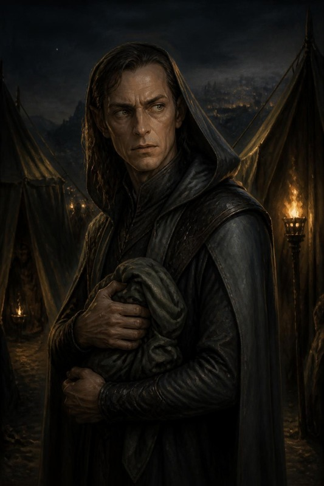

> **La scena "molto bella" (canone `Bestiario/villain/Salvatore/Salvatore.md`).**
> **Quando**: al ritorno dalla tenda, fra le tende del campo. Se il tavolo ha
> fretta si sposta nel caos delle mura (Scena 10), e il box funziona uguale. I
> PG **incrociano un ladro** che non c'entra con l'orda — un
> uomo incappucciato che si muove tra le tende con troppa grazia, un fagotto
> stretto al petto. È **Vatore**: mille anni prima di diventare **Salvatore
> "Sal" della Luna d'Argento**, il mercante-spia che li tradirà in ARC-09. Loro
> **non possono saperlo**. Questo è il cuore grigio della scena.

**Chi è, adesso.** Vatore, il "Ladro d'Ombra" di Hammerfist. Ha **appena rubato
il Sigillo di Ossidiana** (Appendice B) e pianifica la fuga nel futuro (userà un
Cronolito). Ha appena visto **quattro ombre uscire vive dalla tenda del generale**, e nelle
cronache che non dovrebbe aver letto i Quattro sono quattro: ne è **ossessionato**. Personalità: freddo, parla il meno possibile, li osserva
con un **terrore reverenziale mal mascherato**.
> **Canone (DM 2026-07-23) — cosa lo corrompe.** Vatore è **già marcio di
> avidità e sete di potere**: non gli importano le conseguenze. Ha rubato il
> Sigillo *sapendo* che divora anime — e ha deciso che le pagherà con quelle
> degli altri, e poi con la propria. È questa scelta, non un incidente, a
> renderlo **Sal**. Nella scena non è un innocente ingenuo: è un uomo che ha
> già scelto l'ombra, e che ora vede in VOI un potere che vorrebbe rubare.

> **Read-aloud (Andor lead — l'incontro che non capiscono).** *Tra due tende, un
> uomo. Non è dell'orda: veste ombre cucite bene, e stringe al petto qualcosa
> avvolto in un panno. Vi guarda — e nei suoi occhi non c'è l'odio del nemico:
> c'è TERRORE. Il terrore di chi ha appena visto un mito camminare. Non attacca.
> Non scappa nemmeno, subito. Vi fissa come si fissa qualcosa che non dovrebbe
> esistere, e sussurra, più a sé stesso che a voi: «…quattro. Eravate davvero in
> quattro.» Poi la maschera torna: un sorriso freddo, un passo indietro verso
> l'ombra. Artemis, il tuo Anello è diventato gelido.*

**Le risposte del party (grigie — non sanno cosa diventerà):**

| Approccio | Prova | Cosa succede | Eco su Sal nel 1372 (ARC-09) |
|---|---|---|---|
| **Lo ignorano / lo lasciano andare** | — | Vatore svanisce nell'ombra col Sigillo. | Sal esiste "intatto" in ARC-09 — nessun vantaggio, ma nessun sospetto reciproco. |
| **Gli parlano** (Intuizione/Diplomazia CD 18) | 18 | Vatore, terrorizzato, lascia sfuggire un frammento: *«Voi non morite. L'ho letto. Nelle cronache che non sono ancora scritte.»* Poi fugge. | In ARC-09 Sal **esita** un istante di fronte a loro (li ha già temuti mille anni fa): +2 dei PG a Intuizione/Diplomazia contro Sal la prima volta. |
| **Lo derubano** (Furtività/Rapidità di Mano CD 22) | 22 | Gli sfilano il **Sigillo di Ossidiana** (o parte del bottino). | In ARC-09 Sal si presenta **senza** un asso che avrebbe avuto (il DM toglie a Sal un oggetto/piano — es. l'Olio di Sabotaggio parte scarico). |
| **Lo feriscono** (attacco riuscito) | — | Vatore urla, sanguina, attiva il **Cronolito** e sparisce nel tempo. | **Sincronizzazione**: nel 1372 **Sal sanguina nello stesso punto**, all'improvviso, davanti a chi lo osserva (la maschera vacilla) — i PG lo **riconoscono** come "l'uomo del passato" se collegano i punti. |
| **Cercano di ucciderlo** | scontro breve | Non muore qui (il Cronolito lo salva a 1 pf: *deve* sopravvivere per esistere nel 1372 — paradosso auto-consistente). | Sal in ARC-09 porta una **cicatrice antica** e un odio personale: sa che loro ci hanno provato. Nemico più cattivo, ma più fragile emotivamente. |

> **Perché è grigia (nota di tono).** I PG hanno davanti un ladro spaventato che
> **non ha ancora fatto nulla** — ma che (loro non lo sanno) diventerà un
> traditore. Ucciderlo "preventivamente" è un atto oscuro contro un innocente-per-
> ora; lasciarlo andare significa (senza saperlo) crescere il proprio nemico. Non
> c'è scelta pulita. **Registra tutto**: paga in ARC-09. *(Il paradosso regge
> sempre: Vatore DEVE sopravvivere per diventare Sal — il Cronolito lo garantisce.
> I PG possono segnarlo, derubarlo, terrorizzarlo, non cancellarlo.)*

> **Registrazione**: annota l'esito in `state.md §7` (thread «[VATORE/SAL]») e
> nell'Echo Ledger (§7). Cross-link: `Bestiario/villain/Salvatore/Salvatore.md`
> §Sincronizzazione.

L'artefatto che stringe al petto è in **Appendice B**.

---

## §5 — ATTO III · L'ALBA

> **Il percorso dell'atto.** Dal primo ariete al ritorno. Le mura, il drago che
> cala sul cortile, il rito all'incudine, la luce del Rubino.
>
> 🛑 **La prima sessione<!-- storico --> (la serata del 2026-09-25)<!-- /storico --> si ferma al primo box della Scena 10.** Il resto
> dell'atto è della sessione dopo.

| Scena | Dove | Chi entra | Prova |
|---|---|---|---|
| **10** · Le mura all'alba | il camminamento est | il capitano delle mura | prova collettiva, una via su tre |
| **11** · Il duello | il cortile interno | **Skullcrusher il Nero** | combattimento su **M7-B** |
| **12** · Il Rituale della Forgia Eterna | l'incudine, nel cortile | un nano molto vecchio | nessuna |
| **13** · Il Rubino e il ritorno | il cortile | — | nessuna |

### SCENA 10 — Le mura all'alba

Si arriva qui **dove le tacche hanno lasciato i PG** (tabella di uscita
dell'orologio, §4). Se Hella ha vegliato i semi, i **due Treant di Adamantio**
caricano il fianco dell'orda mentre il primo ariete arriva (Scena 5).

> **Read-aloud (Salvatore lead, LotR support).** *Il primo ariete arriva alle
> mura che il sole non è ancora sopra il crinale. Il legno prende la pietra con
> un tonfo che prende lo sterno prima delle orecchie, e il camminamento
> vi si muove sotto i piedi di un dito. Un nano accanto a voi si sputa nelle
> mani, riprende l'ascia e non dice niente. Quello dopo di lui si è già
> incastrato la barba nella cinghia dell'elmo, e non ha il tempo di
> tirarla fuori. In basso, le scale salgono.*
>
> **Che fate?**

<!-- storico -->
⚠️ **Perché questo box è stato riscritto** *(riscrittura 2026-09-18)*. Il
precedente diceva *«Dove vi gettate, la linea tiene»* e chiamava i PG *«quattro
leggende venute dal futuro»*. Due difetti dichiarati, non questioni di gusto:

- `editorial-standards.md` §2 — **mai risolvere l'azione dei PG dentro il
  read-aloud**. «La linea tiene» era l'**esito della prova di gruppo** della
  Scena 10, letto prima che qualcuno tirasse.
- `read-aloud-adulti.md` §4 — *il predestinato senza costo* e *tutto epico*
  sono due delle sei cose che fanno staccare un lettore adulto. Il nano che si
  sputa nelle mani fa lo stesso lavoro e non chiede di essere creduto.

<!-- /storico -->
Poi, quando le prime scale arrivano in cima:

> **Read-aloud (Salvatore lead).** *Il camminamento è largo quanto un tavolo da
> pranzo e lungo quanto la fortezza. Sotto, l'orda non urla più: ha smesso
> quando ha cominciato a salire, e il silenzio che ha lasciato è peggio. Un
> uncino morde la pietra a tre passi da voi, poi un altro, poi sei insieme. Il
> capitano delle mura guarda voi, non i suoi.*
>
> **Che fate?**

**Le tre vie, e nessuna è quella giusta.** La prova è **collettiva**: il party
sceglie **una** via, tutti tirano quella. Non c'è una scelta migliore — c'è
quella che costa meno a *questo* gruppo.

| Via | Prova | Se riesce | Il costo, anche riuscendo |
|---|---|---|---|
| **Tenere la breccia** | Forza o attacco, **CD 18** | la falla regge; i nani vi vedono farlo | ci si arriva al duello **stanchi**: −2 al primo tiro d'iniziativa del duello (Scena 11) |
| **Rincuorare i difensori** | Diplomazia o Guarire, **CD 18** | +2 morale a tutta la linea per l'assalto | la breccia la tiene qualcun altro, e **qualcuno muore**: tira sul *Registro delle Perdite* di ARC-08 |
| **Sabotare gli arieti** | Disattivare o Artigianato, **CD 20** | due arieti fuori uso, l'assalto rallenta di mezz'ora | siete **fuori** dalle mura quando il drago arriva: il duello comincia con i PG separati di 18 m |

**🚫 Modi di fallimento — il fallimento è un costo, mai uno stop.** Nessuna
combinazione di tiri ferma l'avventura: il duello con Skullcrusher si gioca
comunque, perché è già accaduto.

| Successi (su 4) | Cosa cambia davvero |
|---|---|
| 4 | le mura reggono pulite; il duello parte con i PG schierati e **Re Thorek in piedi dietro di loro** |
| 2-3 | reggono a stento. Il duello parte normale |
| 1 | i nani perdono il camminamento est: il duello si combatte **con Re Thorek a 8 pf alle spalle**. Pressione emotiva, **nessun malus meccanico** — il re non è una barra della vita |
| 0 | 🔴 **la breccia cede.** Il duello si combatte **in mezzo ai feriti** portati giù dalle mura: M7-B con 6 quadretti di terreno difficile e **due nani a terra** che Hella può scegliere di raggiungere invece di combattere. Nessun malus: una **scelta in più**, e più dura |

⚠️ **La riga a zero successi è il punto di questa tabella.** Il modo più veloce
di insegnare a un tavolo che indagare e rischiare non conviene è punire il
fallimento con meno gioco. Qui a zero successi **si gioca di più**, non di meno.

- ► **Esito**: *mura tenute saldamente / a stento / breccia ceduta*.

### SCENA 11 — Il duello con Skullcrusher

**Scheda d'entrata — Skullcrusher il Nero, il capostipite** *(statistiche:
Appendice A)*

| | |
|---|---|
| **Aspetto** | drago nero adulto, snello e arrogante: collo lungo, cranio stretto e cornuto, scaglie nere opache con un riflesso verde d'olio. L'acido gli cola dalle fauci chiuse |
| **Vuole** | vincere **davanti all'orda**, perché per lui il potere è quello che gli altri hanno visto |
| **Suona** | dice **il nome** dell'avversario prima di colpire, ogni volta |
| **Eco** | la tabella B4 (§7): ogni ferita che gli fate, la Forgia la ricorderà contro **Fauci di Palude** nel 1372 |
| **Ritratto** | la tavola qui sotto. Solo per il DM fino al duello |

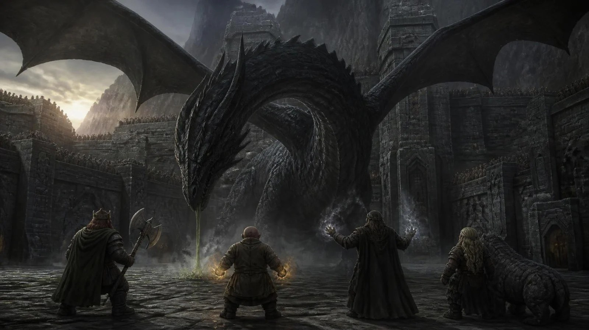

> **Mappa M7-B.** Il drago entra dall'alto (quota ~45 m) e picchia sul cortile
> interno. È il capostipite della stirpe di **Fauci di Palude**: ogni ferita che
> gli infliggete qui, la Forgia la ricorderà mille anni dopo (§7, carry-over B4).

> **Read-aloud (Salvatore lead).** *Prima arriva il freddo. L'ombra passa e
> l'aria del cortile perde dieci gradi in un respiro, e la pelle lo sa prima
> che lo sappiate voi. Poi il rumore: non un ruggito — un **risucchio**, come
> quando il mare si tira indietro prima di tornare. Le braci della forgia si
> piegano tutte nella stessa direzione. Un nano vicino a voi lascia cadere lo
> scudo e non si china a raccoglierlo.*
>
> *Dove atterra, la pietra fuma. L'acido gli cola dalle fauci chiuse e si
> mangia il selciato come acqua nella neve.*
>
> **Che fate?**

> 🎚️ **Se e solo se Thorik tiene Aegis Fang in mano** — *un secondo box, corto,
> e a lui soltanto*: **AEGIS FANG (non canta: urla, dentro il cranio):**
> *«SANGUE ANTICO. ARTEFICE DI LACRIME.»* — *e per un istante la Corona ti
> mostra due immagini sovrapposte: questo drago adesso, e un altro drago sopra
> mura che bruciano, che non hai mai visto.*

<!-- storico -->
⚠️ **Perché è stato spezzato in due** *(2026-09-18)*. Il box unico portava
**nove nomi propri** e finiva su *«state per insegnare a quel sangue cosa vuol
dire aver paura»* — che dice ai giocatori cosa stanno per fare, cioè
**l'esito**. Adesso l'ingresso è **quello che il corpo sente** (freddo, il
risucchio, le braci che si piegano, lo scudo che cade), la visione è un
**micro-box per un solo PG** come chiede `ADR-0014` §1, e l'ultima riga è
**«Che fate?»** invece di una promessa.
<!-- /storico -->

#### 🎬 La regia dei primi due round — una battuta per attore *(ADR-0014 §1)*

> <!-- storico -->
> **Perché c'è.** Sotto trovi le tattiche **del drago**, che questo master aveva
> già e sono buone. Quello che mancava è l'altra metà, che `ADR-0014` prescrive
> dal luglio 2026 per **ogni** sequenza a battute e che esisteva in **un solo
> documento del repo**: i PG agiscono uno alla volta, e se ogni turno è un tiro
> senza descrizione il pathos evapora al terzo round.
> <!-- /storico -->
>
> **Non sono numeri nuovi.** CD e danni restano quelli dell'Appendice A. Qui c'è solo
> **cosa leggere, quando**, e sono sei secondi a testa.

**Apertura di round — cosa è cambiato nel mondo.** Prima di ogni giro, una riga
sola: *dove* è il drago (in cielo, in picchiata, a terra) e *cosa* ha lasciato
il round prima (una crepa, un nano che non si rialza, il fumo dell'acido).

**Il giro, in quattro battute** *(ordine di gioco dichiarato: chi ha vinto
l'iniziativa parla per primo, ma la descrizione segue sempre questo ordine)*:

| | Attore | Riuscita — **una riga** | Fallimento — **una riga, e non è «manchi»** |
|---|---|---|---|
| 1 | **THORIK** — regge | l'ascia entra fra due scaglie e ci resta un istante di troppo: il drago **si gira verso di lui**, ed è quello che serviva | il colpo scivola sulla scaglia bagnata d'acido. Thorik resta in piedi, ma adesso ha le mani che bruciano |
| 2 | **TORDEK** — colpisce | il pugno prende l'ala dove l'osso è sottile: un suono secco, e la picchiata si sbilancia | il drago si alza di un metro e il colpo passa sotto. Tordek finisce in avanti e per un momento **non vede dov'è** |
| 3 | **ARTEMIS** — sceglie il bersaglio | il blast arriva **all'occhio**, e per un round il drago tiene la testa girata di tre quarti | l'ombra si apre troppo presto. Il drago la vede arrivare e **ricorda da dove è partita** |
| 4 | **HELLA** — cambia il campo | le radici salgono dal cortile e chiudono una via di fuga: il drago **deve** restare | la pietra non risponde — qui la terra è giovane e non la conosce. Hella sente l'assenza, e le costa |
| 4-bis | **DURIK** — si mette in mezzo | il drago deve scavalcarlo per arrivare a Hella, e scavalcarlo gli costa il turno di picchiata | il soffio lo prende in pieno: la pietra **fuma**, e l'acido gli fa il 50% in più. Durik non arretra |

**Chiusura di round — l'avanzamento visibile.** Una riga che dica cosa è
**cambiato**, non quanti pf restano: la prima scaglia che manca, il fiato che si
accorcia, il primo passo indietro che il drago fa senza volerlo.

> **Round 1 — apertura da leggere.** *L'ombra passa sul cortile prima del
> rumore. Quando il rumore arriva, è il vostro stesso nome gridato da ottocento
> nani che hanno smesso di combattere per guardare in alto.*
>
> **Che fate?**

⚠️ **Dal round 3 si smette.** La regia serve a far **atterrare** l'inizio; se la
tieni per otto round diventa una lettura e il combattimento si ferma. Dal terzo
round si torna alle tattiche del drago qui sotto, e si descrive solo quello che
cambia davvero.

#### Tattiche di Skullcrusher — regia round per round (stile RHoD, aggancio M7-B)
> Scritte dal punto di vista del drago. Skullcrusher è **giovane nella sua
> arroganza**: non ha mai perso, non sa ancora aver paura. È questo che i PG gli
> insegnano — ed è questo che il suo sangue ricorderà.

- **Round 1 — la Presenza.** Cala dall'alto (Presenza Terrificante CD 22:
  chi fallisce è scosso). Se Zog'tar è morto in modo «spettacolare» (Scena 8), arriva **già
  in picchiata** e i PG perdono la prima azione. Apre col **Soffio acido** sul
  gruppo più fitto (Riflessi CD 24). *Non atterra: vuole restare in cielo, dove
  si sente un dio.*
- **Round 2-3 — il predatore aereo.** Resta in **quota**, picchia con Attacco in
  Volo (morso + coda) e risale — punisce chi non ha gittata o volo. Bersaglio
  preferito: chi lo ha ferito di più (l'arroganza non perdona l'insulto).
  *Momento Artemis*: in volo (Ali d'Ombra) è l'unico che lo raggiunge alla pari.
  *Momento Aegis Fang*: Thorik la **scaglia** — se colpisce in volo, incide la
  **Cicatrice a forma di martello** su un'ala (§7: −2 alla Volare di Fauci nel 1372).
- **Soglia ~⅓ pf (~80) — la prima paura.** Per la prima volta nella sua vita,
  Skullcrusher **esita**. È il momento dei tre esiti (sotto). Se i PG premono,
  può essere ucciso; se allentano, fugge nelle paludi. *«Qualcosa in lui — nel
  sangue — capisce che questi quattro non sarebbero dovuti esistere.»*
- **«La Forgia ricorda» (meccanica cardine).** **CONTA i colpi a segno** su
  Skullcrusher (ferite ancestrali, N≤3) — è il dato per il carry-over B4 (§7).
  Moradin, nella mente di Thorik: *«Ogni ferita che infliggi ora all'antenato,
  la mia Forgia la ricorderà quando affronterai il discendente.»*
- **La Cintura di Tordek RIFIUTA di attivarsi** qui (*«il vero scontro appartiene
  al futuro»*): coerenza col 1372, non nerf. È voluto — Tordek vince senza.
- **Sviluppi.** Comunque finisca (ucciso/ferito/fuggito), il sangue di
  Skullcrusher **sopravvive**: se ferito o fuggito, si ritira nelle paludi a
  leccarsi le ferite e a generare la stirpe che, mille anni dopo, culminerà in
  **Fauci di Palude**. Se **ucciso**, la stirpe nasce comunque (aveva già figli):
  la profezia non spezza il sangue, lo **segna** (carry-over B4). In ogni caso,
  con il drago via, l'orda perde lo sprone e si sfalda entro poche ore (→ Scena
  13). Se Skullcrusher ha **visto** Aegis Fang scagliata, il terrore di
  quell'arma entra nel sangue: Fauci, mille anni dopo, la riconoscerà (gancio
  inverso B4).

#### 🏟️ IL CORTILE — cosa c'è, e cosa ci si può fare che qui non è scritto

> **Perché questa tabella esiste.** Il duello aveva la regia, le tattiche del
> drago e la scalatura, ma **niente sull'arena**: un tavolo che volesse essere
> furbo non trovava appigli, e restava l'iniziativa. Qui non ci sono soluzioni
> pronte — ci sono **cose**, e una riga su cosa succede se qualcuno le usa.
> Per tutto il resto vale il §0-ter: **assorbi, poi rilancia**.

| Nel cortile c'è | Se qualcuno lo usa |
|---|---|
| **Le corde degli arieti**, tese e bagnate | tirarle mentre è basso: Lotta contrapposta con **+4** per la leva. Non lo atterra: gli **inchioda un'ala a terra per un round**, ed è tutto quello che serve |
| **La fucina originale**, accesa da stanotte | ci si può spingere dentro qualcosa. Il drago è **immune all'acido, non al calore della forgia**: 4d6 e — più utile — il fumo gli toglie l'olfatto per 1d4 round |
| **La cisterna sotto il pozzo** | l'acido colpisce l'acqua e **ribolle**: nuvola che oscura, −4 agli attacchi di tutti. Danneggia i PG quanto lui. È una **scelta**, non un trucco |
| **Le campane della torre nord** | il suono nell'aria fredda copre il battito d'ali: chi le suona toglie al drago il vantaggio del suono in picchiata (e si fa **bersagliare**) |
| **Ottocento nani che guardano** | chiamarli è gratis. Arrivano, **e muoiono**: tira sul Registro delle Perdite di ARC-08. Il drago fa un attacco pieno su di loro invece che sui PG. Nessuno lo dice al tavolo prima |

🚫 **Cosa NON dire.** Che la fucina funziona contro di lui. Se lo dici, la
tabella diventa un elenco di mosse; se aspetti, resta un cortile. Il DM **non
legge questa tabella ai giocatori**: la tiene sotto gli occhi e risponde.

⚠️ **E se hanno un'idea che non è in tabella**, la risposta è già scritta in
§0-ter: sì, e adesso c'è un problema nuovo. **Questa tabella è un esempio di
tono, non l'elenco delle cose permesse.**

#### ► ESITO DEL DUELLO (aperto — MAI fisso) → carry-over B4 (§7)

`[HDYWTDT — il finisher a chi mette a terra il drago. «Com'è che lo fai?», e
aspetta. È il momento più grosso della campagna finora: non riempirlo tu.]`

1. **UCCISO** (0 pf): impresa immensa, la profezia in pieno. → Fauci nel 1372
   parte con **−10% PF** e Presenza ridotta contro i portatori (B4).
2. **FERITO GRAVE** (fugge sotto ⅓ pf): esito "medio", il più probabile. →
   Fauci perde **un uso del soffio** (B4).
3. **FUGGITO** (i PG scelgono la sopravvivenza / non lo intaccano): quasi illeso,
   ma **vi ha visti e riconosciuti**. → Fauci **+2 iniziativa** ma morale
   fragile (fugge sotto 75 pf invece di 50) (B4).
*Registra esito + N ferite + se Aegis Fang colpì in volo.*

#### Sidebar — Scalare lo scontro (stile RHoD)
| Situazione | Aggiustamento |
|---|---|
| Party **straripante** (4 PG L14, tutti gli artefatti, aiuti pieni al consiglio) | Skullcrusher **avanzato a Vecchio (GS 14)**: PF 300, soffio 14d4 CD 26, +2 a tutti gli attacchi; oppure 2 **wyvern** scortano il drago dai round 2 |
| Party **logorato** (il campo e le mura andati male, risorse spese, Hella ancora fragile) | Skullcrusher NON usa il soffio 2 volte di fila; a ⅓ pf **fugge subito** (esito FUGGITO garantito) invece di premere |
| **Hella appena risorta** — vuoi proteggerla | Il drago la ignora finché non lo ferisce (predatore: va per la minaccia, non per la novità) — dà alla giocatrice spazio per il suo primo scontro |
| Un PG **abbattuto** | Skullcrusher lo ignora (caccia chi è in piedi e lo minaccia): finestra per stabilizzarlo |

### SCENA 12 — Il Rituale della Forgia Eterna `[CANONE — state.md §5; D-B/D-A, DM 2026-09-19]`

> **Cos'è, e perché esisteva solo in `state.md`.** Questo viaggio **è** il
> **Rituale Legacy 4**, che la matrice degli artefatti chiama *«Siege of the
> Eternal Forge»*. `state.md` §5 dice che **Corona +3, Senzienza e Rubino si
> sbloccano qui**. Fino a oggi il master consegnava il duello e basta: il DM
> tornava dal tavolo a segnare un avanzamento che nel modulo non era successo.
>
> ⏱️ **Quando** *(decisione DM)*: **dopo il combattimento**, sull'esito
> dell'incontro. Non è una prova sotto pressione ed è **senza ulteriori costi** —
> il prezzo di questo arco Thorik lo ha già versato altrove.

#### Il rito si fa comunque. Cambia il tono, non l'esito

Il canone di §6 è esplicito: la fortezza regge perché **la profezia è incisa**.
Anche un duello andato malissimo finisce con gli antenati che ricacciano il
drago. Quindi il Rituale **non si fallisce**: si gioca in una delle quattro voci
che l'incontro ha appena scelto.

| Esito del duello | La voce del rito | La riga che il DM dice |
|---|---|---|
| **UCCISO** | trionfo, e un imbarazzo | i nani antichi non sanno se inginocchiarsi o abbracciarli, e provano tutti e due |
| **FERITO GRAVE** *(il più probabile)* | mestiere | nessuno canta. Si conta chi manca, poi si accende la pietra |
| **FUGGITO** | sollievo con un'ombra | il drago vi ha visti. Il rito si fa lo stesso, e qualcuno guarda il cielo mentre si fa |
| **VINTO SPORCO** *(§6, gli avi intervengono)* | misericordia e dovere | siete venuti a salvarli, e vi hanno salvati loro. La pietra si accende uguale, e pesa di più |

#### La scena, in tre momenti

> ✏️ *Il nano molto vecchio del box qui sotto è **Thorgrim**: è l'unico vecchio
> che i PG conoscono qui, e ha appena tenuto in mano la loro ascia. Il box non lo
> nomina: se il tavolo chiede chi è, il nome lo dà il DM.*

> **Read-aloud (LotR lead) — l'incudine.** *Quello che chiamano altare è
> un'incudine, e si vede: il piano è segnato da mille anni di martelli. Intorno
> non c'è un tempio, c'è un cortile pieno di feriti. Un nano molto vecchio
> appoggia sull'incudine una pietra rossa grande come una noce, e si tira
> indietro di un passo. Nessuno spiega niente. Tutti guardano la corona.*

**Momento 1 — la pietra entra.** Il Rubino trova il suo incasso, quello che per
tutto l'arco non rifletteva la luce. Non serve un tiro: **la Corona lo prende da
sé**, come una serratura che riconosce la chiave. La Corona passa a **+3**.

> **Read-aloud (Salvatore) — l'incasso che si chiude.** *Il vuoto sulla corona
> si riempie e smette di essere un vuoto. Per la prima volta da quando Thorik
> l'ha in testa, l'oro torna indietro da tutte e tre le pietre, e la luce che ne
> esce non è di nessuna delle tre: è di quello che adesso sono insieme. Il metallo
> gli si scalda contro la fronte, poi si raffredda, e resta caldo come una mano.*

**Momento 2 — la Corona parla, o non lo fa.** Qui **si incassa la promessa di
`ARC07-DEF-3` §5**, e i due rami sono già canone:

| Al rito di DEF-3, Thorik… | La Senzienza arriva | E la prima cosa che dice |
|---|---|---|
| **ha donato** il +2 di deflessione | **sveglia**, e con qualcosa da dire su di lui | *«Tre volte hai pagato tu. La terza non te l'ho chiesta io.»* |
| **ha rifiutato** | **fredda**: i poteri sì, il tono no | una voce corretta e senza calore, che dà informazioni e non commenti. ⚠️ **Reversibile**: si scalda in ARC-09, quando lui rischia qualcosa di suo |

> 🎭 **Grigio politico.** La Corona **non è dalla parte di Thorik**. Il suo
> *Want* è la montagna, non il portatore: ha accettato tre gemme e un pegno
> perché le servivano, e lo dirà con la stessa calma con cui dice tutto il resto.

**Momento 3 — Aegis Fang si sveglia**<!-- storico --> *(decisione DM: è una scena, non una riga
di scheda)*<!-- /storico -->. È una scena, non una riga di scheda. `state.md` §5 dice: *«Unchanged until the Siege is won → then Stage
1 full awakening»*. L'Assedio è questo, ed è appena stato vinto.

> **Read-aloud (Mercer lead) — l'ascia prende la parola.** *L'ascia si scalda
> nella mano di Thorik, e non è il calore della forgia. È la prima volta in tre
> anni che si fa sentire senza essere interrogata. Nel cortile nessuno se ne
> accorge, perché nessuno sta guardando le armi.*

- **AEGIS FANG (Ego 14, servo del popolo nanico prima che del portatore):**
  *«Ho visto. Non chiedo più.»* — se al rito di DEF-3 Thorik **ha donato**.
- **AEGIS FANG:** *«Ho visto anche cosa non hai dato.»* — se **ha rifiutato**.
  L'ascia non lo abbandona: lo **guarda**, e il giudizio finisce la prima volta
  che lui rischia qualcosa di suo per Hella.

> **`[HDYWTDT]`** Il primo uso dello Stage 1 non lo descrive il DM. Si chiede al
> giocatore di Thorik: *«L'ascia parla, e per la prima volta non risponde a una
> domanda. Cosa ti dice, e tu cosa fai con quella frase davanti a ottocento nani
> che ti stanno guardando?»*

> **Chiusura.** Tre pietre accese, un'ascia che ha appena parlato, e un cortile
> che non sa ancora di essere una leggenda. **«Che fate?»**

#### ⚠️ Due cose per il DM, e una da decidere

- **Il Rubino è a uso singolo e si spende nel ritorno** (D16, `DEF-5` §3). Non
  è un potere nuovo in tasca: è il motore del viaggio di casa.
- **Non ci sono altri costi qui** — né TS, né pegni, né punti caratteristica.

#### Momento 4 — l'Aura della Forgia Eterna `[CANONE — DM 2026-09-20]`

**Il quarto potere, quello che la Corona non aveva mai avuto.** La matrice
degli artefatti lo chiama *Aura of the Eternal Forge* e lo dà al **Rituale 4,
alla vittoria nella battaglia antica**. È adesso.

| Chi | Cosa riceve |
|---|---|
| **I quattro** | *Possenza Divina* e *Protezione dal Male* |
| **Ogni nano entro 30 metri** | *Possenza Divina*, *Protezione dal Male*, *Benedizione*, e un uso di *Scolpire Pietra* |
| **Thorik** | irradia **+4 di morale** ad attacchi e tiri salvezza per ogni nano che lo veda |
| **I nemici dei nani** | **Volontà CD 20** o **scossi** per 1 minuto |

⏱️ **Durata e cadenza**: dura **fino all'alba** la prima volta, e da allora
resta alla Corona come potere **1/settimana**. Non è una ricarica: è la cosa
che la Corona sa fare da quando è intera.

> **Read-aloud (LotR lead) — l'aura.** *Il vecchio che ha posato la pietra
> alza la testa, e non guarda Thorik: guarda dietro di lui. In tutto il
> cortile i feriti stanno smettendo di essere feriti. Un fabbro con una
> gamba sola si tira su appoggiandosi al muro, e il muro gli si apre sotto
> la mano come argilla, e lui ci infila la gamba e resta in piedi. Nessuno
> grida. Ottocento nani guardano un uomo con una corona e capiscono, tutti
> insieme e senza parlare, di essere dentro una storia che verrà raccontata.*

⚠️ **Tre cose per il DM, e la prima è di bilancio.**

- **L'Aura arriva DOPO il duello, non prima.** L'innesco è *«vittoria nella
  battaglia antica»*, non l'arrivo: il duello (Scena 11) resta tarato come è scritto, e nessun
  numero di Skullcrusher va toccato. 🔎 Una fonte d'artefatto più vecchia la
  dava *«automatica all'arrivo»*, ed è una mappatura superata — quella
  descriveva un Rituale 4 di una scena sola.
- **Metà dell'Aura la giocate già**, sotto un altro nome. La **Guarigione del
  passaggio** della Scena 1 — pf pieni, usi ricaricati, niente tiri — è la
  metà curativa di questo stesso potere, attribuita al portale. Resta lì e non
  si somma: qui arriva **solo la metà che potenzia**.
- **Il Manto di Pietra e Spirito NON è di questo rituale**, e il giocatore lo
  sa: è sulla sua scheda dal **Rituale 3**, riga «Rit. 3», *Mente Vuota*
  permanente e RD 5/epico. La riga della matrice che lo dava qui era una
  mappatura vecchia, ed è stata corretta.

### SCENA 13 — Il Rubino e il ritorno

> **Read-aloud (Casa di Davide — la profezia compiuta).** *L'orda, senza
> generale e senza drago a spronarla, si sfalda come sabbia. Hammerfist regge.
> Sulla fronte di Thorik il Rubino, che all'incudine era soltanto una pietra, si
> accende per la prima volta, e la sua luce è calda come sangue e antica come
> la roccia. La vittoria che credevate storia era la vostra, adesso, con le
> vostre mani. Il passato ha sempre avuto il vostro volto. La luce vi avvolge e
> vi strappa via, verso casa, verso una fortezza che brucia mille anni più in là.*

⚠️ *Il box di prima chiamava il Rubino «la terza gemma, muta da sempre»; ma
l'incasso è vuoto per tutto l'arco (`state.md` §5, e Balvar lo dice: «Tu ne hai
due»), e la pietra entra solo al Rituale della Scena 12.*
- **Attivazione gemme (D5/D16)**: portale aperto da Topazio+Smeraldo; il **Rubino
  si accende SOLO ORA** e diventa il motore del ritorno al 1372.
- **Raccordo (D16)**: → riemersione al **Cuore della Montagna**, Giorno 3
  dell'assedio del 1372. La **cucitura** è il **master #5**.
- ► **Esito**: il **tono del Rubino** dipende da come è finito il duello (§7).
  Corona ora a **3 gemme accese**.

---

## §6 — CONTINGENZE & SCONFITTA

| Mossa | Risposta del modulo |
|---|---|
| **Vogliono cambiare il passato** (salvare qualcuno destinato a morire, avvisare i nani di eventi futuri) | Timeline auto-consistente: ci **provano**, ma "va sempre come doveva". Il nano che vogliono salvare muore comunque, in un altro modo. Non è fato crudele: è che **è già successo**. Ottimo pathos, zero paradossi. |
| **Cercano tesori/conoscenze da riportare nel futuro** | Possono! Ma la maggior parte **non attraversa** il Rubino (solo ciò che è "loro" torna — corpi, artefatti legati). L'**eccezione canonica** è il **Sigillo di Ossidiana** rubato a Vatore (Appendice B): il Cronolito che lo lega a Vatore lo fa «passare» come gancio ARC-09. |
| **Vogliono reclutare Thorgrim / portarlo nel futuro** | Impossibile (non è "loro"): Thorgrim resta, e la sua eco è la Cerimonia delle 100 Asce (ARC-08). Commovente: si separano da un fratello che è già polvere da mille anni. |
| **Evitano del tutto il duello con Skullcrusher** | Difficile ma possibile (montaggio): allora il Rubino si accende comunque (la fortezza regge), ma **senza ferite ancestrali** → nessun carry-over B4 (Fauci al 1372 a piena forza). La scelta ha un prezzo futuro. |
| **FALLIMENTO — il duello va malissimo / un PG cade / fuggono sconfitti** | Non c'è TPK: la timeline **esige** che vincano (la profezia È incisa). Se il combattimento crolla, Thorgrim e gli antenati **intervengono** e ricacciano il drago (a caro prezzo: molti nani antichi muoiono — pathos, e la Cerimonia delle 100 Asce ne porterà i nomi). I PG vincono "sporco": **nessuna ferita ancestrale** registrata, il Rubino si accende col tono «misericordia/dovere», e portano il peso di essere stati salvati dagli avi che erano venuti a salvare. |

---

## §7 — ECHO LEDGER (le conseguenze che attraversano gli archi)

| Evento (qui) | Eco | Quando riemerge | Dove si gestisce |
|---|---|---|---|
| **Esito del duello con Skullcrusher** (Scena 11) | UCCISO/FERITO/FUGGITO → effetto quantificato su Fauci di Palude | ARC-08 (boss di Hammerfist) | **`PortaleForgia-P5-B4-CARRYOVER-Forgia-Ricorda.md`** + statblock Fauci ARC-08 |
| **Ferite ancestrali segnate** (N≤3) | +N TxC **o** +Nd6 ai portatori vs Fauci; Aegis Fang in volo → cicatrice d'ala (−2 Volare Fauci) | ARC-08 | B4 §3 |
| **Aegis Fang «sente» Fauci** (gancio inverso) | +2 circostanza a Thorik vs Fauci + preavviso del soffio | ARC-08 | B4 §4 |
| **Vatore segnato/derubato/ferito** (Scena 9) | sincronizzazione su Sal nel 1372 (sanguina / manca un asso / vi teme) | ARC-09 (Sal mercante-spia) | **state.md §7** + `Bestiario/villain/Salvatore/` |
| **Seme del Ghostlord** (Scena 5, incontro con Zeth) | i PG assistono all'inizio della Lichificazione di Zeth (mano del Collezionista attraverso il tempo) | ARC-09 (dilemma etico di Hella su Zeth il Murato) | **state.md §7** + `Bestiario/villain/Ghostlord/` |
| **Scelte-costo vs Zog'tar** (Scena 8) | Thorik affaticato / Cintura di Tordek «assaggiata» o disciplinata / tono del Rubino | ARC-08 (vs Fauci) | Scena 8 + B4 |
| **Tono del Rubino** (esito duello) | «nessuna pietà» (UCCISO) / «dovere» (FERITO) / «vigile» (FUGGITO) → colore della Corona in ARC-08 | ARC-08 ingresso | `ARC07-CONSEGUENZE-ECHI.md` §2 |
| **La Senzienza arriva calda o fredda** (Scena 12) | il ramo lo ha deciso `DEF-3` §5: se Thorik ha donato il +2 di deflessione la Corona **commenta**, se ha rifiutato **informa e basta**. ⚠️ Il freddo e' **reversibile** | ARC-08 e ARC-09, ogni volta che la Corona parla | `state.md` §5 · `ARC07-CONSEGUENZE-ECHI.md` |
| **Aegis Fang allo Stage 1** (Scena 12) | l'ascia ha smesso di interrogare Thorik — **oppure** lo giudica, e il giudizio finisce la prima volta che lui rischia qualcosa di suo per Hella | ARC-08, alla prima scena che riguarda Hella o nani da proteggere | `Bestiario/` scheda Aegis Fang + `state.md` §5 |
| **La prima frase dell'ascia, detta dal giocatore** (`[HDYWTDT]`, Scena 12) | quella frase e' canone: ottocento nani l'hanno sentita, e a Hammerfist qualcuno la **ripetera' storta** | ARC-08, arrivo al Cuore della Montagna | `ARC07-CONSEGUENZE-ECHI.md` |
| **Cronache dei Quattro Eroi compiute** | fama crescente presso i nani → Custodi Eterni | ARC-08 E5 / Cerimonia 100 Asce | ARC-08 |
| **Sigillo di Ossidiana** (se rubato a Vatore) | artefatto di Shar (anti-luce / furto d'ombra, divora anime) — vedi Appendice B; contrasta l'Anello di Artemis | ARC-09 | `state.md §7 [SIGILLO DI OSSIDIANA]` + `Bestiario/villain/Salvatore/` |

---

## §8 — AVANZAMENTO (budget PX per scena + tesoro pregenerato)

### A. Budget PX del beat (party 4 PG, APL 13)
| Scena | Tipo | PX/PG `[verif. ✓ ERRATA/TESORO-WBL 2026-07-23]` |
|---|---|---|
| Scene 1-4: l'arrivo, Durin, la targa, il consiglio | storia/social | 600 |
| Scene 6-8: il campo, Balvar, Zog'tar (GS 14) | combattimento veloce | 2.400 |
| Scena 10: le mura | montaggio/eroico | 600 |
| Scena 9: Vatore (scena grigia, qualunque esito) | roleplay grigio | 500 |
| **Scena 11: Skullcrusher (GS 12)** | boss | **2.700** (party 4, APL 13) |
| Scene 12-13: il Rituale e il Rubino | premio di storia maggiore | 800 |
| **TOTALE beat** | | **~7.600/PG** |

> Sommato a Terra (~11.600) + Affreschi (~1.900) + Resurrezione (~1.900), il
> party **matura il 14° verso Hammerfist** (D8). Le parti giocate non si ritoccano.

### B. Tesoro PREGENERATO (i doni di Re Thorek I + il bottino del passato)
| Dove | Oggetto (pregenerato) | Valore |
|---|---|---|
| Scena 4 (il consiglio, se fiducia piena) | **Benedizione degli Antenati**: 4 **Pozioni di Cura Ferite Serie** dell'antica fucina (curano 3d8+11) | ~3.000 mo |
| Scena 4 (dono cerimoniale) | **Torque di Thorek I** — monile nanico antico (+1 sacro ai TS vs paura; e nel 1372 è una **reliquia storica**: i nani si scoprono il capo davanti a chi lo porta) | ~2.000 mo + valore storico |
| Scena 9 (se derubano Vatore) | **Sigillo di Ossidiana** — artefatto minore di Shar (Manto di Notte + Furto della Notte, divora anime; contrasta l'Anello di Artemis — Appendice B) | speciale (gancio ARC-09) |
| Scena 10 (bottino dell'orda antica, se sabotano gli arieti) | armi orchesche primitive (poco valore) + un **corno da guerra di ferro nero** (curiosità, 300 mo) | ~300 mo |
| Scena 11 (resti di Skullcrusher, se UCCISO) | **scaglia del Primo Nero** — trofeo: materiale per **1 oggetto ad acido** (arma/armatura +1d6 acido, o focus per incantesimi acidi; a discrezione del fabbro), e prova che la profezia è compiuta | ~1.500 mo |

> ⚠️ **Cosa torna nel 1372**: solo ciò che è "loro" o legato (corpi, artefatti,
> il Sigillo rubato). Le pozioni consumate qui restano qui; i doni indossati
> tornano. Il DM decida caso per caso (§6).

---

## §9 — PONTE al master #5 + HANDOUT & ASSET

**Ponte.** Il Rubino acceso, la profezia compiuta, la Corona a **tre gemme**: la
luce strappa i quattro al passato. Ma non tornano nella Sala della Forgia da cui
erano partiti — il Rubino, «Cuore della Leggenda», li deposita **dove serve**:
al **Cuore della Montagna**, sotto Hammerfist, il **Giorno 3 dell'assedio del
1372**, mentre la fortezza brucia sopra di loro. → **master #5: il Ritorno a
Hammerfist** (la cucitura D16, il raccordo all'ARC-08).

### Handout giocatore
1. **Le Cronache dei Quattro Eroi** — la pagina di profezia, consegnata alla
   soglia prima di partire (`DEF-3` §8-ter): *«Quattro Eroi dal futuro salveranno la fortezza dalla
   Mano Rossa e dal drago Skullcrusher il Nero»*. I giocatori scoprono di
   **essere** la profezia (il momento più forte dell'arco).
2. **La tabella di carry-over B4** (per il DM): esito del duello → effetto su
   Fauci nel 1372.
3. **Statblock di Skullcrusher** (Appendice A.1) per il duello.
4. **Il piano di battaglia di Re Thorek I** — `homebrew/volume-mille-anni/03-HANDOUT-PIANO-DI-BATTAGLIA.md`,
   da mettere sul tavolo di guerra (Scena 4).

### Immagini (atlante C1 — momenti d'uso)
| Momento | Immagine |
|---|---|
| Il portale del Tempo / l'arrivo | `Immagini/tavola-portale-del-tempo.jpg`, in apertura della Scena 1. Sostituisce `PortaleDellaForgiaEterna.webp`, che è la fotografia di un blocco di testo |
| La fortezza giovane, all'arrivo | `Immagini/tavola-hammerfist-giovane.jpg`, Scena 1; e `Immagini/tavola-hammerfist-giovane-porta.jpg` per la porta e la targa, Scena 3 |
| Skullcrusher nel cortile | `Immagini/web/tavola-skullcrusher-nel-cortile.jpg`, sotto la scheda del drago (Scena 11) |
| I ritratti del cast | sotto le schede d'entrata, da `Immagini/ritratti/` (Zog'tar da `Immagini/web/`) |
| L'affresco del Tempo (partenza) | `Sala Forgia Eterna - Camera Ottagono con 8 Affreschi Divini (Parte 2).webp` |

### Musica
- **`Musica/LaCanzoneDellePietre.mp3`** — all'accensione del **Rubino** (Scena
  13): la leggenda che si compie merita il tema della pietra al suo apice.

---

<!-- storico -->
### Cosa è cambiato nel riordino del 2026-09-25

Il DM ha chiesto un master che si legga in avanti, e una prosa che abbia un
senso logico e cronologico. Riordinando sono venuti fuori dieci punti in cui il
testo si contraddiceva con l'ordine degli eventi o col canone. Sono corretti
nel testo; qui c'è l'elenco, perché chi ha una stampa vecchia sappia cosa è
cambiato.

| | Cosa diceva la stesura di prima | Perché non reggeva | Dove è corretto |
|---|---|---|---|
| 1 | il box d'arrivo leggeva la targa: *«Quei Quattro Eroi… siete VOI»* | dava il **Nome** del nodo d'indizio, che il master stesso dice di non regalare mai; e lo dava prima che la pattuglia li trovasse | Scena 1 (il bosco) e Scena 3 (la porta) |
| 2 | il box della Zona 1 diceva che la targa era stata incisa **oggi** | era la **Lettura** del nodo, detta gratis | Scena 3 |
| 3 | il consiglio di guerra era un paragrafo dentro la pattuglia, e la Scena 2 «Thorgrim» era «assorbita» in una scena che non la conteneva | Thorgrim esisteva solo nella versione veloce | Scena 4 |
| 4 | Thorgrim chiedeva la corona e riceveva l'ascia | due oggetti diversi nella stessa battuta | Scena 4 |
| 5 | la fonte di luglio faceva togliere la Corona a Thorik davanti al re | in `DEF-3` §5 se la toglie per la seconda volta in vita sua, per Hella | Scena 4 |
| 6 | il riposo era in ore (3 h, 6 h) che non tornavano con le tacche | l'orologio è in tacche, e la guarigione del passaggio aveva già rimesso in piedi tutti | Scena 5 |
| 7 | Balvar parlava con i PG davanti a Zog'tar, senza dire come | nanico antico, a bassa voce, in fondo alla tenda | Scena 7 |
| 8 | Zog'tar *«muore in questa scena, la storia dice così»* | la Via A lo lascia vivo e umiliato | Scena 8 |
| 9 | Vatore *«ha appena visto quattro individui respingere un'orda»*, durante l'infiltrazione | di notte l'orda non è ancora stata respinta: li ha visti uscire dalla tenda del generale | Scena 9 |
| 10 | il Rubino era *«la terza gemma, muta da sempre»* | l'incasso è vuoto fino al Rituale | Scena 13 |

### FILE-FONTE ASSORBITI DA QUESTO MASTER (→ `_ARCHIVIO/` a consolidamento chiuso)
`_ARCHIVIO/PortaleForgia-P5-FASTPLAY.md` (master da tavolo B3) · `PortaleForgia-P5-DEFINITIVO-PARTE1/2.md`
(prosa estesa) · `_ARCHIVIO/PortaleForgia-P5-RICALIBRATO.md` (deprecato) · sezione «battaglia
antica» di `_ARCHIVIO/PortaleForgia-P6-INTEGRAZIONE-Completa.md` (deprecata).
`PortaleForgia-P5-B4-CARRYOVER-Forgia-Ricorda.md` resta **vivo** (tabella
DM-approved citata da qui e dall'ARC-08). `Bestiario/villain/Salvatore/Salvatore.md`
resta vivo (Vatore/Sal).
<!-- /storico -->

---

<!-- pagina: una-colonna -->

## APPENDICE A — STATISTICHE

> Una pagina A4 a una colonna, da tenere aperta durante gli scontri. I numeri
> stanno **solo qui** (ADR-0021): le schede d'entrata nelle scene dicono chi è
> il PNG, questa appendice dice quanto fa male.

### A.1 · Skullcrusher il Nero (Scena 11)

```
============================================================
   SKULLCRUSHER IL NERO — il Primo Nero (GS 12) [verifica B5]
   Drago Nero Adulto potenziato · capostipite di Fauci di Palude
============================================================
Taglia: Enorme (Huge, 4,5 m) · Tipo: Drago (Terra, acido)
PF: 240 · CA 27 (−2 taglia, +19 nat) · tocco 8 · impreparato 25 · Iniz +4
BAB/Lotta: +22 / +39 (Enorme) · FOR 27 · DES 10 · COS 21 · SAG 15 · CAR 14
Velocità: Terra 12 m · Volare 36 m (scarsa)
Attacchi: Morso +26 (2d6+9) · 2 Artigli +21 (1d8+4) ·
          2 Ali +21 (1d6+4) · Coda +21 (1d8+13)
Full-attack (a terra): morso + 2 artigli + 2 ali + coda
Soffio ACIDO: cono 18 m, 12d4, Riflessi CD 24 ½, ricarica 1/1d4
Presenza Terrificante: CD 22 (Volontà o scossi), all'ingresso
Incantesimi da stregone (5°-6°) · Immune acido, sonno, paralisi
------------------------------------------------------------
NOTA D8 (party APL 13, 4 PG con artefatti): GS 12 è VOLUTO
"medio" — il duello dev'essere epico ma vincibile, perché il
vero climax è Fauci nel 1372. Non gonfiarlo: qui si SEMINA.
============================================================
```

### A.2 · Zog'tar Deatheye e le sue quattro guardie (Scena 8)

```
============================================================
   ZOG'TAR DEATHEYE — generale della Mano Rossa (GS 14)
   Mezzo-Ogre/Orco · Barbaro 10 / Guerriero 4 · Grande · CM
============================================================
PF: 230 (14 DV) · CA 24 (−1 taglia, +10 arm. completa, +3 DES, +2 nat)
   tocco 12 · impreparato 21 · Iniz +3
BAB/Lotta: +14 / +26 · Velocità 12 m
FOR 26 (32 in Ira) · DES 16 · COS 20 · INT 12 · SAG 12 · CAR 14
Attacco: Ascia a due mani +1 +26 mischia (3d6+15, 19-20/×3) in Ira
Full-attack: +26/+21/+16 (3d6+15)
TS: Tempra +16 · Riflessi +8 · Volontà +7 (+2 in Ira)
------------------------------------------------------------
• Ira Barbarica Superiore (3/g): +6 FOR, +6 COS, +3 Vol, −2 CA, 10 round
• RD 5/— · Presenza Minacciosa: entro 9 m, Vol CD 20 o scosso 1d4 round
• Colpo Possente: fino a −10 TxC per +20 danni (Attacco Poderoso migliorato)
• OCCHIO DI OSSIDIANA (artefatto minore maledetto, incastonato al posto
  dell'occhio destro — decisione DM 2026-09-24): 3/g azione di movimento,
  marca un bersaglio → −2 CA contro Zog'tar e +2 danni subiti da lui, 5 round.
  Prezzo: Zog'tar è VULNERABILE alla luce divina (Luce di Lathander/Corona).
Talenti: Attacco Poderoso, Ira Extra, Critico Migl. (ascia), Arma Focalizzata
   & Specializzata (ascia), Robustezza, Iniziativa Migliorata.
GUARDIE (4): Hobgoblin Guerriero 8 · CA 20 · PF 60 · spadone +14 (2d6+6)
============================================================
```

### A.3 · Durin Rocciadura (Scena 2)

Nano Guerriero 6 · PF 52 · CA 22 (arm. completa +1, scudo) · BAB/Lotta +6/+10 ·
Ascia Doppia +1 +9 (per lato, 1d8+5, 19-20/×3) · TS Temp +8, Rifl +2, Vol +3 ·
FOR 18, COS 16, SAG 14. **Onesto e leale fino alla morte** una volta convinto;
antenato di Othrek (Hammerfist 1372). *Se muore alle mura (Scena 10), la Cerimonia
delle 100 Asce (ARC-08) può portarne il nome — eco commovente.*

### A.4 · Balvar Fuocospento (Scena 7)

Lo statblocco completo è nel Bestiario, `Bestiario/villain/balvar-fuocospento-cr13.md`,
e nel volume del viaggio è il capitolo che segue questo master. Qui non si
copia: una seconda copia diverge alla prima errata.

### A.5 · Re Thorek I e Thorgrim Barbadiferro (Scena 4)

Non combattono. Re Thorek I è un Guerriero 16 senza statblocco completo;
Thorgrim è una non-creatura. Se il tavolo li porta in combattimento, è una
scelta del DM e va segnata come `[INFERRED — needs DM confirmation]`.

### A.6 · Le creature del campo (Scena 6)

Sono le complicazioni dello skill challenge, e si usano con le statistiche
standard dell'SRD: nessuna ha una scheda sua nel repo.

| Creatura | Da dove viene | Cosa conta |
|---|---|---|
| **Pattuglia di 4 orchi** | complicazione 3 | Guerriero 3; passano a 6 m |
| **Lupo da guerra** | complicazione 4 | olfatto acuto, Ascoltare e Osservare +8 |
| **Squadrone di 6 hobgoblin** | complicazione 6 | a 24 m; manda il corridore |
| **La pattuglia dei tre fallimenti** | skill challenge | uno scontro da GS 10, che rischia l'allarme |

<!-- nuova-pagina -->

## APPENDICE B — IL SIGILLO DI OSSIDIANA

> **Cos'è.** Un sigillo/anello-sigillo di **ossidiana nera**, gelido al tatto,
> che «beve» la luce intorno; inciso con la runa-vuoto di **Shar** (Signora della
> Notte, dea di perdita, oscurità e segreti). È ciò che Vatore ha appena rubato,
> e ciò con cui diventerà **Sal**. Shar è più pertinente di Mask perché il
> **prezzo è la perdita di anime**, non solo il furto.

| Potere | Effetto |
|---|---|
| **1 · Manto di Notte Assoluta** (passivo, gratis) | Entro **9 m** dal portatore gli incantesimi di **luce** di livello ≤2 sono **soppressi**; *daylight* e superiori richiedono **prova di livello incantatore CD 20** o falliscono. La luce non-magica è solo attenuata (penombra). |
| **2 · Furto della Notte** (1/giorno, azione) | Il portatore compie **un'azione furtiva** (furto, colpo, passaggio) come se fosse **invisibile e silenzioso** per **1 round**. NON attivabile in piena luce naturale. |

> **⚖️ IL PREZZO — «consuma anime» (il cuore oscuro dell'oggetto).** Ogni uso del
> **Potere 2** — e ogni giorno in cui il **Potere 1** resta attivo oltre la prima
> ora — **divora un'anima**: infliggi **1 livello negativo** a una creatura
> senziente **toccata nelle ultime 24 h** (il Sigillo «raccoglie» il pegno), o
> consuma un'**anima intrappolata** (gemma-spirito, non-morto legato). **Se
> nessuna anima è disponibile, consuma il PORTATORE**: 1 livello negativo a sé,
> che diventa **permanente** dopo 24 h se non redento (*restoration*). È il
> meccanismo che trasforma **Vatore in Sal**: lo usa sugli altri, poi su sé
> stesso, e la **sete di potere lo acceca** al conto che sta accumulando.

> **⚔️ AGGANCIO — l'Anello di Artemis (Lathander vs Shar).** L'Anello Riforgiato
> di Artemis porta una **scintilla di Lathander** (dio dell'**Alba**, nemesi
> cosmica di Shar). Se **Artemis** impugna il Sigillo, i due artefatti si
> **annullano a vicenda**: (a) il Manto di Notte **non può sopprimere** la luce
> d'Alba dell'Anello; (b) i **poteri di luce/alba dell'Anello diventano
> instabili o non disponibili** finché porta il Sigillo — e viceversa il Sigillo
> è **soppresso** in sua mano. Artemis deve **scegliere quale servire**: Notte o
> Alba. È il suo **bivio d'artefatto per l'ARC-09** (se lo prende lui, il DM lo
> gioca come una lotta interna tra i due patroni; se lo prende un altro PG, il
> prezzo delle anime è pieno).

> **Gancio ARC-09.** Se i PG lo **rubano a Vatore** e lo riportano nel presente
> (paradosso auto-consistente del Cronolito), Sal si presenta **senza il suo
> asso** e la **sincronizzazione** con lui si complica (vedi la tabella della Scena 9). Scheda
> speditiva → `Bestiario/villain/Salvatore/Salvatore.md` §Sigillo; thread
> `state.md §7 [SIGILLO DI OSSIDIANA]`.

<!-- nuova-pagina -->

## APPENDICE C — LE VERSIONI VELOCI

> Le stesse scene del corpo, a montaggio: una prova di gruppo e un esito. Si
> usano quando la serata è corta, e si possono mescolare con le scene complete.

### C.1 · Atto I in quindici minuti (Scene 2-4)

La pattuglia si riassume in tre righe: Durin vede la Corona e cade in ginocchio
(via A). Il consiglio e Thorgrim diventano una prova sola:

- **Prova di gruppo**: Diplomazia/Intimidire **CD 20** → fiducia piena
  (invisibilità, benedizioni, mappa del campo). Fallimento: aiuti dimezzati
  (−2 alla Scena 6).

### C.2 · La tenda in dieci minuti (Scene 6-8)

- **Infiltrazione (3 tiri)**: Muoversi Silenz./Nascondersi/Osservare **CD 20**
  (−2 se aiuti dimezzati). Metà successi = raggiungete la tenda non visti.
- **Zog'tar (risoluzione veloce, GS 14)**: un **assalto coordinato** (sorpresa +
  il colpo più forte del party) lo abbatte se dichiarano tattica sensata e
  vincono **un** tiro contrapposto. Se l'infiltrazione è fallita, è sveglio: −4
  alla sorpresa, un solo scambio.

### C.3 · Il duello in tre scambi (Scena 11)

> **🎚️ [FAST-PLAY] del duello** (se vuoi chiudere veloce): 3 scambi narrati a
> prova di gruppo (Attacco/Volare **CD 22**), poi si sceglie l'esito tra i tre
> sotto in base a quanti scambi i PG hanno "vinto" (0-1 = fuggito, 2 = ferito
> grave, 3 = ucciso). Registra comunque N ferite per B4. **[COMBATTIMENTO
> COMPLETO]** = la regia round-per-round qui sotto, su M7-B.

<!-- nuova-pagina -->

## APPENDICE D — MAPPE

> Le tre mappe a pergamena stanno su pagine intere. Sotto ci sono le griglie da
> cui sono generate: si modifica la griglia e si rigenera l'immagine, mai il
> contrario.

### Le mappe a pergamena

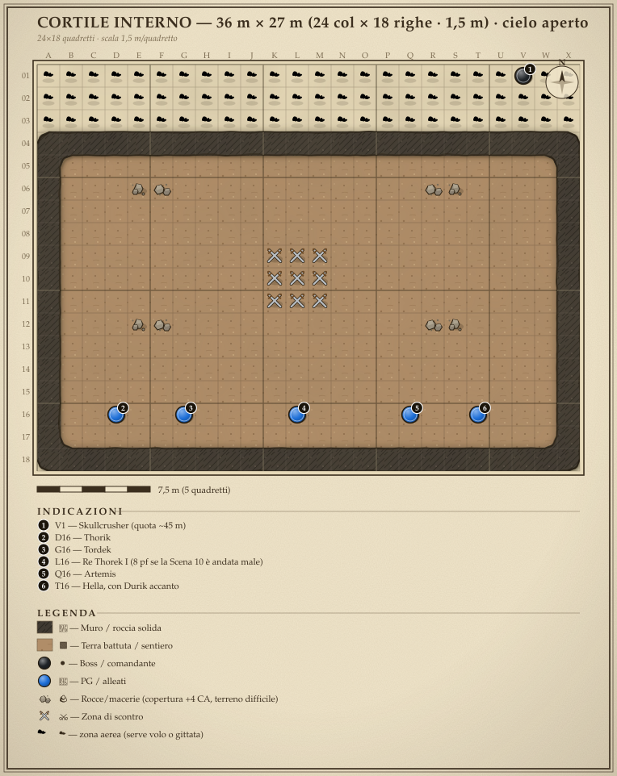

<!-- nuova-pagina -->

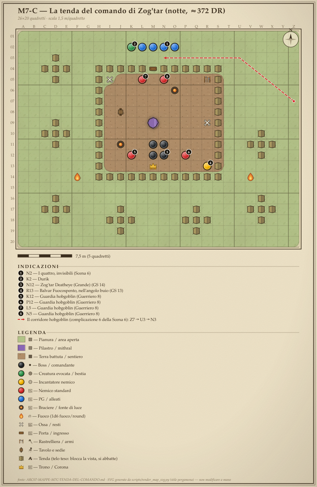

<!-- nuova-pagina -->

### Le griglie ASCII ultra-clear (scala 1,5 m/quadretto)

> 📗 **Versione a piena scheda tattica** (posizioni PG/PNG/villain, terreno &
> altitudini, tattiche di villain/mostri, evoluzione) nell'**Atlante Mappe
> Definitivo**: `Mappe/ARC07-MAPPE-DEFINITIVO.md`. Le griglie qui sotto sono
> identiche; là hanno gli add-on DM. Le versioni a pergamena di M7-B e M7-C
> sono all'inizio di questa appendice.

#### MAPPA M7-A — HAMMERFIST ≈372 DR: fortezza, campo dell'orda, mura (strategica)

```
════════════════════════════════════════════════════════════════════════
 HAMMERFIST ≈372 DR — vista strategica (non in scala; il duello è su M7-B)
════════════════════════════════════════════════════════════════════════
   NORD ▲  ╔══════════════════════════════════════════════╗
          ║   🏰🏰🏰  HAMMERFIST GIOVANE (mura bianche)  🏰🏰🏰 ║  ← Zona 1 (sicura)
          ║   🏰  [Sala del Trono: Re Thorek I]  [Fucina]  🏰 ║     arrivo del portale
          ║   🏰🏰  ═══ camminamenti ═══  BRECCIA▓▓  🏰🏰🏰🏰 ║  ← Zona 3 (mura, alba)
          ╚════════════════▲▲▲═══════════════▲▲▲═════════════╝
                    scale d'assedio / arieti ↑ (l'orda preme)
   ~~~~~~~~~~~~~~~~~~~~~~~ CORTILE INTERNO (arena del duello → M7-B) ~~~~~~~~~
          ⛺⛺⛺⛺⛺⛺⛺⛺⛺⛺⛺⛺⛺⛺⛺⛺⛺⛺⛺⛺⛺⛺⛺  ← Zona 2: MARE DI TENDE
   GP1▪   ⛺⛺⛺  ╔═══════════╗  ⛺⛺⛺   👤VATORE (Sc.9, tra le tende)  ▪GP2
          ⛺⛺  ║ TENDA DEL  ║  ⛺⛺⛺⛺⛺⛺⛺⛺⛺⛺⛺⛺⛺⛺⛺⛺⛺⛺
          ⛺⛺  ║  COMANDO   ║  ⛺⛺  ⚔️ZOG'TAR + 4 guardie (Sc.8)
          ⛺⛺  ╚═══════════╝  ⛺⛺⛺⛺⛺⛺⛺⛺⛺⛺⛺⛺⛺⛺⛺⛺⛺⛺
   GP3▪   ⛺⛺⛺⛺⛺⛺ (10.000 dormono) ⛺⛺⛺⛺⛺⛺⛺⛺⛺⛺⛺⛺⛺  ▪GP4
          — — — — foresta a sud (i PG escono dalla postierla nord) — — — —  SUD ▼
────────────────────────────────────────────────────────────────────────
LEGENDA · 🏰 mura/fortezza (bianche, nuove) · ▓ breccia · ⛺ tende (copertura)
· ▪GP posti di guardia · ╔╗ tenda del comando (Zog'tar) · 👤 Vatore · ⚔️ scontro
veloce · SKULLCRUSHER entra dall'alto sul cortile interno → M7-B.
════════════════════════════════════════════════════════════════════════
```

#### MAPPA M7-B — L'ARENA DEL DUELLO (cortile interno · Skullcrusher)

```
════════════════════════════════════════════════════════════════════════
 CORTILE INTERNO — 36 m × 27 m (24 col × 18 righe · 1,5 m) · cielo aperto
 Skullcrusher entra da V1 (quota ~45 m) e picchia. PG partono dalla riga 16.
════════════════════════════════════════════════════════════════════════
COL →  A B C D E F G H I J K L M N O P Q R S T U V W X
01    ☁️☁️☁️☁️☁️☁️☁️☁️☁️☁️☁️☁️☁️☁️☁️☁️☁️☁️☁️☁️☁️⚫☁️☁️   Skullcrusher in quota, circa 45 m (V1)
02    ☁️☁️☁️☁️☁️☁️☁️☁️☁️☁️☁️☁️☁️☁️☁️☁️☁️☁️☁️☁️☁️☁️☁️☁️   zona aerea: serve volo o gittata
03    ☁️☁️☁️☁️☁️☁️☁️☁️☁️☁️☁️☁️☁️☁️☁️☁️☁️☁️☁️☁️☁️☁️☁️☁️
04    🏰🏰🏰🏰🏰🏰🏰🏰🏰🏰🏰🏰🏰🏰🏰🏰🏰🏰🏰🏰🏰🏰🏰🏰   camminamenti +4,5 m, arcieri
05    🏰🟫🟫🟫🟫🟫🟫🟫🟫🟫🟫🟫🟫🟫🟫🟫🟫🟫🟫🟫🟫🟫🟫🏰
06    🏰🟫🟫🟫🪨🪨🟫🟫🟫🟫🟫🟫🟫🟫🟫🟫🟫🪨🪨🟫🟫🟫🟫🏰   macerie: copertura +4 CA
07    🏰🟫🟫🟫🟫🟫🟫🟫🟫🟫🟫🟫🟫🟫🟫🟫🟫🟫🟫🟫🟫🟫🟫🏰
08    🏰🟫🟫🟫🟫🟫🟫🟫🟫🟫🟫🟫🟫🟫🟫🟫🟫🟫🟫🟫🟫🟫🟫🏰
09    🏰🟫🟫🟫🟫🟫🟫🟫🟫🟫⚔⚔⚔🟫🟫🟫🟫🟫🟫🟫🟫🟫🟫🏰   impronta del drago, 4,5 m
10    🏰🟫🟫🟫🟫🟫🟫🟫🟫🟫⚔⚔⚔🟫🟫🟫🟫🟫🟫🟫🟫🟫🟫🏰
11    🏰🟫🟫🟫🟫🟫🟫🟫🟫🟫⚔⚔⚔🟫🟫🟫🟫🟫🟫🟫🟫🟫🟫🏰
12    🏰🟫🟫🟫🪨🪨🟫🟫🟫🟫🟫🟫🟫🟫🟫🟫🟫🪨🪨🟫🟫🟫🟫🏰
13    🏰🟫🟫🟫🟫🟫🟫🟫🟫🟫🟫🟫🟫🟫🟫🟫🟫🟫🟫🟫🟫🟫🟫🏰
14    🏰🟫🟫🟫🟫🟫🟫🟫🟫🟫🟫🟫🟫🟫🟫🟫🟫🟫🟫🟫🟫🟫🟫🏰
15    🏰🟫🟫🟫🟫🟫🟫🟫🟫🟫🟫🟫🟫🟫🟫🟫🟫🟫🟫🟫🟫🟫🟫🏰
16    🏰🟫🟫🔵🟫🟫🔵🟫🟫🟫🟫🔵🟫🟫🟫🟫🔵🟫🟫🔵🟫🟫🟫🏰   i 4 PG e Re Thorek I
17    🏰🟫🟫🟫🟫🟫🟫🟫🟫🟫🟫🟫🟫🟫🟫🟫🟫🟫🟫🟫🟫🟫🟫🏰
18    🏰🏰🏰🏰🏰🏰🏰🏰🏰🏰🏰🏰🏰🏰🏰🏰🏰🏰🏰🏰🏰🏰🏰🏰
════════════════════════════════════════════════════════════════════════
LEGENDA · ☁️ zona aerea (serve volo o gittata) · ⚫ Skullcrusher · ⚔ impronta
d'atterraggio del drago (Enorme) · 🟫 cortile · 🪨 macerie (copertura +4) ·
🏰 mura e camminamenti (+4,5 m, arcieri nani) · 🔵 PG e Re Thorek I.
@mark 1 ; V1 ; Skullcrusher (quota ~45 m)
@mark 2 ; D16 ; Thorik
@mark 3 ; G16 ; Tordek
@mark 4 ; L16 ; Re Thorek I (8 pf se la Scena 10 è andata male)
@mark 5 ; Q16 ; Artemis
@mark 6 ; T16 ; Hella, con Durik accanto
```

#### MAPPA M7-C — LA TENDA DEL COMANDO (Scene 7 e 8)

La griglia e i tre blocchi di accompagnamento stanno in
`Mappe/ARC07-MAPPE-M7C-TENDA-DEL-COMANDO.md`, compilati dal contratto JSON
`Mappe/ARC07-MAPPE-M7C-TENDA-DEL-COMANDO.json` (modalità 3 della skill delle
mappe: la griglia non si scrive a mano). La tenda misura 18 m × 16,5 m.

<!-- /pagina -->
