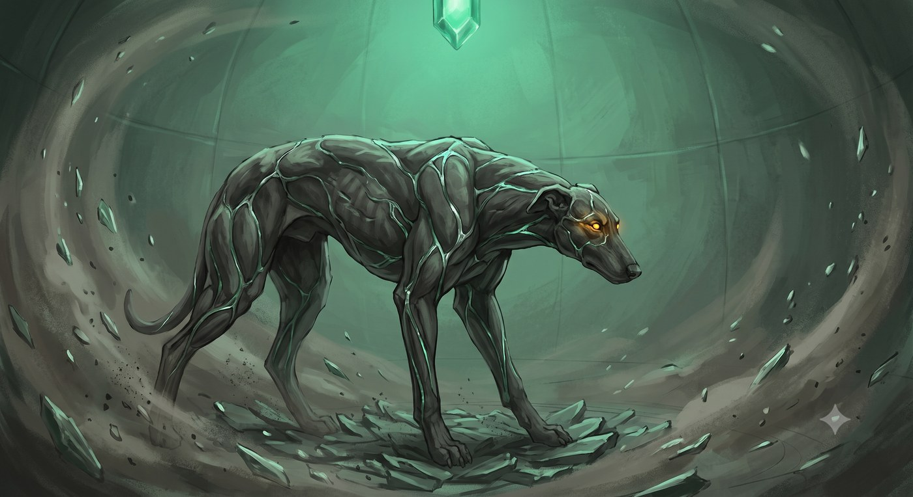

# Durik, il guardiano di pietra

> *Per la giocatrice di Hella. Si consegna al risveglio, quando Durik appoggia
> la testa sul petto di Hella. Da quel momento è tuo.*

> *Era il tuo cane da galoppo, ed è morto prima di te. Nel tuo viaggio fra i morti il suo ricordo è caduto nella pietra,
> e la pietra se l'è tenuto.*
>
> *Quando la montagna ha ceduto lo Smeraldo, la polvere del guardiano sconfitto
> ha preso la sua forma. Mithral intrecciato a roccia scura, come muscolo a
> osso. Occhi di topazio. Non abbaia più: quando vuole dirti qualcosa fa un
> click, come una pietra che si assesta in un muro a secco.*
>
> *A Moradin avevi risposto che doveva proteggere te. Lo fa. Si mette sempre
> fra te e quello che ti vuole male, e non gliel'hai mai insegnato.*

---

## Le statistiche

**Durik Riforgiato** · Bestia magica (animale potenziato, sottotipo Terra) ·
Media · Neutrale Buono · compagno di Hella

| Voce | Valore |
|---|---|
| **Dadi Vita** | 12d10+36 · **102 pf** ¹ |
| **Iniziativa** | +2 |
| **Velocità** | 12 m · scavare 3 m in terra morbida |
| **CA** | **21** (+2 DES, +9 naturale) · contatto 12 · colto alla sprovvista 19 |
| **Attacco base / Lotta** | +9 / +15 |
| **Attacco** | morso **+15** mischia (**2d6+6**, 19-20/×2) |
| **Attacco completo** | morso **+15** (2d6+6) e 2 artigli **+13** (1d4+3) |
| **Spazio / portata** | 1,5 m / 1,5 m |
| **Tiri salvezza** | Tempra **+11** · Riflessi **+10** · Volontà **+6** |
| **Caratteristiche** | FOR 22 · DES 15 · COS 17 · INT 4 · SAG 14 · CAR 8 |

<!-- storico -->
¹ *12 DV da canone; i punti ferita (12d10+36) sono confermati dal DM il
2026-09-24.*
<!-- /storico -->
¹ *12 DV, 12d10+36 punti ferita.*

### Cosa sa fare

| Capacità | Effetto |
|---|---|
| **Riduzione del danno 5/adamantio** (Str) | la corteccia di granito e mithral regge a tutto tranne l'adamantio |
| **Colpi magici** (Sop) | i suoi attacchi superano la RD come armi magiche; il **morso conta come adamantio** |
| **Percezione tellurica 18 m** (Str) | sente chi si muove a terra entro 18 m, anche al buio, anche invisibile. Non chi vola |
| **Immunità** (Str) | charme, compulsione, paralisi, sonno, pietrificazione, veleno |
| **Resistenza al freddo 10** (Str) | |
| **Vulnerabilità all'acido** | l'acido gli fa **+50%**: la pietra si corrode |
| **Fedeltà assoluta** (Str) | nessuna magia lo mette contro di te. Chi prova a charmarlo o dominarlo deve superare **Volontà CD 18** o perde l'incantesimo |
| **Legame** (Sop) | gli dai ordini col pensiero entro **18 m**, senza parlare. Oltre, fa l'ultima cosa che gli hai chiesto, o ti protegge |
| **Empatia della pietra** (Sop) | sente il tuo umore a qualunque distanza, e ti manda il suo: pericolo, calma, fretta. Viaggia nel Sogno della Terra, finché uno dei due ha pietra sotto i piedi |

---

## Come si gioca

**Sta sempre con te.** Cammina al tuo fianco come un compagno normale. Non
serve evocarlo.

**Se non gli dai ordini, ti protegge.** Si mette fra te e il pericolo che
percepisce. Chi vuole arrivarti addosso deve passare da lui o girargli
intorno.

**Il click vuol dire: sotto.** Quando Durik fa il click, qualcosa si muove a
terra entro 18 m. Chiedi al DM dove.

**Non è fatto per combattere da solo.** È uno scudo che morde. Rende bene a
fianco di Thorik o di Tordek, per prendere un nemico ai fianchi, o quando
afferra e tiene fermo qualcuno mentre gli altri lavorano. Mandato da solo
contro un nemico grosso, non regge.

**Se viene distrutto** torna polvere, e la polvere torna nel terzo seme della
Collana. Con una carica dell'**Evocazione dei Guardiani** lo richiami subito,
per un'ora. All'alba è di nuovo intero, e resta.

---

## Come cresce

Durik non cresce con i tuoi livelli. Cresce con le **Prove di Risonanza**:
momenti in cui il legame fra voi si mette alla prova. Il DM te lo dice quando
succede, di solito dopo.

| Prove | Cosa cambia |
|---|---|
| **1** ✅ | 12 DV, il morso passa a 2d6+6. *È già successa: è il motivo per cui è così* |
| 2 | RD **8**/adamantio · percezione tellurica **27 m** |
| 3 | diventa **Grande**: +4 FOR, −2 DES, +4 armatura naturale; nuovo attacco, schianto 2d6+9 |
| 4 | **immune all'acido**; il morso conta anche come ferro freddo |
| 5 | immune a tutti i danni da energia; +2 SAG, e capisce le tue parole senza ambiguità |

