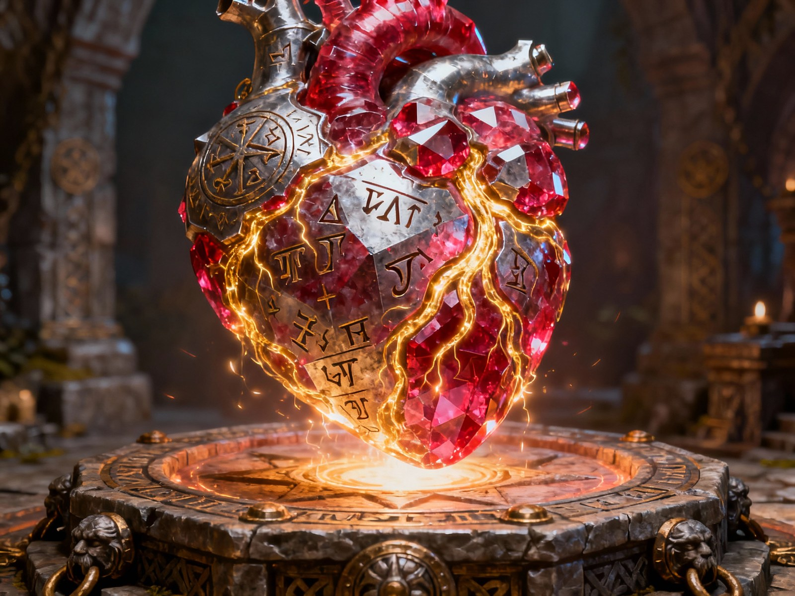

# Il Cuore di Moradin

> *Da mostrare al tavolo subito dopo il box del reliquiario (`DEF-3` §3), non
> prima: se lo vedono prima, la rivelazione diventa una conferma.*

> *Un cuore nanico di rubino, grande come un pugno. Quattro camere, i vasi
> visibili. Batte sessanta volte al minuto.*
