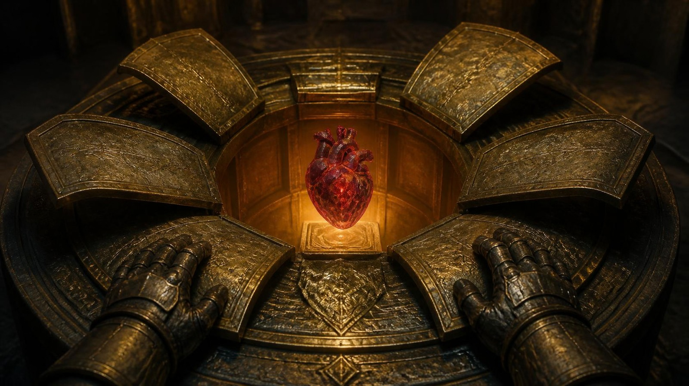
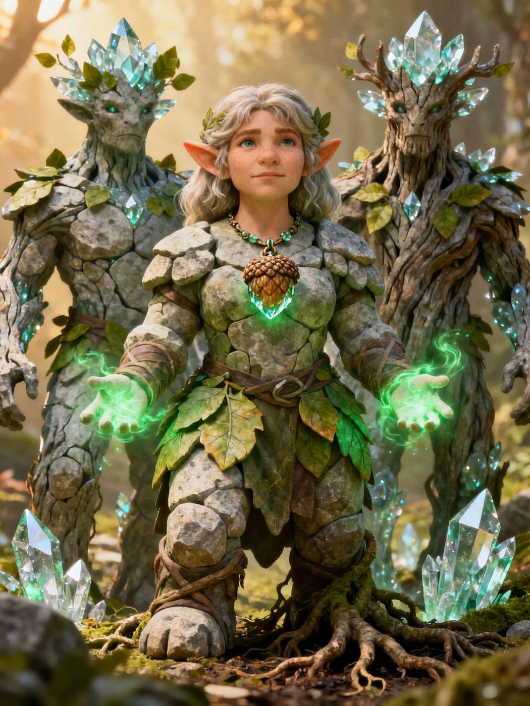
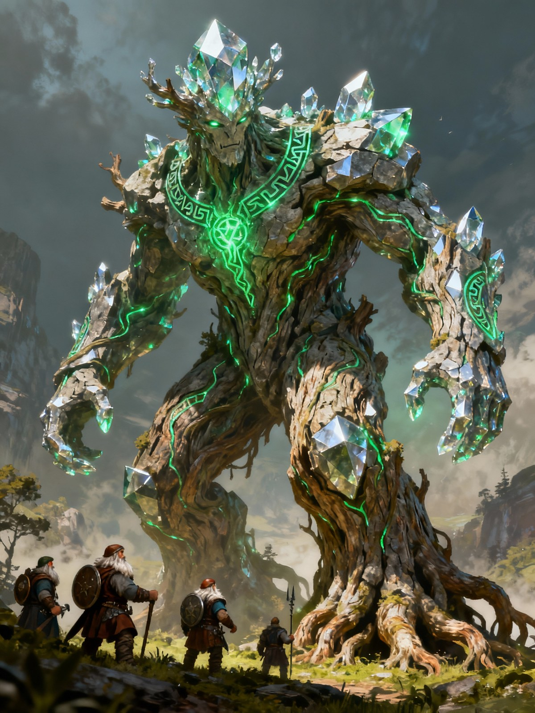
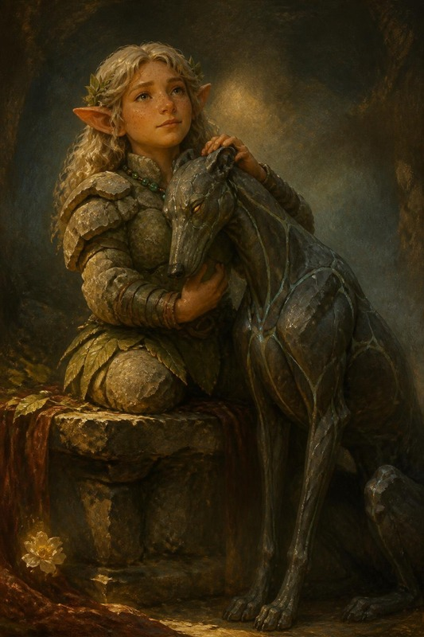
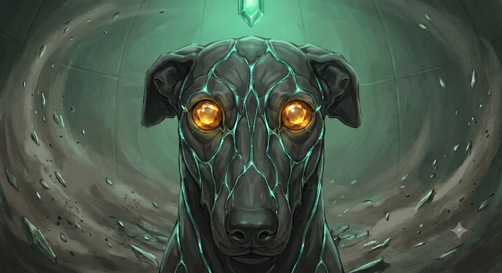

<!-- GENERATO da scripts/build_booklet_html.py --format hb (ADR-0013).
     Manifest: ARC07-SERATA-GIOCATORI.manifest.json — i capitoli CITANO i master (ADR-0003).
     Le immagini restano riferimenti relativi al repo: per la resa con
     immagini incorporate usa la via HTML (--format html). -->

{{frontCover}}

{{logo }}

# RUMBLING STONE
## Il Cuore e la Porta
___

### Le pagine da consegnare: echi, preghiera, doni, Hella tornata, Durik, le Cronache

{{banner HANDOUT GIOCATORI}}

{{footnote
  Da stampare e tagliare. Ogni pagina si consegna quando lo dice la regia del DM: non tutte insieme, non prima
}}

\page

# ✉ Echi — Thorik

{{note
##### ✉ HANDOUT GIOCATORE
Pagina da consegnare al giocatore indicato, in privato.
}}

# Thorik — le mani sotto la trave

> *Per il giocatore di Thorik. È quello che hai sognato dormendo nella Sala
> della Forgia. Il DM ti chiede di leggerlo ad alta voce; la riga in fondo è
> solo per te.*

---

> *Sogni di essere ancora inginocchiato sull'Altare, e il peso c'è ancora, ma
> non lo porti da solo. C'è un secondo paio di mani sotto la trave. Non le
> vedi: le senti, e sono più piccole delle tue, e sono fredde come pietra
> all'ombra, e non tremano.*
>
> *Provi a girare la testa per vedere chi è. E il sogno, con la gentilezza
> ottusa dei sogni, ti gira la testa dall'altra parte.*

---

**Solo per te.** Al rito dello Smeraldo qualcuno ha retto il Peso insieme a
te, e aveva le mani più piccole delle tue. Stanotte, prima di lasciare la
Sala, saprai chi era.

\page

# ✉ Echi — Tordek

{{note
##### ✉ HANDOUT GIOCATORE
Pagina da consegnare al giocatore indicato, in privato.
}}

# Tordek — lo zaino

> *Per il giocatore di Tordek. È quello che hai sognato dormendo nella Sala
> della Forgia. Il DM ti chiede di leggerlo ad alta voce; la riga in fondo è
> solo per te.*

---

> *Sogni una fiera. Non una fiera nanica: banchi bassi, teli chiari, una
> lingua che non conosci ma che capisci lo stesso, e un odore di spezie che
> non crescono in nessun posto in cui sei stato. Nessuno ti guarda. Sei un
> cliente come un altro, e la cosa che ti mette a disagio è proprio quella.*
>
> *In fondo al vicolo dei banchi c'è un tavolino con sopra il tuo zaino.
> Aperto. E un uomo che non riesci a mettere a fuoco conta le tue cose, una
> per una, con la pazienza di chi fa l'inventario. Non ruba niente.
> Cataloga.*
>
> *Ti svegli con la mano già sulla cinghia.*

---

**Solo per te.** Nello zaino porti una cosa che non hai messo tu: ce l'ha
fatta mettere **Artemis**, nel Piano della Terra. Se vuoi sapere cos'è,
chiedilo a lui.

\page

# ✉ Echi — Artemis

{{note
##### ✉ HANDOUT GIOCATORE
Pagina da consegnare al giocatore indicato, in privato.
}}

# Artemis — la porta socchiusa

> *Per il giocatore di Artemis. È quello che hai sognato dormendo nella Sala
> della Forgia. Il DM ti chiede di leggerlo ad alta voce; la riga in fondo è
> solo per te.*

---

> *Il bazar te lo ricordi ancora: i teli chiari, i registri, tutto quel
> disordine ricchissimo tenuto in ordine da qualcuno di molto bravo. Nel
> sogno ci torni, ma da fuori, e la porta del mercato non è la porta del
> mercato. È l'affresco del Tempo.*
>
> *È socchiusa, e dallo spiraglio viene aria vera, che sa di fumo di forgia e
> di neve. Mille anni di aria.*
>
> *Sullo stipite, all'altezza della mano, il legno è consumato da un pollice
> che ci si è appoggiato molte volte. Lo spiraglio non l'hai fatto tu.*

---

**Solo per te.** L'affresco del Tempo è una porta, e qualcuno l'ha già usata.
Quando la attraverserete, cerca chi si muove come te.

\page

# ✉ Echi — Hella

{{note
##### ✉ HANDOUT GIOCATORE
Pagina da consegnare al giocatore indicato, in privato.
}}

# Hella — dall'altra parte, e ritorno

> *Per la giocatrice di Hella. Due fogli: il primo lo leggi ad alta voce agli
> altri quando il DM te lo chiede, il secondo è un promemoria per quando Hella
> potrà raccontare.*

---

## I · Mentre gli altri dormono

> *Non dormi più, tu. Ma per la prima volta da quando sei qui, qualcuno dorme
> vicino a te: tre respiri lenti che conosci come conosci il tuo nome.*
>
> *Accanto a te, ferma, c'è una forma di polvere e mithral scuro che aspetta,
> con la pazienza dei cani, di essere chiamata.*
>
> *Poi, lontanissima, la voce di un nano che hai tenuto per mano dice il tuo
> nome nel sonno. E per la prima volta da quando sei morta, hai freddo. Il
> freddo è dei vivi.*

**Solo per te.** La forma che aspetta è **Durik**. La voce è quella di
**Tordek**. Stanotte ti riportano indietro.

---

## II · Quello che hai attraversato

*Un promemoria, in prima persona, per il momento in cui Hella racconta. Usa le
tue parole: queste sono solo le cose vere.*

**Il fuoco della verità.** Mi hanno chiesto di dire una cosa che non avevo mai
detto a nessuno. L'ho detta tutta, ad alta voce. Bruciava più del fuoco.

**La pietra che ricorda.** Mi hanno offerto di dimenticare il dolore. Ho detto
di no. Certe ferite si tengono aperte, altrimenti si dimentica anche perché
facevano male. Il ricordo di Durik è caduto nella pietra, e la pietra se l'è
preso.

**Il martello e il voto.** Moradin mi ha chiesto che protezione volevo essere.
Una radice sotto di loro, non un muro davanti. Ho giurato di tenerli ancorati.

**Una cosa che nessuno sa.** Mentre ero laggiù, Thorik reggeva un peso che lo
schiacciava. Ho messo le mani sotto le sue e ho tenuto, da dove ero. Lui non sa
che ero io.

\page

# ✉ Il Cuore di Moradin

{{note
##### ✉ HANDOUT GIOCATORE
Pagina da consegnare al giocatore indicato, in privato.
}}

# Il Cuore di Moradin

> *Da mostrare al tavolo subito dopo il box del reliquiario (`DEF-3` §3), non
> prima: se lo vedono prima, la rivelazione diventa una conferma.*

> *Un cuore nanico di rubino, grande come un pugno. Quattro camere, i vasi
> visibili. Batte sessanta volte al minuto.*

\page

# ✉ La preghiera della resurrezione

{{note
##### ✉ HANDOUT GIOCATORE
Pagina da consegnare al giocatore indicato, in privato.
}}

# La preghiera della resurrezione

> *Per il giocatore di Thorik, allo Step 1 del rito. Si legge in piedi, a nord
> del cerchio, con la mano sull'Altare. Non si recita a memoria: si legge,
> come si legge un contratto davanti a chi lo deve firmare.*

---

> *Vorrak Moradin, hragn tul-vesh!*
> *Hella drenn-okh hald: torn, torn-vrath!*

*Si pronuncia VÒR-rak mo-RA-din, HRAGN tul-VESH, con la erre battuta. Vuol
dire: «Padre Moradin, ferro sotto la montagna! Hella, figlia della pietra:
torna, la strada non è finita!» Poi, in italiano:*

> *Padre che batti il ferro sotto la montagna,*
> *questa è caduta, e noi siamo rimasti in piedi.*
>
> *Non ti chiediamo di rifarla.*
> *Ti chiediamo di riprenderla dal fuoco*
> *prima che si raffreddi.*
>
> *Abbiamo portato le pietre che volevi.*
> *Abbiamo pagato quello che chiedevi.*
> *Quello che manca, chiedilo adesso, e lo paghiamo.*
>
> *Hella, figlia della pietra che sogna,*
> *torna.*
> *La tua strada non è finita.*

---

*Conoscenze (religioni) **CD 15**. Se la preghiera esce storta, Therysol alza
la testa: l'ha sentito. Si può ritentare, con −2 per ogni tentativo.*

\page

# ✉ La carta del Dono — Thorik

{{note
##### ✉ HANDOUT GIOCATORE
Pagina da consegnare al giocatore indicato, in privato.
}}

# La carta del Dono — Thorik

> *Il DM te la consegna **dopo** che hai scelto di donare. Il prezzo te l'ha
> detto Moradin prima; qui c'è quello che è germogliato in Hella, e cosa ti
> torna indietro.*

---

**Quello che hai dato, per sempre.** Il **+2 di deflessione** che la Corona dà a te.
Scende a **+1**: **−1 alla CA** per il resto della campagna.

**Quello che è germogliato in Hella.** **Lo Scudo del Custode.** Una volta al giorno,
azione immediata: quando un alleato entro **9 m** sta per subire danno, Hella
lo prende su di sé, **dimezzato**.

**E ti torna addosso.** Ogni volta che lei usa lo Scudo, tu sei **accelerato
per 3 round**, e in quei round ti muovi **verso chi lei ha protetto**: almeno
un'azione di movimento per round che accorci la distanza, o l'accelerazione si
spegne. *«Sei accelerato. E vai da lui.»*

**Una volta sola.** Nel momento del bisogno Hella può **rendertelo** per una
scena intera. Poi mai più.

*Non le hai dato un potere. Le hai passato il tuo mestiere: stare davanti.*

\page

# ✉ La carta del Dono — Tordek

{{note
##### ✉ HANDOUT GIOCATORE
Pagina da consegnare al giocatore indicato, in privato.
}}

# La carta del Dono — Tordek

> *Il DM te la consegna **dopo** che hai scelto di donare. Il prezzo te l'ha
> detto Moradin prima; qui c'è quello che è germogliato in Hella, e cosa ti
> torna indietro.*

---

**Quello che hai dato, per sempre.** **Ancoraggio della Montagna**: due volte al giorno,
azione immediata, nessuno ti sposta. **Lascia i Bracieri.** Dove i giganti
spingono e i draghi afferrano, quel bottone non c'è più.

**Quello che è germogliato in Hella.** **Pelle di Adamantio: RD 3/adamantino.** È
l'**unica** riduzione del danno che avrà.

**Una volta sola.** Nel momento del bisogno Hella può **rendertelo** per una
scena intera. Poi mai più.

*Nel buio lei ha sentito una voce che la teneva ferma. Adesso l'ancora è passata
a chi l'ha usata.*

\page

# ✉ La carta del Dono — Artemis

{{note
##### ✉ HANDOUT GIOCATORE
Pagina da consegnare al giocatore indicato, in privato.
}}

# La carta del Dono — Artemis

> *Il DM te la consegna **dopo** che hai scelto di donare. Il prezzo te l'ha
> detto Moradin prima; qui c'è quello che è germogliato in Hella, e cosa ti
> torna indietro.*

---

**Quello che hai dato, per sempre.** **Un dado del tuo *Eldritch Blast***: da **7d6** a
**6d6**. Non una volta: **ogni colpo**, per il resto della campagna.

**Quello che è germogliato in Hella.** **Il Rovo Eldritch.** **A volontà**, azione
standard, attacco di contatto a distanza, **18 m**: **2d6**, metà rovi che
escono dal terreno e metà **fuoco**. Non si prepara e non finisce mai.

**Una volta sola.** Nel momento del bisogno Hella può **rendertelo** per una
scena intera. Poi mai più.

*Un warlock non è forte perché colpisce duro. È forte perché può farlo tutto
il giorno. È esattamente questo che le hai dato.*

\page

# ✉ Hella, tornata

{{note
##### ✉ HANDOUT GIOCATORE
Pagina da consegnare al giocatore indicato, in privato.
}}

# Hella, tornata

> *Per la giocatrice di Hella, al risveglio. La tua scheda resta la tua: livelli,
> incantesimi preparati, equipaggiamento. Questo foglio dice **cosa aggiungere**
> e **cosa è cambiato**. Dove una riga ha una casella, la segna il DM dopo il
> rito.*

---

## Il corpo nuovo

> *Respiri, e l'aria ha un sapore. Te n'eri dimenticata.*
>
> *Le dita sono un poco più lunghe di come le ricordavi, e le unghie hanno la
> grana della corteccia giovane. Le orecchie si sono fatte a punta, come foglie
> appena aperte. Fra i capelli biondi corre una venatura che non è un capello. Chi ti guarda negli occhi li trova color ambra, e distoglie
> lo sguardo un istante prima di quanto farebbe con un nano.*
>
> *La pietra sotto i piedi la senti anche con gli stivali: antica, forte, dalla
> tua parte. Il fuoco invece lo senti prima di vederlo, e non ti piace più.*

**Tipo.** Umanoide (nano) **e** vegetale: sei un **Ibrido Treant**. Stessa
persona, stessi ricordi, stessi livelli: **Ranger 1 / Druida 12**.

---

## Da aggiungere alla scheda

### Quello che hai portato dal viaggio

| Cosa | Effetto |
|---|---|
| **Resistenza al freddo 15** | |
| **Rigenerazione 1** | 1 pf per round finché tocchi terra o pietra naturale. Non nel round dopo aver preso danno da fuoco |
| **Radicamento** | 1 volta al giorno, 5 round: niente e nessuno ti spinge, ti travolge o ti sbilancia. Non ti muovi |
| **Il Marchio della Veritade** | +4 a Diplomazia con i nani di Moradin. 1 volta al giorno, una verità detta in faccia: Volontà **CD 17** o chi l'ascolta è scosso |
| **La Radice Silenziosa** | +2 a Percepire Intenzioni. 1 volta al giorno, empatia immediata con chi hai davanti |
| **Le Radici del Mondo** | la rigenerazione vale anche su suolo sacro o druidico. 1 volta al giorno, **Radicamento corale**: per 5 round gli alleati entro 9 m hanno +1 morale ai tiri salvezza, e tu resti ferma |
| **Empatia vegetale +4** | |
| **Fotosintesi** | 1 volta al giorno, un'ora di sole pieno: recuperi **2d8 pf** |
| **Il Sogno della Terra** | 1 volta al giorno, fai una domanda alla terra: *divinazione*, livello dell'incantatore 12 |
| **Scurovisione 27 m** | |

### Il prezzo

**Vulnerabilità al fuoco**: il fuoco ti fa **+50%**. È quello che hai pagato
per la Via della Radice.

### La Collana dei Semi Eterni

Un torc di legno e metallo, alla temperatura di chi lo porta. Tre semi: due
verdi venati d'adamantio, il terzo grigio-verde e ruvido. Toccandolo senti il
peso di una testa appoggiata sul petto.

| Potere | Effetto |
|---|---|
| **Saggezza della Terra** | +4 di potenziamento alla Saggezza. ⚠️ **Non si somma** al Periapto di Saggezza: vale il bonus più alto |
| **Corteccia del Guardiano** | +3 di armatura naturale alla CA |
| **Avatar della Radice** | 1 volta al giorno, azione standard: diventi un **Ibrido Treant Enorme** per 10 round. +8 FOR, portata estesa, schianti. Torna all'alba |
| **Evocazione dei Guardiani** | 3 volte al giorno, azione standard, un seme per volta. Semi I e II: un **Treant di Adamantio**. Seme III: **Durik**, se è stato distrutto |

**Treant di Adamantio** *(evocato)* · Grande · 90 pf · RD 10/adamantio · CA 24 ·
velocità 9 m · 2 schianti **+18** (2d8+9) · danni doppi a oggetti e strutture,
ignora la durezza sotto 20 · i suoi colpi contano come adamantio.

### I doni dei tuoi compagni

| | Seme | Da chi | Cosa ti dà |
|---|---|---|---|
| ☐ | I | Thorik, la sua deflessione | **Scudo del Custode**: 1 volta al giorno, azione immediata, prendi su di te il danno destinato a un alleato entro 9 m, **dimezzato**. E Thorik scatta verso chi hai protetto |
| ☐ | II | Tordek, il suo Ancoraggio | **Pelle di Adamantio**: **RD 3/adamantino**. La tua unica |
| ☐ | III | Artemis, un dado del suo colpo | **Rovo Eldritch**: a volontà, azione standard, contatto a distanza 18 m, **2d6**, metà rovi e metà fuoco |

**La restituzione.** Una volta sola per ogni seme germogliato, azione
immediata, **decidi tu**: il seme rende al compagno quello che aveva dato, per
una scena intera. Poi quel seme non restituisce più. Non consuma
l'evocazione.

Un seme senza dono resta **dormiente**: evoca il suo guardiano, ma non
germoglia niente sopra.

---

## Le benedizioni di Moradin, su di te

> *«Combatterai i miei figli. Proteggili. Proteggi il focolare.»*

Oltre alle sei carte che hanno tutti:

- **Mantello della Fiamma**: resistenza al fuoco **20** per una battaglia.
  Tienilo per quella in cui brucerà;
- **Benedizione di Moradin Incarnato**: 1 volta per battaglia, +2 sacro a
  colpire e ai danni, +4 contro paura e charme, **un ritiro**.

---

## Il compagno

**Durik** ha la sua scheda. Cammina con te.

\page

# ✉ Durik, il guardiano di pietra

{{note
##### ✉ HANDOUT GIOCATORE
Pagina da consegnare al giocatore indicato, in privato.
}}

# Durik, il guardiano di pietra

> *Per la giocatrice di Hella. Si consegna al risveglio, quando Durik appoggia
> la testa sul petto di Hella. Da quel momento è tuo.*

> *Era il tuo cane da galoppo, ed è morto prima di te. Nel tuo viaggio fra i morti il suo ricordo è caduto nella pietra,
> e la pietra se l'è tenuto.*
>
> *Quando la montagna ha ceduto lo Smeraldo, la polvere del guardiano sconfitto
> ha preso la sua forma. Mithral intrecciato a roccia scura, come muscolo a
> osso. Occhi di topazio. Non abbaia più: quando vuole dirti qualcosa fa un
> click, come una pietra che si assesta in un muro a secco.*
>
> *A Moradin avevi risposto che doveva proteggere te. Lo fa. Si mette sempre
> fra te e quello che ti vuole male, e non gliel'hai mai insegnato.*

---

## Le statistiche

**Durik Riforgiato** · Bestia magica (animale potenziato, sottotipo Terra) ·
Media · Neutrale Buono · compagno di Hella

| Voce | Valore |
|---|---|
| **Dadi Vita** | 12d10+36 · **102 pf** ¹ |
| **Iniziativa** | +2 |
| **Velocità** | 12 m · scavare 3 m in terra morbida |
| **CA** | **21** (+2 DES, +9 naturale) · contatto 12 · colto alla sprovvista 19 |
| **Attacco base / Lotta** | +9 / +15 |
| **Attacco** | morso **+15** mischia (**2d6+6**, 19-20/×2) |
| **Attacco completo** | morso **+15** (2d6+6) e 2 artigli **+13** (1d4+3) |
| **Spazio / portata** | 1,5 m / 1,5 m |
| **Tiri salvezza** | Tempra **+11** · Riflessi **+10** · Volontà **+6** |
| **Caratteristiche** | FOR 22 · DES 15 · COS 17 · INT 4 · SAG 14 · CAR 8 |

¹ *12 DV, 12d10+36 punti ferita.*

### Cosa sa fare

| Capacità | Effetto |
|---|---|
| **Riduzione del danno 5/adamantio** (Str) | la corteccia di granito e mithral regge a tutto tranne l'adamantio |
| **Colpi magici** (Sop) | i suoi attacchi superano la RD come armi magiche; il **morso conta come adamantio** |
| **Percezione tellurica 18 m** (Str) | sente chi si muove a terra entro 18 m, anche al buio, anche invisibile. Non chi vola |
| **Immunità** (Str) | charme, compulsione, paralisi, sonno, pietrificazione, veleno |
| **Resistenza al freddo 10** (Str) | |
| **Vulnerabilità all'acido** | l'acido gli fa **+50%**: la pietra si corrode |
| **Fedeltà assoluta** (Str) | nessuna magia lo mette contro di te. Chi prova a charmarlo o dominarlo deve superare **Volontà CD 18** o perde l'incantesimo |
| **Legame** (Sop) | gli dai ordini col pensiero entro **18 m**, senza parlare. Oltre, fa l'ultima cosa che gli hai chiesto, o ti protegge |
| **Empatia della pietra** (Sop) | sente il tuo umore a qualunque distanza, e ti manda il suo: pericolo, calma, fretta. Viaggia nel Sogno della Terra, finché uno dei due ha pietra sotto i piedi |

---

## Come si gioca

**Sta sempre con te.** Cammina al tuo fianco come un compagno normale. Non
serve evocarlo.

**Se non gli dai ordini, ti protegge.** Si mette fra te e il pericolo che
percepisce. Chi vuole arrivarti addosso deve passare da lui o girargli
intorno.

**Il click vuol dire: sotto.** Quando Durik fa il click, qualcosa si muove a
terra entro 18 m. Chiedi al DM dove.

**Non è fatto per combattere da solo.** È uno scudo che morde. Rende bene a
fianco di Thorik o di Tordek, per prendere un nemico ai fianchi, o quando
afferra e tiene fermo qualcuno mentre gli altri lavorano. Mandato da solo
contro un nemico grosso, non regge.

**Se viene distrutto** torna polvere, e la polvere torna nel terzo seme della
Collana. Con una carica dell'**Evocazione dei Guardiani** lo richiami subito,
per un'ora. All'alba è di nuovo intero, e resta.

---

## Come cresce

Durik non cresce con i tuoi livelli. Cresce con le **Prove di Risonanza**:
momenti in cui il legame fra voi si mette alla prova. Il DM te lo dice quando
succede, di solito dopo.

| Prove | Cosa cambia |
|---|---|
| **1** ✅ | 12 DV, il morso passa a 2d6+6. *È già successa: è il motivo per cui è così* |
| 2 | RD **8**/adamantio · percezione tellurica **27 m** |
| 3 | diventa **Grande**: +4 FOR, −2 DES, +4 armatura naturale; nuovo attacco, schianto 2d6+9 |
| 4 | **immune all'acido**; il morso conta anche come ferro freddo |
| 5 | immune a tutti i danni da energia; +2 SAG, e capisce le tue parole senza ambiguità |

\page

# ✉ Le Cronache dei Quattro Eroi

{{note
##### ✉ HANDOUT GIOCATORE
Pagina da consegnare al giocatore indicato, in privato.
}}

<!-- Auto-generated — do not edit by hand.
     Sorgente: 07_il Portale Della Forgia Eterna/ARC07-HANDOUTS.md
     Rigenera con: python3 scripts/dm.py handout --tipo profezia --da 07_il Portale Della Forgia Eterna/ARC07-HANDOUTS.md
     Incolla tutto su https://homebrewery.naturalcrit.com/ (New brew). -->

{{margin-top:60px}}

{{banner PROFEZIA}}

# Le Cronache dei Quattro Eroi

{{note
> *Dalle Cronache di Thorgrim Barbadiferro, incise nella pietra di Hammerfist:*
>
> *«Quando la Mano Rossa calò sul nostro focolare e il cielo si fece nero di
> ali, non fu un re a salvarci, né un esercito. Furono **Quattro Eroi** venuti
> da un tempo che non era ancora. Portavano una corona di stelle di pietra, un
> martello che cantava, un anello di luce e ombra, e con loro camminava la vita
> stessa rifiorita dalla morte.*
>
> *Abbatterono il drago nero e spezzarono l'orda. Poi svanirono, come erano
> venuti, lasciando solo il loro nome nella roccia.»*
>
> — Moradin, nella mente di Thorik: *«Le Cronache dicono che 'Quattro Eroi'
> salvarono Hammerfist. Siete VOI. Siete sempre stati voi. Andate. Chiudete il
> cerchio.»*
}}

{{margin-top:30px}}

{{footnote Handout giocatori · 2026-07-10 · Rumbling Stone}}
{{pageNumber,auto}}

\page

# ✉ Il piano di battaglia di Re Thorek I

{{note
##### ✉ HANDOUT GIOCATORE
Pagina da consegnare al giocatore indicato, in privato.
}}

# Il piano di battaglia di Re Thorek I

> *Carbone su una pelle di capra stesa sul tavolo di guerra, la notte prima
> dell'assalto. La mano è di uno scriba che ha fretta; i numeri li ha dettati
> il re, e in un punto lo scriba ha dovuto cancellare e riscrivere.*

**HAMMERFIST — LA NOTTE PRIMA DELL'ALBA**

**Noi.** Ottocento guerrieri. Duecento fra vecchi e ragazzi, armati di quello
che c'era. Cinquanta chierici del Padre. Il re e le quindici guardie della
sala. E voi quattro.

**Loro.** Settemila orchi. Duemila goblin. Ottocento hobgoblin. Duecento ogre.
Il generale, quello con la pietra nera al posto di un occhio. Il drago.

**Le mura.** Reggono due ore dall'inizio dell'assalto. ~~Tre.~~ Due.

**Il piano.**

1. **Stanotte.** Voi quattro nel campo, senza farvi vedere. La tenda nera al
   centro, dove le pattuglie non passano. Il generale non deve vedere l'alba.
2. **All'alba.** Il drago scende a vendicarlo. Lo aspettiamo nel cortile, non
   sulle mura: sulle mura ci serve ogni braccio.
3. **Dopo.** Senza generale e senza drago, l'orda è un gregge, e un gregge si
   spinge giù dal pendio.

*In fondo, con un'altra mano, più lenta e più grande:*

**Dalla pietra, la forza. Dalla forza, l'onore.**

