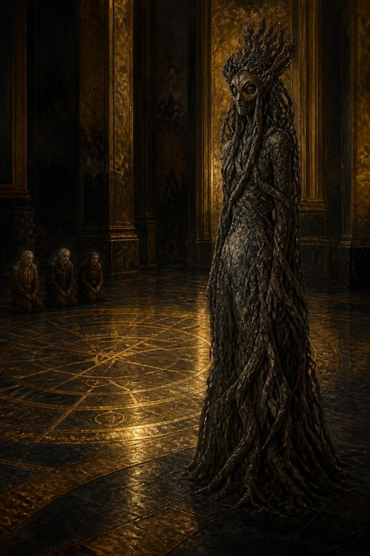
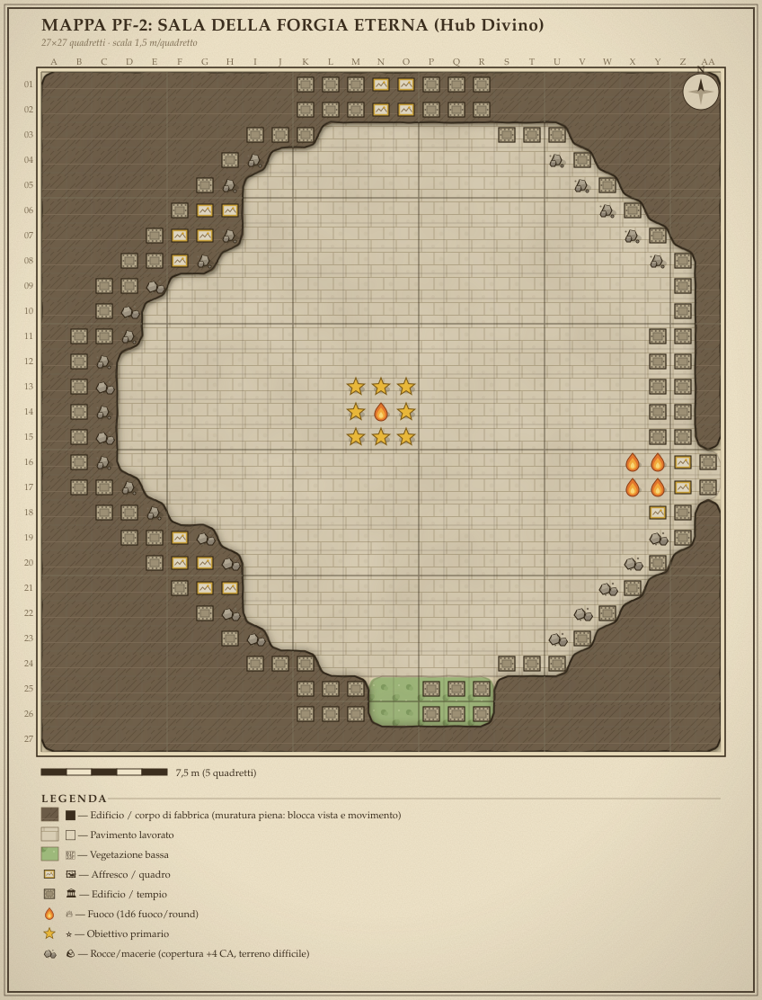
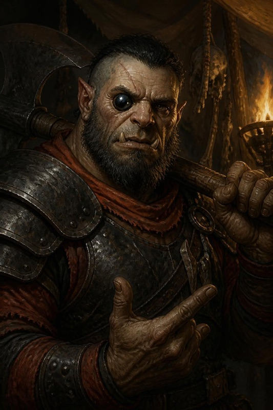

<!-- GENERATO da scripts/build_booklet_html.py --format hb (ADR-0013).
     Manifest: ARC07-SERATA-RESURREZIONE-BOOKLET.manifest.json — i capitoli CITANO i master (ADR-0003).
     Le immagini restano riferimenti relativi al repo: per la resa con
     immagini incorporate usa la via HTML (--format html). -->

{{frontCover}}

{{logo }}

# RUMBLING STONE
## La Resurrezione e i Mille Anni
___

### Il risveglio nella Forgia · il rito del Cuore di Moradin · Hammerfist mille anni fa, fino all'alba

{{banner BOOKLET DI SESSIONE}}

{{footnote
  Sessione D&D 3.5 per 4 personaggi di 13° livello (Hella torna al rito) · Faerûn, Flamerule 1372 DR e ≈372 DR · Campagna privata RumblingStone · regia DM, cast ed echi, master DEF-2/3/4 integrali, handout per PG
}}

\page

# Dove siamo — la serata della resurrezione e dei mille anni

> *Il basalto è ancora tiepido nel punto in cui avete dormito, e da nessuna
> altra parte. Sulla parete di sud-est i numeri nanici sono scesi meno di
> quanto vi aspettavate. Accanto all'Altare, Therysol non si è mossa.*
>
> *E ai piedi dell'Altare c'è il cane di pietra, sdraiato come si sdraiano i
> cani vecchi davanti a una porta chiusa. Non ha dormito. Vi guarda alzarvi
> uno per uno, poi torna a guardare lei.*

**Questa è la serata del 2026-09-25.** Tre beat in fila, nell'ordine in cui
li decide la Sala:

1. **Il risveglio nella Forgia** — la parte di `ARC07-DEF-2` che non avete
   ancora giocato: i sogni delle quattro ore rubate e gli affreschi che
   incidono la vittoria su Terros. In forma **breve**, venticinque minuti.
2. **La resurrezione di Hella** — `ARC07-DEF-3` per intero: il rito, i tre
   Doni, la Custode delle Radici, il risveglio, Durik che si lega a lei.
3. **Mille anni fa, fino all'alba** — `ARC07-DEF-4` dall'arrivo alla notte:
   la targa, Durin, Re Thorek I, l'orologio della notte, Balvar, Zog'tar.
   **Ci si ferma al primo ariete sulle mura.** Il duello con Skullcrusher e il
   Rituale 4 sono della sessione dopo.

**Decisioni del DM prese il 2026-09-24** *(valgono per questo booklet)*:

| | Decisione | Dove pesa |
|---|---|---|
| **S1** | La serata copre `DEF-3` e `DEF-4` **fino all'alba**. Il duello e il Rituale 4 si giocano nella sessione successiva | regia, Atto IV |
| **S2** | `DEF-2` non è stato giocato: si apre con una **versione breve** (sogni, A5, A7, A8, Benedizioni) | regia, Atto I |
| **S3** | **Durik è sempre presente**, come un compagno normale. Se viene distrutto torna polvere nel terzo seme; la Collana lo rievoca spendendo una carica (1 ora) e all'alba torna intero e stabile | scheda di Durik |
| **S4** | Illustrazioni: si usano quelle esistenti; per le mancanti ci sono i **prompt** in `Immagini/PROMPT-IMMAGINI-07ILP.md` | regia, «Cosa mostrare» |

**Stato al tavolo, entrando** *(da `campaign/state.md` §0, §1, §6)*:

- **Orologio di Hammerfist**: **3g 16h**. Hanno dormito nella Sala (riposo
  R4, tariffa divina −4 h). Il rito costa circa un'ora. Il viaggio a −1000
  costa **zero**: il Rubino li riporterà all'istante della partenza.
- **Corona di Adamantio**: Topazio e Smeraldo accesi, l'incasso del Rubino
  vuoto. Deflessione ancora **+2**: il dono non è stato fatto.
- **Thorik**: −4 DES, +2 COS, +4 CAR permanenti. **Nessun −2 COS.** Non sa che
  la presenza verde sotto la trave era Hella (eco **E-07f**).
- **Tordek**: nessun malus. Ha nello zaino il **Seme-Mercato di Varis**, non
  toccato, e non sa cosa sia (eco **E-07a**, **E-07b**).
- **Artemis**: Anello riforgiato, *Eldritch Blast* **7d6**. Nessun Marchio.
- **Hella**: morta, il corpo sull'Altare, tre semi innestati. Lo spirito ha
  già compiuto il viaggio nell'Incudine del Mondo: verità piena, ferita
  tenuta aperta, **Via della Radice**. I compagni non lo sanno.
- **Durik**: ha preso forma nel Piano della Terra e da allora orbita il corpo.
  Non è ancora legato a lei.
- **Therysol**: veglia il corpo da sei giorni.

**Come usare questo booklet.**

| Capitolo | Per chi | Quando |
|---|---|---|
| I · Regia della serata | ⚠ DM | da leggere prima, da tenere aperto durante; contiene gli echi del passato che stasera tornano |
| II · La cassetta del DM | ⚠ DM | pronuncia, suoni, indice dei read-aloud dell'arco |
| III-V · Master DEF-2, DEF-3, DEF-4 | ⚠ DM | **si leggono in avanti**, nell'ordine in cui si gioca. Ogni PNG ha la sua **scheda d'entrata** nella scena in cui compare; statistiche e mappe sono nelle **appendici A4** in fondo a ciascun master |
| VI · Collana dei Semi Eterni, scheda DM | ⚠ DM | la scheda dell'artefatto, da consultare |
| Echi privati per PG | ✉ uno a testa | Thorik, Tordek, Artemis all'inizio; Hella al risveglio (`DEF-3` §7) |
| Il Cuore di Moradin (immagine) | ✉ a tutti | subito dopo la rivelazione del reliquiario (`DEF-3` §3) |
| La preghiera della resurrezione | ✉ al giocatore di Thorik | allo Step 1 (`DEF-3` §4) |
| Carte dei Doni | ✉ solo a chi dona | allo Step 5, **dopo** che ha scelto di donare: il prezzo lo dice prima Moradin, a voce |
| Scheda di Hella risorta, scheda di Durik | ✉ alla giocatrice di Hella | al risveglio (`DEF-3` §7) |
| Le Cronache dei Quattro Eroi | ✉ a tutti | alla soglia (`DEF-3` §8-ter), quando la Corona apre l'affresco del Tempo |
| Il piano di battaglia di Re Thorek I | ✉ a tutti | al consiglio di guerra (`DEF-4` Scena 4) |

I tre master segnano **✉ Si consegna qui** nel punto esatto di ogni foglio, e
`DEF-3` §0 ha la stessa tabella in ordine di gioco.

Le pagine ✉ stanno anche in un secondo volume, `ARC07-SERATA-GIOCATORI`, da
stampare a parte e tagliare.

**Come si stampa** (lo standard di [`GUIDA-BOOKLET-E-PDF`](../../../docs/guides/GUIDA-BOOKLET-E-PDF.md)):

Dalla radice del repo, con `C` la cartella di questo booklet:

- **il volume del DM**, da stampare, con segnalibri:
  `python3 scripts/export_booklet_typst.py C/ARC07-SERATA-RESURREZIONE-BOOKLET.manifest.json --all`
- **una pagina ✉ per file**, da stampare o mandare a un giocatore (tredici
  file in `C/pdf/`):
  `python3 scripts/dm.py booklet C/ARC07-SERATA-GIOCATORI.manifest.json --pdf`
- **tutte le pagine ✉ in un volume**:
  `python3 scripts/export_booklet_typst.py C/ARC07-SERATA-GIOCATORI.manifest.json --all`

⚠️ Nel volume unico dei giocatori le pagine corte stanno una dopo l'altra: gli
echi di Thorik, Tordek e Artemis possono finire sullo stesso foglio. Per
consegnarli a persone diverse si usano i PDF singoli della seconda riga.
I PDF non stanno nel repo (`*.pdf` è ignorato): si rigenerano coi comandi qui
sopra.


\page

# I · Regia della serata

{{note
##### ⚠ SOLO DM
Questo capitolo è materiale del DM: non mostrarlo ai giocatori.
}}

# Regia della serata — dalla Sala della Forgia all'alba di mille anni fa

> **Cos'è.** La scaletta della serata, in ordine di gioco. Non riscrive i
> master: dice **quale paragrafo aprire, quando, per quanto**, cosa consegnare
> e cosa annotare. Dove un master e questa regia non si trovano d'accordo,
> vince il master, e prima ancora vince `campaign/state.md`.
>
> **Pilastri della serata**: Casa di Davide guida il rito (tre persone che
> pagano per una quarta), BG3 guida il risveglio (tornano cose di tre sessioni
> fa), Andor guida la notte a −1000 (un orologio, una tenda, un vecchio che
> incide). Mercer sotto tutto: le voci, il finisher, lo spotlight.

---

## §0 · La serata in una tabella

| Atto | Cosa | Master | Minuti | Si consegna | Musica / immagine |
|---|---|---|---:|---|---|
| **0** | Prima di cominciare | questa pagina | 10 | ✉ gli echi privati a Thorik, Tordek, Artemis | — |
| **I** | Il risveglio nella Sala | `DEF-2` §7-bis, §4 (A5, A7, A8), §7 | 25 | — | l'immagine della Sala con gli otto affreschi |
| **II** | La resurrezione di Hella | `DEF-3` §2 → §8-bis | 90 | ✉ Carte dei Doni allo Step 5, **dopo il sì** · ✉ scheda di Hella e scheda di Durik al §7 | il Cuore di Moradin dopo il §3 · *La canzone delle pietre* dallo Step 5 |
| — | Pausa | | 15 | | |
| **III** | La soglia | `DEF-3` §8-ter | 15 | ✉ Le Cronache dei Quattro Eroi | la Sala, di nuovo: il portale non ha ancora un'immagine (§7, riga 6) |
| **IV** | Mille anni fa, fino all'alba | `DEF-4` Atto I e Atto II, Scene 1-9 | 120 | ✉ il piano di battaglia al consiglio · l'orologio della notte, su un foglio in vista | — |
| **Stop** | Il primo ariete | `DEF-4` Scena 10, primo box | 5 | | |

**Le immagini e la musica**, nell'ordine in cui servono:

- la Sala con gli otto affreschi, Atti I e III:
  `Immagini/web/Sala Forgia Eterna - Camera Ottagono con 8 Affreschi Divini (Parte 2).jpg`;
- il Cuore di Moradin, Atto II dopo il §3: `Immagini/tavola-cuore-di-moradin.jpg`;
- Durik, Atto II al §7: è sulla sua scheda (`PG/Immagini/web/durik2.jpg`);
- *La canzone delle pietre*, dallo Step 5 al risveglio: `Musica/LaCanzoneDellePietre.mp3`.

**Totale**: circa **4 ore e 40**. Se la serata ne ha quattro, i tagli sono già
scritti in fondo a ogni atto, sotto **«Se sei in ritardo»**.

---

## §1 · Atto 0 — Prima di cominciare

**Sul tavolo**: la pianta della Sala e il cerchio del rito (`DEF-3`,
Appendice B); la tenda del comando, M7-C (`DEF-4`, Appendice D); il PDF delle Benedizioni di Moradin; un foglio bianco per
l'orologio della notte, che servirà solo nell'Atto IV.

**Le schede che cambiano stasera**, da tenere a portata:

| Scheda | Perché |
|---|---|
| Corona di Adamantio, §«Il dono al rito di Hella» | se Thorik dona, la deflessione scende a +1 |
| Bracieri Gemelli, §«Il dono al rito di Hella» | se Tordek dona, l'Ancoraggio sparisce |
| Anello dell'Illuminazione Caotica | se Artemis dona, *Eldritch Blast* 7d6 → 6d6 |
| Collana dei Semi Eterni, pagina 1 | nasce stasera |

**Consegna gli echi privati** a Thorik, Tordek e Artemis, uno a testa, piegati.
Di' solo: *«Questo è quello che avete sognato. Leggetelo quando ve lo dico.»*
La giocatrice di Hella non riceve niente adesso: il suo foglio arriva più
avanti, ed è la prima cosa che le dai dopo tre sessioni di silenzio.

> 📐 **Com'è fatto un eco, da stasera** (`consequence-echoes.md` §3-ter, tre
> regole). Ogni foglio ha **un solo frammento**, il sogno, che si legge ad
> alta voce. Sotto c'è **una riga «solo per te»** che dà un nome e una
> direzione: chi, o cosa, e verso dove guardare. Non spiega il sogno, non
> anticipa i Doni, non dà numeri. Se un giocatore chiede di più, **rispondi
> tu**, a voce: il foglio non deve fare il lavoro del DM.

> 🎭 **La giocatrice di Hella.** Stasera torna a giocare dopo una lunga
> assenza del personaggio. Nell'Atto I e nella prima metà dell'Atto II il suo
> PG è morto. **Non lasciarla ferma**: nell'Atto I legge ad alta voce il
> sogno di Hella (è l'unica che parla dall'altra parte), e nell'Atto II, allo
> Step 5, è lei a scegliere se sentire o no il nome gridato. Trovi i due
> momenti marcati 🌙.

### Gli echi del passato che stasera tornano

Le righe dell'Echo Ledger (`state.md` §7.E) che questa serata **incassa**. Una
per scena, e il posto dove cade.

| Eco | Da dove viene | Dove si paga stasera |
|---|---|---|
| **E-07f** | la luce verde sotto la trave, al rito dello Smeraldo | `DEF-3` §8, *«Ero io, Thorik.»* Si chiude |
| **E-07c** | Thorik ha pagato il Peso dove nessuno guarda | `DEF-3` §2-bis: al rito gli chiedono di pagare di nuovo, e lui si muove per primo |
| **E-07d** | l'ultimo suono di Terros era un assenso | A5: la Forgia registra una vittoria **onorata** |
| **E-07a / E-07b** | il Seme di Varis nello zaino di Tordek | il sogno di Tordek. Se lo racconta, **Artemis decide se dire la verità** |
| la zampa sul margine | Durik nato dalla polvere di Terros | A5, poi `DEF-3` §7 |
| il Marchio di Varis | **non attivo** | quindi l'Anello **non pizzica** allo Step 3: salta la riga di `DEF-3` §1 |

---

## §2 · Atto I — Il risveglio nella Sala *(25 minuti, versione breve di `DEF-2`)*

Il riposo R4 è già giocato: hanno dormito nella Sala, l'orologio è a **3g 16h**.
Quello che non è stato giocato è **cosa hanno sognato** e **cosa la Sala ha
inciso** mentre dormivano.

### I.1 · I sogni delle quattro ore *(8 minuti)*

`DEF-2` §7-bis. Niente tiri, niente CD, nessun effetto meccanico.

1. Leggi il box dell'addormentarsi (**`DEF-2` §7-bis**, *«Il basalto è tiepido
   sotto la schiena…»*).
2. Uno alla volta, ogni giocatore **legge il proprio sogno ad alta voce** dal
   foglio che gli hai dato. Ordine: **Tordek, Artemis, Thorik**. Thorik per
   ultimo perché il suo è quello che la serata incasserà. **La riga «solo per
   te» non si legge ad alta voce.**
3. 🌙 **Poi la giocatrice di Hella legge il suo**, dal foglio che le dai
   adesso: *«Non dormi più, tu.»* Nessuno commenta. Anche lei tiene per sé la
   riga in fondo, che le dice chi sono la forma che aspetta e la voce.
4. Leggi il box del risveglio (**`DEF-2` §7-bis, «Al risveglio»**).

⚠️ **Non spiegare nulla di più della riga.** Se Thorik chiede di chi erano le
mani fredde: *«non lo sai ancora; stanotte sì.»* È l'eco **E-07f**, si paga al
§8 del rito. Se Tordek racconta il sogno, **Artemis decide** se dire la verità
sul Seme: la riga di Tordek lo manda da lui apposta.

### I.2 · Gli affreschi che hanno inciso la Terra *(12 minuti)*

Tre affreschi obbligati, perché ognuno arma qualcosa che la serata o l'arco
dopo usano. Gli altri cinque restano per chi li cerca.

| Affresco | `DEF-2` | Perché non si salta |
|---|---|---|
| **A5 — La Forza Sostenuta** | §4 | il box mostra **una zampa di pietra con occhi di topazio** sul margine. È la prima volta che il tavolo sente che Durik è entrato nella storia |
| **A7 — La Battaglia di Hammerfist** | §4 | se Thorik appoggia Aegis Fang alla cornice, l'ascia **parla** e nasce il **Bane draconico contro Fauci di Palude**. È un effetto permanente che l'ARC-08 dà per acquisito. Se nessuno ci pensa, fallo notare con l'ascia: vibra passando davanti |
| **A8 — Il Ritorno Trionfale** | §4 | posare il corpo di Hella davanti alla tela: la mano sul vetro, **la quercia e il martello**. +1 sacro a tutti i TS per 1 ora, che copre l'inizio del rito |

**Facoltativi**, se il tavolo li chiede: A3 (la catarsi di Thorik, il fallimento
del TS è il dono), A6 (Artemis legge il Tempo, Sapienza Magica **CD 18**: è il
gancio che nell'Atto IV porta a Vatore). La Visione Condivisa di A2 **si
salta**: tre TS per un effetto che il rito subito dopo supera.

### I.3 · Le Benedizioni di Moradin *(5 minuti)*

`DEF-2` §7: il rinnovo all'Altare, Conoscenze (religioni) **CD 12**. Consegna le
carte del PDF. Fatto questo, l'Altare è libero per il rito.

**Se sei in ritardo**: tieni I.1 e A7. A5 e A8 diventano una riga ciascuno
detta da te mentre si alzano.

---

## §3 · Atto II — La resurrezione di Hella *(90 minuti, `DEF-3` per intero)*

Qui non c'è niente da tagliare: è la scena per cui l'arco esiste. La regia sta
già dentro il master, in ordine. Questa pagina aggiunge **tre cose**: quando
consegnare i fogli, come giocare Durik, e cosa annotare.

| Momento | `DEF-3` | Cosa fai tu |
|---|---|---|
| La Sala trattiene il fiato | §2 | box di apertura, poi la tabella dei sensi. **Rispetta la colonna «Cosa NON dire»**: il battito sotto l'Altare è la rivelazione di §3 |
| Le sei porte | §2 | opzionali. La **CAR grezza CD 13** con Therysol dà la battuta degli undicimila respiri: è la migliore della serata e costa un tiro |
| L'incasso vuoto | §2-bis | solo se qualcuno guarda la Corona. **Non dire** che si riempie a −1000 |
| Il Cuore di Moradin | §3 | **dopo** il box, mostra la pagina ✉ *Il Cuore di Moradin* (l'immagine). Canone: il Cuore sta **dentro** l'Altare, che si apre come un fiore di metallo; al rito si posa **sul petto di Hella** |
| Il rito, Step 1-4 | §4 | apertura di round, micro-box, esito scritto. Chiudi ogni step su **«Che fate?»** |
| **Step 5 — il richiamo** | §5, §6 | ▶ vedi II.1 qui sotto |
| Step 6 — Moradin | §7, in apertura | tre secondi. Non allungarlo |
| Il risveglio | §7 | ▶ vedi II.2 |
| Il racconto delle prove | §8 | ▶ vedi II.3 |
| La prima ora: Hella prova il corpo, Hella e Tordek | §8-bis | ▶ vedi II.3, in fondo |

### II.1 · Lo Step 5, dove si decide la serata

Lo Step 5 contiene tre scene in una, e l'ordine conta:

1. **Moradin chiede i Doni** (`DEF-3` §5, «Come lo chiede Moradin»). Sono
   **quattro battute** nella voce del Cuore, da leggere prima dei tiri:
   **il perché** (il fuoco da solo non forgia, serve il metallo), **a cosa
   serve** (quello che date mette radice in lei e combatte con voi; chi non dà
   lascia il suo seme chiuso), **il prezzo** detto a ciascuno per nome, col
   numero subito dopo a voce normale, e **la domanda**: *«Chi di voi dà?»*.
   Poi taci. **Si gioca di ruolo**: chi dona lo dice e lo fa, come sta scritto
   nei tre box di §5.

   **Le Carte dei Doni si consegnano DOPO**, e solo a chi ha donato: sono la
   ricevuta di quello che ha dato e di quello che è germogliato in Hella (lo
   Scudo e l'Eco, la Pelle di Adamantio, il Rovo, la restituzione). A chi
   rifiuta non si dà niente, e **non si annuncia** la reazione del suo
   artefatto: la scopre giocando (`DEF-3` §5, tabella delle reazioni).

   > ⚖️ **Cosa si dice e cosa no.** Si dicono il perché, lo scopo e il prezzo:
   > senza i primi due i giocatori scelgono al buio, senza il terzo il
   > sacrificio è una trappola del DM (`DEF-3` §1 lo chiede due volte). Non si
   > dice la **forma** del dono, né che cosa fa l'artefatto di chi rifiuta.
   > La tabella «Cosa sanno i giocatori» in `DEF-3` §5 tiene la lista.
2. **I tre tirano Volontà CD 18** (servono 2 successi su 3; **3 su 3** se i Doni
   versati sono uno o nessuno).
3. **La Custode delle Radici** entra dal Sud vuoto del cerchio (§6). Il suo
   box e le tre risposte A/B/C. Non ha statistiche perché non combatte.

🌙 **La giocatrice di Hella, allo Step 5.** Mentre i tre tirano, chiedile a
bassa voce: *«Senti chiamare il tuo nome. Da dove arriva la voce che segui?»*
La risposta non cambia i dadi. Cambia **chi Hella guarda per primo al
risveglio**: il master dice Tordek, ma se lei ne sceglie un altro, vale la sua
scelta, e la battuta di §7 si gira verso quel PG.

`[HDYWTDT]` Se il richiamo riesce, il colpo finale va **al giocatore di Tordek,
o a chi ha tirato meglio**: *«Hella torna. Com'è la tua voce, l'ultima volta
che la chiami?»* La frase è canone. **Scrivila** nel registro di fine serata:
Hella la ricorderà.

### II.2 · Il risveglio, e Durik

Il master ha due box in fila (§7): Hella che inspira, poi Durik che appoggia la
testa. **Fra i due, fermati**: lascia dieci secondi di silenzio vero, come
chiede la nota di tono del viaggio dello spirito. Nessun commento del party.

Poi consegna **alla giocatrice di Hella** tre fogli:

1. **La scheda di Hella risorta** (le righe da aggiungere alla sua scheda);
2. **La scheda di Durik** (decisione **S3**: sempre presente);
3. la **Collana dei Semi Eterni**, pagina 1, con i semi segnati come sono
   andati allo Step 5.

**Da qui Durik si gioca come un PG in miniatura.** Alcune note per non
dimenticarlo:

- **Si mette sempre fra Hella e la fonte di pericolo percepita.** È la risposta
  che la giocatrice diede a Moradin nel viaggio, «Protegge Hella», e il suo
  comportamento canonico. Se la giocatrice gli dà un ordine diverso, obbedisce.
  Se non gliene dà, fa questo.
- **Non abbaia.** I suoi suoni sono di pietra: un click, uno strofinio, una
  faglia lontana. Usali come segnale: *«Durik fa il click»* vuol dire
  tremorsenso, qualcosa si muove sotto i piedi entro 18 m.
- **A −1000 attraversa il portale** con lei. È legato alla Collana, quindi è
  «suo» nel senso di `DEF-4` §6.
- **Prova di Risonanza.** Durik ne ha già una, per questo è a 12 DV. La
  prossima arriva quando Hella lo usa per proteggere un alleato che non sia
  lei, o quando combattono fianco a fianco contro un GS pari al livello del
  party: **Zog'tar, stanotte, la conta**. Non dirlo prima: dillo dopo, quando
  la RD sale a 8.

### II.3 · Il racconto delle prove

`DEF-3` §8. È **lo spotlight della giocatrice di Hella**: le tre prove dette con
parole sue. Nel suo foglio di echi c'è un promemoria in prima persona di cosa
ha attraversato, così non deve ricordarlo a memoria dopo settimane.

La scena che il tavolo aspetta è la rivelazione a Thorik: *«Ero io, Thorik.»*
Il box è nel master. **Dopo quel box non aggiungere niente**: l'eco E-07f si
chiude lì, ed è pagata.

**Poi, il momento privato Hella e Tordek** (`DEF-3` §8-bis): cinque minuti, e li
improvvisano loro. Se la serata è in ritardo, **questo non si taglia**: si
taglia la prep di battaglia.

### II.4 · Cosa annotare prima della pausa

| | Cosa | Dove va dopo |
|---|---|---|
| ☐ | Thorik: **dona / rifiuta** il +2 di deflessione | `ARC07-CONSEGUENZE-ECHI.md` §2-bis, la casella vuota. **Serve all'Atto IV della sessione dopo**: decide la voce della Corona al Rituale 4 |
| ☐ | Tordek: **dona / rifiuta** l'Ancoraggio | scheda Bracieri |
| ☐ | Artemis: **dona / rifiuta** 1d6 di *Eldritch Blast* | scheda Anello |
| ☐ | Successi allo Step 5: **3 / 2 / 1 / 0** | se 2: il PG che ha fallito ha il dono «a metà» e **lo scopre a −1000**, al primo uso (`DEF-3` §9) |
| ☐ | La Custode: **A / B / C** | `state.md` §7 [DEBITO DELLA RADICE] |
| ☐ | La frase del finisher allo Step 5 | è canone: la ricordano tutti |
| ☐ | La ghianda annerita: trovata? piantata o messa in un seme? | `DEF-3` §11 C |

---

## §4 · Atto III — La soglia *(15 minuti)*

`DEF-3` §8-ter, «La soglia». Tre battute: il box dell'affresco A6 con i tre punti
di luce, la riga di Moradin (*«Con due pietre il varco si apre…»*), la tabella
delle tre scelte.

**Consegna qui le Cronache dei Quattro Eroi**, a tutti, mentre la Corona apre
la porta. `ARC07-HANDOUTS.md` lo prescrive: è il momento in cui scoprono di
essere la profezia.

🎭 **Therysol non vuole che vadano**, e lo dice solo se qualcuno glielo chiede.
Se nessuno glielo chiede, annota che nessuno l'ha fatto. In ARC-08 lei lo
ricorda.

⚠️ **Il costo sull'orologio è zero**, ma **non dirlo** prima che attraversino.
Se chiedono, Moradin non promette niente oltre la sua riga.

---

## §5 · Atto IV — Mille anni fa, fino all'alba *(120 minuti)*

**Decisione S1**: si gioca fino al primo ariete. Il resto è della sessione dopo.

| Blocco | `DEF-4` | Modalità | Minuti |
|---|---|---|---:|
| L'arrivo nel bosco, la guarigione del passaggio, lo shock | Scena 1 | automatico + TS Volontà **CD 20** | 10 |
| La pattuglia di Durin e la cavalcata | Scena 2 | tre vie, nessun tiro se sinceri | 10 |
| La porta e la targa di bronzo | Scena 3, nodo d'indizio | tre strati, sei porte | 15 |
| Il consiglio di guerra, Re Thorek I e Thorgrim | Scena 4 | ✉ il piano di battaglia · prova di fiducia | 15 |
| **L'orologio della notte** | §4, in testa all'Atto II | 8 tacche su un foglio in vista | — |
| La notte nella fortezza: riposo, banchetto, Zeth, i semi di Hella | Scena 5 | a tacche | 15 |
| La postierla e il mare di tende | Scena 6 | skill challenge | 15 |
| La tenda: Balvar, poi Zog'tar | Scene 7-8 · mappa M7-C | **combattimento completo** | 30 |
| Vatore, fra le tende al ritorno | Scena 9 | scena grigia | 10 |
| Stop: il primo ariete | Scena 10, primo box | un box | 5 |

### IV.1 · L'arrivo

La **guarigione del passaggio** è automatica: pf pieni, usi giornalieri
ricaricati. **Non guarisce** i costi permanenti di Thorik, compreso il **−1 CA**
se ha donato. Dillo come dice il master, *«il portale non vi trasporta: vi
rifà»*, mai come una ricarica.

**Hella a −1000.** È il suo primo passo fuori dalla Sala da viva. Due cose
che il master prevede e che qui cadono bene:

- la terra di mille anni fa **non la conosce**: la Rigenerazione funziona (è
  pietra naturale), il senso del Sogno della Terra no. Se prova un'empatia
  con la pietra, sente un silenzio, e le costa;
- **Durik** invece la segue senza esitare. Il tremorsenso funziona ovunque.

### IV.2 · La targa, e chi prende il Nome

Il nodo d'indizio a tre strati è scritto. **La porta ⚒️ Mestiere è gratis per
Tordek**, e la ✋ Toccare è per chiunque: sono le due che tengono dentro chi non
ha gradi. Se nessuno prende il Nome qui, **non regalarlo**: ripassa con
Thorgrim e poi col Rubino.

### IV.3 · L'orologio della notte

Mettilo sul tavolo **appena finisce il consiglio di guerra**, e spiega la regola
in una frase: *«Otto tacche fino all'alba. Ogni cosa che scegliete ne costa.»*
Le tariffe sono nel master. La tabella da tenere d'occhio è quella di uscita
dalla tenda: **≤ 6 in tempo, 7 di corsa, 8 l'alba vi coglie fuori.**

⚠️ **I semi di Hella.** La prima stesura di `DEF-4` le faceva piantare *«i 3
semi di treant»*: al rito quei semi sono entrati nella Collana. **Il master è
stato allineato il 2026-09-24**: all'alba Hella evoca **due Treant di
Adamantio** con la Collana (due cariche su tre, la tacca resta una). L'uso
della ghianda annerita resta una `[PROPOSTA]` da confermare: è scritta lì.

### IV.4 · La tenda: Balvar prima di Zog'tar

Leggi **`DEF-4` Scena 7 prima di arrivare alla tenda**. Balvar parla in nanico
antico, a bassa voce, a tre passi dal generale che non capisce. Tre cose che al
tavolo si dimenticano:

- la **runa sulla soglia** impedisce i teletrasporti: chi entra, entra e basta;
- Balvar **non chiama la guardia**. Il box è in tre battute, e fra una e
  l'altra aspetti che qualcuno reagisca;
- **il nipote non lo nomina mai per primo.** Osservare **CD 20** sull'ardesia, o
  Diplomazia **CD 18** da un PG nano che non l'abbia minacciato.

Se parlano con Balvar costa **una tacca**. Se lo ascoltano, la sua richiesta è
*«dite che c'ero»*. Annota la risposta: vale un pannello in più negli affreschi.

**La Catena.** Se qualcuno individua la runa-vincolo sulla scaglia di
Skullcrusher (Sapienza Magica **CD 24** o Conoscenze storia **CD 22**), **non
si usa stanotte**: si userà nel duello. Annotalo, e annota chi l'ha letta.

### IV.5 · Zog'tar

**Combattimento completo** su griglia (statistiche in `DEF-4` Appendice A.2, mappa M7-C in Appendice D), perché è
l'unico scontro della serata e il primo di Hella da risorta. Le due vie che non
passano dall'iniziativa (l'Occhio contro il padrone, il corridore che non
parte) sono nel master: **leggile prima**, così le riconosci se il tavolo ci
arriva da solo.

- La **Cintura di Tordek qui funziona** (si rifiuta solo contro Skullcrusher).
  Se la brucia tutta per l'overkill, la Cintura lo «assaggia»: annotalo.
- `[HDYWTDT]` Il finisher a chi abbatte Zog'tar. *«Com'è che lo fai?»*, e aspetti.
- **Il modo in cui muore decide come comincia la sessione dopo.** Se muore in
  modo spettacolare, Skullcrusher arriva già in picchiata e i PG perdono la
  prima azione del duello. Dillo al tavolo **dopo**, non prima.

### IV.6 · Vatore

`DEF-4` Scena 9, al ritorno fra le tende. L'Anello di
Artemis diventa **gelido**: è il pollice sullo stipite del suo sogno, e lui lo
sa. Non nominare Sal. Le cinque risposte del party sono tutte grigie; il
Cronolito garantisce che Vatore sopravviva.

### IV.7 · Lo stop

Quando escono dalla tenda, conta le tacche e leggi la riga della tabella di
uscita che corrisponde. Poi il primo box della **Scena 10** (*«Il primo
ariete arriva alle mura…»*). Finisce su **«Che fate?»**.

**Non rispondere.** Chiudi la serata lì: *«Ce lo dite la prossima volta.»*

**Se sei in ritardo** nell'Atto IV, nell'ordine: la targa diventa il solo
**Fatto** gratis; la pattuglia di Durin si riassume in tre righe (via A, la
Corona); Zog'tar passa alla **versione veloce** (`DEF-4` Appendice C.2: un assalto coordinato, un tiro
contrapposto). **Balvar non si taglia**: è l'unica scena che cambia il duello.

---

## §6 · Il registro di fine serata

Tutto quello che si annota stasera, in un posto. Si trascrive col wizard,
`python3 scripts/dm.py session`, **sul ramo del gruppo**, mai a mano su `main`
(ADR-0007).

| | Cosa | Esito |
|---|---|---|
| ☐ | Sogni letti: chi ha raccontato il suo agli altri? | |
| ☐ | A7: Aegis Fang ha parlato? (Bane contro Fauci) | sì / no |
| ☐ | Doni: Thorik · Tordek · Artemis | |
| ☐ | Step 5: successi, e la frase del finisher | |
| ☐ | La Custode delle Radici: A / B / C | |
| ☐ | Chi Hella ha guardato per primo al risveglio | |
| ☐ | Therysol: qualcuno le ha chiesto se voleva che andassero? | |
| ☐ | La targa: chi ha preso il Nome, e dove | |
| ☐ | Re Thorek I: fiducia piena / aiuti dimezzati | |
| ☐ | Riposo: breve / lungo · banchetto: sì / no | |
| ☐ | Zeth: incontrato? cosa gli hanno detto? | |
| ☐ | Balvar: ascoltato / ucciso / ignorato · «dite che c'ero»: promesso? · la Catena letta da chi? | |
| ☐ | Zog'tar: ucciso in silenzio / spettacolare / umiliato · Cintura bruciata? | |
| ☐ | Vatore: ignorato / parlato / derubato / ferito / tentato di uccidere | |
| ☐ | Tacche spese all'uscita dalla tenda | … su 8 |
| ☐ | Durik: prima Prova di Risonanza della serata? | |

**Echi da armare** nel registro §7.E di `state.md`, se il tavolo li ha
prodotti (proposte, il DM decide quali):

| ID proposto | Da cosa | Tono |
|---|---|---|
| E-07g | la scelta di Thorik sul dono | luminoso o grigio, secondo il ramo |
| E-07h | la risposta alla Custode | grigio |
| E-07i | la frase del finisher allo Step 5 | intimo |
| E-07j | Balvar, «dite che c'ero» | grigio, lunga |
| E-07k | Vatore, qualunque esito | grigio, lunga (ARC-09) |

---

## §7 · Incongruenze trovate preparando la serata

Otto cose che i file dicono in modo diverso, o che non reggono. Nessuna
blocca la serata; tutte vanno sapute prima di trovarsele davanti.

| # | Cosa | Cosa fare stasera |
|---|---|---|
| 1 | **Durik**: `DEF-3` §7 lo dice «compagno a pieno titolo», la scheda del viaggio v2 §10 «evocato, 1 ora» | risolto dalla decisione **S3**: sempre presente |
| 2 | **Durik a 12 DV**: la tabella di risonanza dà *«+1d8+3 pf»* per due DV di un d10 | **12d10+36 = 102 pf**, confermati dal DM il 2026-09-24 |
| 3 | **Periapto di Saggezza +2 e Collana +4**: `DEF-3` §11 C scrive «sinergia +4+2 SAG». In 3.5 due bonus di **potenziamento** alla stessa caratteristica **non si sommano** (SRD, *Combining Magical Effects*) | vale solo il **+4**. Il Periapto resta un oggetto da rivendere o da dare a un altro. **Corretto nel master il 2026-09-25** |
| 4 | **L'equipaggiamento di Hella**: `DEF-3` Appendice A dice cuoio borchiato +2, scudo di legno +1, scimitarra +1; §11 C dice armatura di cuoio +2, falcetto o scudo leggero +1 | vince **la scheda della giocatrice**, che è la fonte più vecchia e l'unica giocata |
| 5 | **I tre semi di treant a −1000** (`DEF-4`, la notte nella fortezza), anteriori al rito | **corretto nel master**: due Treant di Adamantio dalla Collana (IV.3) |
| 6 | **Due immagini dell'arco non sono illustrazioni.** `PortaleDellaForgiaEterna.webp`, che `DEF-4` §9 indica per «il portale del Tempo», è la fotografia di un blocco di testo (un'iscrizione in nanico e la sua traduzione). `Mappa della Sala … Rituale del Cuore di Moradin.webp`, indicata da `DEF-3` per il rito, è un grafico a punti su assi in metri | non mostrarle. Il portale e il rito sono fra i prompt da generare (`Immagini/PROMPT-IMMAGINI-07ILP.md`) |
| 7 | **La preghiera nanica di `DEF-3` §4**, *«Khazâd ai-mênu…»*, riprende parola per parola il grido di guerra dei nani di Tolkien. La skill dello stile lo vieta (non-negoziabile 4: niente testo o nomi presi dalle fonti) | **corretto il 2026-09-24**: master e handout hanno due versi di nanico scritto per la campagna, con la traduzione e la preghiera in italiano |
| 8 | **Durik nella Cassetta del DM** era descritto come *«il nano che emerge dal Rituale»* e con un tic vocale. È un cane e non parla | corretto nella Cassetta con questo lotto |

E una nona, fuori da questo arco: in `state.md` §5 **Therysol** era *him*, mentre
la sua scheda (`Bestiario/png/Therysol/`) e tutti i master la vogliono **donna**
(Ysolde). **Corretto il 2026-09-24** su decisione del DM.

> ✅ **Decisioni del DM del 2026-09-24, applicate ai master**: Re Thorek I e
> Thorgrim sono cugini; Frostcleaver è del re e nell'affresco A3 Thorgrim tiene
> Aegis Fang; Zeth è di mille anni fa (Ghostlord e ARC-09 riallineati); Balvar
> ha INT 16 e SAG 20; l'Occhio di Ossidiana è un occhio vero; **Hella è come
> nei ritratti**, bionda con le orecchie a punta (`DEF-3` §7 e la sua scheda
> allineati); Durik ha 102 pf; la preghiera ha due versi di nanico nuovo.


\page

# II · La cassetta del DM — cast, pronuncia, read-aloud, suoni

{{note
##### ⚠ SOLO DM
Questo capitolo è materiale del DM: non mostrarlo ai giocatori.
}}

# ARC-07 — La cassetta del DM

> **A cosa serve.** L'arco ha cinque master e quasi tredicimila righe. Sono
> scritti bene e sono profondi, ma **al tavolo non si consultano**: nessuno cerca
> un PNG in mezzo a milleseicento righe mentre quattro persone aspettano.
>
> Questa è la fetta che mancava — l'**apparato d'uso** di
> [ADR-0018](../../../plans/adr/ADR-0018-apparato-uso-obbligatorio.md), che l'arco
> aveva **una voce su nove** (il quick-reference dentro ogni master). Sei pagine
> che nessuno legge per piacere, e che si aprono ogni volta che si gioca.
>
> **Modello**: `STANDALONE-Il-Drappo-di-Tarsilia/08-CASSETTA-DEL-DM.md` e
> `08_La Battaglia Di Hammerfist/ARC08-16-CUE-SONORI.md`.
> **Stato**: apparato d'uso (non canone narrativo). **Data**: 2026-08-31.

⚠️ **Cosa questo file NON fa.** Non riscrive niente, non aggiunge fatti e non
decide nulla: **rimanda**. Dove i master tacciono — ed è il caso di qualche tic
vocale — la voce proposta è marcata **[PROPOSTA]** e il DM la cambia senza
chiedere il permesso a nessuno. I master restano la fonte di verità
(ADR-0018: i cinque `ARC*-DEF-*` non si riscrivono retroattivamente).

| § | Cosa |
|---|---|
| 1 | Il foglio del cast — chi parla, cosa vuole, come suona |
| 2 | Come si pronunciano |
| 3 | Indice dei read-aloud — **260 blocchi**, dove sono |
| 4 | I suoni dell'arco |
| 5 | Il momento da fotografare, uno per master |
| 6 | Accessibilità |
| 7 | Cosa resta scoperto, dichiarato |

---

## §1 · Il foglio del cast

Una riga a testa. **Il tic vocale è la colonna che conta**: è ciò che rende un
PNG riconoscibile senza fare accenti, ed è la cosa che al tavolo si dimentica per
prima.

### Chi sta dall'altra parte

| Chi | Cosa vuole | Il tic | Dove |
|---|---|---|---|
| **Terros l'Antico** — guardiano del Nodo di Terra, GS 15 | che nessuno tocchi lo Smeraldo. Non odia: **custodisce** | parla **lentissimo**, come chi non ha mai avuto fretta in diecimila anni. Non alza mai la voce, nemmeno quando colpisce | `#1` §8 |
| **La Sentinella di Mithral** — l'anticamera | verificare chi entra. Non uccide chi supera la prova | **non parla**: risponde battendo. Un colpo = no, due = passa. *[PROPOSTA]* | `#1` §7b |
| **Skullcrusher il Nero** — il duello a −1000 | vincere davanti all'orda, perché il potere è ciò che gli altri hanno visto | dice **il nome** dell'avversario prima di colpire, ogni volta | `#4` Scena 11 |
| **Zog'tar** — il generale dell'orda | prendere Hammerfist. Sa uccidere diecimila uomini | parla ai suoi **contando**: «due file», «tre ore», «cento» | `#4` Scena 8 *[PROPOSTA]* |
| **Balvar Fuocospento** — il runaio esiliato, consigliere | incidere di nuovo, per chi glielo lascia fare | **non smette di lavorare mentre ti parla**. La punta sull'ardesia continua sotto le sue frasi | `#4` Scena 7 |
| **Vatore** (Sal a −1000) | la stessa cosa che vuole Sal oggi, mille anni prima | il tono del **collega**, non del nemico. Riconosce una firma, non un debito | `#4` Scena 9 |

### Chi sta dalla vostra

| Chi | Cosa vuole | Il tic | Dove |
|---|---|---|---|
| **Durik** — il cane di pietra di Hella, nato dalla polvere di Terros al rito dello Smeraldo | stare fra Hella e il pericolo («Protegge Hella», la risposta data a Moradin nel viaggio) | **non parla e non abbaia**: suoni di pietra, un click, uno strofinio, una faglia lontana. Il click vuol dire che qualcosa si muove sotto i piedi *(corretto 2026-09-24: la riga lo diceva un nano che parla)* | `#1` §9 fase 3 · `#3` §7 |
| **Therysol** — veglia il corpo di Hella | che qualcuno resti col morto. Non scende: veglia | frasi **corte e complete**. Non chiede mai niente | `#2`, `#3` |
| **Re Thorek I** — Hammerfist ≈372 DR | reggere le mura fino all'alba | parla **al plurale** anche quando parla di sé: «la fortezza pensa» *[PROPOSTA]* | `#4` Scena 4 |
| **Durin** — la pattuglia, di notte | portare a casa i suoi | ride **prima** di dire una cosa seria *[PROPOSTA]* | `#4` Scena 2, Appendice A |
| **Thorgrim Barbadiferro** — l'antenato | che il martello torni in una mano che sa perché | nomina **il sangue**, mai la persona: «il sangue riconosce il sangue» | `#4` Scena 4 |
| **Il Custode** (ruolo, non persona) | leggere i pannelli e ricordare un fatto vero | — (è una funzione: la assume un PG) | `#2` §3-4 |

⚠️ **Fauci** e **Skullcrusher** arrivano da prima di quest'arco e tornano dopo:
la loro voce sta dove è nata (`08_La Battaglia Di Hammerfist`, `Bestiario/villain/`).
Non rifarla qui — **due versioni di una stessa voce sono peggio di nessuna**.

---

## §2 · Come si pronunciano

Un nome su cui il DM esita è un nome che sparisce dal gioco: si sente una volta,
non torna, e il PNG resta senza etichetta.

| Si scrive | Si dice | Nota |
|---|---|---|
| **Terros** | *TÈR-ros*, accento sulla prima | non «terròs» |
| **Zog'tar** | *ZOG-tar*, l'apostrofo è uno stacco netto, non una vocale | |
| **Balvar Fuocospento** | *BAL-var*, e il cognome **si traduce sempre**: è un soprannome, non un casato | |
| **Thorgrim** | *TÒR-grim*, la *h* non si sente | come Thorik |
| **Thorek** | *TÒ-rek* | ⚠️ si confonde con **Thorik** (il PG) a voce: dì sempre «**Re** Thorek» |
| **Therysol** | *te-RÌ-sol* | |
| **Durik** | *DÙ-rik* | ⚠️ e si confonde con **Durin**: uno emerge dal rituale, l'altro è la pattuglia di mille anni fa. Se li usi nella stessa serata, chiama il secondo «Durin della pattuglia» |
| **Vatore** | *va-TÓ-re* | è **Sal** a −1000: al tavolo non dirlo mai per primo |
| **Hammerfist** | all'inglese, *HÀMMER-fist* | è così che lo dicono i giocatori da nove archi: non correggerli |

---

## §3 · Indice dei read-aloud — 260 blocchi

> **Perché esiste.** Un read-aloud si prova **prima, ad alta voce**: è l'unico
> modo perché suoni come una scena invece che come un paragrafo. Con 260 blocchi
> sparsi su cinque file, senza un indice non si prova niente e si legge tutto a
> freddo.

**Come si usa**: la sera prima, apri le tre righe più dense della sessione che
giocherai e leggile a voce. Tre. Non trenta.

### `#1` PIANO TERRA & TERROS — **130 blocchi**

| N. | Dove |
|---|---|
| 15 | Meccanica sintetica (3.5) — dentro §6-bis |
| 10 | §6-bis Seme-Mercato di Varis |
| 10 | §7b Anticamera della Magnetite — la Sentinella |
| 8 | L'apertura dell'Affresco A5 |
| 7 | testata dell'arco · 7 in §8b Il Distacco |
| 6 | §8a L'arrivo — i primi sei secondi |
| 5 | §9 fase 2, la regia dei tre round |
| 4 | §6 Cristalli Viventi · 4 in §8c-2b · 4 in §9 fase 1 · 4 in Round 1 |
| 3 | §7a il salto co-op · Skill Challenge · Round 2 · fase 3 |
| ≤2 | §1 highlight · §2 ingresso · §3 gravità · §4 viaggio · le 4 zone · eventi · §5 Xorn · §10 · §11-bis · §12 |

### `#2` RITORNO E AFFRESCHI — **39 blocchi**

| N. | Dove |
|---|---|
| 6 | ⚒️ Tordek — le mani fredde, e poi lo zaino |
| 4 | testata |
| 3 | 🔮 Artemis — la porta · 🌙 Hella — dall'altra parte |
| 2 | Artemis davanti alla porta del Tempo · 🛡️ Thorik · «prima la regola» |
| 1 | gli otto affreschi (A1-A8), zone A e B, §3 Cronaca, §5 Visione Condivisa, §6 Stanza della Corona, mappa S-2 |

### `#3` RESURREZIONE DI HELLA — **30 blocchi**

| N. | Dove |
|---|---|
| 7 | §6 Il debito della radice |
| 5 | testata |
| 4 | §4 Il rito corale · §7 Il risveglio |
| 3 | §3 Il Cuore di Moradin |
| ≤2 | §2 l'altare · §5 i tre doni · §8 il racconto delle prove · tesoro |

### `#4` VIAGGIO A MILLE ANNI FA — **43 blocchi**

| N. | Dove |
|---|---|
| 7 | Scena 9 Vatore · 7 il Sigillo di Ossidiana (Appendice B) |
| 6 | Scena 7, Balvar |
| 4 | testata · Scena 11 Skullcrusher |
| ≤2 | §0 quickstart · le 3 zone · le altre scene · supporto PF1e |

### `#5` RITORNO A HAMMERFIST — **18 blocchi**

| N. | Dove |
|---|---|
| 5 | testata |
| 3 | §5 La pulizia → passaggio all'ARC-08 |
| 2 | §3 L'accensione del Rubino · §4 La manifestazione · mappa CM-1 |
| 1 | stato di consegna all'ARC-08 · zone 1-2 · budget PX |

> **Come si rigenera** quando i master cambiano — l'indice cita **file e §**, mai
> i numeri di riga, proprio per invecchiare piano:
>
> ```bash
> cd "07_il Portale Della Forgia Eterna"
> python3 - <<'PY'
> import re, pathlib
> for f in sorted(pathlib.Path('.').glob('ARC07-DEF-*.md')):
>     sez, gruppi = '(testata)', {}
>     for ln in f.read_text(encoding='utf-8').split('\n'):
>         m = re.match(r'^##+\s+(.*)', ln)
>         if m: sez = m.group(1).strip()[:58]
>         if re.match(r'^>\s*\*', ln): gruppi.setdefault(sez, []).append(ln)
>     print(f"\n{f.name} — {sum(len(v) for v in gruppi.values())}")
>     for s, v in sorted(gruppi.items(), key=lambda k: -len(k[1])):
>         print(f"  {len(v):>3}× {s}")
> PY
> ```

---

## §4 · I suoni dell'arco

**Descrizioni, mai titoli di brani**: ognuno usa quello che ha, e il file non
invecchia con le piattaforme (ADR-0018 «regola dei suoni»).

> **La regola di quest'arco**, e non è quella dell'ARC-08. Là il fragore era lo
> stato di riposo e i suoni si spegnevano per fare spazio. **Qui il silenzio è lo
> stato di riposo**: il Piano della Terra non ha vento, non ha uccelli, non ha
> acqua. Ogni suono che metti dentro **pesa il doppio**, e va tolto appena ha
> fatto il suo lavoro.

| Momento | Che suono |
|---|---|
| **L'ingresso nel Piano** (`#1` §2) | il **cambio di gravità si sente**: un tonfo sordo sotto lo sterno, una volta sola. Poi niente, e il niente dura |
| **Il viaggio, zone 1-4** (`#1` §4) | il passo sul cristallo, che cambia timbro a ogni zona: vetro, poi legno, poi pietra bagnata. **È l'unico cue del viaggio** |
| **Il campo dei Cristalli Viventi** (`#1` §6) | un accordo lunghissimo, appena udibile, che **c'era già da prima** che entrassero. Se il tavolo se ne accorge tardi, è perfetto |
| **La Sentinella** (`#1` §7b) | metallo su metallo, **due colpi**, e poi il silenzio che aspetta una risposta |
| **Terros — l'arrivo** (`#1` §8a) | ⚠️ **taglia tutto.** Il boss entra nel vuoto: nessuna musica sotto i primi sei secondi. La roccia che si muove è l'unico suono, e arriva **da sotto** |
| **Il Rituale dello Smeraldo** (`#1` §9) | qui, e **solo qui**, un tono che cresce per tre round e si chiude di colpo sull'incastonatura |
| **La Sala e gli Affreschi** (`#2`) | eco lunga di stanza vuota. Le voci dei PG tornano indietro: falle tornare anche quando parlano piano |
| **Il Cuore di Moradin** (`#3` §3-4) | **un battito.** Uno solo, lento, che si sente col corpo più che con l'orecchio. Smette quando Hella apre gli occhi |
| **Hammerfist ≈372 DR, di notte** (`#4` zona 2) | diecimila tende: cuoio, ferro, e voci in una lingua che non si capisce. **Mai grida**: è un accampamento che dorme |
| **Le mura all'alba** (`#4` scena 4) | tamburi, e sotto i tamburi **il drago che non si vede ancora** |
| **Il duello con Skullcrusher** (`#4` §4) | il pubblico. Non i colpi: **la folla che reagisce ai colpi** |
| **Il ritorno e la manifestazione** (`#5` §4) | silenzio pieno, poi **una voce sola** che riconosce chi è arrivato |

---

## §5 · Il momento da fotografare

Uno per master: il picco che il DM sa in anticipo, e che non manda di fretta.

| Master | Il momento | Perché è quello |
|---|---|---|
| `#1` | **Il Distacco** — l'Altare si centra sul guardiano (§8b) | è il round in cui il tavolo capisce che la stanza combatte con loro, non contro |
| `#2` | **La Visione Condivisa** dei Quattro Eroi (§5) | l'unico momento dell'arco in cui i quattro vedono **la stessa cosa** |
| `#3` | **Hella apre gli occhi** (§7) | tre sessioni di lutto si chiudono in una riga. Non aggiungere niente dopo |
| `#4` | **Thorgrim consegna il martello** (scena 2) | mille anni di eredità in un gesto solo |
| `#5` | **La manifestazione** (§4) | la disfatta che si ribalta davanti a chi l'aveva già data per persa |

⚠️ **La regola**: un beat che non sa qual è il suo picco lo brucia correndo. Se la
serata è in ritardo, **si taglia altro** — non questo.

---

## §6 · Accessibilità

- **Daltonismo**: nelle mappe dell'arco il colore non porta mai da solo
  un'informazione — le zone hanno anche un simbolo e un numero. Se descrivi a
  voce, di' *«la piattaforma tre»*, non *«quella verde»*.
- **Dislessia e carico di lettura**: nessun giocatore deve leggere handout in
  silenzio al tavolo. Gli affreschi (`#2` §4) **si raccontano**, non si passano.
- **Carico cognitivo**: la gravità 2× (`#1` §3) è la regola che affatica di più.
  Tienila su **un foglietto solo**, e ripetila a voce ogni volta che qualcuno
  dichiara un movimento invece di aspettare che se la ricordino.
- **Sicurezza emotiva**: quest'arco contiene una **resurrezione** e il lutto che
  la precede. È il tipo di scena che tocca cose vere: se qualcuno al tavolo ha
  perso qualcuno di recente, si chiede prima, in privato, e si è pronti a
  giocarla più corta.
- **Ritmo**: il master `#1` è lungo il doppio degli altri. Se la sessione è di
  tre ore, **arriva fino alla Sentinella e fermati lì**: è una soglia naturale.

---

## §7 · Cosa resta scoperto — dichiarato

Perché nessuno creda che l'arco sia a norma quando non lo è ancora (è la stessa
onestà di `ARC08-16-CUE-SONORI.md`).

| Voce ADR-0018 | Stato |
|---|---|
| 1 · foglio del cast | ✅ §1 |
| 2 · pronuncia | ✅ §2 |
| 3 · indice read-aloud | ✅ §3 |
| 4 · inserto per lo schermo | ✅ **già esistente**: il §0-bis quick-reference dentro ogni master |
| 5 · cue sonori | ✅ §4 |
| 6 · momento da fotografare | ✅ §5 |
| 7 · **prop fisici** | ✅ `homebrew/HANDOUT-*.hb.md` — **cinque fogli** da consegnare. ⚠️ *Correzione: quando ho scritto questa riga la prima volta dicevo che mancavano tutti. Non era vero: le Cronache dei Quattro Eroi avevano già il loro prop dal 2026-07-10. Ne mancavano tre, e ora ci sono.* La **nota per il DM che non si stampa** resta in `ARC07-HANDOUTS.md` («Quando darlo», le fonti, l'avviso anti-spoiler B4): il generatore la toglie dal prop apposta |
| 8 · accessibilità | ✅ §6 |
| 9 · memoria fra le sessioni | ✅ coperta da `campaign/state.md` + ADR-0007 — **non si duplica** |

---

## Materiale collegato

- [ADR-0018](../../../plans/adr/ADR-0018-apparato-uso-obbligatorio.md) — perché l'apparato è parte del contenuto
- [`PIANO-TRAVASO-DRAPPO-CAMPAGNA`](../../../plans/PIANO-TRAVASO-DRAPPO-CAMPAGNA.md) — il lotto A1 è questo file
- `ARC07-00-INDICE.md` — l'indice dell'arco (file → parte → stato)
- `STANDALONE-Il-Drappo-di-Tarsilia/08-CASSETTA-DEL-DM.md` — il modello
- `08_La Battaglia Di Hammerfist/ARC08-16-CUE-SONORI.md` — il modello dei suoni


\page

# III · Master — Il Ritorno e gli Affreschi (DEF-2)

{{note
##### ⚠ SOLO DM
Questo capitolo è materiale del DM: non mostrarlo ai giocatori.
}}

<!-- module-type: hub -->
# ARC-07 · DEFINITIVO #2 — IL RITORNO E GLI AFFRESCHI (La Cronaca Vivente)
## Il Portale della Forgia Eterna — la Sala, gli Otto Affreschi, la Stanza della Corona

> ⭐ **MASTER DEFINITIVO — beat HUB (ritorno & conseguenze, non un dungeon di
> combattimento).** Come i capitoli non-combat dei migliori AP (l'interludio,
> l'investigazione, il downtime), questo modulo vive di **atmosfera, scelte e
> conseguenze**: le sezioni solo-combattimento (tattiche round-per-round,
> scaling del boss) non si applicano — tutto il resto dello standard AP sì.
> **Sostituisce e fonde**: `PortaleForgia-P2-REVISED-Corretta-PARTE1.md`
> (gli 8 affreschi + geografia della Sala + Benedizioni), la parte "Sala/
> affreschi" di `PortaleForgia-P2-REVISED-Corretta-PARTE2.md`,
> `_ARCHIVIO/PortaleForgia-Interludio-Terra.md` (cambiamenti della Sala + Stanza della
> Corona purificata) e il sistema **«La Forgia Ricorda»** progettato nel
> master #1 §10 — di cui questo file è la **casa definitiva**.
>
> **Sistema: D&D 3.5 SRD** (max PF1e), MAI 5e. Italiano, **CD** non DC.
> Faerûn 1372 DR. Scala mappe **1,5 m/quadretto**.
>
> **Stato al tavolo**: si gioca **al ritorno dal Piano della Terra** (dopo il
> master #1), **prima** della resurrezione di Hella (master #3). Ordine D2.
> **Canone a monte**: Topazio (Fuoco) e Smeraldo (Terra) presi; corpo di Hella
> vegliato da Therysol nella Sala; il suo spirito ha già viaggiato (i PG **non
> lo sanno**). Countdown Hammerfist all'arrivo: **~3g 20h** (`[CANONE GIOCATO]`:
> sono entrati da Terros senza riposare). **Registro completo dei riposi in
> §0-bis**; il sogno del riposo qui nella Sala è il **§7-bis**.

---

## INDICE DEL MODULO

| § | Sezione | Contenuto |
|---|---|---|
| §0 | **Quickstart DM** | dove siete, cosa fa questo beat, cosa stampare, come si chiude |
| §0-bis | **Quick-Reference** | CD delle interazioni, countdown, la Cronaca in una pagina; box PF1e |
| §1 | **Highlight per PG** | cosa vive ciascuno tra gli affreschi (conoscenza asimmetrica) |
| §2 | **Le due Zone** | Atlante: la Sala della Forgia (ottagono) + la Stanza della Corona |
| §3 | **«La Forgia Ricorda»** | il sistema definitivo della Cronaca Vivente (regole + gancio) |
| §4 | **Gli Otto Affreschi** | A1-A8: stato dopo la Terra, interazione, cosa incidono, Sviluppi |
| §5 | **La Visione Condivisa** | il rito corale dei Quattro Eroi Predestinati (A2) |
| §6 | **La Stanza della Corona** | il luogo della morte di Hella: le incisioni-specchio |
| §7 | **Le Benedizioni di Moradin** | rinnovo all'Altare (sostituti delle pozioni) |
| §8 | **Contingenze & fallimento** | «Se i PG fanno X»; sprecare il countdown; toccare ciò che non va toccato |
| §9 | **Echo Ledger** | conseguenze a lungo termine del beat |
| §10 | **Avanzamento** | budget PX per scena + tesoro/benedizioni pregenerate |
| §11 | **Ponte** al master #3 + **Handout & Asset** |
| App. | **Mappe**: S-1 Sala ottagonale · S-2 Stanza della Corona | griglie 1,5 m, su pagina A4 a una colonna |

---

## §0 — QUICKSTART DM

**Dove siete.** Attraversato a ritroso il portale della Terra, i tre Custodi
(Thorik, Tordek, Artemis) rientrano nella **Sala della Forgia Eterna** — l'hub
divino dell'arco: un ottagono di basalto e oro, l'Altare del **Cuore di
Moradin** al centro, **otto affreschi** viventi alle pareti, il corpo di Hella
vegliato da Therysol. La Corona porta ora **due gemme** (Topazio + Smeraldo).

**Cosa fa questo beat.** È il **respiro tra due immersioni** — ma non è tempo
morto. Qui: (1) la **Cronaca Vivente** incide nelle pareti ciò che i PG hanno
compiuto (§3-4), in **entrambe** le stanze; (2) ogni PG ha un momento personale
davanti a un affresco (§1); (3) il **countdown di Hammerfist** (A7) preme sul
riposo; (4) si preparano corpo e cuore alla **resurrezione** (master #3). È il
capitolo in cui la campagna si guarda allo specchio.

**Chi c'è.** Thorik, Tordek, Artemis (vivi); **Therysol** (veglia il corpo, ora
presente); **Hella** morta (spirito in viaggio — solo echi). Nessun nemico.

**Cosa stampare.** La **Quick-Reference §0-bis**; gli **handout §11** (le
iscrizioni degli affreschi, la tavola degli Otto); il PDF **Benedizioni di
Moradin**; le mappe **S-1** e **S-2**.

**Come si chiude.** Gli affreschi hanno registrato la vittoria della Terra; il
portale del Tempo (A6) è all'**80%** e attende la terza tappa; il corpo di
Hella è pronto per il rito. Countdown a fine beat: **~3g 16h** — il riposo nella
Sala costa solo **−4 h** (tariffa divina, §0-bis) e porta con sé il sogno del
**§7-bis**. → **master #3: la Resurrezione di Hella.**

---

## §0-bis — QUICK-REFERENCE DM (una pagina)

### CD delle interazioni (tutte opzionali — nessuna obbligatoria)
| Interazione | CD | Dove |
|---|---|---|
| A1 — Benedizione dell'Osservatore (meditare 1 min) | auto | §4 |
| A2 — Visione Condivisa (TS Volontà, 2 successi su 3) | 18 | §5 |
| A3 — Catarsi di Thorik (TS Volontà; il **fallimento è il dono**) | 17 | §4 |
| A6 — Artemis legge il Tempo (Conoscenze Arcane / Sapienza Magica) | 18 | §4 |
| A7 — Aegis Fang «sente» Fauci (appoggiare l'ascia alla cornice) | auto | §4 |
| A8 — la manifestazione di Hella (posare il corpo davanti) | auto | §4 |
| Benedizioni all'Altare — Conoscenze (religioni) | 12 | §7 |
| Cronaca — leggere un pannello completato (aiuto-memoria) | 15 | §3 |
| Dettagli nascosti negli affreschi | Osservare 20 | §4 |

### Countdown di Hammerfist (A7) — l'orologio che non si ferma

> 📍 **Questo è il file che possiede l'orologio.** Master #1 §8c-4 e la regia di
> sessione ne riportano solo l'estratto: se i numeri divergono, **vale questo**.

#### Le due tariffe del riposo `[CANONE — DM 2026-07-31]`

| Dove dormono | 8 ore di sonno costano | Perché |
|---|---|---|
| **Ovunque**: Faerûn, Sottosuolo, Piano del Fuoco, Piano della Terra | **−12 h** | il sonno più il campo, le guardie, il rimettersi in marcia (`PortaleForgia-P1` r.987) |
| **Sala della Forgia Eterna** | **−4 h** | la Sala è un luogo divino: **il tempo vi scorre più lento**. Otto ore di sonno vero ne costano quattro al mondo di sopra |

⚠️ **La tariffa della Sala era −6 h: ora è −4 h.** Vale **per tutti** i riposi
nella Sala, anche quelli **già giocati** (il ri-prezzo è già dentro il registro
qui sotto). I giocatori **non lo sanno e non devono saperlo**: non annunciare
mai lo sconto. Se qualcuno chiede perché il timer è sceso meno del previsto, la
risposta è dentro il mondo — *«Moradin non conta le ore come le contano gli
uomini»* — non è una concessione del DM.

#### Il registro dei riposi (giocato + previsto)

**Convenzione di calcolo:** il valore pubblicato **~3g 18h al rientro dal Piano
della Terra** è l'**ancora**, e comprende già i riposi **R1 e R2**. Non
ri-sottrarli: sono dentro. Da lì in poi il registro è additivo.

| # | Dove | Stato | Effetto | Orologio |
|---|---|---|---|---|
| **R1** | Piano del Fuoco, prima della piramide | ✅ giocato | dentro l'ancora | — |
| **R2** | **Sala**, dopo il Piano del Fuoco | ✅ giocato | **+2 h** (ri-prezzato −6 h → −4 h) | **3g 20h** |
| **R3** | Piano della Terra, prima della camera di Terros | ❌ **NON fatto** — sono entrati da Terros senza dormire `[CANONE GIOCATO 2026-07-31]` | 0 | **3g 20h** |
| **R4** | **Sala della Forgia**, dopo Terros e prima del rito | ✅ **giocato: dormono nella Sala** `[CANONE GIOCATO]` | **−4 h** | **3g 16h** |
| — | il rito di resurrezione | prossimo | ~1 h | 3g 15h |
| — | viaggio a −1.000 (#4) | previsto | **0 h** — il Rubino riporta all'istante di partenza | 3g 15h |
| — | **consegna all'ARC-08** | | | **≈ 3g 15h** |

> ✅ **RAMO RISOLTO AL TAVOLO.** Hanno tirato dritto su Terros senza riposare e
> hanno dormito **qui**, nella Sala: l'orologio è a **3g 16h** e la consegna
> all'ARC-08 sarà a **≈ 3g 15h** → **Fase 0 piena** (`ARC07-DEF-5`). Il ramo
> «Fase 0 accorciata» **non si applica**. Delle otto ore di sonno il mondo ne
> ha contate quattro, e in quelle rubate è successo il **§7-bis**.

**Dove sta il pericolo.** La soglia dei **2 giorni** (§8) è lontana: da 3g 16h
servirebbero **altri tre riposi ordinari** per avvicinarla. **Il tempo non è più la minaccia principale di questo beat** — lo
è diventato il *costo delle scelte*. Non fingere un'urgenza che i numeri non
sostengono: mostra l'affresco e lascia che sia lui a parlare.

#### Cosa mostra A7, valore per valore

L'affresco aggiorna ogni **6 ore reali**. **Mostralo ogni volta**: è l'unico
posto in cui i PG vedono il prezzo di ciò che hanno appena scelto.

| Orologio | Cosa si vede sull'affresco |
|---|---|
| **3g 20h** | l'orda si è **accampata**: fuochi ordinati fino all'orizzonte, le torri d'assedio ancora **in costruzione**. Le mura sono intatte. Sui camminamenti si vedono figure che portano acqua |
| **3g 08h** | **prima ondata**. Una torre è in posizione contro il lato est; sui camminamenti ci sono i primi corpi coperti. Il fumo non sale più dritto: c'è vento |
| **3g 04h** | la torre di **nord-ovest** ha preso un colpo che non è stato riparato, e alle porte lavora un **ariete**. Nella pietra dipinta c'è una **crepa sottile che non si richiude più** |
| **sotto 2g** | **breccia aperta**, combattimento *dentro* le mura → scatta il §8: pannello velato su A8 e ARC-08 in Fase 0 dura |

> **Read-aloud — A7, ogni volta che il timer scende (Andor).** *I numeri nanici
> nell'angolo dell'affresco cambiano senza rumore. Non c'è un rintocco, non c'è
> un avviso: semplicemente, la volta prima erano altri. E nella pietra dipinta
> qualcosa si è mosso mentre non guardavate — una torre più vicina, un tratto di
> camminamento vuoto che prima non lo era. **La battaglia non vi sta aspettando.
> Sta succedendo.***

### La Cronaca, in tre righe
Ogni gesta compiuta **incide un pannello** negli affreschi della Sala **e**
nelle incisioni della Stanza della Corona. Al ritorno dalla Terra: **A5 si
chiude** («La Forza Sostenuta»), **A6 si fa nitido all'80%**, **A2 sale
all'80%** (la 4ª figura, Hella, prende contorno), **A8 al 60%**. Meditare
davanti a un pannello completato = **Benedizione della Cronaca** (§3).

### 🐾 Supporto Pathfinder 1e (dove il 3.5 è vago) — opzionale, dichiarato
> - **Effetti "morale/sacro" cumulativi**: il 3.5 non fa sommare due bonus
>   *morale*; le benedizioni degli affreschi sono **sacre** (fonte divina
>   diretta) e in PF1e i bonus *sacri* di fonti diverse **non** si sommano tra
>   loro ma **si sommano** ai morale. Usa questa distinzione per evitare lo
>   stacking illimitato: max **un** bonus sacro attivo alla volta dagli
>   affreschi.
> - **"Guarigione emotiva" (A3)**: trattala come *channel positive energy*
>   PF1e a CL 12 sul solo Thorik (una volta), non come cura infinita.

---

## §1 — HIGHLIGHT ASIMMETRICI PER PG

> La Sala offre a ciascuno uno specchio diverso. Da' a ognuno **il suo** momento
> — e ricorda: Hella non parla, si manifesta.

### 🛡️ THORIK — l'unto che ancora non porta la corona (Casa di Davide lead)
- È a LUI che gli affreschi parlano: Moradin gli **gira la testa** (A1), la sua
  anima è dipinta sulla parete (A3), Aegis Fang riconosce il sangue del drago
  (A7). Thorik è il fulcro della Cronaca.
- **A3 — la catarsi.** Rivivere il momento in cui prese la Corona (e perse
  Hella) è il suo beat più intimo: qui il **pianto è forza**, non debolezza (il
  fallimento del TS è il dono). Gioca lento, senza fretta.
- **A7 — la ferita che ritorna.** Aegis Fang nomina **Skullcrusher il Nero** e
  **Thorgrim Barbadiferro**: si salda con la **visione spirituale** che Thorik
  ebbe al risveglio della Corona (master #1 §1, dove combatté Fauci senza
  corpo). Ora sa *perché* quel drago conta. Non è informazione tattica: è un
  peso che diventa scopo.

### ⚒️ TORDEK — il testimone (Mercer support)
- Non è il protagonista degli affreschi, ed è giusto così: il suo ruolo qui è
  **esserci per gli altri** (regge Thorik nella catarsi senza giudicare; è lui
  che, sfiorando la Corona, riceve il **frammento onirico** di Hella — §6).
- I **Bracieri** (ora completi, con la loro coscienza) commentano gli affreschi
  con una riga da vecchio fabbro: davanti ad A1, *«Quello sì che sapeva battere
  il ferro»*. Piccolo colore, grande personaggio.

### 🔮 ARTEMIS — il predone davanti alla porta del Tempo (Andor support)
> **Correzione canone (DM).** A6 NON gli mostra la partita a scacchi di
> Lathander/Mask: **quella visione non è mai stata giocata e Artemis non la
> conosce**. I poteri "Luce di Lathander / Ombra di Mask" che porta li ha già
> **dall'Anello** (reforging alla Forgia — scheda Ring), non da un dono
> divino. Qui A6 è tutt'altro (sotto).
- Davanti ad **A6 (il Tempo)** l'Anello vibra sul caos temporale: Artemis
  **legge** la sovrapposizione −1000/1372 e capisce, prima di tutti, che il
  Topazio+Smeraldo stanno **aprendo una porta** (Sapienza Magica CD 18). È
  curiosità **avida**: una porta sul passato è il più grande "mercato" che
  esista — tesori dimenticati, occasioni. Il DM tenga il gancio: al #4 la sua
  cupidigia avrà cosa mordere (e Vatore lo aspetta).
- Se ha preso il **Marchio di Varis** (master #1 §6-bis, CANONE), qui l'Anello lo
  «pizzica» ogni volta che passa davanti ad A6: il marchio e il caos temporale
  risuonano (conseguenza canonica del Marchio, DM 2026-07-23).

### 🌙 HELLA — la promessa dipinta (solo manifestazione, mai dialogo)
- Hella non ha coscienza di ciò che accade: il suo spirito è nell'Incudine del
  Mondo. Ma **il suo corpo** è nella Sala, e la Forgia lo tiene: se i PG lo
  posano davanti ad **A8** (§4), lei **si manifesta senza parole** — una mano
  premuta sul vetro dall'interno, un simbolo lasciato (**Quercia e Martello
  intrecciati**), poi il nulla. È speranza, non conversazione. *(Nessuna
  battuta lucida: coerente con l'asimmetria — frammento onirico canonizzato.)*

---

## §2 — LE DUE ZONE (Atlante)

### ZONA A — La Sala della Forgia Eterna (l'ottagono divino)
> **Read-aloud (LotR lead + Salvatore).** *Il portale vi deposita sul pavimento
> di adamantio fresco, e la Sala vi accoglie come una madre accoglie i figli
> tornati dalla guerra: senza una parola, solo con la sua immutabile luce
> dorata. Otto pareti, otto affreschi grandi come porte di titani, e al centro
> — sempre, eterno — l'Altare del Cuore di Moradin, dove la Forgia arde di un
> fuoco che non consuma. Dopo il peso del Piano della Terra, respirare qui è
> come bere acqua di fonte: l'aria sa di ozono e di pietra pulita, e per un
> istante il mondo non frana. Ma qualcosa È cambiato. Le pareti non sono più
> quelle di prima. La Sala ha guardato ciò che avete fatto — e lo ha scritto.*

**Terreno (callout):** ottagono Ø 40 m (26 quadretti), soffitto 15 m; muri
basalto+oro (Durezza 20); 4 colonne sacre (1 mithral a nord, 3 adamantio);
Altare centrale 2×2 m con la Forgia Eterna; **Portale P1** a nord (sempre
aperto, verso la Stanza della Corona). Pavimento perfetto (corsa ×4 possibile).
Zona **sicura**: nessun nemico. Vedi **MAPPA S-1**.

**Cosa cambia dopo la Terra (stato degli affreschi all'arrivo):**
- **A4 (Fuoco)**: chiuso e statico da tempo (vulcano spento, dominio).
- **A5 (Terra)**: si **chiude ORA** → «La Forza Sostenuta» (§4).
- **A2 (Quattro Eroi)**: sale all'**80%** — la 4ª figura (Hella) prende contorno.
- **A6 (Tempo)**: **80%**, il portale dorato pulsa: pronto per il #4.
- **A8 (Ritorno)**: **60%** — i quattro e Hammerfist sullo sfondo.
- **A7 (Hammerfist)**: countdown **~3g 20h** all'arrivo, **3g 16h** dopo il
  riposo (§0-bis). Mura più segnate, orda accampata, torri ancora in costruzione.

### ZONA B — La Stanza della Corona (il luogo della morte)
> **Read-aloud (Salvatore + Casa di Davide).** *Il Portale P1 è sempre aperto,
> e oltre di esso c'è il posto da cui tutto è cominciato: la Stanza della
> Corona, nel cuore del Sottosuolo, dove Hella è morta. Ma non è più la stanza
> che avete lasciato. L'aura corrotta del santuario di Karrn il Senza-Volto —
> il gelo, i muschi viola, le ragnatele dei drow — si sta ritirando come marea.
> La luce sacra che scorre dal Portale sta agendo come candeggina sull'anima
> della pietra: dove c'era muffa, ora c'è polvere di roccia pulita che brilla.
> E sull'arco di pietra, la runa del Fuoco arde di un arancione permanente —
> un faro. Avete riconquistato una testa di ponte. E sulla parete dietro il
> trono, dove il sangue di Hella si è asciugato, qualcosa si sta incidendo.*

**Terreno (callout):** arena rettangolare 30×20 m (vedi **MAPPA S-2**); trono
centrale su dais +1,5 m (ora vuoto: la Corona è di Thorik); 4 pilastri di
mithral agli angoli; Portale P1 a nord. Ora è un **Santuario Sicuro**: sotto
l'effetto di *Consacrare* automatico (chi vi si rifugia ha +1 ai TS contro
paura, i non-morti −1 per colpire). Vedi §6 per le incisioni.

---

## §3 — «LA FORGIA RICORDA»: il sistema definitivo della Cronaca Vivente

> **Questa è la casa del sistema** (progettato nel master #1 §10). Regole
> uniche, valide per tutto l'arco.

**Il principio.** Gli affreschi della Sala e le incisioni della Stanza della
Corona **non sono arte**: sono la **memoria di Moradin**, che scrive la storia
dei Custodi mentre accade. Alcuni pannelli sono **statici** (storia antica),
alcuni **progressivi** (si chiariscono col valore dimostrato), alcuni **portali**
(si aprono e poi si chiudono), uno è **live** (Hammerfist in tempo reale), uno
è **vuoto** (il finale, che i PG stanno scrivendo).

**Come un beat incide un pannello.** Ogni tappa maggiore dell'arco fa due cose,
**in entrambe le stanze**: chiude/apre un pannello e ne chiarisce altri (tabelle
di progressione in §4). Il DM lo descrive al ritorno: i PG **vedono** la loro
storia guadagnata.

**Gancio meccanico — «Benedizione della Cronaca» (unico, non-cumulabile).**
Meditare 1 minuto davanti a un pannello **completato**: **1/giorno per
pannello**, concede **+1 sacro** a UN tiro legato al tema del pannello (la
Forza Sostenuta → una prova di FOR o un TS Tempra; la Verità → Percepire
Intenzioni; ecc.). Massimo **un** bonus della Cronaca attivo alla volta (PF1e:
i sacri non si sommano tra loro). In più, un Custode può **«leggere» un pannello
completato** (Sapienza/Conoscenze CD 15) per rammentare un **fatto vero** già
vissuto — aiuto-memoria diegetico su gesta/nemici passati, **mai** divinazione
sul futuro.

**Regola d'oro (coerenza).** La Cronaca **non anticipa**: A2 e A8 mostrano un
futuro *possibile*, non garantito (destino non scritto — un PG può ancora
fallire o cadere). Non usare gli affreschi per railroadare: sono uno specchio,
non un binario.

---

## §4 — GLI OTTO AFFRESCHI (stato dopo la Terra, interazione, cosa incidono)

> **Proprietà comuni.** 8×5 m; cornice oro+adamantio (irremovibile, Durezza 20);
> superficie di **vetro liquido** che si muove quando non osservata; **vetro
> indistruttibile** (divinamente protetto). Reagiscono al tocco del portatore
> della Corona e degli altri artefatti. *Dettagli nascosti in ognuno: Osservare
> CD 20.*

### A1 — «L'Alba del Mondo» (NORD · statico)
> **Read-aloud (LotR lead — deep time).** *Il primo affresco mostra un'era in
> cui il mondo era ancora caos. Al centro, alto dieci metri, MORADIN: muscoli
> di granito, barba intrecciata d'oro, mithral e adamantio, e negli occhi le
> fiamme della creazione. Davanti a lui un'incudine titanica, grande quanto una
> montagna. Nella sinistra, Frostforge — il martello leggendario, testa di
> adamantio stellare, manico di ferro grezzo. Nella destra, la CORONA DI
> ADAMANTIO in fase di nascita, che brilla come una stella appena accesa.
> Intorno, il caos primordiale: fiamme alte chilometri, fulmini che spaccano la
> realtà, pietra liquida che ribolle, ombre antiche che tentano di avvolgere
> tutto. Ma Moradin è CALMO. Concentrato. Guarda la Corona con amore paterno.
> Non forgia per potere: forgia per PROTEGGERE i figli nanici che ancora non
> esistono. Voi. Thorik, quella Corona sulla tua fronte è la stessa. Diecimila
> anni non l'hanno cambiata. Cambia solo chi la porta.*

*Dettagli nascosti (Osservare CD 20): altre divinità osservano — Corellon per
gli elfi, Garl per gli gnomi, Gruumsh con invidia orchesca; nella fucina, altri
artefatti nascono — un Aegis Fang primordiale, altri martelli senza nome.*
- **Interazione (Thorik, tocco della Corona).** Moradin **gira la testa** e lo
  guarda attraverso il tempo: *«Figlio della Pietra. Porti il mio dono più
  prezioso. Portalo con onore, con umiltà, con speranza. Non deludere la
  compagna caduta. Non deludere Hammerfist. Completa il destino.»* Poi sorride
  e torna a battere.
- **Effetto — Benedizione dell'Osservatore.** Chi medita 1 min: **+1 sacro a
  tutti i TS per 24 h** (Thorik +2). Rinnovabile 1/giorno. *(Questo è il
  pannello-Cronaca «La Fede».)*
- **Sviluppi.** A1 non cambia mai — è l'ancora. Ma se Thorik gli parla dopo aver
  fallito qualcosa di grave (una promessa rotta, §Echo), Moradin **non gira la
  testa**: la parete resta pietra. Un silenzio che pesa più di mille parole.

### A2 — «I Quattro Eroi Predestinati» (NORD-OVEST · progressivo → 80%)
> **Read-aloud (Casa di Davide — l'anointing dipinto).** *Quando siete partiti,
> questo affresco era nebbia: quattro sagome vaghe che combattevano qualcosa di
> indistinto. Ora — dopo il Fuoco, dopo la Terra — la nebbia si è quasi diradata.
> Riconoscete voi stessi. Un nano con una stella sulla fronte e un'ascia che
> canta. Un nano più snello, le mani avvolte di ki dorato. Un umano con un
> anello pulsante che scaglia raggi viola. E la quarta figura — che fino a ieri
> non c'era — comincia ad avere un contorno: una druida cinta di luce verde,
> tre treant attorno a lei come guardie. Hella. La parete la sta disegnando
> mentre voi la state riportando indietro. Non è una promessa della Forgia:
> è la Forgia che vi guarda scrivere il vostro stesso destino, un colpo di
> scalpello alla volta.*

**Progressione** (80% dopo la Terra): riconoscete l'equipaggiamento esatto, lo
sfondo cristallino. *La quarta figura si «riempie» perché Hella sta per
tornare — presagio della resurrezione, non garanzia.*
- **Interazione corale:** la **Visione Condivisa** → §5.
- **Sviluppi.** Se al #3 la resurrezione riesce, A2 salta al 90%; se il ramo del
  rifiuto viene giocato (master #3), la quarta figura **torna nebbia** — la
  Cronaca registra anche ciò che non è stato.

### A3 — «La Visione del Risveglio» (NORD-EST · personale Thorik)
> **Read-aloud (Salvatore — la memoria che sanguina).** *Questo affresco mostra
> eventi di poche ore fa. Thorik, sei TU. La figura dipinta si avvicina esitante
> al trono nella Stanza della Corona, e tocca la Corona. Il flash di luce dorata,
> la transizione — e poi il campo di battaglia dove hai combattuto fianco a
> fianco con gli eroi che ti hanno preceduto. Uno di loro è **THORGRIM
> BARBADIFERRO**, che mille anni fa portò la tua stessa ascia, Aegis Fang in
> pugno. Nel frastuono senza suono dell'affresco le sue labbra dicono: «Portala
> bene, fratello. Ora è tua.» E all'alba, quando la luce dorata inonda il campo,
> la Corona non è più posata: è FUSA alla fronte, parte di chi la porta. L'affresco si
> ferma esattamente dove comincia il presente. Come se la Sala avesse aspettato
> te per finire di dipingerlo.*
> ✏️ *Allineato il 2026-09-24 su decisione del DM: il box diceva «portatore
> della Corona otto secoli fa, il Frostcleaver in pugno». Frostcleaver è di Re
> Thorek I, suo cugino (`DEF-4` Scena 4); Thorgrim è l'antico portatore
> di **Aegis Fang**, e il viaggio è a mille anni fa.*

- **Interazione (Thorik osserva 1 min, TS Volontà CD 17 — il fallimento è il
  dono).** *Fallimento:* rivive tutto — paura, speranza, la **perdita di Hella**
  — e **piange**; catarsi. La Corona brilla come *Daylight*; Moradin: *«Piangere
  non è debolezza. È forza. Riconoscere il dolore e continuare: questo è
  coraggio.»* → **guarigione 3d8+13 pf** + **+2 sacro Volontà 24 h**.
  *Successo:* resta composto, commosso; guarigione minore 2d8+13.
- **Sviluppi.** Dopo la resurrezione, A3 **aggiunge una scena**: Hella viva che
  posa una mano sulla spalla di Thorik. Chiude il cerchio del lutto.

### A4 — «Il Portale del Fuoco» (OVEST · portale CHIUSO)
Già attraversato e vinto: la superficie, un tempo lava liquida e reale, è ora
**statica** — il vulcano spento, il lago di lava calmo. Simbolo di **dominio**.
Non serve tornarci. *(La sua iscrizione originale — «Il Fuoco purifica la
memoria…» — è ora un handout, §11.)*
- **Sviluppi.** Nessuno: è memoria conclusa. Colore: se Tordek gli passa
  vicino, i Bracieri (metà Fuoco) si scaldano di nostalgia.

### A5 — «Il Portale della Terra» (EST · portale che si CHIUDE ORA) → «La Forza Sostenuta»
Al ritorno, la superficie liquida della Terra **si solidifica** sotto i vostri
occhi e diventa il pannello-conseguenza del master #1.
> **Read-aloud.** *L'affresco di Est, che era una finestra di gravità e
> cristallo, si raffredda come metallo temprato. La scena si fissa: tre figure
> che reggono un altare mentre una montagna vivente si dissolve in polvere di
> stelle. E sul margine — piccola, quasi nascosta — una zampa di pietra che si
> solidifica, occhi di topazio. La Forgia ha visto anche lui.*
- **Cosa incide:** «La Forza Sostenuta» — i tre eroi + Durik che prende forma.
- **Benedizione della Cronaca:** +1 sacro a una prova di FOR o TS Tempra.

### A6 — «Il Viaggio Attraverso il Tempo» (SUD-OVEST · temporale → 80%)
> **Read-aloud (Andor lead — il tempo incerto).** *Questo affresco è doloroso
> da guardare a lungo. Mostra due scene SOVRAPPOSTE, come una doppia esposizione
> che il cervello si rifiuta di separare. Nella prima — **Anno −1000** —
> Hammerfist è giovane, le mura appena erette e ancora lucide; i nani combattono
> un'orda primitiva di orchetti, e un drago nero GIOVANE si tuffa sulle
> fortificazioni: il capostipite di una stirpe che riconoscerete. Nella seconda
> — **Anno 1372, ADESSO** — Hammerfist è assediata, le mura segnate, l'esercito
> della Mano Rossa schierato sotto, e **Fauci di Palude** — lo stesso sangue,
> mille anni più vecchio e più grande — circola sopra come un avvoltoio. Le due
> scene si alternano ogni tre battiti, e non capite quale sia «reale». Ma dopo
> la Terra qualcosa è cambiato: le immagini si mettono a fuoco, e al centro
> della doppia esposizione **pulsa un portale dorato**. Una porta. Sul passato.
> E la Corona di Thorik, con due gemme accese, risponde al suo battito.*
> **Attivazione (canone D5/D16):** il portale del Tempo si apre con **Topazio +
> Smeraldo** (che i PG ora hanno); il **Rubino NON apre il portale** — si
> accende **solo alla vittoria antica** e riporta i PG al 1372 (cucitura al
> Cuore della Montagna → master #5). Coerente con `LaCorona_di_Adamantio-DM.md`,
> state.md §6, `campaign-artifacts.md`.
- **Interazione (Artemis — NON la visione divina).** L'Anello vibra sul caos
  temporale; **Sapienza Magica CD 18**: Artemis capisce che la porta si sta
  aprendo e *dove* porta (il passato). Beat di **curiosità avida** (§1). Nessun
  effetto meccanico regalato: la ricompensa è **sapere per primo**.
- **Sviluppi.** Alla vittoria del #4, A6 va al 100% e il Rubino si accende: la
  scena si unifica in una sola linea temporale — la profezia compiuta.

### A7 — «La Battaglia di Hammerfist» (SUD-EST · LIVE)
Hammerfist **adesso**, aggiornata ogni 6 ore reali: l'orda, le torri d'assedio,
**Fauci di Palude** in volo, e un **timer** in numeri nanici. All'arrivo:
**~3g 20h** all'arrivo, **3g 16h** dopo il riposo nella Sala. È l'orologio del
beat: il registro completo dei riposi e la progressione dell'affresco stanno in
**§0-bis «Countdown di Hammerfist»**.
- **Interazione (Aegis Fang, appoggiata alla cornice — canone, si salda col
  master #1 §1).** L'ascia **vibra e parla** (evento rarissimo): *«Drago. Fauci
  di Palude. Il capostipite della sua stirpe — **Skullcrusher il Nero** — cadde
  sotto i miei colpi, impugnata da **Thorgrim Barbadiferro**, mille anni fa. Il
  sangue riconosce il sangue. Quando lo incontrerai, io sentirò. Canterò il
  canto di morte dei draghi. E lui tremerà.»*
  - **Effetto — Bane Draconico specifico (permanente, solo vs Fauci di Palude):**
    +2 competenza all'attacco, **+3d6** danni (invece di +2d6 vs draghi), critico
    ×4, e **1/incontro (azione gratuita)** infliggere *Scosso* a Fauci 1d4 round
    (Volontà CD 22 nega; se fallisce, ha il flashback ancestrale della morte del
    capostipite). *Questo prepara meccanicamente il boss di Hammerfist (ARC-08),
    e si intreccia col carry-over «La Forgia ricorda le ferite» del #4.*
- **Sviluppi.** Ogni riposo qui fa avanzare il timer: descrivi il cambiamento
  (una torre nuova, una breccia). Se i PG «sprecano» il countdown → §8.

### A8 — «Il Ritorno Trionfale» (SUD · vuoto → 60%)
La tela un tempo vergine ora è al **60%**: i quattro (Hella compresa, viva) e
Hammerfist sullo sfondo, i festeggiamenti abbozzati. È il finale che i PG stanno
dipingendo con le loro scelte.
- **Interazione (posare il corpo di Hella davanti — manifestazione muta).**
> **Read-aloud.** *Quando posate il corpo di Hella davanti alla tela, la luce
> verde della sua anima druidica esce dalle ossa e tocca il vetro. Per dieci
> battiti del cuore, Hella appare nell'affresco — semitrasparente, serena,
> bellissima. Non parla. Preme una mano contro il vetro dall'interno, come chi
> saluta attraverso una finestra ghiacciata. E dove tocca, lascia un segno
> inciso: una **quercia e un martello intrecciati**. Poi svanisce. È una
> promessa, non un discorso: «tornerò».*
- **Effetto.** Nessun dialogo (asimmetria). **+1 sacro a tutti i TS per 1 ora**
  (speranza rinnovata); e Thorik *sa*, senza sapere come, che il rito del #3
  può riuscire.
- **Sviluppi.** Dopo la resurrezione, A8 sale all'80%; alla vittoria di
  Hammerfist, 100% (il pannello che le Cronache dei Quattro Eroi promettono).

---

## §5 — LA VISIONE CONDIVISA (rito corale dei Quattro Eroi — A2)

> Il momento corale del beat: i tre vivi + il corpo di Hella davanti ad A2.

**Procedura.** Thorik tocca A2 con la Corona; **tutti e 3 TS Volontà CD 18**;
con **≥2 successi** la visione si apre per tutti.
> **Read-aloud.** *Per dieci secondi l'affresco esplode di chiarezza su un
> futuro POSSIBILE, non promesso: Hammerfist salva, le bandiere naniche al
> vento; voi quattro — **Hella viva** — davanti a Re Thorek; la mano di lei
> nella mano di Thorik; Artemis con le ali d'ombra spiegate; Tordek in
> meditazione, l'aura di ki visibile; e sotto il balcone, mille nani che
> gridano: «Eroi! Salvatori!». Poi la visione svanisce, e quello che resta è
> inciso più a fondo di qualsiasi affresco: QUESTO È POSSIBILE. Dipende
> da voi.*
- **Effetto — Speranza Rinnovata.** **+1 morale all'attacco per 1 ora**; e la
  determinazione del party ha un àncora (usala come DM se esitano: la Cronaca
  ha mostrato la posta in gioco, non un finale garantito).
- **Fallimento (meno di 2 successi):** la visione resta sfocata, dolorosa —
  vedete Hella ma non riuscite a metterla a fuoco. Nessun malus: solo il peso
  di un futuro che non si lascia afferrare. Ritentabile dopo la resurrezione
  (allora è automatico).
- **Sviluppi (BG3-eco).** Ciò che i PG **vedono** qui torna al 100% di A8: se il
  finale reale diverge dalla visione (un PG cade, Hella non torna), la
  differenza tra il dipinto e il vero diventa una delle immagini più forti
  della campagna.

---

## §6 — LA STANZA DELLA CORONA (le incisioni-specchio)

> La Sala e la Stanza sono **una sola cronaca**: ciò che la Sala dipinge, la
> Stanza incide nella pietra dove Hella è morta. Il DM le mostri **insieme** —
> è il cuore della richiesta «conseguenze in entrambe le stanze».

**Stato (dopo la Terra).** Il santuario si sta purificando (Zona B, §2). Sulla
parete dietro il trono — dove il corpo di Hella giacque — si incide, lettera
dopo lettera, la **Cronaca dei Custodi** in rune naniche:
- **Runa del Fuoco**: accesa (arancione permanente) dal ritorno dal Fuoco.
- **Runa della Terra**: si accende ORA (verde smeraldo), specchio di A5.
- **Incisione «La Seconda Gemma»**: la Corona con **due** gemme; e accanto, la
  sagoma di una druida che era **cava** (un'assenza scavata nella pietra il
  giorno della morte) e ora è **meno cava** — la pietra si sta *riempiendo*,
  come A2. Presagio della resurrezione, scolpito nel luogo della morte.

> **Read-aloud (posando lo sguardo sull'incisione).** *Thorik, tu ricordi
> questa parete coperta del sangue di Hella. Ora il sangue non c'è più: al suo
> posto, la pietra si sta scolpendo da sola. C'è la Corona incisa, due gemme
> che ardono. E c'è lei — o l'ombra di lei — scavata nel granito il giorno in
> cui è caduta. Ma l'ombra si sta chiudendo, come una ferita che rimargina dal
> fondo. La montagna sta ricordando Hella viva prima ancora che lo sia.*

**Interazione (opzionale, molto intima).** Se un PG posa una mano
sull'incisione della druida e pronuncia il suo nome (nessun tiro): la pietra è
**calda**. Solo quello. È il segno che il legame regge, sotto il mondo.
**Effetto:** al rito del #3, il primo TS del ritual-master ha **+1 sacro** (la
Stanza «partecipa» alla resurrezione). *(Pannello-Cronaca «Il Ritorno».)*

**Perché tornare qui — e perché forse no.** La Stanza è ora un **Santuario
Sicuro** (*Consacrare*), ed è il posto **emotivamente** giusto per il riposo
lungo prima del rito: dormire dove Hella è morta, la sera prima di riportarla
indietro. Ma da quando la tariffa della Sala è **−4 h** contro le **−12 h** di
qualunque altro posto (§0-bis), la scelta è diventata un vero scambio:

| Dove dormono | Costa | In cambio |
|---|---|---|
| **Sala della Forgia** | **−4 h** | niente bonus, e A7 ticchetta sotto gli occhi |
| **Stanza della Corona** | **−12 h** | il **+1 sacro** al primo TS del ritual-master (l'interazione qui sopra) e la scena giusta |

**Non suggerire tu la Sala.** Se scelgono la Stanza pagando otto ore in più per
un +1 e per il senso della cosa, quella è esattamente la decisione che questo
beat esiste per far prendere. Ottimo anche come rifugio se qualcosa va storto (§8).

---

## §7 — LE BENEDIZIONI DI MORADIN (rinnovo all'Altare)

Il party non ha pozioni: le **Benedizioni divine** le sostituiscono. Pregare
10 minuti all'Altare del Cuore di Moradin (**Conoscenze religioni CD 12** —
Moradin risponde sempre, i Custodi sono scelti). Durata 24 h o fino a consumo;
rinnovabili 1/giorno tornando alla Sala.

| Benedizione | Effetto 3.5 | Sostituisce (valore) |
|---|---|---|
| **Pelle di Pietra** | Resist. Fuoco 10 + Freddo 5 | *Resist Energy* (1.000 mo) |
| **Cuore Incrollabile** | come *Endure Elements* potenziato + 2 TS Tempra vs ambiente | *Endure Elements* (~500 mo) |
| **Vigore della Forgia** | 3 cariche/giorno, azione std: cura 3d8+10 a sé (o a un cristallo, master #1 §6) | pozioni di cura |
| **Forza della Montagna** *(solo nel Piano della Terra)* | ignora la gravità 2×, +2 FOR vs gravità | — (specifica dell'arco) |

> Handout carte-singole nel PDF `BenedizioniDiMoradin.pdf` (§11).

---

## §7-bis — «LE QUATTRO ORE RUBATE»: cosa si sogna dormendo nella Forgia `[CANONE — DM 2026-07-31]`

### Prima la regola, perché è la domanda che nasce sempre

**Dormire nella Sala sono otto ore vere.** Riposo lungo pieno: pf, slot,
poteri giornalieri, condizioni rimosse — **tutto**, come ovunque. Lo sconto
è **solo sull'orologio del mondo**: fuori ne passano **quattro**.

> Non è un mezzo riposo. È un riposo intero **che costa metà**.

E qui c'è la cosa bella, che non è una scappatoia ma il **motore di questa
scena**: se dormono otto ore e il mondo ne conta quattro, **quattro ore devono
stare da qualche parte**. Stanno nel sogno. Il tempo che la Forgia non spende
fuori, lo spende **dentro di loro**.

> **Read-aloud — l'addormentarsi (Salvatore + LotR).** *Il basalto è tiepido
> sotto la schiena, e la Sala fa una cosa che nessuna locanda ha mai fatto: **si abbassa
> di tono**. La luce dorata non si spegne — si ritira, come una brace coperta
> per la notte. L'ultima cosa prima di andare giù è un rumore
> minutissimo: uno scalpello che lavora molto lontano, dall'altra parte di
> una parete che non esiste.*
>
> *Poi dormite. E il sonno è lungo. Molto più lungo di una notte.*

### Quando si attiva

**La prima volta che dormono nella Sala dopo che la Cronaca ha inciso un
pannello nuovo.** Cioè, adesso: la vittoria contro Terros è appena entrata
nella parete. Non è ripetibile a comando — se dormono di nuovo senza aver
compiuto nulla, la Sala tace, e quel silenzio è a sua volta un'informazione.

**Niente tiri. Niente CD. Nessun effetto meccanico.** È regia pura: quattro
scene brevi, una per giocatore, giocate **una alla volta e in privato se
puoi** — o almeno lette a turno mentre gli altri ascoltano senza commentare.
Chiudi ogni scena e passa oltre: **non spiegare nulla**.

### 🛡️ THORIK — le mani fredde sotto la trave

> *Sogni di essere ancora inginocchiato sull'Altare, e il peso c'è ancora — ma
> non lo porti da solo. C'è un secondo paio di mani sotto la trave. Non le
> vedi: le **senti**, e sono più piccole delle tue, e sono fredde come pietra
> all'ombra, e non tremano.*
>
> *Provi a girare la testa per vedere chi è. E il sogno, con la gentilezza
> ottusa dei sogni, ti gira la testa **dall'altra parte**.*

È il compimento dell'immagine che la Corona gli aveva mostrato alla vigilia —
*due mani sotto un architrave che scende*. Al rito quelle mani erano le sue, e
non erano sole.
⚠️ La presenza verde è **Hella**, e Thorik **non lo sa**: la crede Moradin, o
non se lo chiede. **Non confermarlo fino al #3.** Se il giocatore indovina:
*«non lo sai.»* È l'eco **E-07f** (`state.md` §7.E).
⚠️ **Non trasformarlo in orgoglio né in senso di colpa.** Il punto è più
sottile: è un uomo la cui identità è *reggere*, e che per la prima volta ha
scoperto di **non aver retto da solo** — e la cosa non lo ha diminuito. Se il
giocatore ne parla, ascolta e non risolvere.

*(Nota di canone, 2026-08-06: fino a questa data la scena di Thorik era il suo
rovescio — «qualcun altro ci è arrivato prima, tu sei quello in piedi» — scritta
quando il pegno era attribuito per errore a Tordek, e questa scena stava sotto
il suo nome. Il pegno è del portatore: la scena torna a lui, insieme alle mani
fredde.)*

### ⚒️ TORDEK — lo zaino

Al rito **non gli è stato chiesto niente**, e non ha pagato niente: il Peso era
del portatore. La sua notte è **una scena sola**, e non parla dell'Altare.

> *Sogni una fiera. Non una fiera nanica: banchi bassi, teli chiari, una
> lingua che non conosci ma che capisci lo stesso, e un odore di spezie che non
> crescono in nessun posto in cui sei stato. Nessuno ti guarda. Sei un cliente
> come un altro, e la cosa che ti mette a disagio è **proprio quella**.*
>
> *In fondo al vicolo dei banchi c'è un tavolino con sopra il TUO zaino.
> Aperto. E un uomo che non riesci a mettere a fuoco sta contando le tue cose,
> una per una, con la pazienza di chi fa l'inventario. Non ruba niente.
> **Cataloga.***
>
> *Ti svegli con la mano già sulla cinghia.*

Il Seme **non è stato toccato** e il Marchio **non è attivo**: non è la gemma
che agisce, è la Sala che gli mostra **cosa si è caricato in spalla senza
chiedere**. Se Tordek racconta il sogno al gruppo, lascia che sia Artemis a
decidere se dire la verità: **quella conversazione vale una scena**.
*(Salta la seconda parte se il Seme è stato rifiutato o distrutto.)*

### 🔮 ARTEMIS — la porta, dopo che hai già visto il negozio

> *Il bazar te lo ricordi ancora: i teli chiari, i registri, tutto quel
> disordine ricchissimo tenuto in ordine da qualcuno di molto bravo. Nel sogno
> ci torni — ma da fuori, e la porta del mercato non è la porta del mercato.
> È l'affresco del Tempo.*
>
> *È **socchiusa**, e dallo spiraglio viene aria vera, che sa di fumo di forgia
> e di neve. Mille anni di aria. E sai, col tipo di certezza che hai solo nei
> sogni, che oltre c'è tutto quello che il mondo ha dimenticato di aver perso:
> interi cataloghi, cose senza proprietario da dieci secoli.*
>
> *Sai anche, con la stessa certezza, che **qualcuno l'ha già aperta prima di
> te**. Lo spiraglio non l'hai fatto tu, e sullo stipite, all'altezza della
> mano, il legno è **consumato da un pollice** che ci si è appoggiato molte
> volte.*

Il gancio è **Vatore** (#4). Non nominarlo. Se Artemis chiede di chi è il
pollice: nel sogno lo sapeva, sveglio non se lo ricorda. E se chiede se il
bazar c'entra — *sì, ma non sai come*.

### 🌙 HELLA — dall'altra parte `[handout per la sua giocatrice]`

> *Non stai sognando: tu non dormi più. Ma per la prima volta da quando sei
> qui, **qualcuno dorme vicino a te** — abbastanza vicino da sentirli, tre
> respiri lenti che conosci come conosci il tuo nome.*
>
> *E c'è una quarta cosa, accanto a te, che non respira e sta ferma: una forma
> di polvere e mithral scuro che aspetta, con la pazienza dei cani, di essere
> chiamata. Tu non l'hai ancora chiamata. Non sai come.*
>
> *Poi, lontanissima, una voce di uomo — un nano, la voce di un nano che hai
> tenuto per mano — dice il tuo nome nel sonno. E per la prima volta da quando
> sei morta, **hai freddo**. È bellissimo. Il freddo è dei vivi.*

È il ponte diretto al master #3. **Durik c'è già** ma non è ancora suo. Il
freddo è il primo sintomo del ritorno.

### Al risveglio

> **Read-aloud (LotR).** *Vi svegliate insieme, e nessuno dice niente per un
> po'. Sulla parete di sud-est i numeri nanici sono cambiati — meno di quanto
> vi aspettavate, molto meno, e nessuno di voi sa dire perché. Il basalto sotto
> di voi è ancora tiepido nel punto esatto in cui avete dormito, e da nessuna
> altra parte.*

⚠️ **Non spiegare lo sconto delle ore.** Se qualcuno lo nota — ed è previsto
che lo notino, la riga sopra serve a questo — la risposta è dentro il mondo:
*«Moradin non conta le ore come le contano gli uomini.»*

---

## §8 — CONTINGENZE & FALLIMENTO («Se i PG fanno X…»)

| Mossa | Risposta del modulo |
|---|---|
| **Vogliono staccare le cornici d'oro** (5.000 mo l'una) | Impossibile: irremovibili (Durezza 20, e la Sala è sacra). Provarci **offende** — Moradin non concede Benedizioni per 24 h. Un Custode che ruba alla Forgia non è più un Custode, per un giorno. |
| **Attaccano/danneggiano un affresco** | Il vetro è indistruttibile. Ma A1 **smette di girare la testa** a Thorik finché non c'è un atto di contrizione (una preghiera sincera, o un gesto verso Hella). La Cronaca registra anche gli affronti. |
| **Vogliono riposare all'infinito nella Sala** | A7 **ticchetta**: mostra il countdown scendere, le mura di Hammerfist cedere. Ogni riposo extra **nella Sala** = **−4 h** (tariffa divina), **fuori** dalla Sala = **−12 h**, e in entrambi i casi un cambiamento visibile sull'affresco. Non c'è un cancello, c'è un **prezzo**. |
| **Saltano del tutto gli affreschi** (fretta verso il rito) | Legittimo: nessun affresco è obbligatorio. Perdono le Benedizioni della Cronaca, il Bane di Aegis Fang vs Fauci (A7) e la catarsi di Thorik (A3). La resurrezione del #3 resta possibile, ma **più fredda**: nessuno ha visto la promessa. |
| **Chiedono a Therysol di risvegliare Hella subito** | Therysol non può (non è quello il rito): spiega che serve il Cuore di Moradin e i sacrifici del party (master #3). Ma la sua veglia è **canone vivo**: raccontala (un tiefling mezzodrago che monta la guardia a una druida morta, in silenzio, da giorni). |
| **FALLIMENTO — sprecano l'orologio** (riposi ripetuti, indugio) | Nessun «game over»: ma se il countdown A7 scende sotto **2 giorni** prima del rito, la Cronaca incide un **pannello velato** su A8 (un'ombra sul finale trionfale) e il DM apre l'ARC-08 con Hammerfist **già in breccia** (Fase 0 più dura). Il tempo è la vera risorsa di questo beat: si perde in silenzio, come in Andor. |

---

## §9 — ECHO LEDGER (conseguenze a lungo termine)

| Evento (qui) | Eco | Quando riemerge | Dove si gestisce |
|---|---|---|---|
| **Aegis Fang «sente» Fauci** (A7) | Bane draconico permanente vs Fauci di Palude | ARC-08 (boss avanguardia) | statblock Fauci ARC-08 + carry-over #4 |
| **Catarsi di Thorik** (A3) | Il lutto accettato → A3 aggiunge la scena di Hella viva dopo il #3 | #3 e oltre | questo file §4 |
| **Visione Condivisa** (A2/A5) | Il futuro *visto* torna al 100% di A8; la differenza dipinto-vero è un'immagine di campagna | #3, ARC-08 | A8 + Echo master #1 |
| **La Stanza si «riempie»** (§6) | +1 sacro al primo TS del rito #3; se il rito fallisce (ramo del rifiuto), l'ombra torna a scavarsi | #3 | master #3 |
| **Countdown sprecato** (§8) | Hammerfist entra in breccia prima → Fase 0 ARC-08 più dura | ARC-08 | state.md §2 / ARC-08 |
| **Artemis legge il Tempo** (A6) | Curiosità avida verso il passato → mordente al #4 (Vatore, tesori del −1000) | #4 | master #4 |

---

## §10 — AVANZAMENTO (budget PX per scena + tesoro/benedizioni pregenerate)

### A. Budget PX del beat (party 3 PG, APL eff. 12 · PG di 13°)
> Beat **hub**: PX di **storia e interpretazione**, non di combattimento.

| Scena | Tipo | PX/PG `[verif. ✓ ERRATA/TESORO-WBL 2026-07-23]` |
|---|---|---|
| Ritorno e lettura della Cronaca (entrambe le stanze) | storia | 400 |
| A3 — catarsi di Thorik (beat personale riuscito, per chiunque lo giochi bene) | roleplay | 300 |
| A5/§6 — incisione della Forza Sostenuta + Stanza | storia | 200 |
| A7 — Aegis Fang & la ferita di Skullcrusher | storia/setup boss | 300 |
| §5 — Visione Condivisa (rito corale) | roleplay corale | 400 |
| A8 — la manifestazione di Hella | roleplay | 300 |
| **TOTALE beat** | | **~1.900/PG** |

> Piccolo di proposito (è un interludio): somma al modulo Terra (~11.600) e
> avvicina i PG al 14° verso Hammerfist. Le parti giocate non si ritoccano.

### B. Tesoro pregenerato & benedizioni
> La Sala non è una stanza-loot: la sua «ricchezza» sono le **Benedizioni**
> (sostituti di pozioni, con valore-equivalente) e due oggetti trovabili.

| Dove | Oggetto / dono (pregenerato) | Valore |
|---|---|---|
| Altare (§7) | **4 Benedizioni** rinnovabili — equivalenti a Resist Energy (1.000), Endure Elements (500), pozioni di cura (3/giorno), Forza della Montagna | ricchezza speciale (non-WBL) |
| A8 (manifestazione) | **Ghianda di Speranza** (CANONE DM 2026-07-23): è la **stessa ghianda annerita** che Hella stringe nel pugno dalla morte (master #3 §7-bis); l'affresco A8 la «mostra» come segno. Al rito del #3 diventa un piccolo àncora druidico (+1 sacro 1/g al Radicamento) **o** va nel 1° seme della Collana. Curiosità sacra, 0 mo. | — |
| Stanza della Corona | Sotto il dais del trono (Osservare CD 22): **reliquia dei Custodi caduti** — un anello sigillo nanico annerito, appartenuto a un portatore della Corona di ere fa (200 mo per un collezionista; +2 di circostanza a Diplomazia coi nani devoti se indossato) | 200 mo |

Ricchezza speciale (Corona 2/3, Bracieri completi) già contata al master #1.

---

## §11 — PONTE al master #3 + HANDOUT & ASSET

**Ponte.** Riposato il party (Sala **−4 h** o Stanza della Corona **−12 h** col
**+1 sacro** al rito: è una scelta, §6), rinnovate le Benedizioni, viste le pareti riempirsi della propria storia — resta
un solo atto prima di lasciare la Forgia: **riportare indietro Hella**. Il corpo
è pronto davanti all'Altare; il Cuore di Moradin attende di essere speso; ogni
PG dovrà **volerlo e donare qualcosa**. → **master #3: la Resurrezione di
Hella.**

### Handout giocatore
1. **La Tavola degli Otto Affreschi** — schema dell'ottagono (MAPPA S-1) con i
   titoli, da consegnare così i giocatori «leggono» la Sala.
2. **Le Iscrizioni**: quella del Fuoco (A4, ora storica), quella di Moradin
   («Il Fuoco ha purificato lo Spirito…», dal master #1) e il **simbolo di
   Hella** (quercia+martello) da A8.
3. **Benedizioni di Moradin** — carte singole (`BenedizioniDiMoradin.pdf`).

### Immagini (atlante C1 — momenti d'uso)
| Momento | Immagine |
|---|---|
| Arrivo nella Sala | `Sala-Forgia-Eterna.webp` |
| La tavola degli 8 affreschi | `Sala Forgia Eterna - Camera Ottagono con 8 Affreschi Divini (Parte 2).webp` |
| L'Altare / il Cuore | `ilCuoreDiMoradin.png` |

### Musica
- **`Musica/LaCanzoneDellePietre.mp3`**: qui, sottovoce, durante la lettura
  della Cronaca e la manifestazione di Hella (A8). È il tema pietra/forgia:
  suonala piano quando la Sala «ricorda».

---

### FILE-FONTE ASSORBITI DA QUESTO MASTER (→ `_ARCHIVIO/` a consolidamento chiuso)
`PortaleForgia-P2-REVISED-Corretta-PARTE1.md` (8 affreschi, geografia Sala,
Benedizioni) · parte "Sala/affreschi" di `PortaleForgia-P2-REVISED-Corretta-PARTE2.md`
· `_ARCHIVIO/PortaleForgia-Interludio-Terra.md` (cambiamenti Sala + Stanza della Corona) ·
sistema «La Forgia Ricorda» promosso qui dal master #1 §10.
*(La resurrezione — Altare, Cuore di Moradin, rito — è il master #3, non qui.)*

---

<!-- pagina: una-colonna -->

## APPENDICE — MAPPE (scala 1,5 m/quadretto)

> 📗 **Versione a piena scheda tattica** (posizioni PG/PNG/villain, terreno &
> altitudini, tattiche di villain/mostri, evoluzione) nell'**Atlante Mappe
> Definitivo**: `Mappe/ARC07-MAPPE-DEFINITIVO.md`. Le griglie qui sotto sono
> identiche; là hanno gli add-on DM. Qui stanno su una pagina A4 a una colonna:
> larghe 72 caratteri, in una colonna da 8 cm andrebbero a capo.

### MAPPA S-1 — LA SALA DELLA FORGIA ETERNA (ottagono, 8 affreschi)

```
════════════════════════════════════════════════════════════════════════
 SALA DELLA FORGIA ETERNA — ottagono Ø 40 m (26 quadretti) · soffitto 15 m
 Zona SICURA · Altare centrale · Portale P1 a NORD (→ Stanza della Corona)
════════════════════════════════════════════════════════════════════════
                          NORD  ▼  [P1 → Stanza Corona]
              ┌───────────[ A1 «L'Alba del Mondo» ]───────────┐
             ╱   (statico · Moradin forgia la Corona)          ╲
      [ A2 ]╱                                                    ╲[ A3 ]
   «4 Eroi» │        🔲 col.mithral (nord)                       │ «Visione»
   (→80%)   │                                                    │ (Thorik)
            │                    ✦ (*) spawn PG                  │
     OVEST  │   🔲col        ╔══════════════╗          🔲col     │  EST
   [ A4 ]───┤  (adam.)       ║   ALTARE     ║        (adam.)     ├───[ A5 ]
   «Fuoco»  │                ║  CUORE DI    ║                    │ «Terra»
   CHIUSO   │                ║   MORADIN    ║                    │ →«Forza
            │                ║  🔥 Forgia   ║                    │ Sostenuta»
            │                ╚══════════════╝                    │ (si chiude)
            │                                                    │
            │                 🔲 col.adam. (sud)                 │
      [ A6 ]╲                                                    ╱[ A7 ]
   «Tempo»   ╲   († corpo di Hella — vegliato da Therysol)      ╱ «Hammerfist»
   (→80%,    ╲                                                 ╱  LIVE ⏳3g18h
   portale)   └───────────[ A8 «Ritorno Trionfale» ]──────────┘  +Aegis Bane
                          SUD  ▲   (vuoto → 60%)
────────────────────────────────────────────────────────────────────────
LEGENDA · A1-A8 affreschi 8×5 m (vetro indistruttibile) · 🔲 colonne sacre
(1 mithral N, 3 adamantio) · ╔╗ Altare 2×2 m + Forgia Eterna · (*) spawn
· † corpo di Hella (davanti ad A8 per la manifestazione) · [P1] portale
sempre aperto. Distanze: spawn→Altare 6 m; Altare→parete 15 m; Ø 40 m.
STATO DOPO LA TERRA: A4 chiuso · A5 si chiude («Forza Sostenuta») · A2 80%
(4ª figura = Hella prende contorno) · A6 80% (portale del Tempo pulsa) ·
A8 60% · A7 ⏳~3g18h. La Sala HA REGISTRATO la vittoria: mostralo.
════════════════════════════════════════════════════════════════════════
```

### MAPPA S-2 — LA STANZA DELLA CORONA DI ADAMANTIO (santuario in purificazione)

> **Geometria CANONICA** (invariata dall'incontro giocato di ARC-06):
> `06_Stanza-corona-di-adamantio/CoronaDiAdamantio/Tactics_and_maps.md` — stessi
> posizionamenti di trono, muro, colonne, statue, alcove, macerie e ingresso.
> Qui è mostrata nello **stato ARC-07** (santuario in purificazione, DEF-2).

```
════════════════════════════════════════════════════════════════════════
 STANZA DELLA CORONA — 15 m × 19,5 m (10 col × 13 righe · 1,5 m/quadretto)
 NORD in alto (trono/muro) · ingresso a SUD (righe basse) · ora SANTUARIO
════════════════════════════════════════════════════════════════════════
@north S
COL →   A  B  C  D  E  F  G  H  I  J
13     ⬛ 🗿 🗿 📜 🌀 📜 🗿 🗿 ⬛ ⬛   NORD · 📜 PARETE della CRONACA · 🌀 portale, dietro
12     🔲 ⬛ 🔲 ⬛ 👑 👑 ⬛ 🔲 ⬛ 🖼️   👑 TRONO E-F12, vuoto · 🖼️ Dipinti Invisibili
11     🔲 ⬛ 🔲 ⬛ ✝️ ⬛ ⬛ 🔲 🪨 🖼️   ✝️ E11 = dove sedeva Belkram (ARC-06) · 🪨 macerie
10     🔲 ⬛ 🔲 ⬛ ⬛ ⬛ ⬛ 🔲 ⬛ ⬛   B10 = ex nascondiglio Yochlol 2
09     ⬛ ⬛ ⬛ ⬛ ⬛ ⬛ ⬛ ⬛ ⬛ ⬛   H09 = ex nascondiglio Yochlol 1
08     🗿 ⬛ 🔲 ⬛ ⬛ ⬛ 🔲 ⬛ 🗿 ⬛
07     ⬛ 🪨 ⬛ ⬛ ⬛ ⬛ ⬛ 🪨 ⬛ ⬛   🪨 macerie (terreno difficile ×2)
06     🗿 ⬛ 🔲 ⬛ ⬛ ⬛ 🔲 ⬛ 🗿 ⬛
05     ⬛ ⬛ ⬛ ⬛ ⬛ ⬛ ⬛ ⬛ ⬛ ⬛
04     ⬛ ⬛ 🔲 ⬛ ⬛ ⬛ 🔲 ⬛ ⬛ ⬛
03     ⬛ ⬛ ⬛ ⬛ ⬛ ⬛ ⬛ ⬛ ⬛ ⬛
02     ⬛ ⬛ ⬛ 🚪 🚪 🚪 ⬛ ⬛ ⬛ ⬛   🚪 INGRESSO sud D-F02, verso la Sala della Forgia
01     ⬛ ⬛ ⬛ ⬛ ⬛ ⬛ ⬛ ⬛ ⬛ ⬛   SUD
════════════════════════════════════════════════════════════════════════
LEGENDA · ⬛ pavimento (ora pulito) · 🔲 colonne parallele (copertura +4 CA,
spezzano la linea di vista) · 🗿 statue di Moradin (deturpate in ARC-06 → in
restauro) · 🗿 in B13/H13/A08/I08 = alcove-nicchie (statue del culto
deturpate, in restauro); in C13/G13/A06/I06 = statue dei re · 🪨 macerie
(terreno difficile) · 📜 muro dietro il trono = ora PARETE della CRONACA
(incisioni-specchio, DEF-2 §6) · 🌀 portale drow SIGILLATO (dietro il muro;
inerte dalla caduta di Urialle) · 👑 trono vuoto: la Corona è di Thorik ·
🖼️ Dipinti Invisibili (J11-J12, come in ARC-06) · ✝️ postazione di Belkram
(ARC-06) · 🚪 ingresso sud, collegamento P1 ↔ Sala della Forgia.
```
- **Tipo / scala**: hub scenico specchio, 10×13 (15×19,5 m), 1,5 m/quadretto.
  Ora **santuario sicuro** (Consacrare) — il *desecrate* di ARC-06 è dissolto.
- **Terreno & luce**: pavimento pulito; macerie 🪨 (B07/H07/I11) = terreno
  difficile; colonne 🔲 e statue 🗿 = copertura +4. La luce viola-verde delle
  torce drow è **sostituita** dalla luce calda del Portale: illuminazione
  normale (niente miss chance).
- **Posizioni notevoli (INVARIATE da ARC-06)**: trono **E-F12**; muro dietro il
  trono **D-F13** (durezza 8, 360 pf/3 m, Spezzare CD 35) → ora vi si incide la
  **Cronaca** («La Seconda Gemma», la sagoma-druida che si riempie, DEF-2 §6);
  **portale drow E13** dietro il muro, **sigillato e inerte**; Dipinti
  Invisibili **J11-J12**; ingresso **D-F02** (sud). Reliquia nascosta sotto il
  trono (Osservare CD 22, DEF-2 §10).
- **Memoria del luogo (regia)**: qui sedeva Belkram (✝️ E11) col worg, qui
  cadde **Hella** (ARC-06). I muschi e le ragnatele drow **seccano** sulle
  macerie e nelle alcove (la purificazione avanza a vista, sessione dopo
  sessione). Chi posa la mano sull'incisione della druida e ne dice il nome
  sente la **pietra CALDA** (DEF-2 §6).
- **Evoluzione**: ogni beat dell'arco aggiunge una riga alla Parete della
  Cronaca (specchio della Sala S-1). A resurrezione avvenuta, la sagoma-druida
  è **piena**.
- **Riferimento**: geometria = `06_.../Tactics_and_maps.md`; stato = DEF-2 §6/§10.

<!-- /pagina -->


\page

# IV · Master — La Resurrezione di Hella (DEF-3)

{{note
##### ⚠ SOLO DM
Questo capitolo è materiale del DM: non mostrarlo ai giocatori.
}}

<!-- module-type: hub -->
# ARC-07 · DEFINITIVO #3 — LA RESURREZIONE DI HELLA
## Il Portale della Forgia Eterna — il Cuore di Moradin, i Doni, il Debito della Radice

> ⭐ **MASTER DEFINITIVO — beat HUB rituale (il cuore emotivo dell'arco).**
> È la scena per cui esiste l'intero ARC-07 (G0). Non è un combattimento: è
> un **rito corale**, tre sacrifici che sono scelte, un risveglio, e un
> **prezzo che il mondo esige** (il filo grigio). Le sezioni solo-combattimento
> non si applicano; tutto il resto dello standard AP sì.
> **Sostituisce e fonde**: `_ARCHIVIO/PortaleForgia-P3B-ResurrezioneHella-COMPLETO.md`
> (master eletto B2 — rito, sacrifici, ramo del rifiuto, risveglio, Collana,
> Treant), i risultati canonici del viaggio dello spirito
> (`...IL-VIAGGIO-NELL'INCUDINE-DEL-MONDO-risultati.md`, D12) e la scheda
> `PG/Artefatti/Artefatti-Pg/Hella/01_Collana_dei_Semi_Eterni.md`.
> Deprecato: `...-RICALIBRATO-alternative.md`.
>
> **Sistema: D&D 3.5 SRD** (max PF1e), MAI 5e. Italiano, **CD** non DC.
> Faerûn 1372 DR. Scala mappe **1,5 m/quadretto**.
>
> **Stato al tavolo**: si gioca **dopo** il Ritorno & Affreschi (master #2) e
> **prima** del Viaggio a 1.000 anni fa (master #4). Ordine D2 — nonostante la
> sigla storica "3B". **Canone a monte**: lo spirito di Hella **ha già
> compiuto il viaggio nell'Incudine del Mondo** (verità piena / ferita aperta /
> Via della Radice — tutte le prove superate); i PG **non lo sanno ancora** —
> lo scopriranno qui, dalla sua voce (§8). Countdown Hammerfist: **~3g 16h**
> `[CANONE GIOCATO 2026-07-31]` — registro dei riposi in `ARC07-DEF-2` §0-bis,
> che è il file che possiede l'orologio. Il party arriva **riposato** (hanno
> dormito nella Sala) e col sogno di `DEF-2` §7-bis addosso: Hella, dall'altro
> lato, **ha già sentito Thorik dire il suo nome nel sonno**.
>
> 🧭 **Riordinato il 2026-09-25, su richiesta del DM.** Il corpo si legge in
> avanti, nell'ordine in cui la serata accade: la Sala, le gemme, il Cuore, gli
> step del rito, i Doni dentro lo Step 5, il richiamo, la Custode, lo Step 6 che
> apre il risveglio, il racconto, la prima ora, la soglia. Prima lo Step 6 stava
> **prima** dei Doni e della Custode, che però succedono durante lo Step 5, e la
> soglia stava dopo contingenze, echi e PX. La scheda completa di Hella e lo
> statblocco dei Treant sono in **Appendice A**, le mappe in **Appendice B**.
> Dove i giocatori ricevono un foglio c'è la riga **✉ Si consegna qui**; la
> tabella in §0 le mette in fila. I numeri di sezione da §0 a §12 non sono
> cambiati.

---

## INDICE DEL MODULO

| § | Sezione | Contenuto |
|---|---|---|
| §0 | **Quickstart DM** | dove siete, cosa fa questo beat, cosa stampare, **cosa si consegna e quando** |
| §0-bis | **Quick-Reference** | CD del rito, tabella dei Doni, box PF1e |
| §1 | **Highlight per PG** | il sacrificio come beat di ciascuno; il risveglio di Hella |
| §2 | **La scena** | la Sala che trattiene il fiato: sensi, sei porte |
| §2-bis | **Le due gemme accese** | la terza che manca, e la riga che nessuno ha detto a Thorik |
| §3 | **Il Cuore di Moradin** | il reliquiario che si apre |
| §4 | **Il rito corale, Step 1-4** | la regia degli step, le prove, l'apertura dello Step 5 |
| §5 | **Step 5 · i Tre Doni, poi il richiamo** | Moradin chiede; chi dona; il rifiuto; la Volontà dei tre |
| §6 | **Step 5 · il Debito della Radice** | la Custode entra dal Sud, tre risposte |
| §7 | **Step 6 e il risveglio** | Moradin manifesto, Hella respira, Durik si lega, la Collana nasce |
| §8 | **Il racconto delle prove** | l'asimmetria si scioglie |
| §8-bis | **La prima ora dopo il rito** | Hella prova il corpo nuovo; le Benedizioni; Hella e Tordek |
| §8-ter | **La soglia** | l'affresco del Tempo, la scelta, Therysol |
| §9 | **Contingenze & fallimento** | «se i PG fanno X»; i modi di fallimento dello Step 5 |
| §10 | **Echo Ledger** | conseguenze a lungo termine |
| §11 | **Avanzamento** | PX, artefatti, il corredo di Hella |
| §12 | **Ponte + Handout & Asset** | verso il master #4; handout, immagini, musica |
| App. A | **Statistiche** | la scheda completa di Hella risorta, il Treant di Adamantio |
| App. B | **Mappe** | la Sala della Forgia a pergamena, il cerchio del rito |

---

## §0 — QUICKSTART DM

**Dove siete.** Nella **Sala della Forgia Eterna**, davanti all'Altare del Cuore
di Moradin. La Corona porta due gemme; gli affreschi hanno registrato la vittoria
della Terra (master #2); il corpo di Hella riposa, vegliato da Therysol. Resta
un solo atto prima di lasciare la Forgia: **riportarla indietro.**

**Cosa fa questo beat.** È **il momento per cui l'arco esiste**. (1) Moradin
rivela il **Cuore di Moradin** (§3), reliquia single-use che sola può
resuscitarla; (2) il **rito corale** chiede a ogni PG una **prova e un
sacrificio** — e ognuno deve *volerlo* (§4-5); (3) strappare un'anima al Sogno
della Terra lascia un **debito** che il mondo verrà a riscuotere (§6, il filo
grigio); (4) Hella si risveglia **Ibrido Treant**, Durik si lega a lei, nasce la
**Collana dei Semi Eterni** (§7); (5) per la prima volta i PG **odono** cosa ha
attraversato il suo spirito (§8). Poi il party è di **4**, pronto per il #4.

**Chi c'è.** Thorik, Tordek, Artemis (officianti); **Therysol** (veglia, testimone);
**Moradin** (divino, manifesto per 3 secondi allo Step 6); **Hella** (morta →
viva); e — al momento del richiamo — **la Custode delle Radici** (§6, CANONE
DM 2026-07-23; il ramo A/B/C si gioca).

**Cosa stampare.** La **Quick-Reference §0-bis** (rito + sacrifici); i sei
fogli per i giocatori, nella tabella qui sotto; le mappe dell'**Appendice B**
(la Sala a pergamena e il cerchio R-1); la scheda completa di Hella
(**Appendice A**); il PDF Benedizioni.

**Come si chiude.** Hella viva, i Doni tessuti (o i debiti aperti), il Debito
della Radice registrato, la Collana al collo, Durik al fianco. La Corona può ora
aprire il **portale del Tempo** (Topazio + Smeraldo). → **master #4: il Viaggio
a 1.000 anni fa** (Hella è il 4° PG, APL 13 pieno).


### ✉ Cosa si consegna, e quando

Il DM ha sul tavolo sei fogli per i giocatori. Si danno **in quest'ordine**, e
mai prima del momento scritto: ognuno risponde a una domanda che il tavolo si
deve essere già fatto.

| Quando | Cosa | A chi | Il file |
|---|---|---|---|
| prima di cominciare (la regia della serata, Atto 0) | gli **echi privati** | Thorik, Tordek, Artemis, uno a testa | `homebrew/sessione-resurrezione-mille-anni/03-05-ECHI-*.md` |
| §3, subito dopo il box del reliquiario | **Il Cuore di Moradin**, l'immagine | a tutti | `…/11-TAVOLA-CUORE-DI-MORADIN.md` |
| §4, Step 1 | **la preghiera della resurrezione** | al giocatore di Thorik | `…/10-HANDOUT-PREGHIERA.md` |
| §5, **dopo il sì** di chi dona | **la carta del Dono** | solo a chi ha donato | `…/07a-07c-CARTA-DONO-*.md` |
| §7, dopo il box di Durik | **Hella, tornata**, **Durik** e l'eco privato di Hella | alla giocatrice di Hella | `…/09-SCHEDA-HELLA-RISORTA.md` · `…/08-SCHEDA-DURIK.md` · `…/06-ECHI-HELLA.md` |
| §8-ter, mentre la Corona apre il varco | **Le Cronache dei Quattro Eroi** | a tutti | `homebrew/HANDOUT-1-cronache-quattro-eroi.hb.md` |

⚠️ **Il prezzo dei Doni si dice, la carta no.** Moradin dice a voce cosa costa
(§5); la carta, con quello che germoglia in Hella, arriva dopo il sì. Se la
carta arrivasse prima, il tavolo farebbe i conti invece di scegliere.

---

## §0-bis — QUICK-REFERENCE DM (una pagina)

### Il Rito, in sei passi (CD esplicite)
| Step | Chi | Prova | CD | Fallimento |
|---|---|---|---|---|
| 1 — Invocazione | Thorik | Conoscenze (religioni) | 15 | riprova, −2 cumulativo |
| 2 — Canalizzazione | Tordek | Concentrazione | 20 | 2d6 non letali, riprova |
| 3 — Stabilizzazione | Artemis | Utilizzare Oggetti Magici | 18 | corpo rifiuta, −10 min |
| 4 — Germinazione semi | (Moradin) | automatico | — | — |
| 5 — Richiamo dello spirito | **tutti e 3** | Volontà | 18 | ≥2 successi su 3 (3 su 3 se Thorik ha rifiutato il Dono) |
| 6 — Fusione | (Moradin manifesto) | automatico | — | — |

### I Tre Doni — il trapianto (§5)
| PG | Dona, **per sempre** | 🌱 Hella riceve |
|---|---|---|
| 🛡️ **Thorik** | il **+2 di deflessione** della Corona → **−1 CA permanente** | **Lo Scudo del Custode** — 1/g, immediata: prende il danno di un alleato entro 9 m, **dimezzato**. 🔄 E Thorik è **accelerato 3 round, verso chi è stato protetto** |
| ⚒️ **Tordek** | **Ancoraggio della Montagna** (2/g), che lascia i Bracieri | **Pelle di Adamantio — RD 3/adamantino** (la sua **unica** RD) |
| 🔮 **Artemis** | **1d6 di Eldritch Blast**, per sempre (7d6 → 6d6) | **Il Rovo Eldritch** — **a volontà**, contatto a distanza 18 m, **2d6** |

> **Un Dono è un trapianto, non una tassa**: il potere **esce dall'artefatto del
> donatore** e **germoglia in un seme della Collana**. Il party non perde la
> capacità — cambia mano e forma.
> 🔗 **I tre si moltiplicano**: colpo da 40 → dimezzato (20) → meno la RD (17) →
> Thorik scatta → e Hella ha il Rovo a volontà, quindi non perde il turno.
> **Chi rifiuta** lascia il **seme dormiente**, e il suo **artefatto reagisce**
> (§5, tabella delle reazioni). La resurrezione NON è in ostaggio: il Cuore
> basta da solo — i doni comprano la **qualità** del ritorno, non la vita.

### 🐾 Supporto Pathfinder 1e (dove il 3.5 è vago) — opzionale, dichiarato
> - **Il costo della resurrezione**: il 3.5 (*raise dead*) impone un **livello
>   negativo** al risorto. Qui il Cuore di Moradin lo **assorbe** (miracolo
>   divino) — ma se vuoi il crunch PF1e, applica **1 livello negativo a Hella
>   che svanisce dopo 7 giorni** invece dei doni-di-scena, e trattalo con le
>   regole PF1e dei livelli negativi (−1 a tutto, −5 pf, sparisce senza TS).
>   *Default di questo master: nessun livello negativo (il Cuore paga).*
> - **Il Debito della Radice** (§6): trattalo come un **patto/geas PF1e** non
>   coercitivo (nessun TS, nessun danno finché non violato): è un obbligo
>   narrativo con effetti solo se onorato o tradito.


---

## §1 — HIGHLIGHT ASIMMETRICI PER PG

> Qui l'asimmetria si **scioglie**: i tre che hanno agito nel mondo e Hella che
> ha viaggiato nell'aldilà si ritrovano. Ma fino al risveglio (§7), ognuno sa
> solo la sua metà.

### 🛡️ THORIK — l'unto che paga il prezzo del re (Casa di Davide lead)
- Porta il peso della Corona **e** dona la protezione che la Corona dà a lui:
  il DM lo dica chiaro — Thorik **non le regala un potere, le passa il suo
  mestiere**, e resta con **−1 alla CA** per il resto della campagna. È la sua
  natura di leader-che-si-sacrifica, non un'ingiustizia.
- 🔄 **E il suo dono gli torna addosso**: ogni volta che Hella scuda qualcuno,
  lui **scatta verso quella persona**. Il DM lo narri come un riflesso, non come
  un bonus — *«ti muovi prima di decidere di muoverti»*.
- **Non sa** che la "presenza verde" che gli alleviò le spalle al Piano della
  Terra (master #1 §9) era lei. Lo scoprirà al §8, e sarà uno dei momenti più
  forti della campagna: *ha già portato peso per Hella, senza saperlo.*

### ⚒️ TORDEK — il faro nel buio (Mercer lead qui)
- È **il suo** beat emotivo: è la voce che Hella ha sentito nel buio, il legame
  che l'ha tenuta ancorata. Al richiamo (Step 5) **dà al giocatore la scena**:
  lascialo chiamare Hella con parole sue.
- Dona **l'Ancoraggio della Montagna**: il potere che lo tiene piantato passa a
  lei. È coerente con quel che è stato per Hella nel buio — **l'ancora** — e i
  Bracieri lo dicono in una riga sola e poi tacciono: questo è un momento suo,
  non loro.

### 🔮 ARTEMIS — la scintilla, non il serbatoio (Andor support)
- Il suo Dono **non è il più leggero, ed è il DM a doverlo dire**: cede **un
  dado dell'*Eldritch Blast*, per sempre**, cioè un pezzo di quel che fa a ogni
  singolo turno per il resto della campagna. Un warlock non è forte perché
  colpisce duro: è forte perché **può farlo tutto il giorno** — e quella è
  esattamente la cosa che regala.
- 🌱 Al tavolo la nota da far cadere una volta sola: Hella ha **vulnerabilità al
  fuoco ×1,5**, prezzo della Via della Radice, e adesso **porta il fuoco**.
- Se porta il **Marchio di Varis** (#1 §6-bis, CANONE): l'Anello, durante la
  stabilizzazione (Step 3), «pizzica» — il caos vitale e il marchio del mercato
  risuonano. Gancio muto (conseguenza canonica del Marchio, DM 2026-07-23).

### 🌙 HELLA — il ritorno (da qui, PG a pieno titolo)
- Fino al risveglio: **nessuna coscienza** (solo le sensazioni del viaggio,
  ormai concluse). Al risveglio: **torna con i doni PIENI vinti da sola**
  (§INTEGRAZIONE, sotto) + i Doni del party. È **Dream Dwarf Ranger 1 / Druida
  12**, Ibrido Treant.
- **Il Racconto delle Prove** (§8) è il suo grande momento-spotlight: racconta
  ai compagni cosa ha attraversato — la Verità, la Ferita, il Voto. Da' alla
  giocatrice la scena.

**INTEGRAZIONE — i doni PIENI del viaggio (canone giocato, sovrascrivono i base):**
Resist. Freddo **15** + Rigenerazione 1 (terra); **Marchio della Veritade**
(+4 Diplomazia coi nani di Moradin; 1/g verità→Volontà CD 17 o scosso); **Radice
Silenziosa** (+2 Percepire Intenzioni; 1/g empatia); **Radici del Mondo**
(rigenerazione su suolo sacro/druidico; 1/g Radicamento 5 round, +1 morale TS
alleati entro 9 m); **costo**: Vulnerabilità al fuoco (+50%). Bonus fissi:
Ibrido Treant, Empatia vegetale +4, Fotosintesi, Earth Dream amplificato (1/g
*Divination* CL 12), Scurovisione 27 m.


---

## §2 — LA SCENA: L'ALTARE DEL CUORE (Atlante)

> Il beat vive in un solo luogo — l'Altare al centro della Sala — ma è il luogo
> più sacro dell'arco. Trattalo come un tempio, non come una stanza.

> **Read-aloud (LotR lead + liturgia).** *La Sala della Forgia si è fatta
> silenziosa in un modo nuovo. Non il silenzio del vuoto: il silenzio di una
> sala che trattiene il fiato. Gli otto affreschi guardano dalle pareti —
> Moradin che forgia, i Quattro Eroi che prendono contorno, Hammerfist che
> brucia nel suo riquadro. Al centro, l'Altare arde di una fiamma dorata che
> non consuma. E lì, sulla pietra di mithral, giace il corpo di Hella: le mani
> incrociate sul petto, la pelle color cera, i tre semi di treant posati, uno
> su ciascuna mano e uno sulla fronte, che pulsano piano come se già sapessero.
> Therysol si scosta dalla veglia. Per la prima volta in giorni non ha più
> bisogno di montare la guardia, e non sa dove mettere le mani.*

**Terreno (callout):** l'Altare 2×2 m al centro dell'ottagono (MAPPA S-1 del
master #2); attorno, un **cerchio rituale di 3 m di raggio** — Thorik a Nord,
Tordek a Est, Artemis a Ovest, il Sud lasciato **vuoto** (da lì fluisce
l'energia). I tre semi sul corpo formano un **triangolo** inscritto nel cerchio
dei tre officianti. Vedi le mappe dell'**Appendice B**. Zona **sacra e sicura** — ma non
"comoda": chi partecipa al rito non può fare altro (nessuna azione esterna
durante gli step).

**Scheda d'entrata — Therysol, la veglia**

| | |
|---|---|
| **Vuole** | non vegliare un altro corpo. Ha perso il fratello nel Piano del Fuoco e ne porta il secondo respiro nel petto: sei giorni accanto a Hella le hanno riaperto quella notte |
| **Suona** | frasi corte e complete. Non chiede mai niente. Quando parla di Hella usa il presente |
| **Sa** | ogni respiro che il corpo non ha fatto: ha contato fino a undicimila. Che il corpo **si gira verso sud**: l'ha rimesso dritto undici volte |
| **Non sa** | cosa ha attraversato lo spirito di Hella. Niente del viaggio a −1000 |
| **Eco che porta** | la sua scheda: il cristallo di Theron fuso nel petto. Quando Hella inspira, Therysol si tocca lo sterno, e nessuno le chiede perché |
| **Eco che arma** | alla soglia (§8-ter) non vuole che vadano. Se nessuno glielo chiede, **se ne ricorda**: in ARC-08 aiuta con meno calore chi non l'ha guardata |

**THERYSOL (piano, senza voltarsi):** *«Undicimila. Poi ho smesso di contare.
Non perché fosse troppo. Perché avevo paura del numero dopo.»*

### La Sala per sensi — e cosa non dire *(ADR-0057)*

| 👁 Occhi | 👂 Orecchie | ✋ Pelle e naso | 🚫 **Cosa NON dire** |
|---|---|---|---|
| l'oro dell'Altare non proietta ombre: le cose vicine sembrano **ritagliate** | il silenzio ha un **fondo basso**, come una nota tenuta troppo a lungo da qualcuno che non respira | il pavimento è **tiepido sotto le suole**, più caldo dell'aria | ❌ che il fondo basso **è il Cuore che batte dentro l'Altare**: è la rivelazione di §3, e detta qui §3 diventa una conferma |
| i semi sul corpo hanno una **venatura che si muove**, lenta, come linfa in un tronco tagliato | quando qualcuno parla, la voce **non ha eco**: la sala se la prende | odore di **ferro caldo e di terra piovuta**, due cose che non stanno insieme | ❌ che la terra piovuta **è Hella**: che il corpo stia già cambiando è ciò che i PG devono **notare da soli** |
| la Corona sulla fronte di Thorik ha **due gemme accese e un incasso vuoto** | | il metallo dell'Altare **non è freddo**, e un nano lo trova sbagliato | ❌ che l'incasso vuoto **è il Rubino e si apre col viaggio**: vedi §2-bis, si guadagna |

### Le sei porte — interagire con la Sala *(prove grezze, ADR-0022)*

Nessuna richiede un grado speso. Sono **opzionali**: chi non le tocca non perde
niente, chi le tocca entra nel rito già dentro la scena.

| Prova | CD | Cosa dà |
|---|---:|---|
| **SAG** grezza — ascoltare il fondo basso | 14 | il ritmo è **sessanta al minuto**: un cuore a riposo. Non dice di chi |
| **INT** grezza — leggere l'affresco A6 | 16 | la scena del portale ha **tre punti di luce**, non due: qualcuno, mille anni fa, aveva tutte e tre le gemme |
| **COS** grezza — restare a mani nude sul mithral | 12 | il metallo **restituisce** calore invece di prenderlo: +1 al primo tiro del rito, e la sensazione che la pietra sia d'accordo |
| **CAR** grezza — parlare a Therysol mentre si scosta | 13 | dice a bassa voce la cosa che non ha detto in sei giorni: *«Ho contato i respiri che non faceva. Sono arrivata a undicimila e ho smesso.»* → eco |
| **FOR** grezza — spostare l'Altare per allineare il Sud | 18 | non si muove di un dito. **Il fallimento è l'informazione**: l'Altare è ancorato alla montagna, non appoggiato |
| **DES** grezza — posare i semi in un triangolo perfetto | 15 | +1 allo Step 4. ⚠️ **Thorik ha −2 a DES** per il prezzo delle gemme: se prova lui, è la statistica che ha venduto |


---

## §2-bis — LE DUE GEMME ACCESE, E LA TERZA CHE MANCA `[CANONE — state.md §5]`

> **Perché sta qui.** I PG hanno speso due archi a cercare quelle pietre. Se il
> rito le ignora, quelle sessioni diventano un corridoio verso questa. Questa
> sezione è **breve apposta**: non è una scena, è la riga che fa pesare il
> passato dentro il presente.

| Gemma | Come è entrata nella Corona | Cosa si vede **adesso**, nel rito |
|---|---|---|
| **Topazio** | recuperato nel **Piano del Fuoco** (P3) | quando l'Altare arde allo Step 1, il topazio **arde insieme** e prende lo stesso ritmo. È l'unica gemma che *risponde* al fuoco della forgia |
| **Smeraldo della Forza** | forgiato dopo Terros l'Antico, al rito in cui **Thorik ha versato un pezzo di sé** | allo Step 5 lo smeraldo **si raffredda**, e Thorik lo sente. La Terra riconosce chi le ha già pagato una volta |
| **Rubino** | ❌ **manca** | l'incasso vuoto sulla Corona, per tutta la scena, **non riflette la luce dorata**. È un buco nero piccolo come un'unghia in mezzo all'oro |

**Scheda d'entrata — Aegis Fang e la Corona, le due voci di metallo**

| | Aegis Fang | Corona di Adamantio |
|---|---|---|
| **Vuole** | servire il popolo nanico, **prima** del portatore | la montagna. Non sta dalla parte di Thorik |
| **Suona** | nomina il sangue, mai la persona: *«il sangue riconosce il sangue»* | stasera **non parla**: calore sulla fronte, immagini. La voce arriva col Rituale 4 |
| **Eco che porta** | Thorgrim Barbadiferro, mille anni fa; lo dice davanti ad A7 | l'incasso vuoto che non riflette la luce (§2-bis) |
| **Eco che arma** | se Thorik rifiuta il dono, **lo giudica** nelle scene che riguardano Hella o nani da proteggere | se Thorik rifiuta, al Rituale 4 arriva **fredda**. Se dona, si scalda ogni volta che l'Eco del Custode lo fa scattare |

### La riga che nessuno ha ancora detto a Thorik

`state.md` §7.E lo registra come eco **E-07c**: al rito dello Smeraldo gli è
stato chiesto *«un pezzo di te stesso»*, e non l'ha delegato. Ha pagato
**−2 DES e +2 COS**, che sommati ai −2 DES della Corona fanno **−4 al
punteggio** — un punto solo di CA, Riflessi e iniziativa al tavolo.

> 🎭 **Grigio politico — il Want di Thorik che non riguarda i PG.** Nessuno al
> tavolo se n'è accorto, e lui **non corregge nessuno**. Lo elogiano per quanto
> sa incassare, cioè per il +2 COS: per la metà che si vede. Fra un attimo
> §5 gli chiederà di pagare **di nuovo**, e il DM che conosce questa riga sa
> perché Thorik si muove per primo — non per generosità, ma perché adesso
> conosce il cambio e non si fida a lasciarlo accettare a un altro.

> **Read-aloud (Casa di Davide lead) — solo se un PG guarda la Corona.** *La
> corona sulla fronte di Thorik ha due pietre vive e un vuoto. Il topazio tiene
> il calore della sala, lo smeraldo lo respinge, e in mezzo l'incasso scoperto
> resta scuro: l'oro gli arriva addosso e non ne torna indietro niente. È un
> difetto di un'unghia su un oggetto che ha attraversato due ere, e chiunque lo
> guardi abbastanza a lungo finisce per guardare solo quello.*

⚠️ **Non dire** che l'incasso si riempie col viaggio a −1.000: **è la posta
della soglia, §8-ter**. Qui è un difetto che si nota, non una promessa che si annuncia.

> **Assorbi e rilancia.** Se un giocatore inventa una spiegazione per il vuoto
> — «l'ha persa qualcuno», «è stata rubata», «non è mai esistita» — **prendila
> nel canone** e dalle un prezzo: quella diventa la versione che i nani di
> Hammerfist raccontano, e sarà **sbagliata** in un modo che a −1.000 costerà
> mezz'ora di diffidenza a chi la ripete.


---

## §3 — IL CUORE DI MORADIN (rivelazione del reliquiario)

> **MORADIN (voce dalla Corona/Aegis):** *«L'Altare al centro della Sala non è
> solo un altare. È un RELIQUIARIO. Dentro, custodito da millenni, riposa il
> Cuore di Moradin. Non un cuore letterale: un frammento di essenza divina
> cristallizzata. Si usa solo per le emergenze supreme. Riportare una druida
> dalla morte… si qualifica.»*

> **Read-aloud (Salvatore — il sacro che si sente nel corpo).** *Sotto le mani
> di Thorik il mithral SI APRE. Non c'erano cuciture,
> un istante fa: ora una camera interna di trenta centimetri si schiude come un
> fiore di metallo. Dentro, sospeso nella luce dorata, un cristallo di rubino
> sanguigno grande come il tuo pugno — e ha la forma ESATTA di un cuore nanico:
> quattro camere, i vasi visibili, tutto scolpito in rubino divino trasparente.
> E pulsa. Sessanta battiti al minuto. Il ritmo di un cuore a riposo. Da vicino
> arriva il calore. Vita. Creazione pura. E la sua luce non promette un secondo
> battito: una cosa così si spende UNA volta sola.*

**Scheda d'entrata — Moradin, tre secondi di voce vera**

| | |
|---|---|
| **Vuole** | che il focolare regga. Hella gli serve viva per la guerra che viene, e lo dice senza vergogna |
| **Suona** | tramite la Corona e l'ascia, sempre. Parla **una sola volta** con voce fisica, allo Step 6, e fa tremare la Sala. Non spiega, non consola, non ripete |
| **Sa** | tutto quello che la Forgia ha visto. Non dice mai di più di quello che serve al passo dopo |
| **Eco che arma** | le sue reazioni ai Doni (§5): *«La Forgia piega il metallo che riceve»* al dono, *«la paura del prezzo è già il prezzo»* al rifiuto. Sono le frasi che i giocatori si ripeteranno |

> **⚠️ Canone (state.md §6):** il Cuore di Moradin è **single-use**. Dopo il
> rito è **SPESO** — NON torna nell'Altare. Se un file/engine lo "riusa" dopo
> l'arco, è una violazione da segnalare. (La vecchia riga "Cuore ritornato
> nell'Altare" è superata.)


**✉ Si consegna qui: *Il Cuore di Moradin*.** Subito dopo il box, mostra a tutti
la pagina con l'immagine. Il Cuore sta **dentro** l'Altare, che si apre come un
fiore di metallo; al rito si posa sul petto di Hella.

---

## §4 — IL RITO CORALE (Step 1-4, e l'apertura dello Step 5)

> **Setup.** Corpo di Hella al centro, il Cuore di Moradin posato **sopra** il
> suo cuore (allineamento preciso). I tre semi (mani + fronte). I tre officianti
> ai punti cardinali, il Sud vuoto. Moradin guida telepaticamente.

### ⚙️ Come si gioca questo rito — la regia `(ADR-0014)`

> **Il difetto che questa sezione chiude.** Sei step con sei CD sono una lista
> di tiri. Un rito è una **scena a turni**: ha un'apertura, un giro in cui
> ciascuno fa la sua cosa, un esito detto per la riuscita **e** uno per il
> fallimento, e una chiusura. Senza, il tavolo tira dadi e aspetta.

**Ordine di gioco fisso**: Thorik → Tordek → Artemis → Moradin. Non è
iniziativa: è **liturgia**, e l'ordine è parte del rito. Chi salta il turno lo
salta davanti agli altri tre.

**Apertura di round**, una per step — una riga, non di più:

| Step | Apertura di round da leggere |
|---|---|
| 1 | *L'oro dell'Altare si alza di un dito.* |
| 2 | *Il battito rallenta, e chiede a qualcuno di seguirlo.* |
| 3 | *La pelle di Hella ha ancora il colore della cera.* |
| 4 | *I semi smettono di pulsare. Stanno decidendo.* |
| 5 | *Il Sud del cerchio è vuoto, e qualcosa lo sta guardando da lì.* |
| 6 | *La sala prende fiato al posto vostro.* |

**Esito, in due righe già scritte.** Una per la riuscita, una per il fallimento.
Il DM le legge senza inventare, e la scena non si spegne mai sul numero:

| Step | ✅ Riuscita | ❌ Fallimento *(mai «non succede niente»)* |
|---|---|---|
| **1** | l'oro sale fino alla volta e **gli otto affreschi si illuminano in fila**, da Moradin fino a Hammerfist | la preghiera esce **storta** — una sillaba antica sbagliata. Therysol alza la testa: lo ha sentito. Ritenta, ma adesso c'è un testimone |
| **2** | i due battiti si sovrappongono e per un istante **non si distingue quale sia di chi** | Tordek prende **2d6 non letali** e la cosa peggiore: per un secondo ha sentito il buio in cui lei era, e adesso lo sa |
| **3** | le ferite si chiudono **al contrario**, dall'interno, e il colore torna dal petto alle dita | l'Anello sputa **un colore solo**. Il corpo si stabilizza a metà: ha colore ma non calore |
| **4** | le radici entrano **senza sangue**, e il corpo le accetta come se le avesse sempre avute | un seme **non germoglia**. Resta un seme. Da qualche parte, più avanti, mancherà qualcosa |
| **5** | tre voci diventano **una voce**, e la sala la restituisce più forte di come è entrata | il richiamo torna indietro **vuoto**, come una corda che non ha preso. Si può ritentare: ma ogni tentativo la porta più lontano |
| **6** | → §7 | → §9, tabella dei modi di fallimento |

> **Chiusura di round, ogni volta.** Il DM chiude lo step guardando i giocatori
> e chiedendo: **«Che fate?»** — anche quando la risposta giusta è «il prossimo
> tira». Un rito in cui non si può scegliere niente è un filmato.


**STEP 1 — Invocazione (Thorik · Conoscenze religioni CD 15).** La preghiera
nanica antica: *«Vorrak Moradin, hragn tul-vesh! Hella
drenn-okh hald: torn, torn-vrath!»* (*Padre Moradin, ferro sotto la montagna!
Hella, figlia della pietra: torna, la strada non è finita!*). Poi la preghiera
per intero, in italiano, dall'handout.
**✉ Si consegna qui: *la preghiera della resurrezione*** al giocatore di
Thorik, che la legge ad alta voce.
Successo: l'Altare arde d'oro, il Cuore accelera a 90 bpm.

> ✏️ *Sostituita il 2026-09-24 su decisione del DM: la riga di prima riprendeva
> parola per parola il grido di guerra dei nani di Tolkien, e la skill dello
> stile lo vieta (non-negoziabile 4). Il nanico qui sopra è scritto per questa
> campagna: si pronuncia **VÒR-rak mo-RA-din, HRAGN tul-VESH**, con la erre
> battuta e le vocali brevi.*

**STEP 2 — Canalizzazione (Tordek · Concentrazione CD 20).**
> *Tordek, il respiro rallenta da sé. C'è un battito — il Cuore di Moradin — e
> il tuo ki lo prende come misura. L'energia della vita fluisce dal Cuore,
> attraverso te, verso Hella. Dall'altra parte c'è una lotta: il suo spirito
> VUOLE tornare, e la morte non molla la presa. La corda è tesa fra le due.*
Fallimento: 2d6 non letali, riprova.

**STEP 3 — Stabilizzazione (Artemis · Utilizzare Oggetti Magici CD 18).** L'Anello
esplode in **due colori insieme** — oro (vita) e argento (transizione): la sua
dualità *riforgiata* (dal reforging alla Forgia, non da una visione divina)
richiude le ferite del corpo, riporta il colore alla pelle. *Il respiro… non
ancora. Ma quasi.*

**STEP 4 — Germinazione (automatico, Moradin).** I semi **germogliano
istantaneamente**: radici dorate penetrano la pelle senza dolore, avvolgono
cuore, polmoni, mente. Il DNA treant si fonde col nano: Hella diventa **Ibrido**.


**STEP 5 — Il Richiamo (tutti e 3).** Lo Step 5 è tre scene in una, e il master
le mette in fila: prima **Moradin chiede i Doni** (§5), poi **i tre chiamano**
e tirano Volontà (in fondo al §5), infine **la Custode delle Radici** entra dal
Sud vuoto (§6). Lo **Step 6** apre il §7. Leggi l'apertura di round dello
Step 5 (*«Il Sud del cerchio è vuoto…»*) e passa al §5.

---

## §5 — I TRE DONI (il trapianto) `[CANONE — DM 2026-09-12]`

> **La regola d'oro.** La resurrezione **non è in ostaggio**: col Cuore, Hella
> torna comunque. I doni comprano la **qualità del ritorno**. Moradin **chiede,
> non impone**, e prima di chiedere dice **perché** e **a cosa serve**: il
> discorso è qui sotto.

### 🔨 Come lo chiede Moradin: il perché, lo scopo, il prezzo `[riscritto 2026-09-25 su richiesta del DM]`

> ✏️ **Perché è cambiato.** Prima c'era una riga sola: *«Chi dona cosa? Nessuno
> è obbligato. Ma ogni dono mancato, la carne lo ricorderà.»* Il DM ha fatto
> notare che con quella i giocatori possono dire sì o no, ma non sanno **a che
> cosa**: un dio che chiede un sacrificio deve dire perché lo chiede e che cosa
> ne farà. Adesso sono quattro battute, e la voce è quella del **Cuore**: la
> forma visibile di Moradin arriva solo allo Step 6.

**Battuta 1 · il perché.** Si legge appena i tre sono in cerchio per lo Step 5,
**prima** dei tiri di Volontà. La voce di Moradin è lenta e bassa, e non
alza mai il tono: il peso ce l'hanno le parole.

> *Sul petto di Hella il Cuore batte una volta, più forte degli altri. La voce
> che segue non passa dall'aria: arriva nello sterno, come arriva il colpo di
> un maglio dall'altra parte della montagna.*
>
> **MORADIN:** *«Voi tre, che l'avete portata fin qui.
> Io sono il fuoco. Il fuoco scalda e fonde, e da solo non ha mai forgiato
> niente: alla forgia serve il metallo. Hella torna, e questo lo do io, senza
> chiedere niente in cambio. Ma la morte l'ha svuotata, e nel petto ha tre
> semi che la mia mano non apre.»*

**Battuta 2 · a cosa serve.**

> *Il battito torna al suo passo. La voce no: resta.*
>
> **MORADIN:** *«Un seme così germoglia soltanto da quello che un compagno dà
> di sé. Chi dà, lo perde per sempre. Ma non va sprecato: mette radice in lei,
> prende la sua forma, e da domani combatte accanto a voi con le sue mani. Io
> non lo prendo. Il ferro lavorato a freddo si crepa alla prima tempra, e un
> dono strappato è ferro freddo. Chi non dà non perde niente: il suo seme resta
> chiuso, e Hella torna senza quella parte.»*

**Battuta 3 · il prezzo, a ciascuno.** La voce si posa su un giocatore alla
volta, e il DM lo guarda. Dopo la frase di Moradin, **fuori dalla voce**, il DM
dice il numero: un sacrificio fatto senza sapere quanto costa è una trappola.

| A chi | Moradin | Poi il DM, a voce normale |
|---|---|---|
| 🛡️ Thorik | *«Thorik. La Corona ti fa da scudo. Metà di quello scudo passerà a lei, e non tornerà.»* | la deflessione della Corona scende da **+2** a **+1**: **−1 alla CA, per sempre** |
| ⚒️ Tordek | *«Tordek. Quando il mondo ti spinge, i Bracieri ti piantano nella pietra. Quella radice passerà a lei. Da domani, chi ti spinge ti sposta.»* | **Ancoraggio della Montagna** lascia i Bracieri **per sempre** |
| 🔮 Artemis | *«Artemis. Un pezzo del tuo fuoco passerà a lei. Colpirai meno forte, a ogni colpo, finché vivi.»* | ***Eldritch Blast*** da **7d6** a **6d6**, **per sempre** |

**Battuta 4 · la domanda.**

> *Il Cuore rallenta. Sotto l'Altare, il battito aspetta.*
>
> **MORADIN:** *«Non vi chiedo se le volete bene: l'avete portata fin qui. Vi
> chiedo che cosa di voi siete disposti a lasciare nella sua carne. Nessuno è
> obbligato, e io non giudicherò nessuno. Chi di voi dà?»*

Poi **si tace**, e si gioca di ruolo: chi dona lo dice e lo fa, come nei tre box
qui sotto. **La Carta del Dono si consegna dopo il sì**, e solo a chi ha donato.

**Cosa sanno i giocatori quando scelgono, e cosa no.** Il perché, lo scopo e il
prezzo si dicono; la **forma** del dono resta una scoperta, perché se il tavolo
la conosce si mette a fare i conti e la scena diventa un confronto fra numeri.

| Moradin lo dice | Resta da scoprire |
|---|---|
| il Cuore riporta Hella in ogni caso; i semi no | che cosa germoglia: lo Scudo, la Pelle, il Rovo |
| quello che date diventa suo, e combatte con voi | che i tre doni fanno catena |
| il prezzo di ciascuno, col numero | che la Collana può **restituire** il dono, una volta |
| chi rifiuta lascia il suo seme chiuso | come reagisce l'**artefatto** di chi rifiuta |
| | che il seme chiuso si può riempire più avanti, in ARC-09 |

⚠️ *«Io non giudicherò nessuno»* è vero alla lettera: Moradin non giudica. Gli
artefatti sì (tabella delle reazioni, più sotto). Se un giocatore lo nota dopo,
la frase ha fatto il suo lavoro.

> **🌱 Che cos'è un Dono, in questo rito.** Non è una tassa: è un **trapianto**.
> Il donatore dà **un potere del proprio artefatto**. Quel potere **lascia il suo
> artefatto per sempre** e **germoglia in un seme della Collana dei Semi Eterni**,
> dove diventa druidico. **Il party non perde la capacità: cambia mano e cambia
> forma.** È il potere **#6** della Collana che si accende — i tre semi
> *«custodiscono i sacrifici che i compagni offrirono al rituale»*, e da oggi si
> sa **quali**.

### I tre doni, in una tabella

| Chi | Dona — **esce dal suo artefatto per sempre** | 🌱 Nel seme germoglia | Seme |
|---|---|---|---|
| 🛡️ **Thorik** | **Il +2 di deflessione** della Corona di Adamantio | **Lo Scudo del Custode** | I |
| ⚒️ **Tordek** | **Ancoraggio della Montagna** (2/giorno) dei Bracieri | **Pelle di Adamantio** | II |
| 🔮 **Artemis** | **1d6 di Eldritch Blast**, per sempre (7d6 → 6d6) | **Il Rovo Eldritch** | III |

---

### DONO 1 — THORIK: «La Forza» → **Lo Scudo del Custode**

> *Thorik si toglie la Corona — l'unica altra volta è stato per incastonare lo
> Smeraldo — e la posa sul petto di Hella. Non prega. Dice soltanto:* **«Io so
> come si sta davanti. Adesso lo sai anche tu.»**

**Cosa dona.** Il **+2 di deflessione alla CA** che la Corona dà **a lui**.
**Thorik non le dà un potere: le dà il suo mestiere.**

**Costo permanente**: **−1 alla CA**. La Corona non lo protegge più come prima.

🌱 **Hella riceve — Lo Scudo del Custode.**
**1/giorno**, azione immediata: quando un alleato entro **9 m** sta per subire
danno, Hella lo prende **su di sé, dimezzato**.

🔄 **L'Eco del Custode** *(si attiva ogni volta che lei usa lo Scudo)*
Nel momento in cui Hella incassa per qualcun altro, **qualcosa in Thorik
scatta**: è **accelerato** (*haste*) per **3 round**, e in quei round **si muove
verso chi lei ha appena protetto** — almeno un'azione di movimento per round che
riduca la distanza, o l'accelerazione si spegne.

> 🎲 **Al tavolo si gioca in una frase**: *«Sei accelerato. E vai da lui.»*
> Nient'altro da ricordare: la direzione è già sul tavolo.
> ⚠️ **Si taglia il costo da sola**: in 3.5 non si fa attacco completo dopo un
> movimento, quindi se chi è stato protetto è **lontano** l'attacco extra **non
> scatta** e restano velocità, +1 CA, +1 Riflessi, +1 al colpire.
> ⚠️ **I 3 round sono una taratura, non un dogma**: se domina la scena, **1
> round**; se non si nota, **1 round ogni 10 danni assorbiti** (massimo 3).

---

### DONO 2 — TORDEK: «Il Respiro» → **Pelle di Adamantio**

> *Tordek non parla. Preme i palmi sulla terra ai due lati del corpo di Hella, e
> i Bracieri si spengono di un tono. Quando li rialza, il calore è passato in lei.*

**Cosa dona.** **Ancoraggio della Montagna** (2/giorno, azione immediata: nega
lo spostamento forzato), **che lascia i Bracieri per sempre**.

**Costo permanente**: nel P5 e nell'ARC-08, dove i giganti spingono e i draghi
afferrano, quel bottone **non c'è più**.

🌱 **Hella riceve — Pelle di Adamantio: RD 3/adamantino.**
🔎 **Non si somma a niente**, ed è verificato: l'Ibrido Treant le dà Resistenza
al Freddo 15, Rigenerazione e Radicamento, **nessuna riduzione del danno**; e la
**Via della Guardia** — l'unica strada del Viaggio che le avrebbe dato RD 2/− —
**non è quella che ha scelto**. Questa è la **sua unica RD**.

> 🎲 **Perché «/adamantino» e non «/−»**: *solo l'adamantio taglia l'adamantio*.
> È il motivo del nome, ed è quel che la rende una riduzione **inferiore** a
> quella che Tordek aveva addosso.

---

### DONO 3 — ARTEMIS: «La Scintilla» → **Il Rovo Eldritch**

> *Artemis apre la mano sopra il cuore fermo e lascia andare una scheggia della
> propria fiamma — non un incantesimo: un pezzo di quello che è. L'Anello, per
> la prima volta da quando lo porta, **non commenta**.*

**Cosa dona.** **1d6 di Eldritch Blast, per sempre**: da **7d6** a **6d6**.

**Costo permanente**: l'*Eldritch Blast* è quel che Artemis fa **a ogni turno**.
È ~11% del suo colpo, sentito **ogni round della campagna**.

🌱 **Hella riceve — Il Rovo Eldritch.**
**A volontà**, azione standard, **contatto a distanza**, gittata 18 m:
**2d6 danni**, metà da rovi che si avvitano fuori dal terreno, metà **fuoco**.
Non si prepara, non si consuma, **non finisce mai**.

> 🎲 **Perché pochi danni sono la cosa giusta.** 2d6 al 13° livello non spostano
> uno scontro, e non devono: il valore è che **c'è sempre**, anche a slot finiti,
> anche in forma selvatica. È la cosa più warlock che esista — un warlock non è
> forte perché colpisce duro, è forte perché **può farlo tutto il giorno** — ed è
> l'unica casella che né Thorik né Tordek potevano riempire.
> 🌱 **E l'ironia va detta al tavolo, una volta sola**: Hella ha **vulnerabilità
> al fuoco ×1,5** — è il prezzo della Via della Radice — e adesso **porta il
> fuoco**.

---

### 🔗 I tre doni sono una catena, non tre regali

Un colpo da **40** che arriverebbe su Artemis:

| | Di chi | Cosa succede |
|---|---|---|
| **1** | 🛡️ Thorik | Hella se lo prende addosso, **dimezzato** → **20** |
| **2** | ⚒️ Tordek | passa attraverso la sua **RD 3/adamantino** → **17** |
| **3** | 🔄 l'Eco | **Thorik scatta verso Artemis**, accelerato: arriva dove il pericolo si è appena manifestato |
| **4** | 🔮 Artemis | e Hella, che ha speso l'azione immediata, **non resta ferma nel suo turno**: il **Rovo** è a volontà |

**Quaranta danni diventano diciassette, il bersaglio è ancora in piedi, il
guardiano è arrivato e la druida non ha perso il turno.** Nessuno dei tre doni,
da solo, fa questo.

---

### ⚒️ Le reazioni degli artefatti — al dono e al rifiuto

Non serve inventare premi né punizioni: **tutti e quattro gli artefatti hanno
già una personalità in scheda**, e reagiscono da soli. Il DM le gioca come
personaggi, non come effetti.

| Artefatto | 🟢 **Se il portatore dona** | 🔴 **Se rifiuta** |
|---|---|---|
| **Corona di Adamantio** *(Thorik)* | La Corona **non protesta**: la pietra accetta di essere spesa, è quello che fa la pietra. E da qui in poi, quando Thorik scatta per l'Eco, **la Corona si scalda** — l'unico segno che dà. Al **Rituale 4** la sua Senzienza si sveglierà avendo **già una cosa da dire su di lui** | La Corona **tace**, ma il **−2 DES** che gli ha preso resta: si è pagata la gemma e non si è pagato lei. ⚠️ Al Rituale 4 la Senzienza arriva **fredda** — i poteri sì, il tono no |
| **Aegis Fang** *(Thorik)* | L'ascia è **senziente, Ego 14**, *«serve il popolo nanico prima del portatore»*, e ha visto. 🟢 **Non chiede più prove di opposizione a Thorik per un arco intero**: ha smesso di dubitare di lui | 🔴 **Lo giudica.** Quando Thorik le chiede qualcosa in una scena che riguarda **Hella o dei nani da proteggere**, l'Ego **tira l'opposizione** invece di obbedire in silenzio (regole oggetti intelligenti 3.5 — la scheda lo prevede già: *«in disaccordo grave l'arma può opporsi»*). 🔓 **Finisce** la prima volta che Thorik rischia qualcosa di suo per lei |
| **Bracieri Gemelli** *(Tordek)* | La **Voce nella Forgia** commenta una volta sola, e poi non ci torna più: *«Bene. Un'ancora serve a chi affonda, non a chi sta a riva.»* 🟢 E da lì in avanti **avvertono Tordek un round prima** quando lui sta per essere spostato con la forza — non lo impediscono più, ma lo **vedono arrivare** | 🔴 **Tacciono una settimana.** Niente avvertimenti, niente commenti, niente battute. Al settimo giorno riparlano, e **la prima frase è sul rifiuto** |
| **Anello dell'Illuminazione Caotica** *(Artemis)* | L'Anello **non commenta** — e per un oggetto nato dal *caos ordinato* della Forgia il silenzio è assenso. 🟢 Poi, la prima volta che Hella usa il **Rovo** davanti ad Artemis, **l'Anello si illumina di riflesso**: riconosce la propria fiamma | 🔴 **Si spegne 24 ore**, tutto compreso — Ali d'Ombra, Passo d'Ombra, i quattro 1/giorno, la Doppia Fiamma. Non è Moradin: è l'Anello, **nato dalla Colonna di Mithral della Forgia**, che ha visto il portatore dire di no **alla Forgia**. Dopo, tutto come prima. ⚠️ E il DM segna in privato che **«ciò che dorme nell'Anello» ha visto** |

⚠️ **Le reazioni al rifiuto sono relazionali e reversibili, per costruzione**:
l'ascia smette di giudicare, i Bracieri riparlano, l'Anello si riaccende.
Nessuna è un malus permanente, e **nessuna tocca il seme**: quello ha la sua
conseguenza qui sotto.

---

### 🚪 Il rifiuto — e cosa succede alla Collana

**Il Cuore basta**: Hella torna comunque, ma **senza i doni mancanti**. La
Collana nasce lo stesso; il **seme resta dormiente** — evoca il suo guardiano
come da scheda, ma **non germoglia niente sopra**.

| Chi rifiuta | 🌱 Conseguenza sul seme e su Hella |
|---|---|
| 🛡️ **Thorik** | Seme I dormiente: **niente Scudo del Custode**, e 🔗 **la catena non esiste** — senza il dimezzamento, la RD di Tordek lavora su danno pieno. Nessun Eco: Thorik non scatterà mai |
| ⚒️ **Tordek** | Seme II dormiente: **Hella resta senza nessuna RD**, e non ne ha di base. Si sente la prima volta che un commando drow le arriva addosso di lama |
| 🔮 **Artemis** | Seme III dormiente: **niente Rovo**. A slot finiti, o in forma selvatica, Hella **non ha un'opzione a distanza** |

**Il riempimento retroattivo resta** *(canone v1, invariato)*: ciascun PG può
colmare il proprio slot **in gioco** più avanti — quest personali ARC-09 — e
quando uno slot si riempie con un atto di sacrificio, **il Dono si attiva
all'indietro**. *Il rifiuto è una quest, non una punizione.*

🌱 **E la Collana restituisce — il potere #6, finalmente definito.**
*Una volta sola, per sempre, per ciascun seme germogliato*: nel momento del
bisogno **Hella decide**, azione immediata, e il seme **rende al donatore ciò
che aveva dato, per una scena intera** — la Corona torna a proteggere Thorik,
l'Ancoraggio torna nei Bracieri, l'*Eldritch Blast* di Artemis torna a 7d6. Il
seme resta germogliato, ma **non restituirà mai più**.
> È la riga che rende il dono un **deposito** invece che una perdita — e chi lo
> rende è **la resuscitata**.

### Reazioni di Moradin (senza giudizio)

Al dono: *«La Forgia piega il metallo che riceve.»* — Al rifiuto: *«Lo ricorderò.
E lo ricorderà anche lei. Ma la paura del prezzo è già il prezzo.»* — Al rifiuto
totale: *«Allora la riporto io. Ma torna come la morte la lasciò, e ciò che non
le avete dato oggi, glielo dovrete domani.»*

**Al risveglio (§7):** Hella nomina **solo chi ha donato** (*«Il tuo scudo,
Thorik. La tua ancora, Tordek. La tua fiamma, Artemis.»*). Per chi ha rifiutato:
lo guarda un istante più a lungo del necessario, e non dice nulla. *Lo sente.*


---

### Il richiamo — lo Step 5 si tira adesso

Quando i Doni sono versati, o rifiutati, i tre chiamano insieme:
**«HELLA OAKENSHIELD! RITORNA! LA TUA STRADA NON È FINITA!»** *(Da' la scena a
Tordek se la vuole.)*

- **Volontà CD 18**, tutti e tre. Servono **2 successi su 3**; ne servono **3 su
  3** se i Doni versati sono **uno o nessuno**. Gli esiti, riuscita e
  fallimento, sono nella tabella di regia del §4; i modi di fallimento, uno per
  numero di successi, nel §9.

> **`[HDYWTDT]`** Allo **Step 5**, se il richiamo riesce, il colpo finale della
> scena **non lo descrive il DM**: si chiede al giocatore di Tordek — o a chi ha
> tirato meglio — *«Hella torna. Com'è la tua voce, l'ultima volta che la
> chiami?»* La frase che dice diventa canone, e Hella la ricorderà al risveglio.

Se il richiamo riesce, lo spirito di Hella attraversa la soglia, e in quel
momento entra la Custode: §6.

---

## §6 — IL DEBITO DELLA RADICE (il filo grigio del piano spirituale) `[CANONE — DM 2026-07-23; il ramo (A/B/C) si gioca]`

> **Cosa fa questo filo (richiesta DM).** Riportare Hella è giusto — ma non è
> **gratis per il mondo**. Nel viaggio, Hella scelse la **Via della Radice** e
> fece il Voto *«io li tengo ancorati»*: la sua anima affondò radici nel **Sogno
> della Terra**. Quando Moradin la richiama, la Radice **non lascia la presa
> pulita**: un capo del filo resta piantato di là, e il vuoto che lei lascia
> dev'essere colmato. Non è un dio a esigerlo, né un demone: è **l'ordine
> naturale** — implacabile come la pietra, né buono né cattivo. È il tuo
> «stile Andor / non bianco né nero».

**La manifestazione (allo Step 5, quando lo spirito attraversa la soglia).**
> **Read-aloud (GoT lead — la creditrice paziente).** *Nel momento in cui lo
> spirito di Hella varca la soglia tra i mondi, la luce dorata dell'Altare
> vacilla — e qualcos'altro è nella Sala con voi. Non un mostro: una PRESENZA.
> Ha la forma di una donna di radici e pietra, alta come Therysol, gli occhi due
> nodi di legno antico. Non è ostile. Non è gentile. È come la montagna: c'è, e
> aspetta. Parla, e la sua voce è il rumore di una faglia che si assesta:*
> **LA CUSTODE DELLE RADICI:** *«Una radice strappata lascia un vuoto. Il vuoto
> va colmato — è legge, non capriccio. Non oggi. Non con lei: il Forgiatore la
> protegge, e io non discuto col Forgiatore. Ma il debito resta. Chi lo porta?»*

**Scheda d'entrata — La Custode delle Radici, la creditrice**

| | |
|---|---|
| **Vuole** | che il vuoto lasciato dalla radice strappata si colmi. Non odia nessuno e non ha fretta |
| **Suona** | come una faglia che si assesta: lenta, bassa, **senza pronomi di cortesia**. Il DM la gioca come un funzionario, cortese e inflessibile. `[PROPOSTA]`: non guarda mai chi parla, guarda Hella |
| **Sa** | il Voto della Radice, parola per parola. Che il Forgiatore protegge Hella, e che con lui non si discute |
| **Non sa** | chi sono gli altri tre, e non le interessa |
| **Eco che arma** | il **Debito della Radice**, A/B/C (§6). Paga in ARC-09, al Cerchio Sacro. Qualunque risposta scelgano, **Hella al risveglio sa che è suo**: la battuta è nel §8 |
| **Tavola** | qui sotto. Solo per il DM fino allo Step 5: mostrata prima, toglie la sorpresa della presenza |



**Chi/cosa è.** La Custode delle Radici — un **psicopompo neutrale** del Sogno
della Terra (CANONE DM 2026-07-23: **si aggancia al Cerchio Sacro di ARC-09** —
la quest della druida Hella, `09_.../Quest 1 – Druida Hellas: Il Cerchio Sacro
della Foresta.md`). Non combatte, non minaccia: **contratta**. Il DM la
gioca come un funzionario dell'ordine naturale — cortese, inflessibile, senza
malizia (Andor: la macchina non odia, esegue).

**Le tre risposte del party (tutte grigie — nessuna pulita):**

| Risposta | Cosa comporta subito | Eco a lungo termine |
|---|---|---|
| **A. Accettare il pegno** (Hella o il party si impegnano a un servizio futuro verso il Sogno) | La Custode si inchina e svanisce; Hella torna con un **legame più forte** col Sogno della Terra (**Earth Dream** utilizzabile **2/giorno**). | Il Debito diventa una **quest ARC-09**: custodire un luogo del Sogno, o un servizio al Cerchio Sacro / al Ghostlord. Onorato = alleanza druidica rafforzata; ignorato → si degrada in "B". |
| **B. Rifiutare / sfidare** (i PG cacciano la Custode, o Hella nega il debito) | La Custode **non combatte**: china il capo e si ritira. *«Come volete. Ma il vuoto si colma da sé — e la natura non è delicata.»* | Sessioni dopo, **qualcosa risale** dal Sogno per riempire il vuoto: un aggancio a un nemico ARC-09 (un non-morto della terra nel dominio del Ghostlord, o una **crepa** che la corruzione fungina di Sonjak sfrutta). Il rifiuto non è punito da un dio: è la natura che riempie i vuoti. |
| **C. Offrire Durik** (il collaterale vivente) | Durik — riforgiato **dal** Sogno della Terra — è già «metà di là». Offrirlo come **pegno vivente**: resta il **ponte** tra Hella e il Sogno. Il Debito è saldato con qualcosa che si ama. | Durik non è del tutto «suo»: **1 volta per sessione** può rispondere al Sogno prima che a Hella (il DM lo muove per un round secondo il Sogno — gancio RP doloroso, mai letale). In cambio, la Collana **non perde mai** il terzo seme (Durik rigermoglia sempre). |

> **Registrazione (obbligatoria).** Segna la scelta in **`state.md §7`** (thread
> di mondo vivo «[DEBITO DELLA RADICE]») e nell'Echo Ledger (§10). È un filo
> **a lungo termine**: paga in ARC-09, non subito. **Nessuna meccanica coercitiva
> ora** (PF1e: patto non-coercitivo): è un obbligo che il mondo ricorda.

> **Perché non è "cattivo" (nota di tono).** La Custode ha ragione: strappare un
> morto all'ordine *è* uno strappo. I PG hanno ragione: Hella merita di tornare.
> Due ragioni che non si annullano — il cuore di ogni buona scena grigia. Non
> c'è una risposta giusta; c'è la risposta che i **tuoi** giocatori scelgono, e
> che li segue.


---

## §7 — STEP 6 E IL RISVEGLIO (Hella torna, Durik si lega, la Collana nasce)

**STEP 6 — La Fusione (Moradin manifesto, 3 secondi).**
> *Luce divina esplode dall'Altare. Per tre secondi la forma di Moradin —
> traslucida, tre metri — appare sopra Hella, e parla con VOCE FISICA VERA, che
> fa tremare la Sala:* **«Hella Oakenshield. Druida antica. Ti richiamo — per il
> servizio reso, per il sacrificio compiuto, per l'amicizia che vi lega.
> Ritorna. VIVI. CRESCI. COMBATTI. In nome di Moradin, Forgiatore di Anime… RESURREZIONE!»**

> **Read-aloud (Salvatore — il ritorno).** *Silenzio. Cinque secondi. Dieci. Il
> Cuore di Moradin, sopra il petto di Hella, rallenta: novanta battiti… sessanta…
> si ferma. E poi — lei INSPIRA. Netto. Improvviso. Profondo, come chi riemerge
> dall'acqua un istante prima di annegare. Il petto si alza. Ricade. RESPIRA. E
> gli occhi si aprono — non più marroni: **ambra dorata**. La pelle ha un
> sottotono di muschio pallido; tra i capelli biondi corre una venatura di
> corteccia sottile; e attorno a lei l'aria sa di terra bagnata e di linfa. È
> Hella. È cambiata. È VIVA.*

**Aspetto (Ibrido Treant):** pelle verdastra sottile, occhi ambra-dorati,
capelli biondi mossi con una venatura di corteccia fine, orecchie appuntite come
foglie giovani *(com'è nei ritratti: decisione DM 2026-09-24)*, dita un po' più lunghe (unghie come corteccia,
funzionali). Stessa personalità, stessi ricordi, stesse abilità druidiche — più
i doni del viaggio (§1) e i Doni del party (§5).

> **Read-aloud — le prime parole (voce rauca, non usata da settimane).** *«Io…
> dove… respirare è… difficile.»* *Gli occhi ambra cercano, si fermano su
> Tordek.* *«Tordek? Sei… reale? O sto ancora sognando? Ero sotto terra. Buio.
> Freddo. Ma sentivo te. La tua voce. Chiamavi. E sono tornata.»* *Si porta una
> mano al petto, sente il cuore battere sotto le dita, e la voce le si spezza:*
> *«Viva. VIVA? Come?»*

**Durik si lega.**
> **Read-aloud (Salvatore — il ritorno del fedele).** *Prima che qualcuno possa
> rispondere, un rumore di pietra su pietra: il grande cane di mithral e roccia
> scura — quello che ha preso forma nel Piano della Terra e da allora non si è
> mai allontanato dal corpo — si fa avanti. Non abbaia: non sa più farlo. Appoggia
> la testa massiccia sul petto di Hella, gli occhi di topazio socchiusi, e resta
> così. Lei alza una mano tremante e la posa tra le sue orecchie di granito. «…Durik?»
> Il cane emette un suono che non è un verso: è il click lontano di una faglia
> che si assesta. È tornato anche lui. Non l'aveva mai davvero lasciata.*

**Scheda d'entrata — Durik, il fedele**

| | |
|---|---|
| **Vuole** | stare fra Hella e il pericolo. Ha orbitato il corpo da quando è nato dalla polvere di Terros |
| **Suona** | **non parla, non abbaia.** Suoni di pietra: un click, uno strofinio, il rumore lontano di una faglia |
| **Sa** | dove si muove qualcosa sotto i piedi, entro 18 metri |
| **Eco che porta** | la lastra del ricordo caduta nella Prova II del viaggio, l'Impronta nel terzo seme. E la zampa col topazio sul margine dell'affresco A5 |
| **Eco che arma** | la prima Prova di Risonanza della serata (se combatte con Hella contro Zog'tar). Il giorno in cui viene distrutto per la prima volta, e torna polvere nel seme, è una scena: `01_Collana` cap. 3 la chiede con un read-aloud |

Da questo momento Durik è il suo **compagno animale** a pieno titolo, evocato dal
**terzo seme** della Collana.

**La Collana dei Semi Eterni nasce.** I tre semi assorbono i sacrifici e si
fondono in un **torc vivente** di legno e metallo (la giocatrice la trova nel
foglio *Hella, tornata*):
- **Saggezza della Terra** (+4 SAG), **Corteccia del Guardiano** (+3 CA naturale);
- **Avatar della Radice** (1/g: Ibrido Treant/Nano Enorme 10 round — +8 FOR,
  portata, schianti);
- **Evocazione dei Guardiani** (3/g): semi I e II → **Treant di Adamantio**
  (statblocco in Appendice A); seme III → **Durik**;
- **I Doni dei Semi** (3 slot): custodiscono i sacrifici del party — se un PG ha
  rifiutato (§5), il suo slot è **vuoto** e si potrà colmare in gioco.


Lo statblocco del **Treant di Adamantio** è in **Appendice A**.

**✉ Si consegna qui, alla giocatrice di Hella**: **Hella, tornata** (le righe da
aggiungere alla sua scheda), **Durik** e il suo **eco privato**. La scheda
completa per il DM è in Appendice A.

---

## §8 — IL RACCONTO DELLE PROVE (l'asimmetria si scioglie) — spotlight di Hella

> Il momento in cui i due mondi si toccano: i PG hanno agito nel Piano della
> Terra **senza sapere** cosa attraversava lei; lei ha viaggiato **senza sapere**
> cosa facevano loro. Ora si raccontano. **Da' la scena alla giocatrice di Hella.**

Quando è pronta a parlare, Hella racconta le **tre prove** dell'Incudine del Mondo
(canone giocato):
- **Il Fuoco della Verità** — ha dichiarato ad alta voce una verità scomoda
  (verità piena): *«Ho dovuto dire una cosa che non avevo mai detto. E bruciava
  più del fuoco.»*
- **La Pietra che Ricorda** — ha scelto di tenere il dolore **come ferita aperta**,
  non di razionalizzarlo: *«Mi hanno chiesto di dimenticare per non soffrire. Ho
  detto no. Certe ferite vanno tenute aperte, o si dimentica perché fanno male.»*
- **Il Martello e il Voto** — ha scelto la **Via della Radice**: *«Io vi tengo
  ancorati. Non un muro davanti a voi: una radice sotto di voi. Ho giurato.»*

**Le rivelazioni incrociate (i momenti forti):**
- **Thorik scopre** che la presenza verde che gli alleviò il peso al Piano della
  Terra (#1 §9) **era lei**: *ha già portato peso per lui, dall'aldilà.*
> **Read-aloud (Casa di Davide — il debito che si scioglie).** *Hella si volta
> verso Thorik, e c'è qualcosa nei suoi occhi ambra che lui non sa ancora
> leggere.* *«Quando eri nel Piano della Terra, sotto la montagna che ti
> schiacciava le spalle — ti sei sentito una mano fredda, una luce verde, che ti
> alleggeriva il peso. Ricordi?»* *Thorik ricorda: l'aveva scambiata per una
> benedizione senza nome.* *«Ero io, Thorik. Non potevo fare altro, da dove ero,
> che starti vicina. Hai portato peso per me senza saperlo, e io ho portato il
> tuo. Anche da morta. Siamo pari, tu e io — e non lo eravamo mai stati.»*
- **Durik**: Hella capisce che l'Impronta caduta nel Sogno (Prova II) è tornata a
  riempirsi — *è* Durik. *«Non l'ho perso davvero. È andato dove serviva.»*
- Se il party ha vissuto **il Debito della Radice** (§6): Hella **lo sa** — il
  Voto della Radice è la ragione del debito. Il suo commento cambia la scena:
  *«Il prezzo… lo pago io, non voi. La radice è mia.»* (o, se hanno offerto Durik:
  *«Avete dato lui. Lo capisco. Ma una parte di me non ve lo perdonerà mai del
  tutto — e una parte vi ringrazierà per sempre.»*).

**Sviluppi.** Questo racconto **incide** l'affresco A3 (master #2): dopo il rito,
A3 aggiunge la scena di Hella viva che posa una mano sulla spalla di Thorik. Il
cerchio del lutto si chiude.


---

## §8-bis — LA PRIMA ORA DOPO IL RITO

Hella cammina, prova il corpo nuovo (*«la pietra mi parla: antica, forte,
protettiva»*), prega, prepara gli incantesimi. Prova *Produce Flame*: la fiamma
verde-oro funziona **ma la sente ostile** (vulnerabilità). Evoca un orso: appare
mezzo-corteccia, cambiato dalla sua nuova affinità.

**Le Benedizioni di Moradin su Hella** (Moradin: *«Combatterai i miei figli.
Proteggili. Proteggi il focolare.»*) — le 6 standard (master #2 §7) **+**:
- **Mantello della Fiamma** (Resist Fuoco **20**) — **cruciale**: mitiga la sua
  vulnerabilità per una battaglia (falla valere prima di Skullcrusher/Fauci).
- **Benedizione di Moradin Incarnato** (1/battaglia): +2 sacro att/danni, +4 vs
  paura/charme, **1 ri-tiro**.

> **Momento privato Hella + Tordek** (5 min di RP, lasciar improvvisare): la
> gratitudine, la paura della morte perduta, le promesse di un dopo. È il
> pagamento emotivo del legame che ha tenuto Hella ancorata nel buio. *(Se al
> §5 Tordek ha rifiutato il Dono, questo momento è più incrinato — vedi §5.)*


---

## §8-ter — LA SOGLIA

> Riposato e riformato il cerchio, resta l'ultima soglia dell'arco: la Corona,
> con Topazio e Smeraldo, può aprire il **portale del Tempo** (affresco A6).

> **Il difetto che questa sezione chiude.** «Poi si apre il portale» è una
> didascalia. L'ultima scena di un arco è il posto dove **la scelta costa**, e
> qui ce n'è una vera: la Corona può aprire il portale **con due gemme su tre**,
> e nessuno sa cosa vuol dire attraversare un varco tenuto aperto da un oggetto
> incompleto.

> **Read-aloud (Andor lead — la tensione che non alza la voce).** *L'affresco
> A6 non è cambiato in mille anni, ma adesso ha tre punti di luce e due sono
> accesi. Il terzo resta un cerchio inciso e vuoto, alto sulla parete, alla
> stessa altezza dell'incasso scoperto sulla corona. Nessuno lo ha fatto
> notare. Lo hanno visto tutti.*

**Il fatto da mettere sul tavolo, con parole da DM e non da manuale**: Moradin
non promette. Dice quello che sa, e non di più.

> **MORADIN (piano, senza enfasi):** *«Con due pietre il varco si apre. Con due
> pietre il varco si richiude quando decide lui, non quando decidete voi. La
> terza non ve la posso dare: è di là.»*

| La scelta | Cosa costa | Cosa apre |
|---|---|---|
| **Attraversare adesso** | il ritorno non è garantito dal lato di qua: si torna **solo** trovando il Rubino a −1.000 | il master #4 parte con una posta reale invece che con un viaggio turistico |
| **Cercare prima un'alternativa** | l'orologio di Hammerfist scorre (**3g 16h** in `state.md`), e i PG lo sanno | una sessione in più, e un arrivo a Hammerfist con meno tempo |
| **Mandare avanti uno solo** | Moradin rifiuta: *«Il varco conta quattro. Ne ha contati quattro anche mille anni fa.»* | niente — ma la battuta dice al tavolo **che di là li aspettano in quattro** |

> 🎭 **Grigio politico.** Therysol non vuole che vadano. Il suo *Want* non
> riguarda i PG: ha vegliato un corpo per sei giorni e non ha nessuna
> intenzione di rifarlo. Se qualcuno glielo chiede, lo dice. Se nessuno glielo
> chiede, **resta zitta e se ne ricorda**.

> **Chiusura della scena, e dell'arco.** Il portale è chiuso. La Corona è
> pronta. Quattro persone sono in piedi davanti a un affresco, e una di loro
> respira da tre ore. **«Che fate?»**

⚠️ **Non dire** che il Rubino sta *dentro* la battaglia di −1.000 e si spende
lì: è la posta del master #4, e `state.md` la registra come **single-use SPENT
at the ancient battle**. Qui il tavolo deve solo sapere che di là c'è una
pietra, non cosa le succederà.

**✉ Si consegna qui, a tutti: *Le Cronache dei Quattro Eroi***, mentre la Corona
apre il varco. È il momento in cui i giocatori scoprono di essere la profezia.

---

## §9 — CONTINGENZE & FALLIMENTO

| Mossa | Risposta del modulo |
|---|---|
| **Vogliono resuscitarla PRIMA (Parte 2, appena ritrovata)** | Impossibile: i semi di treant e il viaggio dello spirito non sono ancora avvenuti. Moradin: *«Non ancora. Deve prima attraversare la Terra dentro di sé.»* |
| **Non vogliono spendere il Cuore** (temono la perdita) | Legittimo, ma è l'unico modo. Moradin non forza. Se rimandano, il countdown A7 scorre e Hella resta morta: è una scelta, con un costo (Tordek devastato, nessun 4° PG al #4). |
| **Chiedono a Moradin di resuscitarla senza costi** | *«La magia non basta. Serve la vita. Io do il Cuore; voi date il resto — o lei torna monca di ciò che potevate donarle.»* (rifiuto totale, §5). |
| **Attaccano/scacciano la Custode delle Radici** (§6) | Non combatte: si ritira (ramo B). Nessun scontro — ma il vuoto si colmerà da sé, peggio. |
| **Un PG vuole sacrificare la PROPRIA vita** (oltre il richiesto) | Moradin **rifiuta**: *«Non chiedo una morte per una vita. Chiedo un dono, non un baratto di anime. Rimetti via quel coraggio: ti servirà domani.»* (evita il martirio gratuito). |
| **FALLIMENTO — lo Step 5 va male** (meno di 2 successi; **3 successi su 3** se i doni versati sono **uno o nessuno**) | Il rito non finisce in un «game over»: cosa succede dipende da **quanti** successi ci sono stati, ed è la tabella qui sotto. *(Prima questa riga dava un esito solo, il livello negativo, e la tabella sotto ne dava quattro: vale la tabella.)* |

---

### I modi di fallimento — zero successi apre gioco, non lo chiude

> **Il principio.** Un rito che può solo riuscire non è una prova. Un rito che
> può solo fallire è una punizione. Qui **ogni esito produce una scena
> successiva**, e la peggiore è anche la più giocabile.

| Successi allo Step 5 | Cosa torna | Cosa apre |
|---:|---|---|
| **3 su 3** | Hella intera, i tre doni attecchiscono | la soglia (§8-ter) parte pulita |
| **2 su 3** | Hella intera, un dono **attecchisce a metà** | il PG che ha fallito lo scopre **a −1.000**, nel momento peggiore: il suo dono non risponde al primo tentativo |
| **1 su 3** | Hella torna con **1 livello negativo** e non ricorda i nomi per 1d4 minuti | una scena vera al risveglio: **chi le dice il proprio nome per primo** conta, e Hella lo ricorderà per tutto l'arco |
| **0 su 3** | Hella **non torna adesso** | 🔎 **Questo non è un game over.** Il Cuore regge per **un'ora**, e Moradin lo dice: *«Il canale è aperto. Non è lei a non voler tornare.»* La sala diventa un'indagine di un'ora — cosa manca al cerchio? Il Sud vuoto. Il seme non germogliato. La gemma mancante. La risposta esiste ed è nei §2, §2-bis e §6, e il tavolo la ricompone da sé |

⚠️ **Il vicolo cieco ha una porta**: se l'ora scade senza che il tavolo trovi
niente, **Therysol** parla — e dice la cosa che ha visto in sei giorni di
veglia, non una soluzione ma un fatto: *«Il corpo si gira verso sud. L'ho
rimesso dritto undici volte.»* Da lì si riparte.


---

## §10 — ECHO LEDGER (conseguenze a lungo termine)

| Evento (qui) | Eco | Quando riemerge | Dove si gestisce |
|---|---|---|---|
| 🛡️ **Thorik dona il +2 di deflessione** | −1 CA permanente; e ogni volta che lei scuda qualcuno **lui scatta** (Eco del Custode). Hella gli deve un debito morale | **ogni scontro** in cui lo Scudo si accende | state.md §1/§7 |
| ⚒️ **Tordek dona l'Ancoraggio** | i Bracieri non lo hanno più; in cambio **avvertono un round prima** dello spostamento forzato | P5, ARC-08 (giganti, draghi che afferrano) | `PG/Artefatti/.../Tordek/` |
| 🔮 **Artemis dona 1d6 di EB** | l'*Eldritch Blast* resta a **6d6** per il resto della campagna | **ogni round in cui spara** | `PG/Artefatti/.../ringOfChaoticIllumination/` |
| **Chi rifiuta un Dono** (§5) | **seme dormiente** (niente Scudo / niente RD / niente Rovo) **e l'artefatto reagisce**: Aegis Fang giudica, i Bracieri tacciono 7 giorni, l'Anello si spegne 24 h | ARC-08 (1ª ferita critica / 0 pf / lame drow) | `ARC08-REGISTRO-PERDITE` / HOOKS ARC-09 |
| 🌱 **La Collana restituisce** (potere #6) | **una volta sola per seme**: Hella rende al donatore ciò che aveva dato, per una scena | quando lei decide | `PG/Artefatti/.../Hella/01_Collana…` |
| **Rifiuto totale** | 3 slot-dono vuoti sulla Collana | quest personali ARC-09 (un atto di sacrificio per slot) | HOOKS-INTEGRATION-MASTER |
| **Il Debito della Radice** (§6) | pegno al Sogno della Terra (A: quest / B: vuoto che risale / C: Durik ponte) | ARC-09 (Cerchio Sacro / Ghostlord / corruzione fungina) | **state.md §7** + questo file |
| **Thorik scopre "la presenza verde"** (§8) | il legame Thorik-Hella si approfondisce (fama/anointing) | ARC-08/09 (bond, Cerimonia 100 Asce) | state.md §7.R |
| **Cuore di Moradin SPESO** | catalizzatore consumato per sempre | tutto l'arco a valle | state.md §6 |
| **Aegis Fang, se Thorik ha donato** | l'arma **smette di dubitare di lui**: nessuna prova di opposizione per un arco intero | ARC-08 | `PG/Artefatti/.../Aegis Fang/` |


---

## §11 — AVANZAMENTO (budget PX + artefatti)

### A. Budget PX del beat (party 3→4 PG, APL eff. 12-13 · PG di 13°)
> Beat **hub** rituale: PX di storia, sacrificio e roleplay.

| Scena | Tipo | PX/PG `[verif. ✓ ERRATA/TESORO-WBL 2026-07-23]` |
|---|---|---|
| Il rito corale completato (Step 1-6) | rito corale | 800 |
| La scelta-costo di ogni PG (§5, qualunque strada) | roleplay/sacrificio | 400 |
| Il Debito della Radice affrontato (§6, qualunque risposta) | roleplay grigio | 400 |
| Il Racconto delle Prove (§8) | roleplay/spotlight | 300 |
| **TOTALE beat** | | **~1.900/PG** |

> Interludio come il master #2: piccolo in PX, enorme in campagna. Somma alla
> Terra (~11.600) e all'Affreschi (~1.900) → il 14° matura a Hammerfist (D8).

### B. Artefatti & tesoro (ricchezza speciale, conteggio separato)
| Oggetto | Chi | Stato dopo il rito | Valore di riferimento |
|---|---|---|---|
| **Collana dei Semi Eterni** | Hella | **nasce ora** (Radicata): +4 SAG, +3 CA nat, Avatar della Radice, Evocazione dei Guardiani (Treant/Durik), 3 slot-dono | artefatto minore (non-WBL) |
| **Durik Riforgiato** (12 DV) | Hella | compagno a pieno titolo (evocato dal 3° seme) | — |
| **Cuore di Moradin** | (altare) | **SPESO** (single-use) — non torna | — |
| **Corona di Adamantio** | Thorik | invariata (2/3 gemme); pronta ad aprire il portale del Tempo | già contata (#1) |

### C. Tesoro PREGENERATO — il ritorno del corredo di Hella
> Un rito non è una stanza-tesoro, ma questo beat ha il suo loot naturale: alla
> resurrezione, **l'equipaggiamento che Hella portava alla morte** (recuperato
> dal suo corpo nell'ARC-06 e custodito con lei nella Sala) **torna a lei** —
> ricchezza ordinaria che rientra nel WBL del party, itemizzata:

| Oggetto (corredo di Hella, restituito) | Valore |
|---|---|
| **Armatura di cuoio +2** (ora venata di corteccia, adattata all'Ibrido) | ~4.000 mo |
| **Mantello della Resistenza +2** | ~4.000 mo |
| **Periapto di Saggezza +2** (⚠️ **non si somma** al +4 della Collana: due bonus di potenziamento alla stessa caratteristica non si sommano, vale il più alto; resta utile se la Collana è soppressa o perduta) | ~4.000 mo |
| **Scudo/arma druidica +1** (falcetto o scudo leggero) | ~2.000 mo |
| **Bacchetta di Cura Ferite Moderate** (25 cariche) | ~1.600 mo |
| **LORDO restituito** | **~15.600 mo** |

> **Sorpresa nascosta (Osservare CD 20, sul corpo di Hella prima del rito):**
> la **ghianda annerita** stretta nel pugno da quando è morta — l'ultima che
> raccolse in vita (è la stessa **«Ghianda di Speranza»** che l'affresco A8
> mostra, master #2). Al risveglio Hella la pianta nel primo suolo sacro che
> tocca (CANONE DM 2026-07-23): diventa un piccolo **àncora druidico** (+1 sacro
> 1/giorno al Radicamento) **o** va nel 1° seme-dono vuoto della Collana — scelta
> della giocatrice. 0 mo commerciali, peso emotivo enorme.

> **Cuore di Moradin — dopo la spesa:** non lascia loot (si dissolve), ma sulla
> superficie dell'Altare resta un'**impronta a forma di cuore**, tiepida per
> sempre: la Sala ricorda anche questo (pannello-Cronaca, master #2).

Le Benedizioni si rinnovano all'Altare (master #2 §7). Nessun altro loot
ordinario (è un rito).


---

## §12 — PONTE al master #4 + HANDOUT & ASSET

**Ponte.** Hella è viva, il party è di **quattro**, e la soglia (§8-ter) è
stata attraversata. Al di là c'è Hammerfist come era **mille anni fa**, e una
battaglia che deciderà, nel passato, le sorti del presente. → **master #4: il
Viaggio a 1.000 anni fa** (Hella è il 4° PG).

### Handout giocatore

Sono i sei fogli della tabella di §0, «Cosa si consegna, e quando»: gli echi, il
Cuore, la preghiera, le carte dei Doni, Hella tornata con Durik, le Cronache.
Stanno in `homebrew/sessione-resurrezione-mille-anni/`, e il volume
`ARC07-SERATA-GIOCATORI` li stampa un foglio ciascuno.

### Immagini (atlante C1 — momenti d'uso)
| Momento | Immagine |
|---|---|
| Il Cuore di Moradin, dopo il §3 | `Immagini/tavola-cuore-di-moradin.jpg`: il reliquiario aperto, fedele al box. `ilCuoreDiMoradin` lo mostrava appoggiato sopra l'Altare, e resta per la copertina e per `DEF-2` e `DEF-5` |
| La Custode delle Radici, allo Step 5 | `Immagini/tavola-custode-delle-radici.jpg`, in §6 |
| Il risveglio di Hella | `Immagini/web/Hella_elementale.jpg` |
| La Sala durante il rito | la **pianta a pergamena** dell'Appendice B. ⚠️ `Mappa della Sala della Forgia Eterna durante il Rituale del Cuore di Moradin.webp` è un grafico, non un'illustrazione (verificato il 2026-09-24) |

### Musica
- **`Musica/LaCanzoneDellePietre.mp3`** — **QUI è il suo momento pieno**: falla
  partire al richiamo dello spirito (Step 5) e lasciala salire fino
  all'inspirazione del risveglio (§7). È il tema pietra/forgia dell'arco: la
  resurrezione è la sua nota più alta.

---

### FILE-FONTE ASSORBITI DA QUESTO MASTER (→ `_ARCHIVIO/` a consolidamento chiuso)
`_ARCHIVIO/PortaleForgia-P3B-ResurrezioneHella-COMPLETO.md` (master B2: rito, sacrifici,
ramo del rifiuto, risveglio, Collana, Treant) · `...-RICALIBRATO-alternative.md`
(deprecato) · risultati del viaggio (`...-MONDO-risultati.md`, canone integrato).
*(Le schede Collana/Durik restano vive in `PG/Artefatti/`.)*

<!-- pagina: una-colonna -->

## APPENDICE A — STATISTICHE

> Una pagina A4 a una colonna. La giocatrice di Hella ha la sua versione, le
> righe da aggiungere alla scheda (`09-SCHEDA-HELLA-RISORTA.md`); questa è la
> scheda completa per il DM, e i numeri stanno qui una volta sola.

### A.1 · Hella Oakenshield, risorta (§7)

```
============================================================
   HELLA OAKENSHIELD — Dream Dwarf · Ranger 1 / Druida 12
   Ibrido Treant (risorta) · Neutrale Buono · Media
============================================================
PF: ~110 (13 DV) · CA 20 (+2 cuoio borch., +5 SAG nat. druida) · Iniz +0
BAB/Lotta: +9/+4 · Velocità 6 m (armatura media)
FOR 12 · DES 10 · COS 18 · INT 13 · SAG 20(+5) · CAR 12
TS: Tempra alto · Riflessi medio · Volontà alto (SAG 20)
Scurovisione 27 m (Dream Dwarf)
------------------------------------------------------------
CAPACITÀ IBRIDO TREANT (dal viaggio + rito)
• Doppio tipo Umanoide(Nano)/Vegetale · VULNERABILITÀ AL FUOCO ×1,5
• Resistenza al Freddo 15 · Rigenerazione 1 pf/round (a contatto terra/pietra;
  non se ha preso fuoco il round prima)
• Empatia Vegetale +4 · Fotosintesi (1/g: 2d8 pf a 1h di sole)
• Radicamento (1/g, 5 round: immune a spinta/travolgere/sbilanciare; immobile)
• Marchio della Veritade (Prova I): +4 Diplomazia coi nani di Moradin; 1/g
  verità→Volontà CD 17 o scosso
• Radice Silenziosa (Prova II): +2 Percepire Intenzioni; 1/g empatia immediata
• Radici del Mondo (Prova III): rigenera su suolo sacro/druidico; 1/g
  Radicamento corale (+1 morale TS agli alleati entro 9 m, 5 round, lei immobile)
DONI DEL PARTY (§5, solo se donati — segna quelli veri dopo il rito):
  [ ] Scudo del Custode (Thorik) - 1/g immediata, prende il danno di un alleato
      entro 9 m DIMEZZATO; Thorik accelerato 3 round verso il protetto
  [ ] Pelle di Adamantio (Tordek) - RD 3/adamantino (la sua UNICA RD)
  [ ] Rovo Eldritch (Artemis) - A VOLONTA', standard, contatto a distanza 18 m,
      2d6 (meta' rovi, meta' fuoco)
  RESTITUZIONE (Collana #6): 1 volta sola per seme, immediata, Hella rende al
  donatore cio' che aveva dato per una scena intera. Poi mai piu'.
------------------------------------------------------------
INCANTESIMI DRUIDA (CL 12) — slot: 6/5+1/5+1/4+1/4+1/3+1/2+1/1+1
Preparati tipici pre-battaglia: Entangle, Faerie Fire, Produce Flame · Barkskin,
Bull's Strength, Flaming Sphere, Heat Metal · Call Lightning, Cure Serious,
Spike Stones, Summon Nature's Ally III · Cure Critical, Freedom of Movement,
Ice Storm, SNA IV · Call Lightning Storm, Wall of Thorns, SNA V · Mass Cure
Moderate, Transport via Plants, SNA VI
TALENTI: Augment Summoning, Spell Focus (Conjuration), Natural Spell, Extend
Spell, Combat Casting, Extra Wild Shape, Power of Nature (SNA +2 CL, custom)
------------------------------------------------------------
COMPAGNO — DURIK RIFORGIATO (12 DV) · RD 5/adamantio · Tremorsense · legame
telepatico entro 18 m · si frappone tra Hella e il pericolo ("Protegge Hella").
Evocato dal 3° seme della Collana. (Il rinoceronte visto in gioco è la FORMA
SELVATICA di Hella, non un compagno.)
EQUIP (recuperato dal corpo, §11 C): Cuoio Borchiato +2, Scudo di Legno +1,
Scimitarra +1, Periapto di Saggezza +2, Mantello della Resistenza +2, Bacchetta
di Cura Ferite Moderate (25 cariche).
ARTEFATTO: Collana dei Semi Eterni (§7).
============================================================
```

⚠️ *L'equipaggiamento della scheda (cuoio borchiato, scudo di legno, scimitarra)
e quello del §11 C (cuoio, falcetto o scudo leggero) non coincidono del tutto.
Vale la scheda della giocatrice. `[INFERRED — needs DM confirmation]`*

### A.2 · Treant di Adamantio, evocato dalla Collana (§7)

**Statblock — TREANT DI ADAMANTIO (evocato).** Costrutto/Vegetale, Grande · PF 90
(RD 10/adamantio) · CA 24 (−1 taglia, +15 nat) · Vel 9 m · 2 schianti +18 (2d8+9)
· **Siegebreaker** (danni ×2 a oggetti/strutture, ignora Durezza <20) · i colpi
contano come adamantio. *«Corteccia di ferro freddo, foglie di mithral affilato,
un cuore di energia terrestre.»*

<!-- nuova-pagina -->

## APPENDICE B — MAPPE

### La Sala della Forgia Eterna, a pergamena

La pianta tattica della Sala, con l'Altare al centro. Il cerchio del rito sta
sull'Altare: Thorik a nord, Tordek a est, Artemis a ovest, il Sud vuoto.



<!-- nuova-pagina -->

### Il cerchio del rito, in griglia (scala 1,5 m/quadretto)

> 📗 **Versione a piena scheda tattica** (posizioni PG/PNG/villain, terreno &
> altitudini, tattiche di villain/mostri, evoluzione) nell'**Atlante Mappe
> Definitivo**: `Mappe/ARC07-MAPPE-DEFINITIVO.md`. Le griglie qui sotto sono
> identiche; là hanno gli add-on DM. La pianta a pergamena della Sala è
> all'inizio di questa appendice.

#### MAPPA R-1 — IL CERCHIO DEL RITO (Altare del Cuore di Moradin)

```
════════════════════════════════════════════════════════════════════════
 IL CERCHIO DEL RITO — al centro della Sala della Forgia (ottagono, master #2)
 Cerchio rituale Ø 6 m (raggio 3 m) attorno all'Altare · Sud lasciato VUOTO
════════════════════════════════════════════════════════════════════════
                          NORD  ▼
                        🛡️ THORIK
                    (Corona + Aegis Fang)
                   Conoscenze relig. CD 15
                           │
         🔮 ARTEMIS ───────┼─────── 🥋 TORDEK
         (Ring, UMD 18)    │        (ki, Concentr. 20)
      OVEST                │                        EST
                   ╔═══════╪═══════╗
                   ║   🟡 ALTARE   ║   🟡 = Cuore di Moradin
                   ║  († Hella,   ║        (posato sul cuore di Hella)
                   ║   3 semi:    ║   † = corpo di Hella (supino)
                   ║  🌰 fronte   ║   🌰 = seme (mano sx / mano dx / fronte)
                   ║ 🌰 sx  dx 🌰 ║        → triangolo inscritto nel cerchio
                   ╚═══════╪═══════╝
                           │
                    (SUD = VUOTO)
                  ← da qui fluisce l'energia →
                  ← e QUI, allo Step 5, appare
                    ✦ LA CUSTODE DELLE RADICI (§6)
                          SUD  ▲
────────────────────────────────────────────────────────────────────────
LEGENDA · 🟡 Altare 2×2 m + Cuore di Moradin · † corpo di Hella · 🌰 3 semi
(triangolo) · 🛡️ Thorik (N) · 🥋 Tordek (E) · 🔮 Artemis (O) · SUD vuoto
(energia + soglia della Custode). Chi officia NON può fare altro durante gli
step. Therysol veglia ai margini (testimone, non officiante).
DISPOSIZIONE SACRA: 3 semi (triangolo) inscritti nel cerchio dei 3 officianti.
════════════════════════════════════════════════════════════════════════
```

<!-- /pagina -->


\page

# V · Master — Il Viaggio a 1.000 anni fa (DEF-4)

{{note
##### ⚠ SOLO DM
Questo capitolo è materiale del DM: non mostrarlo ai giocatori.
}}

# ARC-07 · DEFINITIVO #4 — IL VIAGGIO A 1.000 ANNI FA
## Il Portale della Forgia Eterna — Hammerfist ≈372 DR, il duello con Skullcrusher, il Rubino

> ⭐ **MASTER DEFINITIVO — fast-play cinematografico (D1: una sessione).** Non
> un dungeon completo: una **sessione-leggenda** a montaggio, con **un solo
> scontro tattico** (il duello con Skullcrusher) reso a qualità AP. Benchmark di
> craft: il **Palio di Channathgate** (`09_.../…PALIO-DM-MASTER-REFERENCE.md`)
> — matrice di conseguenze, asse temporale, spotlight per PG.
> **Sostituisce e fonde**: `_ARCHIVIO/PortaleForgia-P5-FASTPLAY.md` (master da tavolo B3),
> `PortaleForgia-P5-DEFINITIVO-PARTE1/2.md` (prosa e dialoghi estesi),
> `PortaleForgia-P5-B4-CARRYOVER-Forgia-Ricorda.md` (il ponte «la Forgia
> ricorda le ferite», valori DM-approved), `Bestiario/villain/Salvatore/Salvatore.md`
> (**Vatore**, Sal a −1000), MAP 7 di `Mappe/_ARCHIVIO/TACTICAL-GRIDS-COMPLETE.md`.
> Deprecati a valle: `P5-RICALIBRATO`, la sezione «battaglia antica» di `P6`.
>
> **Sistema: D&D 3.5 SRD** (max PF1e), MAI 5e. Italiano, **CD** non DC. Il
> viaggio è a **1.000 anni prima ≈372 DR** (D7). Scala mappe **1,5 m/quadretto**.
>
> **Stato al tavolo**: si gioca **dopo** la resurrezione di Hella (master #3):
> il party è di **4 PG** (Hella tornata), **APL 13 pieno**. Alla vittoria il
> **Rubino** si accende e riporta i PG al 1372 → **master #5** (raccordo al
> Cuore della Montagna). **Canone**: la Corona ha Topazio + Smeraldo (aprono il
> portale del Tempo); il **Rubino si accende SOLO alla vittoria antica** (D5/D16).
>
> 🧭 **Riordinato il 2026-09-25, su richiesta del DM.** Il corpo segue l'ordine
> in cui si gioca, dal tramonto all'alba, in tre atti e tredici scene. Ogni PNG
> entra nella scena in cui i PG lo incontrano, con la sua **scheda d'entrata**.
> Le statistiche, l'artefatto di Vatore, le versioni veloci e le mappe stanno
> nelle **Appendici A-D**, su pagine A4 a una colonna. Nella stesura di prima le
> sezioni aggiunte a ogni revisione erano in coda (Balvar, il duello, il
> Rituale, Zog'tar, Vatore), e il consiglio di guerra era un paragrafo dentro la
> pattuglia. Nessun contenuto di gioco è stato tolto. Dieci passi della prosa
> si contraddicevano con l'ordine degli eventi o col canone, e sono stati
> corretti: l'elenco è in §9, «Cosa è cambiato nel riordino».

---

## INDICE DEL MODULO

| § | Sezione | Contenuto |
|---|---|---|
| §0 | **Quickstart DM** | dove siete, come si gioca, chi c'è nell'ordine in cui entra, cosa stampare |
| §0-bis | **Quick-Reference** | le CD delle prove, il giro di Skullcrusher, box PF1e |
| §0-ter | **Idee che non sono scritte qui** | assorbi e rilancia; il finisher al giocatore |
| §1 | **Highlight per PG** | il beat di ciascuno dei quattro |
| §2 | **Le zone di Hammerfist ≈372 DR** | atlante: fortezza giovane, mare di tende, mura all'alba |
| §3 | **Atto I · Il tramonto** | Scena 1 il portale e il bosco · 2 la pattuglia di Durin · 3 la porta e la targa · 4 il consiglio di guerra |
| §4 | **Atto II · La notte** | l'orologio della notte · Scena 5 la notte nella fortezza · 6 il mare di tende · 7 la tenda del comando · 8 Zog'tar · 9 Vatore |
| §5 | **Atto III · L'alba** | Scena 10 le mura · 11 il duello con Skullcrusher · 12 il Rituale della Forgia Eterna · 13 il Rubino e il ritorno |
| §6 | **Contingenze & sconfitta** | «se i PG fanno X»; il paradosso; una sconfitta nel passato |
| §7 | **Echo Ledger** | carry-over B4, Vatore→Sal, tono del Rubino |
| §8 | **Avanzamento** | budget PX per scena, tesoro pregenerato |
| §9 | **Ponte + Handout & Asset** | le Cronache, il piano di battaglia, immagini, musica, cosa è cambiato |
| App. A | **Statistiche** | Skullcrusher, Zog'tar e le guardie, Durin, Balvar, le creature del campo |
| App. B | **Il Sigillo di Ossidiana** | l'artefatto che Vatore ha appena rubato |
| App. C | **Le versioni veloci** | le stesse scene a montaggio, per chi ha poco tempo |
| App. D | **Mappe** | M7-A Hammerfist · M7-B il cortile · M7-C la tenda del comando |

---

## §0 — QUICKSTART DM

**Dove siete.** La Corona (Topazio + Smeraldo) ha aperto il portale del Tempo
(affresco A6). I **quattro** Custodi — Hella di nuovo tra loro — precipitano
attraverso mille anni e atterrano a **Hammerfist ≈372 DR**: la fortezza è
giovane, le mura nuove, e un'orda primitiva la assedia sotto le ali di un drago
nero. Su una targa di bronzo alle porte, una profezia già incisa parla di
**«Quattro Eroi dal futuro»**. Quei Quattro siete voi: la leggenda che avete
sempre creduto passato è il vostro presente. **Paradosso bootstrap.**

**Come si gioca** *(decisione DM 2026-09-25)*. Il corpo di questo master è
scritto **a scene complete**, nell'ordine in cui si giocano. Gli scontri si
fanno su griglia: la tenda del comando (Scena 8, mappa **M7-C**) e il cortile
del duello (Scena 11, mappa **M7-B**). Le scene senza scontro hanno una prova di
gruppo a CD fissa per un party di 4 all'APL 13: se **almeno due** PG la superano
la scena riesce, altrimenti riesce lo stesso ma con una **complicazione**. Ogni
scena registra un **esito** (► Esito), e gli esiti alimentano il carry-over B4
verso Fauci di Palude (§7).

> 🎚️ **Se hai poco tempo**, ogni scena lunga ha la sua **versione veloce in
> Appendice C**: è la stessa scena a montaggio, in 10-15 minuti. Si possono
> mescolare, scena per scena.

**Chi c'è, nell'ordine in cui entra.** Durin Rocciadura (Scena 2) · Re Thorek I
e Thorgrim Barbadiferro (Scena 4) · Mastro Costruttore Zeth (Scena 5) · Balvar
Fuocospento e Zog'tar Deatheye, nella stessa tenda (Scene 7 e 8) · Vatore
(Scena 9) · Skullcrusher il Nero (Scena 11). Ognuno ha una **scheda d'entrata**
nella sua scena; le statistiche sono in **Appendice A**.

**Cosa stampare.** La Quick-Reference (§0-bis); il **piano di battaglia** di Re
Thorek, da dare al consiglio (Scena 4, handout in §9); l'**Appendice A**; le
**mappe** dell'Appendice D; la tabella **B4** (§7). Le **Cronache dei Quattro
Eroi** i giocatori le hanno già in mano: si consegnano alla soglia, prima di
partire (`DEF-3` §8-ter).

**Come si chiude.** Vinta la battaglia antica, il **Rubino** si accende («Cuore
della Leggenda»): la profezia è compiuta — era sempre stata vostra. La luce vi
strappa al passato. → **master #5: il ritorno a Hammerfist** (riemersione al
Cuore della Montagna, Giorno 3 dell'assedio del 1372).

---

## §0-bis — QUICK-REFERENCE DM (una pagina)

### Le prove di gruppo delle scene a montaggio (party 4, ≥2 successi)
| Scena | Prova | CD |
|---|---|---|
| 3 — la targa | Conoscenze (storia)/Sapienza, o una delle sei porte | 18 |
| 4 — il consiglio | Diplomazia/Intimidire | 20 (16 se hanno il Nome) |
| 6 — il campo | Muoversi Silenz./Nascondersi/Osservare | 20 (−2 se gli aiuti sono dimezzati) |
| 9 — Vatore | Intuizione/Raggirare/Furtività (a seconda dell'approccio) | 18-22 |
| 10 — le mura | Forza / Diplomazia-Guarire / Disattivare (scelta collettiva) | 18 / 18 / 20 |

### Il giro di Skullcrusher (boss, Scena 11) — 3.5, niente 5e
- **Soffio acido** cono 18 m, 12d4, Riflessi CD 24 ½, **ricarica 1/1d4 round**.
- **Full-attack** (se a terra/quota bassa): morso +26, 2 artigli +21, 2 ali +21,
  coda +21.
- **Volo**: resta in quota, picchia e risale (Attacco in Volo) — punisce chi non
  ha gittata/volo.
- **Presenza Terrificante** CD 22 all'ingresso (Volontà o scossi).
- **«La Forgia ricorda»**: CONTA i colpi a segno (ferite ancestrali, N≤3) e
  l'esito → tabella B4 (§7). La Cintura di Tordek **rifiuta** di attivarsi qui.

### 🐾 Supporto Pathfinder 1e (dove il 3.5 è vago) — opzionale, dichiarato
> - **Viaggio nel tempo & paradosso**: il 3.5 non ha regole. Usa il principio
>   **«timeline auto-consistente»** (Novikov): tutto ciò che i PG fanno è
>   *già accaduto* — non possono cambiare che vincono, solo COME. Nessun
>   TS/meccanica: è una **cornice**, non un puzzle da rompere.
> - **Sincronizzazione di Vatore** (Scena 9): danno/marchio inflitto a Vatore a −1000
>   → si manifesta su **Sal nel 1372** (ARC-09). Trattalo come un **legame
>   simpatico** permanente (stile *sympathy/antipathy* narrativo): nessun TS,
>   è un eco garantito. Registra il tipo di segno.

---

## §0-ter — QUANDO UN GIOCATORE HA UN'IDEA CHE NON È SCRITTA QUI

> **Una pagina sola, e serve mentre giochi.** Questo master ha molte vie
> scritte. I giocatori ne troveranno una che non c'è — è quello che si spera —
> e quel momento decide se la serata resta in piedi o si affloscia in un
> «mmh, non credo si possa».

### La regola, dalla skill dello stile: **assorbi, poi rilancia**

`references/style-pillars.md` §Mercer la chiama *«yes-and with teeth»*:
**l'invenzione del giocatore entra nel canone *e* genera una complicazione.**
Non «sì»; non «no». **Sì, e adesso c'è un problema nuovo.**

| Il giocatore dice | ❌ Come si spegne | ✅ Come si assorbe e si rilancia |
|---|---|---|
| *«Conosco un nano di qui — mio bisnonno me ne parlava»* | «Non c'è nessuno così» | «C'è. È il fratello di Durin, e ti riconosce dal naso. **Ma sta sul camminamento est, e stanotte non dovrebbe esserci nessuno lì.**» |
| *«Verso l'olio delle lanterne sulle scale e do fuoco»* | «Non è previsto» | «Funziona: due scale bruciano. **Il fumo sale dritto sul camminamento dove siete voi**, e adesso non vedete chi arriva» |
| *«Grido ai nani che la profezia parla di noi»* | tira Diplomazia | «La linea si rinsalda, +2 morale. **E l'orda sente il nome**: da adesso puntano voi» |
| *«Prendo la lastra di Balvar e la porto via»* | «È troppo pesante» | «Te la carichi. **Pesa, −1 alla DES finché non la posi**, e Balvar adesso sa esattamente dove sei» |

**Il metro, in una riga**: se l'idea è **specifica** e il giocatore accetta che
il mondo reagisca, **funziona**. Se è generica («cerco un modo»), chiedi
*«come, di preciso?»* — e poi funziona.

### Tre cose da non fare, che costano il tavolo

1. **Non chiedere un tiro per dire di no.** Un tiro è una domanda vera solo se
   entrambi gli esiti ti vanno bene. Se l'idea non deve riuscire, dillo e di'
   **perché**, in finzione.
2. **Non far pagare l'ingegno più della forza bruta.** Se spaccare la porta
   costa un round e aprirla con l'astuzia ne costa tre, hai insegnato al tavolo
   a spaccare le porte.
3. **Non salvare la scena scritta.** Se l'idea del giocatore salta un incontro
   che avevi preparato, **è saltato**. Il tempo che avanza lo spendi
   sull'orologio della notte — e i giocatori se ne accorgono, e ti ringraziano.

### 🎁 Il finisher va al giocatore — `[HDYWTDT]`

`style-pillars.md` §Mercer lo chiede per iscritto: al colpo che uccide un boss,
**la narrazione passa a chi l'ha tirato**. In questo master ci sono **due**
punti, e li trovi marcati nel testo:

- `[HDYWTDT — il finisher a chi abbatte Zog'tar]` → Scena 8
- `[HDYWTDT — il finisher a chi abbatte Skullcrusher]` → Scena 11

🔎 **Non è un abbellimento, ed è la quarta cosa dichiarata e mai applicata di
questo repo**: il marcatore `[HDYWTDT]` era a **zero in tutti e nove gli
archi**, benché la skill dica che va scritto *«at boss-death points in
encounter content»*.

⚠️ **Come si fa senza che diventi imbarazzante**: non si dice «descrivi tu».
Si dice **«com'è che lo fai?»**, e si aspetta. Se il giocatore non vuole,
descrivi tu in una riga e vai avanti: è un regalo, non un compito.

---

## §1 — HIGHLIGHT ASIMMETRICI PER PG (i QUATTRO, Hella è tornata)

### 🛡️ THORIK — la profezia fatta carne (Casa di Davide lead)
- È la SUA leggenda: la Corona che porta è la stessa che il nonno di Thorgrim
  perse contro Skullcrusher. Aegis Fang, nelle sue mani e in quelle di Thorgrim,
  **canta la stessa nota** attraverso mille anni. Thorik non compie la profezia:
  **la profezia era sempre stata Thorik.**
- Al duello, **Aegis Fang scaglia la Cicatrice Ancestrale** (Scena 11): è il gesto che
  segna Skullcrusher e, mille anni dopo, Fauci (carry-over B4).

### 🌙 HELLA — la seconda vita alla prova (BG3 lead — il ritorno che conta)
- È il suo **primo scontro da risorta**: Ibrido Treant, Collana, Durik al
  fianco. Il DM lo faccia pesare — la morte l'ha cambiata, e ora combatte in un
  passato dove non è mai esistita.
- ⚠️ **Vulnerabilità al fuoco** (costo del viaggio): Skullcrusher è acido, non
  fuoco — ma l'orda ha incendiari. E se evoca l'**Avatar della Radice** (Enorme),
  diventa un bersaglio: gioca il dilemma.
- 🐾 **Durik c'è, sempre** *(decisione DM 2026-09-24)*: attraversa il portale con
  lei, perché è legato alla Collana. Contro Skullcrusher conta una riga della sua
  scheda: **vulnerabile all'acido, +50%**. Il soffio del drago è l'unica cosa in
  questo viaggio che lo corrode davvero, e la giocatrice lo sa.
- 🌱 **Il dono «a metà»** *(`DEF-3` §9, riga «2 su 3»)*: se al rito i successi
  dello Step 5 sono stati **due su tre**, il PG che ha fallito lo scopre **qui**,
  al primo uso: il seme che porta il suo dono **non risponde al primo
  tentativo**. Risponde al secondo. Dillo in una riga, nel momento peggiore, e
  non spiegarlo.

### ⚒️ TORDEK — il pugno che deve trattenersi (Andor support)
- La **Cintura della Devastazione rifiuta di attivarsi** qui (*«il vero scontro
  appartiene al futuro»*): è coerenza, non nerf — Tordek deve vincere **senza**
  la sua arma migliore, che è riservata a Fauci nel 1372. Beat di disciplina.
- I **Bracieri** (coscienza) riconoscono la fucina antica di Hammerfist: *«Qui
  è dove tutto è cominciato, ragazzo. Batti bene.»*

### 🔮 ARTEMIS — il predone davanti al ladro (Andor lead)
- **Vatore** (Scena 9) è il suo specchio oscuro: un ladro che ruba attraverso il
  tempo. L'Anello lo **percepisce** (aura temporale) prima di chiunque. È il PG
  giusto per fiutare che quel ladro «non è di qui» — e per decidere cosa farne
  (grigio: robarlo? ucciderlo? lasciarlo?). La sua avidità incontra un pari.
- ⚠️ **Il Marchio di Varis non è attivo** `[CANONE GIOCATO 2026-07-31]`: Artemis
  ha preso il Seme senza toccarlo e l'ha fatto mettere nello zaino di Tordek, e
  il Marchio si chiude col tocco. Quindi la risonanza qui sotto **non scatta**.
  Scatta solo se, prima del viaggio, qualcuno ha toccato il Seme: allora la
  sente chi lo ha toccato, anche se è Tordek. *Se scatta*: il marchio
  «riconosce» la firma temporale di Vatore, due fili della **stessa rete**
  (Varis ↔ Il Collezionista, CANONE DM 2026-07-23), mille anni prima che esista.

---

## §2 — LE ZONE DI HAMMERFIST ≈372 DR (Atlante)

> Mappa **M7-A**. Tre ambienti, una notte e un'alba: la fortezza giovane, il
> mare di tende dell'orda, le mura all'assalto.

### 🎚️ Scheda sensoriale delle tre zone — e cosa NON dire

> **Come si usa.** Le prime tre colonne sono quello che i PG colgono **in sei
> secondi** senza tirare. La quarta è **vincolante quanto le altre**
> ([ADR-0057](../../../plans/adr/ADR-0057-la-quarta-colonna-e-di-tutto-il-repo.md)):
> sono le cose che il tavolo deve **scoprire**, e che l'atmosfera, se ti scaldi,
> racconta al posto loro.

| Zona | Occhi | Orecchie | Pelle / naso | 🚫 Cosa NON dire |
|---|---|---|---|---|
| **1** Fortezza giovane | Pietra bianca, spigoli ancora vivi. **Una** statua di re, non venti | Scalpelli. Di giorno, a quest'ora, in tempo di guerra | Polvere di taglio fresco, che sa di calcare e non di fuliggine | **Che la targa è la profezia su di loro.** Lasciala leggere: è il nodo della Scena 1 |
| **2** Mare di tende | Mille fuochi fino all'orizzonte; una tenda più alta, nera | Un russare che non si interrompe mai del tutto | Grasso bruciato, ferro, bestia | **Quale tenda è quella del generale.** Si deduce da dove *non* passano le pattuglie (Osservare CD 18) |
| **3** Mura all'alba | Scale contro la pietra; nani spalla a spalla che non indietreggiano | Il boato di diecimila gole che diventa **una** | Fumo, sangue di nano (ferro dolce), corda bagnata degli arieti | **Che la linea terrà.** Non lo sai nemmeno tu: dipende dalla prova di gruppo |

⚠️ **Le tre righe «non dire» non sono suggerimenti di stile.** Ognuna protegge
una prova che sta più avanti in questo stesso documento. Dirle in anticipo non
rovina l'atmosfera: rovina **la scena dopo**.

### ZONA 1 — La Fortezza Giovane (Hammerfist appena eretta)

Il read-aloud si legge alla porta, nella **Scena 3**.

**Terreno (callout):** cortili di pietra chiara (movimento normale); la Sala del
Trono di Re Thorek I; la fucina originale (i Bracieri di Tordek la
riconoscono). Zona **sicura** (dentro le mura). Punto d'arrivo del portale.

### ZONA 2 — Il Mare di Tende (l'orda, di notte)

Il read-aloud si legge all'uscita dalla postierla, nella **Scena 6**.

**Terreno (callout):** tende fitte (copertura, difficile in mischia); 4 posti di
guardia (GP1-GP4 agli angoli); la **tenda del comando** (Zog'tar) al centro;
notte = furtività CD 20; ogni fuoco è luce fioca a 3 m. Vedi M7-A zoom.

### ZONA 3 — Le Mura all'Alba (l'assalto)

Il read-aloud apre la **Scena 10**, ed è quello su cui si chiude la serata del
2026-09-25.

**Terreno (callout):** camminamenti sopraelevati (+4,5 m); brecce dove gli
arieti mordono; scale d'assedio (Forza per rovesciarle); il cortile interno
dove, alla fine, Skullcrusher cala. Vedi M7-B (arena del duello).

---

## §3 — ATTO I · IL TRAMONTO

> **Il percorso dell'atto.** Dal portale al consiglio di guerra passa circa
> un'ora e mezza del mondo, e al tavolo 50-60 minuti. L'ordine è quello del
> viaggio: il bosco dove il portale li lascia, la pattuglia che li trova, la
> porta della fortezza, la sala del re.

| Scena | Dove | Chi entra | Prova | Al tavolo |
|---|---|---|---|---:|
| **1** · Il portale e il bosco | un bosco a est delle mura, al tramonto | — | TS Volontà **CD 20** | 10 min |
| **2** · La pattuglia di Durin | lo stesso bosco | **Durin Rocciadura** e sei veterani | nessuna, se sono sinceri | 10 min |
| **3** · La porta e la targa | la porta principale | — | nodo d'indizio, sei porte | 15 min |
| **4** · Il consiglio di guerra | la sala del trono | **Re Thorek I**, **Thorgrim Barbadiferro** | Diplomazia o Intimidire **CD 20** | 25 min |

### SCENA 1 — Il portale e il bosco al tramonto

> **Read-aloud (LotR lead) — il passaggio.** *Per un istante lunghissimo i
> colori si rovesciano, e vi passano davanti vite intere di nani: nascono,
> battono il ferro, invecchiano, in un tempo più corto di un respiro. Poi torna
> il peso, e con il peso il freddo.*
>
> *Siete in piedi in un bosco. Gli alberi sono vecchi, le radici grosse come un
> uomo sdraiato, e l'aria sa di foglie marce e di fumo lontano. Il sole è già
> dietro il crinale. Uno di voi ha le ginocchia bagnate e non si ricorda di
> essere caduto.*

- ⚕️ **GUARIGIONE DEL PASSAGGIO (all'arrivo, automatica)** `[CANONE — DM
  2026-07-31]`: attraversare mille anni **rimette in ordine il corpo**. I quattro
  arrivano a **pf pieni**, senza livelli di affaticamento, con danni da
  caratteristica temporanei azzerati e **tutti gli usi giornalieri ricaricati**
  (invocazioni, poteri dei Bracieri, sinergie 1/giorno, incantesimi di Hella).
  **Nessun tiro, nessun costo, non è una scelta.**
  - **Cosa NON guarisce**: i costi **permanenti** di Thorik — **−4 DES** fra Corona
    e rito dello Smeraldo, e il **−1 CA** se al rito di `DEF-3` §5 ha donato il +2 di
    deflessione (sono prezzi pagati, non ferite) — gli oggetti spesi (Cuore di Moradin, Diapason, Rubino
    quando si accenderà) e le condizioni narrative dell'Echo Ledger.
  - **Perché esiste**: senza questa regola il party arriva al duello con
    Skullcrusher con quello che è avanzato da Terros e dal rito — cioè, molto
    probabilmente, **con dei nani mezzi morti**. Il #4 è una sessione-leggenda,
    con due scontri su griglia prima dell'alba: deve partire pulita.
  - **Come si racconta** (mai come una ricarica): *«Il portale non vi trasporta:
    vi RIFÀ. Per un istante lunghissimo siete scomposti nei vostri mille anni —
    e quando vi ricomponete dall'altra parte, le ferite che avevate non ci sono
    più, perché in questo momento della storia non le avete ancora ricevute.»*
  - Il **costo sull'orologio di Hammerfist è zero**: il Rubino riporta i PG
    all'istante esatto della partenza (`ARC07-DEF-5` §Supporto PF1e).
- **Shock temporale (all'arrivo)**: TS Volontà **CD 20** o **confusi 1d4 round**
  (−2 concentrazione/percezione), poi chiarezza. *(È l'unico prezzo del
  passaggio: il corpo torna intero, la testa no.)*
- **Le Cronache dei Quattro Eroi** i giocatori le hanno in mano da prima di
  partire (`DEF-3` §8-ter): non si consegnano qui.

Quando la testa torna a posto, guardano dove sono.

> **Read-aloud (LotR lead) — la fortezza, da lontano.** *A ovest, fra i
> tronchi, si vedono le torri di una fortezza che conoscete, più basse di come
> le ricordate. Più in là, verso sud, i fuochi dell'orda cominciano ad
> accendersi uno alla volta, e non finiscono. Sopra le mura gira un'ombra con le
> ali. Fa un cerchio lento, poi un altro, e non scende.*

**Dati per il DM (non da leggere).** Il portale li lascia **a circa 500 m a est
delle mura**, un quarto d'ora prima del buio. È autunno inoltrato: **5 °C**, il
fiato si vede, una nebbia bassa comincia a salire dal bosco. Dall'arrivo
all'alba mancano **circa dodici ore**; l'orologio della notte (§4) comincia a
contare dopo il consiglio. Il drago è Skullcrusher e **non attacca**: aspetta
l'alba, e i nani lo sanno. Dentro le mura le forge battono giorno e notte, e il
rumore arriva fin qui. *(Ambiente recuperato da
`_ARCHIVIO/PortaleForgia-P5-DEFINITIVO-PARTE1.md`, allineato al canone: mura
bianche, nessun cavaliere sul drago.)*

- ► **Esito**: chi ha fallito il TS arriva alla pattuglia ancora confuso, e Durin
  lo nota.

### SCENA 2 — La pattuglia di Durin

**Scheda d'entrata — Durin Rocciadura, la pattuglia** *(statistiche: Appendice A)*

| | |
|---|---|
| **Aspetto** | veterano, armatura completa e scudo, ascia doppia. Sta davanti ai suoi sei e ha paura. `[PROPOSTA]`: si vede dal modo in cui tiene l'ascia troppo stretta |
| **Vuole** | riportare a casa i suoi sei. Ha paura e fa il suo lavoro lo stesso |
| **Suona** | la voce gli scappa in alto quando è teso. `[PROPOSTA]`: ride un attimo prima di dire una cosa seria |
| **Sa** | il bosco a est delle mura, il campo dell'orda visto da lontano |
| **Non sa** | chi siano i PG, finché non vede la Corona o sente il tuono |
| **Eco** | è l'**antenato di Othrek**, a Hammerfist nel 1372. Se muore alle mura, la Cerimonia delle 100 Asce può portarne il nome |
| **Ritratto** | qui sotto. Ai giocatori si mostra dopo l'incontro, non prima |


**La pattuglia di Durin (riconoscimento — 3 vie).** Nel bosco a est delle mura,
una pattuglia nanica (6 veterani) li ferma.

**DURIN (teso, voce che gli scappa in alto):** *«FERMI! Chi siete?»* La guida è
**Durin Rocciadura** (Guerriero 6, statistiche in Appendice A), veterano spaventato e
onesto. Fissa la Corona sulla fronte di Thorik.

**DURIN (piano, quasi a sé stesso):** *«Quella cosa… brilla come il sole
forgiato. È… una leggenda?»* **Tre modi di farsi riconoscere** (tutti
funzionano, nessun tiro se sinceri):
- **A — Mostrare la Corona**: Durin cade in ginocchio.
  **DURIN (rotto):** *«La Corona dei Padri. Pensavo fosse un mito.»*
- **B — Invocare Moradin** (preghiera sincera): un **tuono** solo, dal cielo
  sereno. Durin e i suoi si inginocchiano.
  **DURIN (fermo, per la prima volta):** *«Il Padre ha parlato.»*
- **C — Mostrare potere divino** (Benedizione della Forgia, aura dorata su
  Aegis Fang):
  **DURIN (a bassa voce, ai suoi):** *«Dio ha parlato attraverso l'arma.»*
Esito identico: Durin passa da diffidente a **fedele fino alla morte**, li porta
a cavallo al castello. *(Se attaccano la pattuglia: è un tragico
malinteso — i nani che erano venuti a salvare li credono spie; §6 Contingenze.)*

**La cavalcata.** Mezz'ora a cavallo fino alle mura, con i cavalli bassi e
robusti della pattuglia. Durin parla poco, e le cose che dice sono quelle che il
tavolo deve sapere prima del consiglio:

> **DURIN (a mezza voce, senza voltarsi):** *«Attaccano all'alba. Sono
> diecimila. E il drago è tornato da due settimane: qui ha un nome vecchio, e
> non lo diciamo volentieri.»*

- ► **Esito**: *Durin fedele* (qualunque delle tre vie) · *Durin ferito e la
  pattuglia ostile* (se attaccano: §6).

### SCENA 3 — La porta e la targa di bronzo

Durin li porta alla porta principale. Le guardie vedono la Corona e non
toccano nessuno. Prima di entrare c'è la targa.

> **Read-aloud (LotR lead) — deep time al contrario.** *Conoscete Hammerfist:
> le sale annerite dai secoli, le statue consumate, i nomi dei re incisi e
> reincisi. Questa Hammerfist non ha ancora storia. Le mura sono bianche di
> pietra appena tagliata, gli spigoli ancora vivi, e nel cortile c'è la statua
> di un re, una sola. Accanto al battente è appesa una targa di bronzo lucida
> come una pentola nuova. Sotto, sul selciato, qualcosa luccica.*

⚠️ *Il box di prima diceva che la targa era la profezia dei Quattro Eroi e che
era stata incisa oggi, cioè dava il **Fatto** e la **Lettura** del nodo qui sotto
prima che qualcuno la guardasse. Adesso la targa si vede e basta; i trucioli sul
selciato sono la porta 👁️ lasciata aperta.*

#### 🔍 Nodo d'indizio — la targa di bronzo *(Fatto · Lettura · Nome)*

> **Perché è un nodo e non una prova.** Questo master ha un'indagine dentro — i
> PG devono capire **che la profezia parla di loro** — e finora era una prova
> sola, **CD 18**, che si superava o si sbagliava. La skill `rumblingstone-indagine`
> chiede tre strati e **almeno tre porte**, perché un tavolo di picchiatori
> deve poterci entrare lo stesso.

| Strato | Cosa dà | Come si prende |
|---|---|---|
| **Fatto** | *«La targa dice: quattro eroi dal fuoco e dalla pietra.»* | **gratis**, chiunque sappia leggere il nanico. Non si tira |
| **Lettura** | *«L'inchiostro del cesello è fresco. È stata incisa oggi.»* | **una** porta qualsiasi, sotto |
| **Nome** | *«Quei quattro siamo noi, e lo eravamo già prima di partire.»* | **due** porte diverse, o una porta + la Lettura |

**Le sei porte** — tre bastano, e almeno una è fisica, così anche chi non ha
gradi entra:

| Porta | Prova | Cosa vede |
|---|---|---|
| 🧠 Sapere | Conoscenze (storia) **CD 18** | la profezia non è nelle cronache che hanno letto nel 1372: **è stata cancellata** |
| 👁️ Guardare | Osservare **CD 15** | i trucioli di bronzo sono ancora per terra sotto la targa |
| ✋ **Toccare** | **FOR o DES grezza CD 12** — passarci sopra il pollice | il taglio è **vivo**, taglia il polpastrello. Chiunque, nessun grado richiesto |
| 👃 Annusare | Sopravvivenza **CD 14** o un nano, gratis | odore di metallo caldo: il cesello ha lavorato **stamattina** |
| 🗣️ Chiedere | Diplomazia **CD 12** a un qualsiasi nano di guardia | *«L'ha incisa il Re stanotte. Ha detto che gli è venuto in sogno»* |
| ⚒️ Mestiere | Artigianato (fabbro) **CD 15** — Tordek, gratis | riconosce la **mano**: è lo stesso cesello della fucina che userà tra mille anni |

🚫 **Cosa NON dire**: che la profezia parla di loro. Anche se nessuno prende il
**Nome** subito, non si regala: torna al consiglio (Scena 4) quando Thorgrim prende
l'ascia, e alla Scena 13 quando il Rubino si accende. **Un vicolo cieco non
esiste** — l'indizio ripassa, cambiato.

- **Se prendono il Nome alla porta** → arrivano al consiglio di guerra sapendo
  chi sono: Re Thorek I li riconosce **prima** di guardare la Corona, e la
  prova di gruppo della Scena 4 scende a **CD 16**.
- **Se non lo prendono** → non perdono niente. Lo prendono dopo, e la scena in
  cui lo prendono diventa la più forte della serata.
- ► **Esito**: accettano/subiscono il ruolo. Imposta il tono «nessuna pietà» vs
  «misericordia» del Rubino (eco §7).

### SCENA 4 — Il consiglio di guerra di Re Thorek I

Durin li porta dentro per il corridoio principale. La fortezza si prepara
all'assedio: i bambini e i vecchi scendono verso le miniere con un fagotto
ciascuno, le forge delle stanze laterali non si fermano, e dove passano i PG
la gente smette di parlare.

> **Read-aloud (Casa di Davide lead) — il re.** *La sala è lunga quanto una
> strada, e i pilastri sono ancora puliti. In fondo, su un seggio di pietra
> senza cuscino, c'è un nano vecchissimo in armatura, con una grande ascia
> appoggiata al ginocchio: sulla lama c'è un disegno di brina che non si
> scioglie. Si alza piano, un pezzo alla volta, come si carica un carro. Non
> guarda voi: guarda la fronte di chi porta la corona. Accanto al seggio, su una
> panca, un altro vecchio resta seduto e non si alza.*

**Scheda d'entrata — Re Thorek I, il re di una fortezza giovane**

| | |
|---|---|
| **Aspetto** | 182 anni, e li porta come un muro porta la pioggia. Armatura di mithral, l'ascia **Frostcleaver** in pugno anche al tavolo di guerra. `[PROPOSTA]`: una corona semplice, senza gemme |
| **Vuole** | reggere le mura fino all'alba. Ottocento nani contro diecimila |
| **Suona** | lento, al passato remoto quando cita la profezia. `[PROPOSTA]`: parla al plurale anche di sé, *«la fortezza pensa»* |
| **Sa** | la profezia, perché l'ha incisa lui: gli è venuta in sogno. Che suo nonno perse la Corona contro Skullcrusher |
| **Non sa** | che la profezia parla di questi quattro, finché non vede la Corona |
| **Non combatte** | Guerriero 16, e nessuno statblocco completo: non serve |
| **Eco** | la prova di fiducia qui sotto, e il **Torque di Thorek I** (§8). Nel 1372 i nani si scoprono il capo davanti a chi lo porta |
| **Ritratto** | qui sotto. Ai giocatori si mostra dopo l'incontro, non prima |


⚠️ A voce **Thorek** e **Thorik** si confondono: di' sempre **«Re Thorek»**.

**Scheda d'entrata — Thorgrim Barbadiferro, l'antenato**

| | |
|---|---|
| **Aspetto** | un vecchio seduto che non si alza. Le mani sulle ginocchia, e il callo nello stesso punto in cui ce l'ha Thorik, perché hanno tenuto la stessa ascia |
| **Vuole** | che l'ascia torni in una mano che sa perché la tiene |
| **Suona** | la voce non trema, gli occhi sì. Nomina il sangue, mai la persona: *«il sangue riconosce il sangue»* |
| **Non combatte** | è una non-creatura: nessuno statblocco esiste, e non va inventato |
| **Eco** | l'affresco A3 (*«Portala bene, fratello. Ora è tua.»*) e la Cerimonia delle 100 Asce in ARC-08 |
| **Ritratto** | in arrivo: la versione scelta è la seconda generata con Canva, a mani vuote col callo in vista. La prima, con la reliquia in mano, contraddiceva questa scheda |

**Il re.** Re Thorek I (Guerriero 16, 182 anni, Frostcleaver in pugno) vuole
vedere da vicino la Corona che suo nonno perse contro Skullcrusher cinquant'anni
fa. La riconosce, e si inginocchia; con lui si inginocchiano le quindici guardie
della sala. Poi, ancora in ginocchio, recita la profezia.

⚠️ **Thorik non si toglie la Corona.** La prima stesura, in
`_ARCHIVIO/PortaleForgia-P5-DEFINITIVO-PARTE1.md`, gliela faceva togliere
davanti al re; ma in `DEF-3` §5 Thorik se la toglie per la seconda volta in vita
sua, sul petto di Hella, e il master lo dice. Il re scende i gradini e la guarda
dov'è: due pietre accese e un incasso vuoto.

**RE THOREK I (lento, passato remoto, come chi cita a memoria):** *«Quattro
eroi dal fuoco e dalla pietra… nella notte più oscura salveranno gli antenati
e i futuri.»*

**Thorgrim.** Mentre il re recita, il vecchio sulla panca guarda l'ascia di
Thorik, e quando il re tace parla lui.

> **Read-aloud (Mercer lead, Casa di Davide support).** *Il vecchio sulla panca
> non si è mosso. Ha le mani appoggiate sulle ginocchia, e sono mani che hanno
> tenuto la stessa ascia che tiene Thorik: si vede dal callo, nello stesso punto.
> Guarda la corona sulla fronte di Thorik per il tempo di tre respiri. Poi gli
> occhi gli si riempiono e lui non se ne accorge, perché sta già parlando.*
>
> **THORGRIM (voce che non trema, occhi che sì):** *«Mio nonno ha perso la
> corona. L'ascia no. Se dite il vero, fatemi tenere la vostra.»*
>
> *Quando l'ascia passa fra le sue dita e le vostre, per un istante le due prese
> si toccano sul legno. E il legno **suona**.*

⚠️ *L'ascia di Thorgrim è appoggiata alla panca: è **Aegis Fang**, mille anni
più giovane. Quando prende quella di Thorik tiene in mano la stessa arma due
volte, e il legno suona per questo (§1: «canta la stessa nota»). Nella stesura
di prima Thorgrim chiedeva la corona e riceveva l'ascia.*

> 🩸 **Re Thorek I e Thorgrim sono cugini** *(decisione DM 2026-09-24)*: nipoti
> dello **stesso re**, quello caduto contro Skullcrusher cinquant'anni prima.
> Per questo dicono tutti e due *«mio nonno»*, e nessuno dei due mente. La
> Corona è il lutto del re; l'ascia, Aegis Fang, è rimasta a Thorgrim.

**La tavola di guerra.** Poi il re li porta alla mappa, e dice i numeri come li
direbbe a un suo capitano:

**RE THOREK I (in piedi, adesso, con le dita sulla mappa):** *«Ottocento
contro diecimila, e il drago. Le mura reggono due ore. Se all'alba Zog'tar guida
ancora l'orda, cadiamo. Se lui non c'è, l'orda è un gregge, e il drago resta
solo.»* L'unica possibilità è **uccidere Zog'tar di notte**, per fiaccare
l'orda, e **affrontare Skullcrusher** all'alba.
- **Handout — il piano di battaglia** (§9): forze, obiettivi, cosa dà il re. Si
  consegna qui, sul tavolo di guerra.
- **Prova di gruppo**: Diplomazia/Intimidire **CD 20** (**CD 16** se alla porta
  hanno preso il **Nome**) → **fiducia piena**: 4 Pozioni di Invisibilità CL 12,
  le Benedizioni di Moradin +2/+2, la mappa accurata del campo. Fallimento:
  aiuti dimezzati, −2 alle prove della Scena 6.

**I numeri del re** *(per il DM; sono anche nel piano di battaglia, §9)*:

| Hammerfist | L'orda della Mano Rossa |
|---|---|
| 800 guerrieri nanici veterani | 7.000 orchi |
| 200 cittadini armati, vecchi e ragazzi | 2.000 goblin |
| 50 chierici di Moradin | 800 hobgoblin |
| Re Thorek I e 15 guardie reali | 200 ogre |
| — | Zog'tar Deatheye e il drago |

Le mura reggono **due ore** dall'inizio dell'assalto. Il piano del re è quello
della prova qui sopra: Zog'tar di notte, il drago all'alba.

- **Gancio**: Thorgrim riecheggerà nella Cerimonia delle 100 Asce (ARC-08).
- **I doni del re** se la fiducia è piena: le pozioni di cura e il **Torque di
  Thorek I** (§8 B).
- ► **Esito**: *aiuti pieni / dimezzati*.

🕯️ **Adesso metti l'orologio della notte sul tavolo** (§4): il consiglio ha già
preso la prima tacca.

---

## §4 — ATTO II · LA NOTTE

> **Il percorso dell'atto.** Dalla fine del consiglio all'alba. I PG scelgono
> cosa fare nella fortezza, poi escono da una postierla, attraversano il campo,
> entrano nella tenda del comando e tornano indietro. Tutto costa tacche.

| Scena | Dove | Chi entra | Tacche |
|---|---|---|---:|
| **5** · La notte nella fortezza | quartieri ospiti, fucina, gallerie | **Zeth** | da 0 a 7, a scelta |
| **6** · Il mare di tende | dalla postierla al centro del campo | — | 2, più 1 per fallimento |
| **7** · La tenda del comando | la tenda di Zog'tar | **Balvar** | 1 se gli parlano |
| **8** · Zog'tar | la stessa tenda | **Zog'tar** | — |
| **9** · Vatore | fra le tende, al ritorno | **Vatore** | — |

### ⏳ L'OROLOGIO DELLA NOTTE — otto ore, e ogni cosa ne costa

> **Perché esiste.** La scelta del riposo della Scena 5 era già un orologio, scritto
> a parole, in ore che non tornavano con queste tacche. Ma un tempo che non si segna non si sente,
> e il tavolo non può *scegliere di correre un rischio* se non sa quanto ha in
> mano. Questo è il congegno che i due banchi del repo — il Palio e l'Abbazia —
> usano per reggere la tensione, e questo master ne aveva **una menzione sola**.

**Si segna su un foglio, in vista.** Dal tramonto all'alba ci sono **8 tacche**,
e quando il foglio arriva sul tavolo la prima è già segnata: il consiglio. Ogni
tacca è mezz'ora scarsa di gioco reale.

| Cosa | Tacche |
|---|---:|
| Il consiglio di guerra (Scena 4), già segnato | **1** |
| Riposo **breve** · riposo **lungo** (Scena 5) | **2** · **5** |
| Banchetto e benedizioni (Scena 5, facoltativo, +1 morale 12 h) | **1** |
| Hella veglia i semi della Collana: i Treant dell'alba (Scena 5) | **1** |
| Cercare il Mastro Costruttore Zeth (Scena 5) | **1** |
| Attraversare il mare di tende (Scena 6, skill challenge) | **2** |
| Ogni **fallimento** nello skill challenge | **+1** |
| Parlare con Balvar invece di colpire subito (Scena 7) | **1** |

**Quando le tacche finiscono, sorge il sole.** Non è una punizione: è la Scena 10
che comincia, con i PG dove sono in quel momento.

| Tacche spese all'uscita dalla tenda | Come si arriva alle mura |
|---|---|
| ≤ 6 | in tempo. Si rientra, si schiera, le mura e il duello vanno come scritto |
| 7 | 🟡 si rientra **correndo**: nessun riposo prima del drago, −1 a tutti i TS del primo round del duello (Scena 11) |
| 8 | 🔴 **l'alba vi coglie fuori dalle mura.** Non morite: attraversate un campo che si sta svegliando. Prova di gruppo Muoversi Silenziosamente **CD 20**, poi il duello (Scena 11) comincia con i PG **fuori**, e Skullcrusher li vede per primo |

⚠️ **L'orologio corre sulle SCELTE, non sul tempo reale.** Un tavolo che discute
mezz'ora su cosa fare non spende una tacca; un tavolo che decide di andare a
cercare Zeth sì. È la regola dell'Abbazia (`ADR-10` interno: *l'oppressione
avanza sulle scoperte*), e serve a non punire proprio il comportamento che
questo master vuole ottenere — **guardarsi intorno**.

🔎 **E qui l'orologio dice una cosa che il testo prima non diceva**: parlare con
Balvar, cercare Zeth e fare il banchetto costano **3 tacche** in tutto. Sono i
tre pezzi migliori della notte, e sommati sono anche il rischio più grosso. È
il bivio, ed è **vero** — non una finta scelta con una risposta giusta.

### SCENA 5 — La notte nella fortezza

**I quartieri ospiti.** Durin li accompagna, e da qui all'uscita decidono
loro: ogni cosa costa tacche. Nei quartieri ci sono il banchetto (+1 morale 12 h se
mangiano), fabbri che affilano le armi, chierici che benedicono.
- **HELLA — i Treant dell'alba.** *(Allineato al rito il 2026-09-24: la prima
  stesura le faceva piantare «i 3 semi di treant», ma al rito di `DEF-3` §7 i
  tre semi sono entrati nella **Collana dei Semi Eterni**, e da qui in poi non
  si piantano più.)* All'alba Hella usa l'**Evocazione dei Guardiani** sui semi
  I e II: **due Treant di Adamantio** (statblock `DEF-3` §7: 90 pf, RD
  10/adamantio, 2 schianti +18, danni doppi alle strutture) che caricano il
  fianco dell'orda. Costa **due** delle tre cariche del giorno, e la tacca della
  notte resta **una**: vegliare i semi che si aprono. È il beat di potere della
  druida risorta, e ha un prezzo: se Durik viene distrutto nel duello, resta
  **una carica sola** per richiamarlo.
  `[PROPOSTA — conferma DM]` Se al rito Hella ha trovato la **ghianda
  annerita** e non l'ha ancora piantata, «il primo suolo sacro che tocca» può
  essere questo: niente Treant in più, ma una quercia che fra mille anni sarà
  vecchia di mille anni.

**Scheda d'entrata — Mastro Costruttore Zeth, il seme del Ghostlord** *(nelle
gallerie sotto la fucina; cercarlo costa una tacca)*

| | |
|---|---|
| **Aspetto** | mezz'elfo, occhi febbrili, polvere di roccia fino ai gomiti. Traccia rune sulle pareti dei tunnel. `[PROPOSTA]`: col gesso, e ne cancella metà col pollice |
| **Vuole** | che le gallerie non cedano. È disposto a legarci l'anima |
| **Suona** | parla mentre lavora. `[PROPOSTA]`: finisce le frasi degli altri |
| **Sa** | che un chierico incappucciato gli ha dato «i componenti perfetti» |
| **Non sa** | che quei componenti servono a una **lichificazione**, e che la mano è del **Collezionista** attraverso il tempo |
| **Eco** | il **dilemma di Hella su Zeth il Murato** in ARC-09. I PG assistono all'origine del Ghostlord **senza saperlo** |
| **Ritratto** | qui sotto. Ai giocatori si mostra dopo l'incontro, non prima |


- **⚫ SEME DEL GHOSTLORD (hook a lunghissimo termine — CANONE, DM 2026-07-23).**
  Il party incrocia il **Mastro Costruttore Zeth** nelle gallerie, un mezz'elfo dagli occhi
  febbrili, che traccia rune sui tunnel: *«Le mura di Thorek potrebbero cedere.
  Ma legherò la mia anima alla montagna in una Consacrazione. I miei leoni di
  pietra proteggeranno queste gallerie per sempre. Un chierico incappucciato mi
  ha appena dato i componenti perfetti.»* → **È il futuro Ghostlord / Zeth il
  Murato**: i "componenti" sono in realtà per una **Lichificazione**, inflittagli
  dalla fazione del **Collezionista** che viaggia tra i piani e le epoche. I PG
  seminano (senza saperlo) il dilemma etico di Hella su Zeth in ARC-09. Registra
  nell'Echo Ledger (§7) e in `state.md §7`.
- **Riposo — scelta**: **breve** (2 tacche: metà slot e pf) o **lungo** (5
  tacche: recupero pieno, e poi il campo si attraversa di corsa). Il momentum
  spinge al breve. ⚠️ La guarigione del passaggio (Scena 1) li ha già rimessi in
  piedi: il riposo serve solo a chi ha speso qualcosa da allora.

### SCENA 6 — Il mare di tende

> **Read-aloud (Andor lead) — la postierla.** *Poco prima di mezzanotte si apre
> una porta che non è la porta: una feritoia bassa nella roccia viva, di quelle
> che gli esploratori usano da sempre e che nessun cronista scrive. Durin vi
> accompagna fino all'imboccatura. Il fiato esce bianco. Vi mette una mano
> guantata sul braccio, apre la bocca e la richiude. Poi dice soltanto:*
>
> **DURIN:** *«Tornate. Il Padre non butta via un dono così.»*

**Prima di uscire**, se la fiducia al consiglio è stata piena: ognuno beve la
**Pozione di Invisibilità** (CL 12, 120 minuti), e le **Benedizioni di Moradin**
sono già addosso (+2 morale al colpire e ai danni, 12 ore).

> **Read-aloud (Salvatore — l'infiltrazione).** *Fuori dalle mura, il buio è
> vivo. Diecimila nemici dormono attorno a mille fuochi — orchetti, hobgoblin,
> cose peggiori — e il campo si stende fino all'orizzonte come un mare in cui
> ogni onda è una gola che russa. L'aria sa di grasso bruciato, di ferro e di
> bestia. Da qualche parte, al centro, la tenda del generale. Un passo falso e
> il mare si sveglia tutto insieme.*

#### Lo skill challenge: attraversare il mare di nemici
**Skill Challenge «Attraversare il Mare di Nemici»** (~2 km, a blocchi di 200 m):
- Ogni blocco: **Muoversi Silenziosamente CD 20** + **Nascondersi CD 22**.
  L'invisibilità dà **+20 a Nascondersi** finché non attaccano/lanciano offensivi.
- **3 fallimenti prima di 5 successi = pattuglia** (scontro GS 10, rischio
  allarme locale → malus tattici a Zog'tar/Skullcrusher).
- **Complicazioni (tira 1d6 per blocco):**

| d6 | Complicazione |
|---|---|
| 1-2 | Nessun evento. |
| 3 | **Pattuglia di 4 orchi** (Guerriero 3) passa a 6 m: restare immobili, Muoversi Silenz. **CD 18**. |
| 4 | **Lupo da guerra** (Olfatto acuto, Ascoltare/Osservare +8): un fallimento di Furtività → abbaia, la pattuglia si ferma. |
| 5 | **Falò vicino**: luce intensa, Nascondersi **CD +4** per quel blocco. |
| 6 | **Squadrone hobgoblin (6)** a 24 m: se falliscono >2 prove, mandano un **corridore** alla tenda di comando (Zog'tar sarà pre-allertato). |

**Via B — il corridore che non parte** *(chiunque, e non serve nessun grado)*.
È una delle due vie che non passano dall'iniziativa; l'altra, l'Occhio, è nella
Scena 8.
Se la complicazione **6** dello skill challenge è uscita, c'è un corridore
hobgoblin che sta per andare alla tenda. Fermarlo **non richiede di ucciderlo**:
- **DES grezza CD 14** — sgambetto nel buio, e il ragazzo cade nel fuoco altrui;
- **Raggirare CD 16** in orchesco (chi lo parla) — *«Messaggio già passato, torna
  in fila»*;
- **FOR grezza CD 16** — una mano sulla bocca, e lo si tiene finché non sviene.
- **Riesce** → Zog'tar non è pre-allertato, e il round di sorpresa resta pieno.
- **Fallisce** → il corridore arriva. **Non è la fine**: Zog'tar sveglio è più
  duro, e la Scena 8 ha già la riga per quel caso.

- ► **Esito**: *la tenda raggiunta senza farsi vedere* · *con una pattuglia alle
  calcagna* · *con il campo pre-allertato* (corridore, allarme: +2 nemici sulle
  mura nella Scena 10, e Zog'tar sveglio).

### SCENA 7 — La tenda del comando

> **Read-aloud (Andor lead) — la tenda.** *Al centro del campo c'è una tenda
> più alta delle altre, di pelle nera, con ossa appese ai tiranti che battono
> piano nel vento. Le pattuglie qui non passano. Dentro si ride.*

> **Read-aloud (Salvatore lead) — dentro.** *Fa caldo, e c'è puzza di sangue
> secco e di carne mezza cruda. Una tavola con sopra una mappa di Hammerfist,
> piena di croci rosse. In fondo, su un seggio fatto di vertebre e di teschi
> inchiodati, siede un mezzo-ogre enorme che al posto dell'occhio destro ha una
> pietra nera levigata. Sta raccontando a una guardia come impalerà il re sul
> bastione più alto, e ride da solo. Quattro hobgoblin in armatura nera stanno
> di guardia, le mani sulle armi.*

**Mappa M7-C** (Appendice D). I PG entrano da nord, dalla parte della fortezza.
La soglia è illuminata, il fondo no.

**Come va la scena, in ordine.** Nella tenda ci sono due persone che contano, e
**parla prima quella che non dovrebbe**. Zog'tar è sul seggio con le sue
guardie; **Balvar** è nell'angolo in fondo, dove i bracieri non arrivano. I PG
sono invisibili, ma Balvar li **legge**: il suo *Leggere il Fuori-Posto*
percepisce chi non appartiene a questo secolo. Parla in **nanico antico**, a
voce bassa, e nessuno nella tenda capisce: Zog'tar crede che borbotti sulle sue
rune, come fa sempre. La conversazione con Balvar si fa **a tre passi dal
generale**, ed è questa la tensione della scena. Quando finisce, o quando
qualcuno colpisce, comincia la Scena 8.

⚠️ *La stesura di prima metteva Balvar e Zog'tar nella stessa tenda senza dire
come Balvar potesse parlare con i PG davanti al generale. La percezione viene
dal suo statblocco; la lingua e l'angolo buio sono regia, e non gli danno niente
che non abbia già.*

**Scheda d'entrata — Balvar Fuocospento, il runaio esiliato** *(statistiche:
Appendice A)*

| | |
|---|---|
| **Aspetto** | nano dello scudo vecchio, grembiule di cuoio, seduto su uno sgabello da bottega. Sulle ginocchia una lastra d'ardesia, in mano una punta di ferro |
| **Vuole** | che Hammerfist cada **in fretta**, perché un assedio lungo è fame, e lui l'ha già vista. E che qualcuno dica che c'era |
| **Suona** | non smette di incidere mentre parla. La punta sull'ardesia continua sotto le frasi |
| **Sa** | **che i PG non sono di questo secolo**, unico in tutta Hammerfist. Dove vanno colpite le mura. La runa-vincolo sulla scaglia del drago, perché l'ha incisa lui |
| **Non dice** | che ha un nipote di diciannove anni sul camminamento. Mai per primo |
| **Ritratto** | qui sotto. Ai giocatori si mostra dopo l'incontro, non prima |


> **Perché esiste.** Due giocatori hanno chiesto la stessa cosa da due lati:
> Artemis non ha mai niente da individuare, Thorik non incontra mai
> incantatori (`DM-CAMPAIGN-PLAYBOOK` §1-bis). Balvar è la risposta — ma non è
> un boss in più appiccicato al modulo: è **il motivo per cui l'orda ha un
> drago**. Toglilo e il duello della Scena 11 cambia. Statblock:
> `Bestiario/villain/balvar-fuocospento-cr13.md`.

#### Chi è

Un **nano dello scudo**, vecchio, esiliato da Hammerfist prima che i PG
nascessero — anzi: prima che nascessero i bisnonni dei nani che i PG hanno
appena conosciuto. Era il **runaio della fortezza**, quello che incideva le
protezioni sulle porte. Adesso incide per Zog'tar, e Abbathor gli tiene la
mano ferma.

Non comanda l'orda. **Consiglia**, e per questo è più pericoloso del generale:
Zog'tar sa uccidere diecimila uomini, Balvar sa **dove** vanno colpite le mura.

#### ⚖️ Il grigio — perché **crede di aver ragione** *(pilastro GoT)*

> **Aggiunto nella riscrittura del 2026-09-18.** Balvar era già il personaggio
> migliore del master, ma era scritto come **un nemico interessante**, non come
> una fazione. La differenza è che di un nemico interessante si chiede *come lo
> batto*; di una fazione che crede di aver ragione si chiede *cosa vuole, e cosa
> gli costa averlo*. È l'unica riga che il pilastro 5 chiede davvero.

| | |
|---|---|
| **Vuole** | che Hammerfist **cada in fretta**. Non per odio: perché un assedio lungo significa fame dentro le mura, e lui l'ha già vista una volta |
| **Crede** | che i re nanici mentano ai loro, e che le sue rune abbiano protetto per trent'anni una fortezza che l'ha esiliato **senza processo** |
| **La leva** | = suo nipote. È dentro le mura, ha diciannove anni, e Balvar sa esattamente su quale camminamento monta la guardia |
| **Ricattabile** | sì, e da nessuno che non gliene parli **per primo**. Se i PG lo minacciano, si chiude; se gli dicono che il ragazzo è vivo, no |
| **Non è un mostro** | e questo è il punto: se il tavolo lo tratta da mostro, lo scontro funziona lo stesso. Se lo tratta da nano, il master cambia forma |

⚠️ **È una fazione recuperabile, non una fazione debole.** Balvar in combattimento
resta un GS 13, e le sue rune fanno male. Recuperarlo **non lo indebolisce**:
gli cambia bersaglio. *(È la stessa regola dell'`ADR-06` interno dell'Abbazia
sui corsari — il banco l'aveva già capito.)*

🚫 **Cosa NON dire.** Che il nipote esiste. Balvar non lo nomina mai per primo:
si arriva al ragazzo solo se qualcuno **guarda** cosa sta incidendo sull'ardesia
(Osservare **CD 20**: è un nome nanico, e sotto una data di nascita), oppure se
un PG nano gli chiede chi ha lasciato a Hammerfist — **Diplomazia CD 18**, e
funziona solo se non l'hanno ancora minacciato.

> **Read-aloud — il primo incontro (dentro la tenda del comando, Scena 7).**
> **Read-aloud (Andor lead) — 1 di 3, poi FERMATI.** *In fondo alla tenda, dove
> la luce dei bracieri non arriva, un vecchio è seduto su uno sgabello da
> bottega. Grembiule di cuoio. Sulle ginocchia una lastra di ardesia che sta
> incidendo con una punta di ferro, piano, come se fuori non ci fossero
> diecimila tende e un drago.*

> **2 di 3 — dopo che qualcuno ha reagito.** *Alza la testa. Vi guarda uno per
> uno, con calma. Quando arriva alla gemma sulla fronte del vostro capo si
> ferma un istante di troppo. Poi torna a incidere. **Non chiama la guardia.***

> **3 di 3 — solo quando il silenzio diventa scomodo.**
> **BALVAR (voce da vecchio artigiano, nessuna minaccia, nessuna fretta):**
> *«Quella corona la finirono con tre gemme. Tu ne hai due.»* — *un colpo di
> punta sull'ardesia* — *«Quindi non è oggi.»*
>
> **Che fate?**

⚠️ **Spezzato in tre il 2026-09-18, e non per pignoleria.** Era **un box da 15
righe**, sopra il tetto di 12 di `read-aloud-adulti.md` §2, e la self-check
della skill dello stile ha una domanda apposta: *«Did any box grow past the
ceiling because the prose got interesting? → cut; the ceiling wins»*. Qui la
prosa **era** diventata interessante, ed è il motivo per cui era cresciuta.
Spezzandolo in tre beat si guadagna anche una cosa che il box unico non aveva:
**Balvar aspetta che i PG reagiscano prima di parlare**, e il suo silenzio
diventa la prima battuta.

#### La cosa che lo rende memorabile: sa da dove venite

**Leggere il Fuori-Posto** (3/giorno) è l'unica capacità che conta davvero. In
tutta Hammerfist del ≈372 DR, **Balvar è il solo che sa che i PG non
appartengono a questo secolo** — e non lo dice a nessuno, perché
un'informazione che nessuno ha vale più di un'informazione condivisa.

**Non li smaschera. Tratta.** È un mercante di segreti come Varis è un mercante
di merce, e la scena giusta è la stessa: un affare vero con un amo vero.

> **BALVAR:** *«Non chiedo chi siete. Chiedo una cosa sola, e ve la chiedo
> adesso perché fra un'ora saremo tutti occupati. Quando avrete finito quello
> che siete venuti a fare — e lo finirete, lo vedo da come camminate — **dite
> che c'ero**. Non che ho vinto. Che c'ero. La Cronaca scrive solo i nomi che
> qualcuno pronuncia.»*

Questo è il suo prezzo, ed è per questo che ha lasciato passare i PG. Un uomo
cancellato dagli annali che chiede a dei viaggiatori del tempo di **essere
ricordato**. Se accettano, in ARC-08 e ARC-09 gli affreschi della Sala avranno
**un pannello in più**, e nessuno saprà spiegarlo — tranne loro.

#### La Catena: perché il drago combatte per l'orda

Balvar ha inciso una **runa-vincolo** nella scaglia sternale di Skullcrusher.
Non è dominazione: è un **contratto scritto nella carne**, e il drago lo sa,
e lo odia. Questo aggancia direttamente il duello (Scena 11):

| Cosa fanno i PG | Effetto sul duello con Skullcrusher (Scena 11) |
|---|---|
| **Non se ne accorgono** | il duello va come scritto |
| **Individuano la runa** (Sapienza Magica **CD 24**, o Conoscenze storia CD 22 per riconoscere il nanico antico — **è scritta, quindi si legge**) | sanno dove colpire: un colpo mirato alla scaglia sternale (**CA +4**) durante il duello **spezza la Catena** |
| **Spezzano la Catena** | Skullcrusher **smette di combattere per l'orda**. Non diventa alleato — è un drago nero — ma se ne va, e l'assalto alle mura perde le ali. *Esito «FUGGITO» garantito, senza doverlo ridurre a ⅓ pf* |
| **Uccidono Balvar prima dell'alba** | la runa resta (è incisa, non sostenuta), **ma** senza chi la rinnova si indebolisce: Skullcrusher parte con **−2 a tutto** e fugge a **metà** pf invece che a ⅓ |

⚠️ **È qui che il gruppo diventa un gruppo.** Artemis vede l'aura, Thorik legge
il nanico antico, Tordek arriva alla scaglia. Nessuno dei tre ce la fa da solo:
**è esattamente la scena che mancava all'arco.**

#### Come si combatte, se si arriva a combatterlo

**Non ingaggiarlo in campo aperto**: non è un duellante, è un **preparatore**.
Ha **quattro rune già incise** nella tenda del comando, e le ha incise sapendo
che qualcuno sarebbe entrato:

1. sulla **soglia** — *dimensional anchor*: niente *Flee the Scene*, niente
   teletrasporti. **Chi entra, entra e basta.**
2. sul **palo centrale** — *blade barrier*, che scatta a taglio della tenda in
   due, separando il party;
3. **su di sé** — *silence*, che attiva a comando: chi conta sul verbale è
   fuori, lui no (le rune non richiedono componenti verbali);
4. la **quarta è vuota**, e la incide **durante** lo scontro. Falla vedere:
   *«continua a incidere mentre combattete»* è l'immagine che li terrorizza.

**Tattica**: *righteous might* al round 1, poi *blade barrier* e *slay living*
sul più fragile. Se scende sotto **30 pf** non fugge e non implora: **finisce
di incidere la quarta runa** e la lascia lì. `[DM: decidi tu cosa c'è scritto —
è un gancio bianco per ARC-09.]`

#### L'eco a 1372 (il motivo per cui vale la pena)

Balvar è morto da mille anni comunque vada. Ma:

- se i PG hanno **pronunciato il suo nome**, in ARC-08 la Cronaca ha un
  pannello in più — e **Aegis Fang lo riconosce**;
- se hanno **spezzato la Catena**, il carry-over B4 verso **Fauci di Palude**
  cambia di tono: il figlio del drago incatenato ha una ragione in più per
  odiare i nani, o per **non** volere una catena addosso;
- se lo hanno **ucciso senza ascoltarlo**, resta una lastra d'ardesia incisa a
  metà tra le rovine del campo. Qualcuno, in ARC-09, l'ha trovata.

→ Registra l'esito nell'**Echo Ledger** (§7).

### SCENA 8 — Zog'tar

**Scheda d'entrata — Zog'tar Deatheye, il generale** *(statistiche: Appendice A)*

| | |
|---|---|
| **Aspetto** | mezzo-ogre, grande quanto una porta di stalla, armatura completa di piastre annerite. L'ascia a due mani appoggiata alla spalla. Al posto dell'occhio destro, una pietra nera levigata: l'**Occhio di Ossidiana**, un occhio vero *(decisione DM 2026-09-24)* |
| **Vuole** | Hammerfist. Sa uccidere diecimila uomini, non sa dove colpire le mura: per quello c'è Balvar |
| **Suona** | conta, sempre: *«due file», «tre ore», «cento»*. In ira: *«A ME, CANI! ABBATTETE LE OMBRE!»* |
| **Sa** | niente dei PG, a meno che il corridore non sia arrivato |
| **Eco** | come muore decide come comincia il duello. Se viene **umiliato e non ucciso**, la Mano Rossa ha un generale in più nella sua storia |
| **Ritratto** | qui sotto. Ai giocatori si mostra dopo l'incontro, non prima |



**Il round di sorpresa.** I PG invisibili hanno un **round di sorpresa pieno** se
nessuno ha parlato ad alta voce o lanciato incantesimi che li rivelano. Parlare
con Balvar in nanico, a bassa voce, **non** conta come parlare ad alta voce: è il
motivo per cui la Scena 7 viene prima.

#### Tattiche di Zog'tar — round per round (stile RHoD)
> È un macellaio arrogante che si crede immortale: non conosce la paura finché
> non gli entra nelle ossa. Non sa che la Morte è già nella tenda.

- **Round di sorpresa** (se i PG sono invisibili e silenziosi): il party ha un
  round pieno. *È qui che si vince o si complica.* Un colpo coordinato può
  portarlo subito sotto metà.
- **Round 1** (se reagisce): **Ira Barbarica** (*«A ME, CANI! ABBATTETE LE
  OMBRE!»*) + **Occhio di Ossidiana** su Thorik (la minaccia). Le 4 guardie
  ingaggiano i PG più esposti.
- **Round 2-3**: carica il bersaglio che fa più danni, **Colpo Possente**
  moderato (−5/+10) se ha colpito bene. Se Artemis lo martella, si gira su di lui.
- **Soglia 30% pf**: combatte disperato, cerca di **portare un PG con sé** nella
  morte (un ultimo Colpo Possente pieno −10/+20).
- **Sviluppi.** Zog'tar **esce dalla storia in questa scena**: morto, oppure
  umiliato e cacciato dal suo stesso campo (Via A, qui sotto). Il COME conta
  (► Esito, in fondo alla scena). `[HDYWTDT — il finisher a chi lo abbatte: «com'è che
  lo fai?», e aspetta. Se non vuole, una riga tua e si va avanti.]` Alla sua morte, l'Occhio di Ossidiana si spegne; il
  campo perde il direttore. *Se catturato/interrogato invece che ucciso*: Moradin
  approva la saggezza pragmatica (nessun tono «nessuna pietà» sul Rubino).

La seconda via che non passa dall'iniziativa (la prima, il corridore, è
nella Scena 6):

**Via A — l'Occhio contro il suo padrone** *(Artemis, Hella, chi ha visto la runa)*.
L'**Occhio di Ossidiana** è un artefatto **maledetto** e Zog'tar lo sa a metà:
il prezzo è che la luce divina lo brucia. Chi lo capisce — Sapienza Magica
**CD 20**, oppure **gratis** se hanno addosso le Benedizioni di Moradin
(fiducia piena al consiglio, Scena 4) e le vedono reagire — può **mostrargliela invece di colpirlo**:
Intimidire **CD 22** con la Corona scoperta o la Luce di Lathander in mano.
- **Riesce** → Zog'tar **arretra**, e arretrando esce dalla tenda davanti alle
  sue guardie. Perde la faccia, e con lei il campo: l'orda all'alba combatte a
  **−1 morale**, che vale i due nemici in più della Scena 10 tolti.
- ► **Esito nuovo**: *umiliato, non ucciso*. 🔴 **Ed è un problema, non un
  premio**: Zog'tar **vive**, e in ARC-08 la Mano Rossa ha un generale in più
  nella sua storia. Registra nell'Echo Ledger (§7).

⚠️ **Perché due e non una.** Una via alternativa sola diventa «la soluzione
giusta» e il tavolo la cerca invece di giocare. Due che costano in modi diversi
— una la fama del nemico, l'altra il fiato — restano **scelte**.

#### Le scelte-costo dei PG contro Zog'tar (interazioni d'artefatto)
> ⚠️ **Niente tentazione Lathander/Mask per Artemis** (mai giocata, §1). Le sue
> scelte qui sono **tattiche e morali**, non divine.
- **THORIK — Benedizione della Forgia**: può chiedere a Moradin +2 sacro ai
  danni vs Zog'tar e guardie, al **costo di 1 livello di affaticamento** dopo la
  battaglia (peserà su Skullcrusher). *Scelta: potenza ora vs freschezza al drago.*
- **THORIK — finire o interrogare Zog'tar**: colpo finale spettacolare → il
  Rubino registra «nessuna pietà» (tono §7); interrogarlo → «saggezza pragmatica».
- **TORDEK — Cintura della Devastazione**: 3 cariche/giorno (+2d6/+3d6/+4d6). Se
  le brucia tutte per l'overkill, la Cintura lo «assaggia»: contro **Fauci nel
  1372** dovrà superare **Volontà CD 18** per non cedere all'aggressività. Se
  **modera** (1-2 cariche, colpi mirati) → Moradin gli concede **+1 sacro ai TS
  vs paura** in futuro. *(Nota: contro Skullcrusher la Cintura si rifiuta, Scena 11.)*
- **ARTEMIS — pulito o spettacolare**: uccidere Zog'tar in **silenzio** (blast
  mirato) tiene basso l'allarme; ucciderlo in modo **spettacolare** (esplosione
  davanti alle guardie) sparge terrore ma **fa infuriare Skullcrusher** (il
  duello della Scena 11 inizia in picchiata). È il suo bivio da predone: efficienza vs leggenda.
- **HELLA — controllo o distruzione**: *Intralciare* fuori dalla tenda blocca i
  rinforzi (controllo); fulmini/spine (distruzione). Nessun effetto meccanico
  immediato, ma orienta come gli spiriti/Moradin la giudicheranno alla battaglia
  di Rethmar (ARC-09): bonus a controllo-campo o a danni elementali.
- **PX Zog'tar**: ~5.000 totali (~1.250/PG).

- ► **Esito**: *ucciso in silenzio / spettacolare / umiliato e vivo* (Via A). Se
  **spettacolare** (esplosione, decapitazione davanti alle guardie), il terrore
  dilaga MA **Skullcrusher interviene furioso** → il duello inizia col drago già in
  picchiata (i PG perdono la prima azione). Se l'orda è stata **pre-allertata**
  (corridore, allarme): +2 nemici sulle mura (Scena 10) e Zog'tar non è di
  sorpresa.

### SCENA 9 — Vatore, fra le tende

**Scheda d'entrata — Vatore, il ladro che diventerà Sal**

| | |
|---|---|
| **Aspetto** | lo stesso volto di Sal, irriconoscibile nel portamento. Vesti di seta grigia di taglio drow, cappuccio, niente ornamenti. Stringe al petto un fagotto |
| **Vuole** | la stessa cosa che vorrà Sal: potere, e il conto lo pagano altri |
| **Suona** | il tono del collega, non del nemico. Monosillabi. Terrore reverenziale mal nascosto |
| **Sa** | di aver visto quattro persone che non dovrebbero esistere. Che il **Sigillo di Ossidiana** divora anime |
| **Non sa** | niente di Sal. Nessuno al tavolo lo sa |
| **Eco** | la sincronizzazione su Sal nel 1372: sanguina nello stesso punto, gli manca un asso, li teme, li odia. Qualunque cosa facciano, **sopravvive** |
| **Ritratto** | qui sotto. Ai giocatori si mostra dopo l'incontro, non prima |


> **La scena "molto bella" (canone `Bestiario/villain/Salvatore/Salvatore.md`).**
> **Quando**: al ritorno dalla tenda, fra le tende del campo. Se il tavolo ha
> fretta si sposta nel caos delle mura (Scena 10), e il box funziona uguale. I
> PG **incrociano un ladro** che non c'entra con l'orda — un
> uomo incappucciato che si muove tra le tende con troppa grazia, un fagotto
> stretto al petto. È **Vatore**: mille anni prima di diventare **Salvatore
> "Sal" della Luna d'Argento**, il mercante-spia che li tradirà in ARC-09. Loro
> **non possono saperlo**. Questo è il cuore grigio della scena.

**Chi è, adesso.** Vatore, il "Ladro d'Ombra" di Hammerfist. Ha **appena rubato
il Sigillo di Ossidiana** (Appendice B) e pianifica la fuga nel futuro (userà un
Cronolito). Ha appena visto **quattro ombre uscire vive dalla tenda del generale**, e nelle
cronache che non dovrebbe aver letto i Quattro sono quattro: ne è **ossessionato**. Personalità: freddo, parla il meno possibile, li osserva
con un **terrore reverenziale mal mascherato**.
> **Canone (DM 2026-07-23) — cosa lo corrompe.** Vatore è **già marcio di
> avidità e sete di potere**: non gli importano le conseguenze. Ha rubato il
> Sigillo *sapendo* che divora anime — e ha deciso che le pagherà con quelle
> degli altri, e poi con la propria. È questa scelta, non un incidente, a
> renderlo **Sal**. Nella scena non è un innocente ingenuo: è un uomo che ha
> già scelto l'ombra, e che ora vede in VOI un potere che vorrebbe rubare.

> **Read-aloud (Andor lead — l'incontro che non capiscono).** *Tra due tende, un
> uomo. Non è dell'orda: veste ombre cucite bene, e stringe al petto qualcosa
> avvolto in un panno. Vi guarda — e nei suoi occhi non c'è l'odio del nemico:
> c'è TERRORE. Il terrore di chi ha appena visto un mito camminare. Non attacca.
> Non scappa nemmeno, subito. Vi fissa come si fissa qualcosa che non dovrebbe
> esistere, e sussurra, più a sé stesso che a voi: «…quattro. Eravate davvero in
> quattro.» Poi la maschera torna: un sorriso freddo, un passo indietro verso
> l'ombra. Artemis, il tuo Anello è diventato gelido.*

**Le risposte del party (grigie — non sanno cosa diventerà):**

| Approccio | Prova | Cosa succede | Eco su Sal nel 1372 (ARC-09) |
|---|---|---|---|
| **Lo ignorano / lo lasciano andare** | — | Vatore svanisce nell'ombra col Sigillo. | Sal esiste "intatto" in ARC-09 — nessun vantaggio, ma nessun sospetto reciproco. |
| **Gli parlano** (Intuizione/Diplomazia CD 18) | 18 | Vatore, terrorizzato, lascia sfuggire un frammento: *«Voi non morite. L'ho letto. Nelle cronache che non sono ancora scritte.»* Poi fugge. | In ARC-09 Sal **esita** un istante di fronte a loro (li ha già temuti mille anni fa): +2 dei PG a Intuizione/Diplomazia contro Sal la prima volta. |
| **Lo derubano** (Furtività/Rapidità di Mano CD 22) | 22 | Gli sfilano il **Sigillo di Ossidiana** (o parte del bottino). | In ARC-09 Sal si presenta **senza** un asso che avrebbe avuto (il DM toglie a Sal un oggetto/piano — es. l'Olio di Sabotaggio parte scarico). |
| **Lo feriscono** (attacco riuscito) | — | Vatore urla, sanguina, attiva il **Cronolito** e sparisce nel tempo. | **Sincronizzazione**: nel 1372 **Sal sanguina nello stesso punto**, all'improvviso, davanti a chi lo osserva (la maschera vacilla) — i PG lo **riconoscono** come "l'uomo del passato" se collegano i punti. |
| **Cercano di ucciderlo** | scontro breve | Non muore qui (il Cronolito lo salva a 1 pf: *deve* sopravvivere per esistere nel 1372 — paradosso auto-consistente). | Sal in ARC-09 porta una **cicatrice antica** e un odio personale: sa che loro ci hanno provato. Nemico più cattivo, ma più fragile emotivamente. |

> **Perché è grigia (nota di tono).** I PG hanno davanti un ladro spaventato che
> **non ha ancora fatto nulla** — ma che (loro non lo sanno) diventerà un
> traditore. Ucciderlo "preventivamente" è un atto oscuro contro un innocente-per-
> ora; lasciarlo andare significa (senza saperlo) crescere il proprio nemico. Non
> c'è scelta pulita. **Registra tutto**: paga in ARC-09. *(Il paradosso regge
> sempre: Vatore DEVE sopravvivere per diventare Sal — il Cronolito lo garantisce.
> I PG possono segnarlo, derubarlo, terrorizzarlo, non cancellarlo.)*

> **Registrazione**: annota l'esito in `state.md §7` (thread «[VATORE/SAL]») e
> nell'Echo Ledger (§7). Cross-link: `Bestiario/villain/Salvatore/Salvatore.md`
> §Sincronizzazione.

L'artefatto che stringe al petto è in **Appendice B**.

---

## §5 — ATTO III · L'ALBA

> **Il percorso dell'atto.** Dal primo ariete al ritorno. Le mura, il drago che
> cala sul cortile, il rito all'incudine, la luce del Rubino.
>
> 🛑 **La serata del 2026-09-25 si ferma al primo box della Scena 10.** Il resto
> dell'atto è della sessione dopo.

| Scena | Dove | Chi entra | Prova |
|---|---|---|---|
| **10** · Le mura all'alba | il camminamento est | il capitano delle mura | prova collettiva, una via su tre |
| **11** · Il duello | il cortile interno | **Skullcrusher il Nero** | combattimento su **M7-B** |
| **12** · Il Rituale della Forgia Eterna | l'incudine, nel cortile | un nano molto vecchio | nessuna |
| **13** · Il Rubino e il ritorno | il cortile | — | nessuna |

### SCENA 10 — Le mura all'alba

Si arriva qui **dove le tacche hanno lasciato i PG** (tabella di uscita
dell'orologio, §4). Se Hella ha vegliato i semi, i **due Treant di Adamantio**
caricano il fianco dell'orda mentre il primo ariete arriva (Scena 5).

> **Read-aloud (Salvatore lead, LotR support).** *Il primo ariete arriva alle
> mura che il sole non è ancora sopra il crinale. Il legno prende la pietra con
> un tonfo che prende lo sterno prima delle orecchie, e il camminamento
> vi si muove sotto i piedi di un dito. Un nano accanto a voi si sputa nelle
> mani, riprende l'ascia e non dice niente. Quello dopo di lui si è già
> incastrato la barba nella cinghia dell'elmo, e non ha il tempo di
> tirarla fuori. In basso, le scale salgono.*
>
> **Che fate?**

⚠️ **Perché questo box è stato riscritto** *(riscrittura 2026-09-18)*. Il
precedente diceva *«Dove vi gettate, la linea tiene»* e chiamava i PG *«quattro
leggende venute dal futuro»*. Due difetti dichiarati, non questioni di gusto:

- `editorial-standards.md` §2 — **mai risolvere l'azione dei PG dentro il
  read-aloud**. «La linea tiene» era l'**esito della prova di gruppo** della
  Scena 10, letto prima che qualcuno tirasse.
- `read-aloud-adulti.md` §4 — *il predestinato senza costo* e *tutto epico*
  sono due delle sei cose che fanno staccare un lettore adulto. Il nano che si
  sputa nelle mani fa lo stesso lavoro e non chiede di essere creduto.

Poi, quando le prime scale arrivano in cima:

> **Read-aloud (Salvatore lead).** *Il camminamento è largo quanto un tavolo da
> pranzo e lungo quanto la fortezza. Sotto, l'orda non urla più: ha smesso
> quando ha cominciato a salire, e il silenzio che ha lasciato è peggio. Un
> uncino morde la pietra a tre passi da voi, poi un altro, poi sei insieme. Il
> capitano delle mura guarda voi, non i suoi.*
>
> **Che fate?**

**Le tre vie, e nessuna è quella giusta.** La prova è **collettiva**: il party
sceglie **una** via, tutti tirano quella. Non c'è una scelta migliore — c'è
quella che costa meno a *questo* gruppo.

| Via | Prova | Se riesce | Il costo, anche riuscendo |
|---|---|---|---|
| **Tenere la breccia** | Forza o attacco, **CD 18** | la falla regge; i nani vi vedono farlo | ci si arriva al duello **stanchi**: −2 al primo tiro d'iniziativa del duello (Scena 11) |
| **Rincuorare i difensori** | Diplomazia o Guarire, **CD 18** | +2 morale a tutta la linea per l'assalto | la breccia la tiene qualcun altro, e **qualcuno muore**: tira sul *Registro delle Perdite* di ARC-08 |
| **Sabotare gli arieti** | Disattivare o Artigianato, **CD 20** | due arieti fuori uso, l'assalto rallenta di mezz'ora | siete **fuori** dalle mura quando il drago arriva: il duello comincia con i PG separati di 18 m |

**🚫 Modi di fallimento — il fallimento è un costo, mai uno stop.** Nessuna
combinazione di tiri ferma l'avventura: il duello con Skullcrusher si gioca
comunque, perché è già accaduto.

| Successi (su 4) | Cosa cambia davvero |
|---|---|
| 4 | le mura reggono pulite; il duello parte con i PG schierati e **Re Thorek in piedi dietro di loro** |
| 2-3 | reggono a stento. Il duello parte normale |
| 1 | i nani perdono il camminamento est: il duello si combatte **con Re Thorek a 8 pf alle spalle**. Pressione emotiva, **nessun malus meccanico** — il re non è una barra della vita |
| 0 | 🔴 **la breccia cede.** Il duello si combatte **in mezzo ai feriti** portati giù dalle mura: M7-B con 6 quadretti di terreno difficile e **due nani a terra** che Hella può scegliere di raggiungere invece di combattere. Nessun malus: una **scelta in più**, e più dura |

⚠️ **La riga a zero successi è il punto di questa tabella.** Il modo più veloce
di insegnare a un tavolo che indagare e rischiare non conviene è punire il
fallimento con meno gioco. Qui a zero successi **si gioca di più**, non di meno.

- ► **Esito**: *mura tenute saldamente / a stento / breccia ceduta*.

### SCENA 11 — Il duello con Skullcrusher

**Scheda d'entrata — Skullcrusher il Nero, il capostipite** *(statistiche:
Appendice A)*

| | |
|---|---|
| **Aspetto** | drago nero adulto, snello e arrogante: collo lungo, cranio stretto e cornuto, scaglie nere opache con un riflesso verde d'olio. L'acido gli cola dalle fauci chiuse |
| **Vuole** | vincere **davanti all'orda**, perché per lui il potere è quello che gli altri hanno visto |
| **Suona** | dice **il nome** dell'avversario prima di colpire, ogni volta |
| **Eco** | la tabella B4 (§7): ogni ferita che gli fate, la Forgia la ricorderà contro **Fauci di Palude** nel 1372 |
| **Ritratto** | la tavola qui sotto. Solo per il DM fino al duello |


> **Mappa M7-B.** Il drago entra dall'alto (quota ~45 m) e picchia sul cortile
> interno. È il capostipite della stirpe di **Fauci di Palude**: ogni ferita che
> gli infliggete qui, la Forgia la ricorderà mille anni dopo (§7, carry-over B4).

> **Read-aloud (Salvatore lead).** *Prima arriva il freddo. L'ombra passa e
> l'aria del cortile perde dieci gradi in un respiro, e la pelle lo sa prima
> che lo sappiate voi. Poi il rumore: non un ruggito — un **risucchio**, come
> quando il mare si tira indietro prima di tornare. Le braci della forgia si
> piegano tutte nella stessa direzione. Un nano vicino a voi lascia cadere lo
> scudo e non si china a raccoglierlo.*
>
> *Dove atterra, la pietra fuma. L'acido gli cola dalle fauci chiuse e si
> mangia il selciato come acqua nella neve.*
>
> **Che fate?**

> 🎚️ **Se e solo se Thorik tiene Aegis Fang in mano** — *un secondo box, corto,
> e a lui soltanto*: **AEGIS FANG (non canta: urla, dentro il cranio):**
> *«SANGUE ANTICO. ARTEFICE DI LACRIME.»* — *e per un istante la Corona ti
> mostra due immagini sovrapposte: questo drago adesso, e un altro drago sopra
> mura che bruciano, che non hai mai visto.*

⚠️ **Perché è stato spezzato in due** *(2026-09-18)*. Il box unico portava
**nove nomi propri** e finiva su *«state per insegnare a quel sangue cosa vuol
dire aver paura»* — che dice ai giocatori cosa stanno per fare, cioè
**l'esito**. Adesso l'ingresso è **quello che il corpo sente** (freddo, il
risucchio, le braci che si piegano, lo scudo che cade), la visione è un
**micro-box per un solo PG** come chiede `ADR-0014` §1, e l'ultima riga è
**«Che fate?»** invece di una promessa.

#### 🎬 La regia dei primi due round — una battuta per attore *(ADR-0014 §1)*

> **Perché c'è.** Sotto trovi le tattiche **del drago**, che questo master aveva
> già e sono buone. Quello che mancava è l'altra metà, che `ADR-0014` prescrive
> dal luglio 2026 per **ogni** sequenza a battute e che esisteva in **un solo
> documento del repo**: i PG agiscono uno alla volta, e se ogni turno è un tiro
> senza descrizione il pathos evapora al terzo round.
>
> **Non sono numeri nuovi.** CD e danni restano quelli dell'Appendice A. Qui c'è solo
> **cosa leggere, quando**, e sono sei secondi a testa.

**Apertura di round — cosa è cambiato nel mondo.** Prima di ogni giro, una riga
sola: *dove* è il drago (in cielo, in picchiata, a terra) e *cosa* ha lasciato
il round prima (una crepa, un nano che non si rialza, il fumo dell'acido).

**Il giro, in quattro battute** *(ordine di gioco dichiarato: chi ha vinto
l'iniziativa parla per primo, ma la descrizione segue sempre questo ordine)*:

| | Attore | Riuscita — **una riga** | Fallimento — **una riga, e non è «manchi»** |
|---|---|---|---|
| 1 | **THORIK** — regge | l'ascia entra fra due scaglie e ci resta un istante di troppo: il drago **si gira verso di lui**, ed è quello che serviva | il colpo scivola sulla scaglia bagnata d'acido. Thorik resta in piedi, ma adesso ha le mani che bruciano |
| 2 | **TORDEK** — colpisce | il pugno prende l'ala dove l'osso è sottile: un suono secco, e la picchiata si sbilancia | il drago si alza di un metro e il colpo passa sotto. Tordek finisce in avanti e per un momento **non vede dov'è** |
| 3 | **ARTEMIS** — sceglie il bersaglio | il blast arriva **all'occhio**, e per un round il drago tiene la testa girata di tre quarti | l'ombra si apre troppo presto. Il drago la vede arrivare e **ricorda da dove è partita** |
| 4 | **HELLA** — cambia il campo | le radici salgono dal cortile e chiudono una via di fuga: il drago **deve** restare | la pietra non risponde — qui la terra è giovane e non la conosce. Hella sente l'assenza, e le costa |
| 4-bis | **DURIK** — si mette in mezzo | il drago deve scavalcarlo per arrivare a Hella, e scavalcarlo gli costa il turno di picchiata | il soffio lo prende in pieno: la pietra **fuma**, e l'acido gli fa il 50% in più. Durik non arretra |

**Chiusura di round — l'avanzamento visibile.** Una riga che dica cosa è
**cambiato**, non quanti pf restano: la prima scaglia che manca, il fiato che si
accorcia, il primo passo indietro che il drago fa senza volerlo.

> **Round 1 — apertura da leggere.** *L'ombra passa sul cortile prima del
> rumore. Quando il rumore arriva, è il vostro stesso nome gridato da ottocento
> nani che hanno smesso di combattere per guardare in alto.*
>
> **Che fate?**

⚠️ **Dal round 3 si smette.** La regia serve a far **atterrare** l'inizio; se la
tieni per otto round diventa una lettura e il combattimento si ferma. Dal terzo
round si torna alle tattiche del drago qui sotto, e si descrive solo quello che
cambia davvero.

#### Tattiche di Skullcrusher — regia round per round (stile RHoD, aggancio M7-B)
> Scritte dal punto di vista del drago. Skullcrusher è **giovane nella sua
> arroganza**: non ha mai perso, non sa ancora aver paura. È questo che i PG gli
> insegnano — ed è questo che il suo sangue ricorderà.

- **Round 1 — la Presenza.** Cala dall'alto (Presenza Terrificante CD 22:
  chi fallisce è scosso). Se Zog'tar è morto in modo «spettacolare» (Scena 8), arriva **già
  in picchiata** e i PG perdono la prima azione. Apre col **Soffio acido** sul
  gruppo più fitto (Riflessi CD 24). *Non atterra: vuole restare in cielo, dove
  si sente un dio.*
- **Round 2-3 — il predatore aereo.** Resta in **quota**, picchia con Attacco in
  Volo (morso + coda) e risale — punisce chi non ha gittata o volo. Bersaglio
  preferito: chi lo ha ferito di più (l'arroganza non perdona l'insulto).
  *Momento Artemis*: in volo (Ali d'Ombra) è l'unico che lo raggiunge alla pari.
  *Momento Aegis Fang*: Thorik la **scaglia** — se colpisce in volo, incide la
  **Cicatrice a forma di martello** su un'ala (§7: −2 alla Volare di Fauci nel 1372).
- **Soglia ~⅓ pf (~80) — la prima paura.** Per la prima volta nella sua vita,
  Skullcrusher **esita**. È il momento dei tre esiti (sotto). Se i PG premono,
  può essere ucciso; se allentano, fugge nelle paludi. *«Qualcosa in lui — nel
  sangue — capisce che questi quattro non sarebbero dovuti esistere.»*
- **«La Forgia ricorda» (meccanica cardine).** **CONTA i colpi a segno** su
  Skullcrusher (ferite ancestrali, N≤3) — è il dato per il carry-over B4 (§7).
  Moradin, nella mente di Thorik: *«Ogni ferita che infliggi ora all'antenato,
  la mia Forgia la ricorderà quando affronterai il discendente.»*
- **La Cintura di Tordek RIFIUTA di attivarsi** qui (*«il vero scontro appartiene
  al futuro»*): coerenza col 1372, non nerf. È voluto — Tordek vince senza.
- **Sviluppi.** Comunque finisca (ucciso/ferito/fuggito), il sangue di
  Skullcrusher **sopravvive**: se ferito o fuggito, si ritira nelle paludi a
  leccarsi le ferite e a generare la stirpe che, mille anni dopo, culminerà in
  **Fauci di Palude**. Se **ucciso**, la stirpe nasce comunque (aveva già figli):
  la profezia non spezza il sangue, lo **segna** (carry-over B4). In ogni caso,
  con il drago via, l'orda perde lo sprone e si sfalda entro poche ore (→ Scena
  13). Se Skullcrusher ha **visto** Aegis Fang scagliata, il terrore di
  quell'arma entra nel sangue: Fauci, mille anni dopo, la riconoscerà (gancio
  inverso B4).

#### 🏟️ IL CORTILE — cosa c'è, e cosa ci si può fare che qui non è scritto

> **Perché questa tabella esiste.** Il duello aveva la regia, le tattiche del
> drago e la scalatura, ma **niente sull'arena**: un tavolo che volesse essere
> furbo non trovava appigli, e restava l'iniziativa. Qui non ci sono soluzioni
> pronte — ci sono **cose**, e una riga su cosa succede se qualcuno le usa.
> Per tutto il resto vale il §0-ter: **assorbi, poi rilancia**.

| Nel cortile c'è | Se qualcuno lo usa |
|---|---|
| **Le corde degli arieti**, tese e bagnate | tirarle mentre è basso: Lotta contrapposta con **+4** per la leva. Non lo atterra: gli **inchioda un'ala a terra per un round**, ed è tutto quello che serve |
| **La fucina originale**, accesa da stanotte | ci si può spingere dentro qualcosa. Il drago è **immune all'acido, non al calore della forgia**: 4d6 e — più utile — il fumo gli toglie l'olfatto per 1d4 round |
| **La cisterna sotto il pozzo** | l'acido colpisce l'acqua e **ribolle**: nuvola che oscura, −4 agli attacchi di tutti. Danneggia i PG quanto lui. È una **scelta**, non un trucco |
| **Le campane della torre nord** | il suono nell'aria fredda copre il battito d'ali: chi le suona toglie al drago il vantaggio del suono in picchiata (e si fa **bersagliare**) |
| **Ottocento nani che guardano** | chiamarli è gratis. Arrivano, **e muoiono**: tira sul Registro delle Perdite di ARC-08. Il drago fa un attacco pieno su di loro invece che sui PG. Nessuno lo dice al tavolo prima |

🚫 **Cosa NON dire.** Che la fucina funziona contro di lui. Se lo dici, la
tabella diventa un elenco di mosse; se aspetti, resta un cortile. Il DM **non
legge questa tabella ai giocatori**: la tiene sotto gli occhi e risponde.

⚠️ **E se hanno un'idea che non è in tabella**, la risposta è già scritta in
§0-ter: sì, e adesso c'è un problema nuovo. **Questa tabella è un esempio di
tono, non l'elenco delle cose permesse.**

#### ► ESITO DEL DUELLO (aperto — MAI fisso) → carry-over B4 (§7)

`[HDYWTDT — il finisher a chi mette a terra il drago. «Com'è che lo fai?», e
aspetta. È il momento più grosso della campagna finora: non riempirlo tu.]`

1. **UCCISO** (0 pf): impresa immensa, la profezia in pieno. → Fauci nel 1372
   parte con **−10% PF** e Presenza ridotta contro i portatori (B4).
2. **FERITO GRAVE** (fugge sotto ⅓ pf): esito "medio", il più probabile. →
   Fauci perde **un uso del soffio** (B4).
3. **FUGGITO** (i PG scelgono la sopravvivenza / non lo intaccano): quasi illeso,
   ma **vi ha visti e riconosciuti**. → Fauci **+2 iniziativa** ma morale
   fragile (fugge sotto 75 pf invece di 50) (B4).
*Registra esito + N ferite + se Aegis Fang colpì in volo.*

#### Sidebar — Scalare lo scontro (stile RHoD)
| Situazione | Aggiustamento |
|---|---|
| Party **straripante** (4 PG L14, tutti gli artefatti, aiuti pieni al consiglio) | Skullcrusher **avanzato a Vecchio (GS 14)**: PF 300, soffio 14d4 CD 26, +2 a tutti gli attacchi; oppure 2 **wyvern** scortano il drago dai round 2 |
| Party **logorato** (il campo e le mura andati male, risorse spese, Hella ancora fragile) | Skullcrusher NON usa il soffio 2 volte di fila; a ⅓ pf **fugge subito** (esito FUGGITO garantito) invece di premere |
| **Hella appena risorta** — vuoi proteggerla | Il drago la ignora finché non lo ferisce (predatore: va per la minaccia, non per la novità) — dà alla giocatrice spazio per il suo primo scontro |
| Un PG **abbattuto** | Skullcrusher lo ignora (caccia chi è in piedi e lo minaccia): finestra per stabilizzarlo |

### SCENA 12 — Il Rituale della Forgia Eterna `[CANONE — state.md §5; D-B/D-A, DM 2026-09-19]`

> **Cos'è, e perché esisteva solo in `state.md`.** Questo viaggio **è** il
> **Rituale Legacy 4**, che la matrice degli artefatti chiama *«Siege of the
> Eternal Forge»*. `state.md` §5 dice che **Corona +3, Senzienza e Rubino si
> sbloccano qui**. Fino a oggi il master consegnava il duello e basta: il DM
> tornava dal tavolo a segnare un avanzamento che nel modulo non era successo.
>
> ⏱️ **Quando** *(decisione DM)*: **dopo il combattimento**, sull'esito
> dell'incontro. Non è una prova sotto pressione ed è **senza ulteriori costi** —
> il prezzo di questo arco Thorik lo ha già versato altrove.

#### Il rito si fa comunque. Cambia il tono, non l'esito

Il canone di §6 è esplicito: la fortezza regge perché **la profezia è incisa**.
Anche un duello andato malissimo finisce con gli antenati che ricacciano il
drago. Quindi il Rituale **non si fallisce**: si gioca in una delle quattro voci
che l'incontro ha appena scelto.

| Esito del duello | La voce del rito | La riga che il DM dice |
|---|---|---|
| **UCCISO** | trionfo, e un imbarazzo | i nani antichi non sanno se inginocchiarsi o abbracciarli, e provano tutti e due |
| **FERITO GRAVE** *(il più probabile)* | mestiere | nessuno canta. Si conta chi manca, poi si accende la pietra |
| **FUGGITO** | sollievo con un'ombra | il drago vi ha visti. Il rito si fa lo stesso, e qualcuno guarda il cielo mentre si fa |
| **VINTO SPORCO** *(§6, gli avi intervengono)* | misericordia e dovere | siete venuti a salvarli, e vi hanno salvati loro. La pietra si accende uguale, e pesa di più |

#### La scena, in tre momenti

> ✏️ `[PROPOSTA — conferma DM]` *Il nano molto vecchio del box qui sotto può
> essere **Thorgrim**: è l'unico vecchio che i PG conoscono qui, e ha appena
> tenuto in mano la loro ascia. Il box non lo nomina, quindi regge in tutti e due
> i casi.*

> **Read-aloud (LotR lead) — l'incudine.** *Quello che chiamano altare è
> un'incudine, e si vede: il piano è segnato da mille anni di martelli. Intorno
> non c'è un tempio, c'è un cortile pieno di feriti. Un nano molto vecchio
> appoggia sull'incudine una pietra rossa grande come una noce, e si tira
> indietro di un passo. Nessuno spiega niente. Tutti guardano la corona.*

**Momento 1 — la pietra entra.** Il Rubino trova il suo incasso, quello che per
tutto l'arco non rifletteva la luce. Non serve un tiro: **la Corona lo prende da
sé**, come una serratura che riconosce la chiave. La Corona passa a **+3**.

> **Read-aloud (Salvatore) — l'incasso che si chiude.** *Il vuoto sulla corona
> si riempie e smette di essere un vuoto. Per la prima volta da quando Thorik
> l'ha in testa, l'oro torna indietro da tutte e tre le pietre, e la luce che ne
> esce non è di nessuna delle tre: è di quello che adesso sono insieme. Il metallo
> gli si scalda contro la fronte, poi si raffredda, e resta caldo come una mano.*

**Momento 2 — la Corona parla, o non lo fa.** Qui **si incassa la promessa di
`ARC07-DEF-3` §5**, e i due rami sono già canone:

| Al rito di DEF-3, Thorik… | La Senzienza arriva | E la prima cosa che dice |
|---|---|---|
| **ha donato** il +2 di deflessione | **sveglia**, e con qualcosa da dire su di lui | *«Tre volte hai pagato tu. La terza non te l'ho chiesta io.»* |
| **ha rifiutato** | **fredda**: i poteri sì, il tono no | una voce corretta e senza calore, che dà informazioni e non commenti. ⚠️ **Reversibile**: si scalda in ARC-09, quando lui rischia qualcosa di suo |

> 🎭 **Grigio politico.** La Corona **non è dalla parte di Thorik**. Il suo
> *Want* è la montagna, non il portatore: ha accettato tre gemme e un pegno
> perché le servivano, e lo dirà con la stessa calma con cui dice tutto il resto.

**Momento 3 — Aegis Fang si sveglia** *(decisione DM: è una scena, non una riga
di scheda)*. `state.md` §5 dice: *«Unchanged until the Siege is won → then Stage
1 full awakening»*. L'Assedio è questo, ed è appena stato vinto.

> **Read-aloud (Mercer lead) — l'ascia prende la parola.** *L'ascia si scalda
> nella mano di Thorik, e non è il calore della forgia. È la prima volta in tre
> anni che si fa sentire senza essere interrogata. Nel cortile nessuno se ne
> accorge, perché nessuno sta guardando le armi.*

- **AEGIS FANG (Ego 14, servo del popolo nanico prima che del portatore):**
  *«Ho visto. Non chiedo più.»* — se al rito di DEF-3 Thorik **ha donato**.
- **AEGIS FANG:** *«Ho visto anche cosa non hai dato.»* — se **ha rifiutato**.
  L'ascia non lo abbandona: lo **guarda**, e il giudizio finisce la prima volta
  che lui rischia qualcosa di suo per Hella.

> **`[HDYWTDT]`** Il primo uso dello Stage 1 non lo descrive il DM. Si chiede al
> giocatore di Thorik: *«L'ascia parla, e per la prima volta non risponde a una
> domanda. Cosa ti dice, e tu cosa fai con quella frase davanti a ottocento nani
> che ti stanno guardando?»*

> **Chiusura.** Tre pietre accese, un'ascia che ha appena parlato, e un cortile
> che non sa ancora di essere una leggenda. **«Che fate?»**

#### ⚠️ Due cose per il DM, e una da decidere

- **Il Rubino è a uso singolo e si spende nel ritorno** (D16, `DEF-5` §3). Non
  è un potere nuovo in tasca: è il motore del viaggio di casa.
- **Non ci sono altri costi qui** — né TS, né pegni, né punti caratteristica.

#### Momento 4 — l'Aura della Forgia Eterna `[CANONE — DM 2026-09-20]`

**Il quarto potere, quello che la Corona non aveva mai avuto.** La matrice
degli artefatti lo chiama *Aura of the Eternal Forge* e lo dà al **Rituale 4,
alla vittoria nella battaglia antica**. È adesso.

| Chi | Cosa riceve |
|---|---|
| **I quattro** | *Possenza Divina* e *Protezione dal Male* |
| **Ogni nano entro 30 metri** | *Possenza Divina*, *Protezione dal Male*, *Benedizione*, e un uso di *Scolpire Pietra* |
| **Thorik** | irradia **+4 di morale** ad attacchi e tiri salvezza per ogni nano che lo veda |
| **I nemici dei nani** | **Volontà CD 20** o **scossi** per 1 minuto |

⏱️ **Durata e cadenza**: dura **fino all'alba** la prima volta, e da allora
resta alla Corona come potere **1/settimana**. Non è una ricarica: è la cosa
che la Corona sa fare da quando è intera.

> **Read-aloud (LotR lead) — l'aura.** *Il vecchio che ha posato la pietra
> alza la testa, e non guarda Thorik: guarda dietro di lui. In tutto il
> cortile i feriti stanno smettendo di essere feriti. Un fabbro con una
> gamba sola si tira su appoggiandosi al muro, e il muro gli si apre sotto
> la mano come argilla, e lui ci infila la gamba e resta in piedi. Nessuno
> grida. Ottocento nani guardano un uomo con una corona e capiscono, tutti
> insieme e senza parlare, di essere dentro una storia che verrà raccontata.*

⚠️ **Tre cose per il DM, e la prima è di bilancio.**

- **L'Aura arriva DOPO il duello, non prima.** L'innesco è *«vittoria nella
  battaglia antica»*, non l'arrivo: il duello (Scena 11) resta tarato come è scritto, e nessun
  numero di Skullcrusher va toccato. 🔎 Una fonte d'artefatto più vecchia la
  dava *«automatica all'arrivo»*, ed è una mappatura superata — quella
  descriveva un Rituale 4 di una scena sola.
- **Metà dell'Aura la giocate già**, sotto un altro nome. La **Guarigione del
  passaggio** della Scena 1 — pf pieni, usi ricaricati, niente tiri — è la
  metà curativa di questo stesso potere, attribuita al portale. Resta lì e non
  si somma: qui arriva **solo la metà che potenzia**.
- **Il Manto di Pietra e Spirito NON è di questo rituale**, e il giocatore lo
  sa: è sulla sua scheda dal **Rituale 3**, riga «Rit. 3», *Mente Vuota*
  permanente e RD 5/epico. La riga della matrice che lo dava qui era una
  mappatura vecchia, ed è stata corretta.

### SCENA 13 — Il Rubino e il ritorno

> **Read-aloud (Casa di Davide — la profezia compiuta).** *L'orda, senza
> generale e senza drago a spronarla, si sfalda come sabbia. Hammerfist regge.
> Sulla fronte di Thorik il Rubino, che all'incudine era soltanto una pietra, si
> accende per la prima volta, e la sua luce è calda come sangue e antica come
> la roccia. La vittoria che credevate storia era la vostra, adesso, con le
> vostre mani. Il passato ha sempre avuto il vostro volto. La luce vi avvolge e
> vi strappa via, verso casa, verso una fortezza che brucia mille anni più in là.*

⚠️ *Il box di prima chiamava il Rubino «la terza gemma, muta da sempre»; ma
l'incasso è vuoto per tutto l'arco (`state.md` §5, e Balvar lo dice: «Tu ne hai
due»), e la pietra entra solo al Rituale della Scena 12.*
- **Attivazione gemme (D5/D16)**: portale aperto da Topazio+Smeraldo; il **Rubino
  si accende SOLO ORA** e diventa il motore del ritorno al 1372.
- **Raccordo (D16)**: → riemersione al **Cuore della Montagna**, Giorno 3
  dell'assedio del 1372. La **cucitura** è il **master #5**.
- ► **Esito**: il **tono del Rubino** dipende da come è finito il duello (§7).
  Corona ora a **3 gemme accese**.

---

## §6 — CONTINGENZE & SCONFITTA

| Mossa | Risposta del modulo |
|---|---|
| **Vogliono cambiare il passato** (salvare qualcuno destinato a morire, avvisare i nani di eventi futuri) | Timeline auto-consistente: ci **provano**, ma "va sempre come doveva". Il nano che vogliono salvare muore comunque, in un altro modo. Non è fato crudele: è che **è già successo**. Ottimo pathos, zero paradossi. |
| **Cercano tesori/conoscenze da riportare nel futuro** | Possono! Ma la maggior parte **non attraversa** il Rubino (solo ciò che è "loro" torna — corpi, artefatti legati). L'**eccezione canonica** è il **Sigillo di Ossidiana** rubato a Vatore (Appendice B): il Cronolito che lo lega a Vatore lo fa «passare» come gancio ARC-09. |
| **Vogliono reclutare Thorgrim / portarlo nel futuro** | Impossibile (non è "loro"): Thorgrim resta, e la sua eco è la Cerimonia delle 100 Asce (ARC-08). Commovente: si separano da un fratello che è già polvere da mille anni. |
| **Evitano del tutto il duello con Skullcrusher** | Difficile ma possibile (montaggio): allora il Rubino si accende comunque (la fortezza regge), ma **senza ferite ancestrali** → nessun carry-over B4 (Fauci al 1372 a piena forza). La scelta ha un prezzo futuro. |
| **FALLIMENTO — il duello va malissimo / un PG cade / fuggono sconfitti** | Non c'è TPK: la timeline **esige** che vincano (la profezia È incisa). Se il combattimento crolla, Thorgrim e gli antenati **intervengono** e ricacciano il drago (a caro prezzo: molti nani antichi muoiono — pathos, e la Cerimonia delle 100 Asce ne porterà i nomi). I PG vincono "sporco": **nessuna ferita ancestrale** registrata, il Rubino si accende col tono «misericordia/dovere», e portano il peso di essere stati salvati dagli avi che erano venuti a salvare. |

---

## §7 — ECHO LEDGER (le conseguenze che attraversano gli archi)

| Evento (qui) | Eco | Quando riemerge | Dove si gestisce |
|---|---|---|---|
| **Esito del duello con Skullcrusher** (Scena 11) | UCCISO/FERITO/FUGGITO → effetto quantificato su Fauci di Palude | ARC-08 (boss di Hammerfist) | **`PortaleForgia-P5-B4-CARRYOVER-Forgia-Ricorda.md`** + statblock Fauci ARC-08 |
| **Ferite ancestrali segnate** (N≤3) | +N TxC **o** +Nd6 ai portatori vs Fauci; Aegis Fang in volo → cicatrice d'ala (−2 Volare Fauci) | ARC-08 | B4 §3 |
| **Aegis Fang «sente» Fauci** (gancio inverso) | +2 circostanza a Thorik vs Fauci + preavviso del soffio | ARC-08 | B4 §4 |
| **Vatore segnato/derubato/ferito** (Scena 9) | sincronizzazione su Sal nel 1372 (sanguina / manca un asso / vi teme) | ARC-09 (Sal mercante-spia) | **state.md §7** + `Bestiario/villain/Salvatore/` |
| **Seme del Ghostlord** (Scena 5, incontro con Zeth) | i PG assistono all'inizio della Lichificazione di Zeth (mano del Collezionista attraverso il tempo) | ARC-09 (dilemma etico di Hella su Zeth il Murato) | **state.md §7** + `Bestiario/villain/Ghostlord/` |
| **Scelte-costo vs Zog'tar** (Scena 8) | Thorik affaticato / Cintura di Tordek «assaggiata» o disciplinata / tono del Rubino | ARC-08 (vs Fauci) | Scena 8 + B4 |
| **Tono del Rubino** (esito duello) | «nessuna pietà» (UCCISO) / «dovere» (FERITO) / «vigile» (FUGGITO) → colore della Corona in ARC-08 | ARC-08 ingresso | `ARC07-CONSEGUENZE-ECHI.md` §2 |
| **La Senzienza arriva calda o fredda** (Scena 12) | il ramo lo ha deciso `DEF-3` §5: se Thorik ha donato il +2 di deflessione la Corona **commenta**, se ha rifiutato **informa e basta**. ⚠️ Il freddo e' **reversibile** | ARC-08 e ARC-09, ogni volta che la Corona parla | `state.md` §5 · `ARC07-CONSEGUENZE-ECHI.md` |
| **Aegis Fang allo Stage 1** (Scena 12) | l'ascia ha smesso di interrogare Thorik — **oppure** lo giudica, e il giudizio finisce la prima volta che lui rischia qualcosa di suo per Hella | ARC-08, alla prima scena che riguarda Hella o nani da proteggere | `Bestiario/` scheda Aegis Fang + `state.md` §5 |
| **La prima frase dell'ascia, detta dal giocatore** (`[HDYWTDT]`, Scena 12) | quella frase e' canone: ottocento nani l'hanno sentita, e a Hammerfist qualcuno la **ripetera' storta** | ARC-08, arrivo al Cuore della Montagna | `ARC07-CONSEGUENZE-ECHI.md` |
| **Cronache dei Quattro Eroi compiute** | fama crescente presso i nani → Custodi Eterni | ARC-08 E5 / Cerimonia 100 Asce | ARC-08 |
| **Sigillo di Ossidiana** (se rubato a Vatore) | artefatto di Shar (anti-luce / furto d'ombra, divora anime) — vedi Appendice B; contrasta l'Anello di Artemis | ARC-09 | `state.md §7 [SIGILLO DI OSSIDIANA]` + `Bestiario/villain/Salvatore/` |

---

## §8 — AVANZAMENTO (budget PX per scena + tesoro pregenerato)

### A. Budget PX del beat (party 4 PG, APL 13)
| Scena | Tipo | PX/PG `[verif. ✓ ERRATA/TESORO-WBL 2026-07-23]` |
|---|---|---|
| Scene 1-4: l'arrivo, Durin, la targa, il consiglio | storia/social | 600 |
| Scene 6-8: il campo, Balvar, Zog'tar (GS 14) | combattimento veloce | 2.400 |
| Scena 10: le mura | montaggio/eroico | 600 |
| Scena 9: Vatore (scena grigia, qualunque esito) | roleplay grigio | 500 |
| **Scena 11: Skullcrusher (GS 12)** | boss | **2.700** (party 4, APL 13) |
| Scene 12-13: il Rituale e il Rubino | premio di storia maggiore | 800 |
| **TOTALE beat** | | **~7.600/PG** |

> Sommato a Terra (~11.600) + Affreschi (~1.900) + Resurrezione (~1.900), il
> party **matura il 14° verso Hammerfist** (D8). Le parti giocate non si ritoccano.

### B. Tesoro PREGENERATO (i doni di Re Thorek I + il bottino del passato)
| Dove | Oggetto (pregenerato) | Valore |
|---|---|---|
| Scena 4 (il consiglio, se fiducia piena) | **Benedizione degli Antenati**: 4 **Pozioni di Cura Ferite Serie** dell'antica fucina (curano 3d8+11) | ~3.000 mo |
| Scena 4 (dono cerimoniale) | **Torque di Thorek I** — monile nanico antico (+1 sacro ai TS vs paura; e nel 1372 è una **reliquia storica**: i nani si scoprono il capo davanti a chi lo porta) | ~2.000 mo + valore storico |
| Scena 9 (se derubano Vatore) | **Sigillo di Ossidiana** — artefatto minore di Shar (Manto di Notte + Furto della Notte, divora anime; contrasta l'Anello di Artemis — Appendice B) | speciale (gancio ARC-09) |
| Scena 10 (bottino dell'orda antica, se sabotano gli arieti) | armi orchesche primitive (poco valore) + un **corno da guerra di ferro nero** (curiosità, 300 mo) | ~300 mo |
| Scena 11 (resti di Skullcrusher, se UCCISO) | **scaglia del Primo Nero** — trofeo: materiale per **1 oggetto ad acido** (arma/armatura +1d6 acido, o focus per incantesimi acidi; a discrezione del fabbro), e prova che la profezia è compiuta | ~1.500 mo |

> ⚠️ **Cosa torna nel 1372**: solo ciò che è "loro" o legato (corpi, artefatti,
> il Sigillo rubato). Le pozioni consumate qui restano qui; i doni indossati
> tornano. Il DM decida caso per caso (§6).

---

## §9 — PONTE al master #5 + HANDOUT & ASSET

**Ponte.** Il Rubino acceso, la profezia compiuta, la Corona a **tre gemme**: la
luce strappa i quattro al passato. Ma non tornano nella Sala della Forgia da cui
erano partiti — il Rubino, «Cuore della Leggenda», li deposita **dove serve**:
al **Cuore della Montagna**, sotto Hammerfist, il **Giorno 3 dell'assedio del
1372**, mentre la fortezza brucia sopra di loro. → **master #5: il Ritorno a
Hammerfist** (la cucitura D16, il raccordo all'ARC-08).

### Handout giocatore
1. **Le Cronache dei Quattro Eroi** — la pagina di profezia, consegnata alla
   soglia prima di partire (`DEF-3` §8-ter): *«Quattro Eroi dal futuro salveranno la fortezza dalla
   Mano Rossa e dal drago Skullcrusher il Nero»*. I giocatori scoprono di
   **essere** la profezia (il momento più forte dell'arco).
2. **La tabella di carry-over B4** (per il DM): esito del duello → effetto su
   Fauci nel 1372.
3. **Statblock di Skullcrusher** (Appendice A.1) per il duello.
4. **Il piano di battaglia di Re Thorek I** — `homebrew/volume-mille-anni/03-HANDOUT-PIANO-DI-BATTAGLIA.md`,
   da mettere sul tavolo di guerra (Scena 4).

### Immagini (atlante C1 — momenti d'uso)
| Momento | Immagine |
|---|---|
| Il portale del Tempo / l'arrivo | ⚠️ **nessuna immagine adatta**: `PortaleDellaForgiaEterna.webp` è la fotografia di un blocco di testo, non un'illustrazione (verificato il 2026-09-24). Il prompt per rifarla è la scheda **22** di `Immagini/PROMPT-IMMAGINI-07ILP.md` |
| La fortezza giovane, all'arrivo | da generare: scheda **33** dello stesso file |
| Skullcrusher nel cortile | da generare: scheda **41** |
| I ritratti del cast | da generare: sezione «Ritratti del cast di mille anni fa» dello stesso file; i riquadri sono già nel volume `homebrew/volume-mille-anni/` |
| L'affresco del Tempo (partenza) | `Sala Forgia Eterna - Camera Ottagono con 8 Affreschi Divini (Parte 2).webp` |

### Musica
- **`Musica/LaCanzoneDellePietre.mp3`** — all'accensione del **Rubino** (Scena
  13): la leggenda che si compie merita il tema della pietra al suo apice.

---

### Cosa è cambiato nel riordino del 2026-09-25

Il DM ha chiesto un master che si legga in avanti, e una prosa che abbia un
senso logico e cronologico. Riordinando sono venuti fuori dieci punti in cui il
testo si contraddiceva con l'ordine degli eventi o col canone. Sono corretti
nel testo; qui c'è l'elenco, perché chi ha una stampa vecchia sappia cosa è
cambiato.

| | Cosa diceva la stesura di prima | Perché non reggeva | Dove è corretto |
|---|---|---|---|
| 1 | il box d'arrivo leggeva la targa: *«Quei Quattro Eroi… siete VOI»* | dava il **Nome** del nodo d'indizio, che il master stesso dice di non regalare mai; e lo dava prima che la pattuglia li trovasse | Scena 1 (il bosco) e Scena 3 (la porta) |
| 2 | il box della Zona 1 diceva che la targa era stata incisa **oggi** | era la **Lettura** del nodo, detta gratis | Scena 3 |
| 3 | il consiglio di guerra era un paragrafo dentro la pattuglia, e la Scena 2 «Thorgrim» era «assorbita» in una scena che non la conteneva | Thorgrim esisteva solo nella versione veloce | Scena 4 |
| 4 | Thorgrim chiedeva la corona e riceveva l'ascia | due oggetti diversi nella stessa battuta | Scena 4 |
| 5 | la fonte di luglio faceva togliere la Corona a Thorik davanti al re | in `DEF-3` §5 se la toglie per la seconda volta in vita sua, per Hella | Scena 4 |
| 6 | il riposo era in ore (3 h, 6 h) che non tornavano con le tacche | l'orologio è in tacche, e la guarigione del passaggio aveva già rimesso in piedi tutti | Scena 5 |
| 7 | Balvar parlava con i PG davanti a Zog'tar, senza dire come | nanico antico, a bassa voce, in fondo alla tenda | Scena 7 |
| 8 | Zog'tar *«muore in questa scena, la storia dice così»* | la Via A lo lascia vivo e umiliato | Scena 8 |
| 9 | Vatore *«ha appena visto quattro individui respingere un'orda»*, durante l'infiltrazione | di notte l'orda non è ancora stata respinta: li ha visti uscire dalla tenda del generale | Scena 9 |
| 10 | il Rubino era *«la terza gemma, muta da sempre»* | l'incasso è vuoto fino al Rituale | Scena 13 |

### FILE-FONTE ASSORBITI DA QUESTO MASTER (→ `_ARCHIVIO/` a consolidamento chiuso)
`_ARCHIVIO/PortaleForgia-P5-FASTPLAY.md` (master da tavolo B3) · `PortaleForgia-P5-DEFINITIVO-PARTE1/2.md`
(prosa estesa) · `_ARCHIVIO/PortaleForgia-P5-RICALIBRATO.md` (deprecato) · sezione «battaglia
antica» di `_ARCHIVIO/PortaleForgia-P6-INTEGRAZIONE-Completa.md` (deprecata).
`PortaleForgia-P5-B4-CARRYOVER-Forgia-Ricorda.md` resta **vivo** (tabella
DM-approved citata da qui e dall'ARC-08). `Bestiario/villain/Salvatore/Salvatore.md`
resta vivo (Vatore/Sal).

---

<!-- pagina: una-colonna -->

## APPENDICE A — STATISTICHE

> Una pagina A4 a una colonna, da tenere aperta durante gli scontri. I numeri
> stanno **solo qui** (ADR-0021): le schede d'entrata nelle scene dicono chi è
> il PNG, questa appendice dice quanto fa male.

### A.1 · Skullcrusher il Nero (Scena 11)

```
============================================================
   SKULLCRUSHER IL NERO — il Primo Nero (GS 12) [verifica B5]
   Drago Nero Adulto potenziato · capostipite di Fauci di Palude
============================================================
Taglia: Enorme (Huge, 4,5 m) · Tipo: Drago (Terra, acido)
PF: 240 · CA 27 (−2 taglia, +19 nat) · tocco 8 · impreparato 25 · Iniz +4
BAB/Lotta: +22 / +39 (Enorme) · FOR 27 · DES 10 · COS 21 · SAG 15 · CAR 14
Velocità: Terra 12 m · Volare 36 m (scarsa)
Attacchi: Morso +26 (2d6+9) · 2 Artigli +21 (1d8+4) ·
          2 Ali +21 (1d6+4) · Coda +21 (1d8+13)
Full-attack (a terra): morso + 2 artigli + 2 ali + coda
Soffio ACIDO: cono 18 m, 12d4, Riflessi CD 24 ½, ricarica 1/1d4
Presenza Terrificante: CD 22 (Volontà o scossi), all'ingresso
Incantesimi da stregone (5°-6°) · Immune acido, sonno, paralisi
------------------------------------------------------------
NOTA D8 (party APL 13, 4 PG con artefatti): GS 12 è VOLUTO
"medio" — il duello dev'essere epico ma vincibile, perché il
vero climax è Fauci nel 1372. Non gonfiarlo: qui si SEMINA.
============================================================
```

### A.2 · Zog'tar Deatheye e le sue quattro guardie (Scena 8)

```
============================================================
   ZOG'TAR DEATHEYE — generale della Mano Rossa (GS 14)
   Mezzo-Ogre/Orco · Barbaro 10 / Guerriero 4 · Grande · CM
============================================================
PF: 230 (14 DV) · CA 24 (−1 taglia, +10 arm. completa, +3 DES, +2 nat)
   tocco 12 · impreparato 21 · Iniz +3
BAB/Lotta: +14 / +26 · Velocità 12 m
FOR 26 (32 in Ira) · DES 16 · COS 20 · INT 12 · SAG 12 · CAR 14
Attacco: Ascia a due mani +1 +26 mischia (3d6+15, 19-20/×3) in Ira
Full-attack: +26/+21/+16 (3d6+15)
TS: Tempra +16 · Riflessi +8 · Volontà +7 (+2 in Ira)
------------------------------------------------------------
• Ira Barbarica Superiore (3/g): +6 FOR, +6 COS, +3 Vol, −2 CA, 10 round
• RD 5/— · Presenza Minacciosa: entro 9 m, Vol CD 20 o scosso 1d4 round
• Colpo Possente: fino a −10 TxC per +20 danni (Attacco Poderoso migliorato)
• OCCHIO DI OSSIDIANA (artefatto minore maledetto, incastonato al posto
  dell'occhio destro — decisione DM 2026-09-24): 3/g azione di movimento,
  marca un bersaglio → −2 CA contro Zog'tar e +2 danni subiti da lui, 5 round.
  Prezzo: Zog'tar è VULNERABILE alla luce divina (Luce di Lathander/Corona).
Talenti: Attacco Poderoso, Ira Extra, Critico Migl. (ascia), Arma Focalizzata
   & Specializzata (ascia), Robustezza, Iniziativa Migliorata.
GUARDIE (4): Hobgoblin Guerriero 8 · CA 20 · PF 60 · spadone +14 (2d6+6)
============================================================
```

### A.3 · Durin Rocciadura (Scena 2)

Nano Guerriero 6 · PF 52 · CA 22 (arm. completa +1, scudo) · BAB/Lotta +6/+10 ·
Ascia Doppia +1 +9 (per lato, 1d8+5, 19-20/×3) · TS Temp +8, Rifl +2, Vol +3 ·
FOR 18, COS 16, SAG 14. **Onesto e leale fino alla morte** una volta convinto;
antenato di Othrek (Hammerfist 1372). *Se muore alle mura (Scena 10), la Cerimonia
delle 100 Asce (ARC-08) può portarne il nome — eco commovente.*

### A.4 · Balvar Fuocospento (Scena 7)

Lo statblocco completo è nel Bestiario, `Bestiario/villain/balvar-fuocospento-cr13.md`,
e nel volume del viaggio è il capitolo che segue questo master. Qui non si
copia: una seconda copia diverge alla prima errata.

### A.5 · Re Thorek I e Thorgrim Barbadiferro (Scena 4)

Non combattono. Re Thorek I è un Guerriero 16 senza statblocco completo;
Thorgrim è una non-creatura. Se il tavolo li porta in combattimento, è una
scelta del DM e va segnata come `[INFERRED — needs DM confirmation]`.

### A.6 · Le creature del campo (Scena 6)

Sono le complicazioni dello skill challenge, e si usano con le statistiche
standard dell'SRD: nessuna ha una scheda sua nel repo.

| Creatura | Da dove viene | Cosa conta |
|---|---|---|
| **Pattuglia di 4 orchi** | complicazione 3 | Guerriero 3; passano a 6 m |
| **Lupo da guerra** | complicazione 4 | olfatto acuto, Ascoltare e Osservare +8 |
| **Squadrone di 6 hobgoblin** | complicazione 6 | a 24 m; manda il corridore |
| **La pattuglia dei tre fallimenti** | skill challenge | uno scontro da GS 10, che rischia l'allarme |

<!-- nuova-pagina -->

## APPENDICE B — IL SIGILLO DI OSSIDIANA

> **Cos'è.** Un sigillo/anello-sigillo di **ossidiana nera**, gelido al tatto,
> che «beve» la luce intorno; inciso con la runa-vuoto di **Shar** (Signora della
> Notte, dea di perdita, oscurità e segreti). È ciò che Vatore ha appena rubato,
> e ciò con cui diventerà **Sal**. Shar è più pertinente di Mask perché il
> **prezzo è la perdita di anime**, non solo il furto.

| Potere | Effetto |
|---|---|
| **1 · Manto di Notte Assoluta** (passivo, gratis) | Entro **9 m** dal portatore gli incantesimi di **luce** di livello ≤2 sono **soppressi**; *daylight* e superiori richiedono **prova di livello incantatore CD 20** o falliscono. La luce non-magica è solo attenuata (penombra). |
| **2 · Furto della Notte** (1/giorno, azione) | Il portatore compie **un'azione furtiva** (furto, colpo, passaggio) come se fosse **invisibile e silenzioso** per **1 round**. NON attivabile in piena luce naturale. |

> **⚖️ IL PREZZO — «consuma anime» (il cuore oscuro dell'oggetto).** Ogni uso del
> **Potere 2** — e ogni giorno in cui il **Potere 1** resta attivo oltre la prima
> ora — **divora un'anima**: infliggi **1 livello negativo** a una creatura
> senziente **toccata nelle ultime 24 h** (il Sigillo «raccoglie» il pegno), o
> consuma un'**anima intrappolata** (gemma-spirito, non-morto legato). **Se
> nessuna anima è disponibile, consuma il PORTATORE**: 1 livello negativo a sé,
> che diventa **permanente** dopo 24 h se non redento (*restoration*). È il
> meccanismo che trasforma **Vatore in Sal**: lo usa sugli altri, poi su sé
> stesso, e la **sete di potere lo acceca** al conto che sta accumulando.

> **⚔️ AGGANCIO — l'Anello di Artemis (Lathander vs Shar).** L'Anello Riforgiato
> di Artemis porta una **scintilla di Lathander** (dio dell'**Alba**, nemesi
> cosmica di Shar). Se **Artemis** impugna il Sigillo, i due artefatti si
> **annullano a vicenda**: (a) il Manto di Notte **non può sopprimere** la luce
> d'Alba dell'Anello; (b) i **poteri di luce/alba dell'Anello diventano
> instabili o non disponibili** finché porta il Sigillo — e viceversa il Sigillo
> è **soppresso** in sua mano. Artemis deve **scegliere quale servire**: Notte o
> Alba. È il suo **bivio d'artefatto per l'ARC-09** (se lo prende lui, il DM lo
> gioca come una lotta interna tra i due patroni; se lo prende un altro PG, il
> prezzo delle anime è pieno).

> **Gancio ARC-09.** Se i PG lo **rubano a Vatore** e lo riportano nel presente
> (paradosso auto-consistente del Cronolito), Sal si presenta **senza il suo
> asso** e la **sincronizzazione** con lui si complica (vedi la tabella della Scena 9). Scheda
> speditiva → `Bestiario/villain/Salvatore/Salvatore.md` §Sigillo; thread
> `state.md §7 [SIGILLO DI OSSIDIANA]`.

<!-- nuova-pagina -->

## APPENDICE C — LE VERSIONI VELOCI

> Le stesse scene del corpo, a montaggio: una prova di gruppo e un esito. Si
> usano quando la serata è corta, e si possono mescolare con le scene complete.

### C.1 · Atto I in quindici minuti (Scene 2-4)

La pattuglia si riassume in tre righe: Durin vede la Corona e cade in ginocchio
(via A). Il consiglio e Thorgrim diventano una prova sola:

- **Prova di gruppo**: Diplomazia/Intimidire **CD 20** → fiducia piena
  (invisibilità, benedizioni, mappa del campo). Fallimento: aiuti dimezzati
  (−2 alla Scena 6).

### C.2 · La tenda in dieci minuti (Scene 6-8)

- **Infiltrazione (3 tiri)**: Muoversi Silenz./Nascondersi/Osservare **CD 20**
  (−2 se aiuti dimezzati). Metà successi = raggiungete la tenda non visti.
- **Zog'tar (risoluzione veloce, GS 14)**: un **assalto coordinato** (sorpresa +
  il colpo più forte del party) lo abbatte se dichiarano tattica sensata e
  vincono **un** tiro contrapposto. Se l'infiltrazione è fallita, è sveglio: −4
  alla sorpresa, un solo scambio.

### C.3 · Il duello in tre scambi (Scena 11)

> **🎚️ [FAST-PLAY] del duello** (se vuoi chiudere veloce): 3 scambi narrati a
> prova di gruppo (Attacco/Volare **CD 22**), poi si sceglie l'esito tra i tre
> sotto in base a quanti scambi i PG hanno "vinto" (0-1 = fuggito, 2 = ferito
> grave, 3 = ucciso). Registra comunque N ferite per B4. **[COMBATTIMENTO
> COMPLETO]** = la regia round-per-round qui sotto, su M7-B.

<!-- nuova-pagina -->

## APPENDICE D — MAPPE

> Le tre mappe a pergamena stanno su pagine intere. Sotto ci sono le griglie da
> cui sono generate: si modifica la griglia e si rigenera l'immagine, mai il
> contrario.

### Le mappe a pergamena


<!-- nuova-pagina -->


<!-- nuova-pagina -->

### Le griglie ASCII ultra-clear (scala 1,5 m/quadretto)

> 📗 **Versione a piena scheda tattica** (posizioni PG/PNG/villain, terreno &
> altitudini, tattiche di villain/mostri, evoluzione) nell'**Atlante Mappe
> Definitivo**: `Mappe/ARC07-MAPPE-DEFINITIVO.md`. Le griglie qui sotto sono
> identiche; là hanno gli add-on DM. Le versioni a pergamena di M7-B e M7-C
> sono all'inizio di questa appendice.

#### MAPPA M7-A — HAMMERFIST ≈372 DR: fortezza, campo dell'orda, mura (strategica)

```
════════════════════════════════════════════════════════════════════════
 HAMMERFIST ≈372 DR — vista strategica (non in scala; il duello è su M7-B)
════════════════════════════════════════════════════════════════════════
   NORD ▲  ╔══════════════════════════════════════════════╗
          ║   🏰🏰🏰  HAMMERFIST GIOVANE (mura bianche)  🏰🏰🏰 ║  ← Zona 1 (sicura)
          ║   🏰  [Sala del Trono: Re Thorek I]  [Fucina]  🏰 ║     arrivo del portale
          ║   🏰🏰  ═══ camminamenti ═══  BRECCIA▓▓  🏰🏰🏰🏰 ║  ← Zona 3 (mura, alba)
          ╚════════════════▲▲▲═══════════════▲▲▲═════════════╝
                    scale d'assedio / arieti ↑ (l'orda preme)
   ~~~~~~~~~~~~~~~~~~~~~~~ CORTILE INTERNO (arena del duello → M7-B) ~~~~~~~~~
          ⛺⛺⛺⛺⛺⛺⛺⛺⛺⛺⛺⛺⛺⛺⛺⛺⛺⛺⛺⛺⛺⛺⛺  ← Zona 2: MARE DI TENDE
   GP1▪   ⛺⛺⛺  ╔═══════════╗  ⛺⛺⛺   👤VATORE (Sc.9, tra le tende)  ▪GP2
          ⛺⛺  ║ TENDA DEL  ║  ⛺⛺⛺⛺⛺⛺⛺⛺⛺⛺⛺⛺⛺⛺⛺⛺⛺⛺
          ⛺⛺  ║  COMANDO   ║  ⛺⛺  ⚔️ZOG'TAR + 4 guardie (Sc.8)
          ⛺⛺  ╚═══════════╝  ⛺⛺⛺⛺⛺⛺⛺⛺⛺⛺⛺⛺⛺⛺⛺⛺⛺⛺
   GP3▪   ⛺⛺⛺⛺⛺⛺ (10.000 dormono) ⛺⛺⛺⛺⛺⛺⛺⛺⛺⛺⛺⛺⛺  ▪GP4
          — — — — foresta a sud (i PG escono dalla postierla nord) — — — —  SUD ▼
────────────────────────────────────────────────────────────────────────
LEGENDA · 🏰 mura/fortezza (bianche, nuove) · ▓ breccia · ⛺ tende (copertura)
· ▪GP posti di guardia · ╔╗ tenda del comando (Zog'tar) · 👤 Vatore · ⚔️ scontro
veloce · SKULLCRUSHER entra dall'alto sul cortile interno → M7-B.
════════════════════════════════════════════════════════════════════════
```

#### MAPPA M7-B — L'ARENA DEL DUELLO (cortile interno · Skullcrusher)

```
════════════════════════════════════════════════════════════════════════
 CORTILE INTERNO — 36 m × 27 m (24 col × 18 righe · 1,5 m) · cielo aperto
 Skullcrusher entra da V1 (quota ~45 m) e picchia. PG partono dalla riga 16.
════════════════════════════════════════════════════════════════════════
COL →  A B C D E F G H I J K L M N O P Q R S T U V W X
01    ☁️☁️☁️☁️☁️☁️☁️☁️☁️☁️☁️☁️☁️☁️☁️☁️☁️☁️☁️☁️☁️⚫☁️☁️   Skullcrusher in quota, circa 45 m (V1)
02    ☁️☁️☁️☁️☁️☁️☁️☁️☁️☁️☁️☁️☁️☁️☁️☁️☁️☁️☁️☁️☁️☁️☁️☁️   zona aerea: serve volo o gittata
03    ☁️☁️☁️☁️☁️☁️☁️☁️☁️☁️☁️☁️☁️☁️☁️☁️☁️☁️☁️☁️☁️☁️☁️☁️
04    🏰🏰🏰🏰🏰🏰🏰🏰🏰🏰🏰🏰🏰🏰🏰🏰🏰🏰🏰🏰🏰🏰🏰🏰   camminamenti +4,5 m, arcieri
05    🏰🟫🟫🟫🟫🟫🟫🟫🟫🟫🟫🟫🟫🟫🟫🟫🟫🟫🟫🟫🟫🟫🟫🏰
06    🏰🟫🟫🟫🪨🪨🟫🟫🟫🟫🟫🟫🟫🟫🟫🟫🟫🪨🪨🟫🟫🟫🟫🏰   macerie: copertura +4 CA
07    🏰🟫🟫🟫🟫🟫🟫🟫🟫🟫🟫🟫🟫🟫🟫🟫🟫🟫🟫🟫🟫🟫🟫🏰
08    🏰🟫🟫🟫🟫🟫🟫🟫🟫🟫🟫🟫🟫🟫🟫🟫🟫🟫🟫🟫🟫🟫🟫🏰
09    🏰🟫🟫🟫🟫🟫🟫🟫🟫🟫⚔⚔⚔🟫🟫🟫🟫🟫🟫🟫🟫🟫🟫🏰   impronta del drago, 4,5 m
10    🏰🟫🟫🟫🟫🟫🟫🟫🟫🟫⚔⚔⚔🟫🟫🟫🟫🟫🟫🟫🟫🟫🟫🏰
11    🏰🟫🟫🟫🟫🟫🟫🟫🟫🟫⚔⚔⚔🟫🟫🟫🟫🟫🟫🟫🟫🟫🟫🏰
12    🏰🟫🟫🟫🪨🪨🟫🟫🟫🟫🟫🟫🟫🟫🟫🟫🟫🪨🪨🟫🟫🟫🟫🏰
13    🏰🟫🟫🟫🟫🟫🟫🟫🟫🟫🟫🟫🟫🟫🟫🟫🟫🟫🟫🟫🟫🟫🟫🏰
14    🏰🟫🟫🟫🟫🟫🟫🟫🟫🟫🟫🟫🟫🟫🟫🟫🟫🟫🟫🟫🟫🟫🟫🏰
15    🏰🟫🟫🟫🟫🟫🟫🟫🟫🟫🟫🟫🟫🟫🟫🟫🟫🟫🟫🟫🟫🟫🟫🏰
16    🏰🟫🟫🔵🟫🟫🔵🟫🟫🟫🟫🔵🟫🟫🟫🟫🔵🟫🟫🔵🟫🟫🟫🏰   i 4 PG e Re Thorek I
17    🏰🟫🟫🟫🟫🟫🟫🟫🟫🟫🟫🟫🟫🟫🟫🟫🟫🟫🟫🟫🟫🟫🟫🏰
18    🏰🏰🏰🏰🏰🏰🏰🏰🏰🏰🏰🏰🏰🏰🏰🏰🏰🏰🏰🏰🏰🏰🏰🏰
════════════════════════════════════════════════════════════════════════
LEGENDA · ☁️ zona aerea (serve volo o gittata) · ⚫ Skullcrusher · ⚔ impronta
d'atterraggio del drago (Enorme) · 🟫 cortile · 🪨 macerie (copertura +4) ·
🏰 mura e camminamenti (+4,5 m, arcieri nani) · 🔵 PG e Re Thorek I.
@mark 1 ; V1 ; Skullcrusher (quota ~45 m)
@mark 2 ; D16 ; Thorik
@mark 3 ; G16 ; Tordek
@mark 4 ; L16 ; Re Thorek I (8 pf se la Scena 10 è andata male)
@mark 5 ; Q16 ; Artemis
@mark 6 ; T16 ; Hella, con Durik accanto
```

#### MAPPA M7-C — LA TENDA DEL COMANDO (Scene 7 e 8)

La griglia e i tre blocchi di accompagnamento stanno in
`Mappe/ARC07-MAPPE-M7C-TENDA-DEL-COMANDO.md`, compilati dal contratto JSON
`Mappe/ARC07-MAPPE-M7C-TENDA-DEL-COMANDO.json` (modalità 3 della skill delle
mappe: la griglia non si scrive a mano). La geometria è una `[PROPOSTA — conferma
DM]`: il master dice dove stanno le quattro rune e chi c'è, non quanto è grande
la tenda.

<!-- /pagina -->


\page

# VI · Collana dei Semi Eterni — scheda DM

{{note
##### ⚠ SOLO DM
Questo capitolo è materiale del DM: non mostrarlo ai giocatori.
}}

# Collana dei Semi Eterni
*(Necklace of Eternal Seeds — artefatto legato di Hella Oakenshield)*

> **Portatrice**: Hella Oakenshield (Dream Dwarf, Ranger 1 / Druida 12 —
> Ibrido Treant post-resurrezione)
> **Stato attuale**: ⏳ **forgiatura imminente** — la Collana nasce DURANTE
> il rituale di resurrezione P3B (prossima sessione), dai tre semi e dai
> sacrifici del party. Questa scheda è pronta per quel momento.
> **Fonti**: `07_.../PortaleForgia-P3B-ResurrezioneHella-COMPLETO.md`
> (creazione e poteri base), `...HELLA-IL-VIAGGIO...-v2.md` §8-§10 (Durik
> e integrazione), `...IL-VIAGGIO...-risultati.md` (esiti giocati del
> viaggio dello spirito), `campaign/state.md` §6.
> **Formato**: gemello di `../Tordek/01_Bracieri_Gemelli_di_Moradin.md`.

---

## SCHEDA GIOCATORE – VERSIONE 1
### "La Collana dei Tre Semi"

> **📄 Handout separato (T7, 2026-07-04)**: la scheda da **dare al giocatore**
> è ora `00_Collana-SCHEDA-GIOCATORE-STATO-ATTUALE.md` (solo poteri sbloccati,
> 2 snapshot). Questa sezione resta nel master DM come riferimento — **non
> consegnare questo file al giocatore** (contiene la SCHEDA COMPLETA DM sotto).

---

### Aspetto e sensazione

Un torc vivente di legno e metallo, né caldo né freddo: ha la temperatura
di chi lo indossa. Tre semi vi sono incastonati. I primi due sono verdi,
lucidi, percorsi da venature d'adamantio come radici in miniatura.

**Il terzo seme è diverso.** Grigio-verde, con una texture che sembra
corteccia ma è più dura. Toccandolo, Hella sente qualcosa di familiare —
*come il peso di una testa appoggiata sul petto.* (È l'Impronta di Durik:
la polvere della lastra del ricordo, entrata nel Sogno della Terra durante
la Prova II del viaggio dello spirito.)

La Collana non si toglie per caso: le sue estremità affondano appena sotto
la pelle come radichette indolori. Rimuoverla è una scelta, mai un
incidente.

### Requisiti del Portatore

- Essere **Hella** (l'artefatto è nato dal SUO rituale di resurrezione:
  i semi hanno assorbito i sacrifici dei suoi compagni e il suo viaggio
  nella Soglia — non riconosce altri portatori).
- Tipo **Ibrido Treant** attivo (se il template venisse mai soppresso o
  rimosso, i poteri della Collana si sospendono con esso
  `[INFERRED — needs DM confirmation]`).

### Poteri Conosciuti (Stato: Radicata)

#### 1. Saggezza della Terra (Continuo)
+4 di potenziamento alla **Saggezza**.

#### 2. Corteccia del Guardiano (Continuo)
+3 di armatura naturale alla CA.

#### 3. Avatar della Radice (1/giorno – Sop)
Azione standard. Hella si trasforma in **Ibrido Treant/Nano di taglia
Enorme** per 10 round: +8 Forza, portata estesa, attacchi di schianto
(profilo completo in P3B). È la "forma d'Avatar" citata dai file di
campagna — spesa la carica, torna disponibile all'alba.

#### 4. Evocazione dei Guardiani (3/giorno – Sop, un seme per evocazione)
Azione standard. Ogni seme attivato evoca un difensore vegetale che serve
Hella per la durata indicata in P3B:

- **Seme I e Seme II** → un **Treant di Adamantio** (statblock in P3B
  COMPLETO — usare quello, non ricrearlo).
- **Seme III** → **DURIK RIFORGIATO, il Guardiano di Pietra** (12 DV —
  scheda completa in `...IL-VIAGGIO...-v2.md` §10 con la rinomina
  Nymeria→Durik). Non è un'evocazione generica: è LUI. Non parla; i suoi
  versi sono suoni di pietra — click, strofinio di roccia, il movimento
  lontano di una faglia.

I semi spesi si "richiudono" e rigermogliano all'alba successiva
`[INFERRED — needs DM confirmation sul ritmo di ricarica]`.

#### 5. Legame del Sogno (Continuo — solo Durik)
Hella sente Durik nel **Sogno della Terra** come un peso familiare —
un'impronta che è tornata a riempirsi. Finché Durik è evocato ed entro
1,5 km, Hella conosce la sua direzione e il suo stato generale (illeso /
ferito / distrutto). Non è telepatia: è la connessione razziale Dream
Dwarf amplificata dal viaggio `[INFERRED — needs DM confirmation]`.

#### 6. I Doni dei Semi (3 slot) `[CANONE — DM 2026-09-12]`
I tre semi custodiscono i **sacrifici che i compagni offrirono al
rituale**, e da oggi si sa **quali**: al rito ogni PG dona **un potere del
proprio artefatto**, che lascia quell'artefatto **per sempre** e
**germoglia qui** (`ARC07-DEF-3` §5 — il trapianto).

| Seme | Chi ha donato, e cosa | 🌱 Cosa germoglia |
|---|---|---|
| **I** | 🛡️ Thorik — il **+2 di deflessione** della Corona | **Lo Scudo del Custode**: 1/giorno, azione immediata, Hella prende su di sé il danno destinato a un alleato entro **9 m**, **dimezzato**. 🔄 E **Thorik è accelerato 3 round, verso chi è stato protetto** |
| **II** | ⚒️ Tordek — **Ancoraggio della Montagna** (2/g) dai Bracieri | **Pelle di Adamantio: RD 3/adamantino**. 🔎 È la **sua unica** riduzione del danno: l'Ibrido Treant non ne dà, e la Via della Guardia (RD 2/−) non è la strada che ha scelto |
| **III** | 🔮 Artemis — **1d6 di *Eldritch Blast*** (7d6 → 6d6) | **Il Rovo Eldritch**: **a volontà**, azione standard, contatto a distanza 18 m, **2d6** — metà rovi, metà fuoco. Non si prepara e non finisce mai |

**Un seme non donato resta dormiente**: evoca il suo guardiano come sopra, ma
**non germoglia niente**. Si può colmare **in gioco** più avanti (quest personali
ARC-09), e il Dono si attiva **all'indietro**.

🌱 **LA RESTITUZIONE.** *Una volta sola, per sempre, per ciascun seme
germogliato*: nel momento del bisogno **Hella decide** — **azione immediata** — e
il seme **rende al donatore ciò che aveva dato, per una scena intera**. La Corona
torna a proteggere Thorik, l'Ancoraggio torna nei Bracieri, l'*Eldritch Blast*
torna a 7d6. Il seme **resta germogliato**, ma non restituirà mai più.
**Spendere la restituzione NON consuma l'evocazione del seme.**

> È la riga che rende il dono un **deposito** invece che una perdita — e chi lo
> rende è **la resuscitata**.

---

## STATI FUTURI (non ancora sbloccati)

Come i Bracieri di Tordek, la Collana cresce con la storia, non coi
livelli. Percorsi previsti dal canone preparato
`[INFERRED — si sbloccano in ARC-09, needs DM confirmation]`:

| Stato | Trigger previsto | Semi di potere |
|---|---|---|
| **Radicata** (attuale) | Resurrezione P3B | I poteri di questa scheda |
| **Fiorita** | Rituale del Cerchio Sacro (ARC-09 P1, Sacred Forest) | Potenziamento della forma d'Avatar / del cerchio druidico |
| **Foresta che Cammina** | Battaglia di Rethmar / Circolo urbano (ARC-09 C6) | Evocazioni potenziate, legame col Mythal |

---

## SCHEDA COMPLETA DM

### Capitolo 1 – Anima dell'Artefatto

#### Lore (da rivelare gradualmente)

La Collana non fu forgiata: **germogliò**. Quando il party depose i tre
semi sull'altare della Forgia Eterna e vi aggiunse i propri sacrifici,
il Cuore di Moradin — spendendosi per riportare Hella — non si limitò a
riannodare un'anima a un corpo. Passò attraverso il Sogno della Terra,
e il Sogno restituì ciò che vi era stato affidato: i sacrifici dei
compagni (nei primi due semi) e l'Impronta di Durik (nel terzo).

Per questo la Collana non è un oggetto di Hella: è **la memoria del
motivo per cui Hella è tornata**. I nani che conoscono il lore della
Forgia la chiamano *il Torc dei Tre Semi* e si scoprono il capo davanti
al terzo seme — sanno che lì dentro c'è un guardiano che ha già
attraversato la morte una volta, per fedeltà.

#### Cosa sa/vuole l'artefatto

Non è senziente come i Bracieri (nessuna "voce"). Ma **ricorda**: se
Hella tradisse il voto della Via della Radice ("io li tengo ancorati"),
i semi smetterebbero di germogliare finché il voto non viene riaffermato
con un atto `[INFERRED — leva narrativa per il DM, non meccanica]`.

### Capitolo 2 – Scheda tecnica (DM)

| Campo | Valore |
|---|---|
| Categoria | Artefatto minore (non creabile, non acquistabile) |
| Slot | Collo |
| LI (CL) | 20° `[INFERRED]`; effetti non dissolvibili con *dispel magic*; *mordenkainen's disjunction* li sopprime 1d4 round `[INFERRED — needs DM confirmation]` |
| Peso | Trascurabile (vivo: si adatta) |
| Valore | Non quantificato ai fini WBL (ricchezza "speciale", come da audit TESORO-WBL ARC-09: gli artefatti legacy non colmano il WBL ordinario) |
| Distruzione | Solo se tutti e tre i semi vengono spesi e poi bruciati in un fuoco che la portatrice non può percepire `[INFERRED — hook, needs DM confirmation]` |

### Capitolo 3 – Sinergie e vincoli (per il DM, ai tavoli ARC-08/09)

- **Vulnerabilità al fuoco di Hella** (costo della Via della Radice, vedi
  file risultati): la Collana NON la mitiga. In Avatar della Radice la
  taglia Enorme la rende un bersaglio prioritario per i soffi — a
  Hammerfist c'è un drago nero (acido, non fuoco), ma la Mano Rossa ha
  incendiari: il DM lo tenga in conto.
- **Durik in battaglia campale (ARC-08)**: il seme III è la carta
  emotiva della battaglia — se Durik viene distrutto in forma evocata,
  torna nel seme e rigermoglia (non muore di nuovo)
  `[INFERRED — needs DM confirmation]`; la scena della sua prima
  evocazione pubblica merita un read-aloud.
- **Fotosintesi/Empatia vegetale** sono del TIPO Ibrido Treant (P3B), non
  della Collana: se si scrive la scheda differenziale di Hella, tenerli
  separati (fonte: v2 §7 "Bonus Fisso").
- **Regola di coerenza** (state.md §6): il Cuore di Moradin è SPESO.
  Nessun potere della Collana può "riattivarlo" — se un engine lo
  propone, è una violazione da segnalare.

### Capitolo 4 – Cronologia dell'artefatto

| Data/Arco | Evento |
|---|---|
| ARC-06 | Hella muore nella Stanza della Corona (Yochlol half-illithid di Sonjak) |
| ARC-07 P3 | Il party recupera il Topazio; il corpo di Hella è custodito nella Sala della Forgia |
| ARC-07 (giocato) | Viaggio dello spirito nell'Incudine del Mondo: Verità Piena / Ferita Aperta / Via della Radice — tutti i TS superati (vedi file risultati) |
| ARC-07 P4 (in corso) | Il Sogno della Terra porta l'Impronta di Durik verso la camera dello Smeraldo |
| ARC-07 P3B (da giocare) | **La Collana germoglia** al rituale di resurrezione; Durik Riforgiato la riconosce |
| ARC-08/09 | Stati futuri (vedi tabella sopra) |


\page

# ✉ Echi — Thorik

{{note
##### ✉ HANDOUT GIOCATORE
Pagina da consegnare al giocatore indicato, in privato.
}}

# Thorik — le mani sotto la trave

> *Per il giocatore di Thorik. È quello che hai sognato dormendo nella Sala
> della Forgia. Il DM ti chiede di leggerlo ad alta voce; la riga in fondo è
> solo per te.*

---

> *Sogni di essere ancora inginocchiato sull'Altare, e il peso c'è ancora, ma
> non lo porti da solo. C'è un secondo paio di mani sotto la trave. Non le
> vedi: le senti, e sono più piccole delle tue, e sono fredde come pietra
> all'ombra, e non tremano.*
>
> *Provi a girare la testa per vedere chi è. E il sogno, con la gentilezza
> ottusa dei sogni, ti gira la testa dall'altra parte.*

---

**Solo per te.** Al rito dello Smeraldo qualcuno ha retto il Peso insieme a
te, e aveva le mani più piccole delle tue. Stanotte, prima di lasciare la
Sala, saprai chi era.


\page

# ✉ Echi — Tordek

{{note
##### ✉ HANDOUT GIOCATORE
Pagina da consegnare al giocatore indicato, in privato.
}}

# Tordek — lo zaino

> *Per il giocatore di Tordek. È quello che hai sognato dormendo nella Sala
> della Forgia. Il DM ti chiede di leggerlo ad alta voce; la riga in fondo è
> solo per te.*

---

> *Sogni una fiera. Non una fiera nanica: banchi bassi, teli chiari, una
> lingua che non conosci ma che capisci lo stesso, e un odore di spezie che
> non crescono in nessun posto in cui sei stato. Nessuno ti guarda. Sei un
> cliente come un altro, e la cosa che ti mette a disagio è proprio quella.*
>
> *In fondo al vicolo dei banchi c'è un tavolino con sopra il tuo zaino.
> Aperto. E un uomo che non riesci a mettere a fuoco conta le tue cose, una
> per una, con la pazienza di chi fa l'inventario. Non ruba niente.
> Cataloga.*
>
> *Ti svegli con la mano già sulla cinghia.*

---

**Solo per te.** Nello zaino porti una cosa che non hai messo tu: ce l'ha
fatta mettere **Artemis**, nel Piano della Terra. Se vuoi sapere cos'è,
chiedilo a lui.


\page

# ✉ Echi — Artemis

{{note
##### ✉ HANDOUT GIOCATORE
Pagina da consegnare al giocatore indicato, in privato.
}}

# Artemis — la porta socchiusa

> *Per il giocatore di Artemis. È quello che hai sognato dormendo nella Sala
> della Forgia. Il DM ti chiede di leggerlo ad alta voce; la riga in fondo è
> solo per te.*

---

> *Il bazar te lo ricordi ancora: i teli chiari, i registri, tutto quel
> disordine ricchissimo tenuto in ordine da qualcuno di molto bravo. Nel
> sogno ci torni, ma da fuori, e la porta del mercato non è la porta del
> mercato. È l'affresco del Tempo.*
>
> *È socchiusa, e dallo spiraglio viene aria vera, che sa di fumo di forgia e
> di neve. Mille anni di aria.*
>
> *Sullo stipite, all'altezza della mano, il legno è consumato da un pollice
> che ci si è appoggiato molte volte. Lo spiraglio non l'hai fatto tu.*

---

**Solo per te.** L'affresco del Tempo è una porta, e qualcuno l'ha già usata.
Quando la attraverserete, cerca chi si muove come te.


\page

# ✉ Echi — Hella

{{note
##### ✉ HANDOUT GIOCATORE
Pagina da consegnare al giocatore indicato, in privato.
}}

# Hella — dall'altra parte, e ritorno

> *Per la giocatrice di Hella. Due fogli: il primo lo leggi ad alta voce agli
> altri quando il DM te lo chiede, il secondo è un promemoria per quando Hella
> potrà raccontare.*

---

## I · Mentre gli altri dormono

> *Non dormi più, tu. Ma per la prima volta da quando sei qui, qualcuno dorme
> vicino a te: tre respiri lenti che conosci come conosci il tuo nome.*
>
> *Accanto a te, ferma, c'è una forma di polvere e mithral scuro che aspetta,
> con la pazienza dei cani, di essere chiamata.*
>
> *Poi, lontanissima, la voce di un nano che hai tenuto per mano dice il tuo
> nome nel sonno. E per la prima volta da quando sei morta, hai freddo. Il
> freddo è dei vivi.*

**Solo per te.** La forma che aspetta è **Durik**. La voce è quella di
**Tordek**. Stanotte ti riportano indietro.

---

## II · Quello che hai attraversato

*Un promemoria, in prima persona, per il momento in cui Hella racconta. Usa le
tue parole: queste sono solo le cose vere.*

**Il fuoco della verità.** Mi hanno chiesto di dire una cosa che non avevo mai
detto a nessuno. L'ho detta tutta, ad alta voce. Bruciava più del fuoco.

**La pietra che ricorda.** Mi hanno offerto di dimenticare il dolore. Ho detto
di no. Certe ferite si tengono aperte, altrimenti si dimentica anche perché
facevano male. Il ricordo di Durik è caduto nella pietra, e la pietra se l'è
preso.

**Il martello e il voto.** Moradin mi ha chiesto che protezione volevo essere.
Una radice sotto di loro, non un muro davanti. Ho giurato di tenerli ancorati.

**Una cosa che nessuno sa.** Mentre ero laggiù, Thorik reggeva un peso che lo
schiacciava. Ho messo le mani sotto le sue e ho tenuto, da dove ero. Lui non sa
che ero io.


\page

# ✉ Il Cuore di Moradin

{{note
##### ✉ HANDOUT GIOCATORE
Pagina da consegnare al giocatore indicato, in privato.
}}

# Il Cuore di Moradin

> *Da mostrare al tavolo subito dopo il box del reliquiario (`DEF-3` §3), non
> prima: se lo vedono prima, la rivelazione diventa una conferma.*


> *Un cuore nanico di rubino, grande come un pugno. Quattro camere, i vasi
> visibili. Batte sessanta volte al minuto.*


\page

# ✉ La preghiera della resurrezione

{{note
##### ✉ HANDOUT GIOCATORE
Pagina da consegnare al giocatore indicato, in privato.
}}

# La preghiera della resurrezione

> *Per il giocatore di Thorik, allo Step 1 del rito. Si legge in piedi, a nord
> del cerchio, con la mano sull'Altare. Non si recita a memoria: si legge,
> come si legge un contratto davanti a chi lo deve firmare.*

---

> *Vorrak Moradin, hragn tul-vesh!*
> *Hella drenn-okh hald: torn, torn-vrath!*

*Si pronuncia VÒR-rak mo-RA-din, HRAGN tul-VESH, con la erre battuta. Vuol
dire: «Padre Moradin, ferro sotto la montagna! Hella, figlia della pietra:
torna, la strada non è finita!» Poi, in italiano:*

> *Padre che batti il ferro sotto la montagna,*
> *questa è caduta, e noi siamo rimasti in piedi.*
>
> *Non ti chiediamo di rifarla.*
> *Ti chiediamo di riprenderla dal fuoco*
> *prima che si raffreddi.*
>
> *Abbiamo portato le pietre che volevi.*
> *Abbiamo pagato quello che chiedevi.*
> *Quello che manca, chiedilo adesso, e lo paghiamo.*
>
> *Hella, figlia della pietra che sogna,*
> *torna.*
> *La tua strada non è finita.*

---

*Conoscenze (religioni) **CD 15**. Se la preghiera esce storta, Therysol alza
la testa: l'ha sentito. Si può ritentare, con −2 per ogni tentativo.*


\page

# ✉ La carta del Dono — Thorik

{{note
##### ✉ HANDOUT GIOCATORE
Pagina da consegnare al giocatore indicato, in privato.
}}

# La carta del Dono — Thorik

> *Il DM te la consegna **dopo** che hai scelto di donare. Il prezzo te l'ha
> detto Moradin prima; qui c'è quello che è germogliato in Hella, e cosa ti
> torna indietro.*

---

**Quello che hai dato, per sempre.** Il **+2 di deflessione** che la Corona dà a te.
Scende a **+1**: **−1 alla CA** per il resto della campagna.

**Quello che è germogliato in Hella.** **Lo Scudo del Custode.** Una volta al giorno,
azione immediata: quando un alleato entro **9 m** sta per subire danno, Hella
lo prende su di sé, **dimezzato**.

**E ti torna addosso.** Ogni volta che lei usa lo Scudo, tu sei **accelerato
per 3 round**, e in quei round ti muovi **verso chi lei ha protetto**: almeno
un'azione di movimento per round che accorci la distanza, o l'accelerazione si
spegne. *«Sei accelerato. E vai da lui.»*

**Una volta sola.** Nel momento del bisogno Hella può **rendertelo** per una
scena intera. Poi mai più.

*Non le hai dato un potere. Le hai passato il tuo mestiere: stare davanti.*


\page

# ✉ La carta del Dono — Tordek

{{note
##### ✉ HANDOUT GIOCATORE
Pagina da consegnare al giocatore indicato, in privato.
}}

# La carta del Dono — Tordek

> *Il DM te la consegna **dopo** che hai scelto di donare. Il prezzo te l'ha
> detto Moradin prima; qui c'è quello che è germogliato in Hella, e cosa ti
> torna indietro.*

---

**Quello che hai dato, per sempre.** **Ancoraggio della Montagna**: due volte al giorno,
azione immediata, nessuno ti sposta. **Lascia i Bracieri.** Dove i giganti
spingono e i draghi afferrano, quel bottone non c'è più.

**Quello che è germogliato in Hella.** **Pelle di Adamantio: RD 3/adamantino.** È
l'**unica** riduzione del danno che avrà.

**Una volta sola.** Nel momento del bisogno Hella può **rendertelo** per una
scena intera. Poi mai più.

*Nel buio lei ha sentito una voce che la teneva ferma. Adesso l'ancora è passata
a chi l'ha usata.*


\page

# ✉ La carta del Dono — Artemis

{{note
##### ✉ HANDOUT GIOCATORE
Pagina da consegnare al giocatore indicato, in privato.
}}

# La carta del Dono — Artemis

> *Il DM te la consegna **dopo** che hai scelto di donare. Il prezzo te l'ha
> detto Moradin prima; qui c'è quello che è germogliato in Hella, e cosa ti
> torna indietro.*

---

**Quello che hai dato, per sempre.** **Un dado del tuo *Eldritch Blast***: da **7d6** a
**6d6**. Non una volta: **ogni colpo**, per il resto della campagna.

**Quello che è germogliato in Hella.** **Il Rovo Eldritch.** **A volontà**, azione
standard, attacco di contatto a distanza, **18 m**: **2d6**, metà rovi che
escono dal terreno e metà **fuoco**. Non si prepara e non finisce mai.

**Una volta sola.** Nel momento del bisogno Hella può **rendertelo** per una
scena intera. Poi mai più.

*Un warlock non è forte perché colpisce duro. È forte perché può farlo tutto
il giorno. È esattamente questo che le hai dato.*


\page

# ✉ Hella, tornata

{{note
##### ✉ HANDOUT GIOCATORE
Pagina da consegnare al giocatore indicato, in privato.
}}

# Hella, tornata

> *Per la giocatrice di Hella, al risveglio. La tua scheda resta la tua: livelli,
> incantesimi preparati, equipaggiamento. Questo foglio dice **cosa aggiungere**
> e **cosa è cambiato**. Dove una riga ha una casella, la segna il DM dopo il
> rito.*

---

## Il corpo nuovo


> *Respiri, e l'aria ha un sapore. Te n'eri dimenticata.*
>
> *Le dita sono un poco più lunghe di come le ricordavi, e le unghie hanno la
> grana della corteccia giovane. Le orecchie si sono fatte a punta, come foglie
> appena aperte. Fra i capelli biondi corre una venatura che non è un capello. Chi ti guarda negli occhi li trova color ambra, e distoglie
> lo sguardo un istante prima di quanto farebbe con un nano.*
>
> *La pietra sotto i piedi la senti anche con gli stivali: antica, forte, dalla
> tua parte. Il fuoco invece lo senti prima di vederlo, e non ti piace più.*

**Tipo.** Umanoide (nano) **e** vegetale: sei un **Ibrido Treant**. Stessa
persona, stessi ricordi, stessi livelli: **Ranger 1 / Druida 12**.

---

## Da aggiungere alla scheda

### Quello che hai portato dal viaggio

| Cosa | Effetto |
|---|---|
| **Resistenza al freddo 15** | |
| **Rigenerazione 1** | 1 pf per round finché tocchi terra o pietra naturale. Non nel round dopo aver preso danno da fuoco |
| **Radicamento** | 1 volta al giorno, 5 round: niente e nessuno ti spinge, ti travolge o ti sbilancia. Non ti muovi |
| **Il Marchio della Veritade** | +4 a Diplomazia con i nani di Moradin. 1 volta al giorno, una verità detta in faccia: Volontà **CD 17** o chi l'ascolta è scosso |
| **La Radice Silenziosa** | +2 a Percepire Intenzioni. 1 volta al giorno, empatia immediata con chi hai davanti |
| **Le Radici del Mondo** | la rigenerazione vale anche su suolo sacro o druidico. 1 volta al giorno, **Radicamento corale**: per 5 round gli alleati entro 9 m hanno +1 morale ai tiri salvezza, e tu resti ferma |
| **Empatia vegetale +4** | |
| **Fotosintesi** | 1 volta al giorno, un'ora di sole pieno: recuperi **2d8 pf** |
| **Il Sogno della Terra** | 1 volta al giorno, fai una domanda alla terra: *divinazione*, livello dell'incantatore 12 |
| **Scurovisione 27 m** | |

### Il prezzo

**Vulnerabilità al fuoco**: il fuoco ti fa **+50%**. È quello che hai pagato
per la Via della Radice.

### La Collana dei Semi Eterni

Un torc di legno e metallo, alla temperatura di chi lo porta. Tre semi: due
verdi venati d'adamantio, il terzo grigio-verde e ruvido. Toccandolo senti il
peso di una testa appoggiata sul petto.

| Potere | Effetto |
|---|---|
| **Saggezza della Terra** | +4 di potenziamento alla Saggezza. ⚠️ **Non si somma** al Periapto di Saggezza: vale il bonus più alto |
| **Corteccia del Guardiano** | +3 di armatura naturale alla CA |
| **Avatar della Radice** | 1 volta al giorno, azione standard: diventi un **Ibrido Treant Enorme** per 10 round. +8 FOR, portata estesa, schianti. Torna all'alba |
| **Evocazione dei Guardiani** | 3 volte al giorno, azione standard, un seme per volta. Semi I e II: un **Treant di Adamantio**. Seme III: **Durik**, se è stato distrutto |

**Treant di Adamantio** *(evocato)* · Grande · 90 pf · RD 10/adamantio · CA 24 ·
velocità 9 m · 2 schianti **+18** (2d8+9) · danni doppi a oggetti e strutture,
ignora la durezza sotto 20 · i suoi colpi contano come adamantio.

### I doni dei tuoi compagni

| | Seme | Da chi | Cosa ti dà |
|---|---|---|---|
| ☐ | I | Thorik, la sua deflessione | **Scudo del Custode**: 1 volta al giorno, azione immediata, prendi su di te il danno destinato a un alleato entro 9 m, **dimezzato**. E Thorik scatta verso chi hai protetto |
| ☐ | II | Tordek, il suo Ancoraggio | **Pelle di Adamantio**: **RD 3/adamantino**. La tua unica |
| ☐ | III | Artemis, un dado del suo colpo | **Rovo Eldritch**: a volontà, azione standard, contatto a distanza 18 m, **2d6**, metà rovi e metà fuoco |

**La restituzione.** Una volta sola per ogni seme germogliato, azione
immediata, **decidi tu**: il seme rende al compagno quello che aveva dato, per
una scena intera. Poi quel seme non restituisce più. Non consuma
l'evocazione.

Un seme senza dono resta **dormiente**: evoca il suo guardiano, ma non
germoglia niente sopra.

---

## Le benedizioni di Moradin, su di te

> *«Combatterai i miei figli. Proteggili. Proteggi il focolare.»*

Oltre alle sei carte che hanno tutti:

- **Mantello della Fiamma**: resistenza al fuoco **20** per una battaglia.
  Tienilo per quella in cui brucerà;
- **Benedizione di Moradin Incarnato**: 1 volta per battaglia, +2 sacro a
  colpire e ai danni, +4 contro paura e charme, **un ritiro**.

---

## Il compagno

**Durik** ha la sua scheda. Cammina con te.


\page

# ✉ Durik, il guardiano di pietra

{{note
##### ✉ HANDOUT GIOCATORE
Pagina da consegnare al giocatore indicato, in privato.
}}

# Durik, il guardiano di pietra

> *Per la giocatrice di Hella. Si consegna al risveglio, quando Durik appoggia
> la testa sul petto di Hella. Da quel momento è tuo.*


> *Era il tuo cane da galoppo, ed è morto prima di te. Nel tuo viaggio fra i morti il suo ricordo è caduto nella pietra,
> e la pietra se l'è tenuto.*
>
> *Quando la montagna ha ceduto lo Smeraldo, la polvere del guardiano sconfitto
> ha preso la sua forma. Mithral intrecciato a roccia scura, come muscolo a
> osso. Occhi di topazio. Non abbaia più: quando vuole dirti qualcosa fa un
> click, come una pietra che si assesta in un muro a secco.*
>
> *A Moradin avevi risposto che doveva proteggere te. Lo fa. Si mette sempre
> fra te e quello che ti vuole male, e non gliel'hai mai insegnato.*

---

## Le statistiche

**Durik Riforgiato** · Bestia magica (animale potenziato, sottotipo Terra) ·
Media · Neutrale Buono · compagno di Hella

| Voce | Valore |
|---|---|
| **Dadi Vita** | 12d10+36 · **102 pf** ¹ |
| **Iniziativa** | +2 |
| **Velocità** | 12 m · scavare 3 m in terra morbida |
| **CA** | **21** (+2 DES, +9 naturale) · contatto 12 · colto alla sprovvista 19 |
| **Attacco base / Lotta** | +9 / +15 |
| **Attacco** | morso **+15** mischia (**2d6+6**, 19-20/×2) |
| **Attacco completo** | morso **+15** (2d6+6) e 2 artigli **+13** (1d4+3) |
| **Spazio / portata** | 1,5 m / 1,5 m |
| **Tiri salvezza** | Tempra **+11** · Riflessi **+10** · Volontà **+6** |
| **Caratteristiche** | FOR 22 · DES 15 · COS 17 · INT 4 · SAG 14 · CAR 8 |

¹ *12 DV da canone; i punti ferita (12d10+36) sono confermati dal DM il
2026-09-24.*

### Cosa sa fare

| Capacità | Effetto |
|---|---|
| **Riduzione del danno 5/adamantio** (Str) | la corteccia di granito e mithral regge a tutto tranne l'adamantio |
| **Colpi magici** (Sop) | i suoi attacchi superano la RD come armi magiche; il **morso conta come adamantio** |
| **Percezione tellurica 18 m** (Str) | sente chi si muove a terra entro 18 m, anche al buio, anche invisibile. Non chi vola |
| **Immunità** (Str) | charme, compulsione, paralisi, sonno, pietrificazione, veleno |
| **Resistenza al freddo 10** (Str) | |
| **Vulnerabilità all'acido** | l'acido gli fa **+50%**: la pietra si corrode |
| **Fedeltà assoluta** (Str) | nessuna magia lo mette contro di te. Chi prova a charmarlo o dominarlo deve superare **Volontà CD 18** o perde l'incantesimo |
| **Legame** (Sop) | gli dai ordini col pensiero entro **18 m**, senza parlare. Oltre, fa l'ultima cosa che gli hai chiesto, o ti protegge |
| **Empatia della pietra** (Sop) | sente il tuo umore a qualunque distanza, e ti manda il suo: pericolo, calma, fretta. Viaggia nel Sogno della Terra, finché uno dei due ha pietra sotto i piedi |

---

## Come si gioca

**Sta sempre con te.** Cammina al tuo fianco come un compagno normale. Non
serve evocarlo.

**Se non gli dai ordini, ti protegge.** Si mette fra te e il pericolo che
percepisce. Chi vuole arrivarti addosso deve passare da lui o girargli
intorno.

**Il click vuol dire: sotto.** Quando Durik fa il click, qualcosa si muove a
terra entro 18 m. Chiedi al DM dove.

**Non è fatto per combattere da solo.** È uno scudo che morde. Rende bene a
fianco di Thorik o di Tordek, per prendere un nemico ai fianchi, o quando
afferra e tiene fermo qualcuno mentre gli altri lavorano. Mandato da solo
contro un nemico grosso, non regge.

**Se viene distrutto** torna polvere, e la polvere torna nel terzo seme della
Collana. Con una carica dell'**Evocazione dei Guardiani** lo richiami subito,
per un'ora. All'alba è di nuovo intero, e resta.

---

## Come cresce

Durik non cresce con i tuoi livelli. Cresce con le **Prove di Risonanza**:
momenti in cui il legame fra voi si mette alla prova. Il DM te lo dice quando
succede, di solito dopo.

| Prove | Cosa cambia |
|---|---|
| **1** ✅ | 12 DV, il morso passa a 2d6+6. *È già successa: è il motivo per cui è così* |
| 2 | RD **8**/adamantio · percezione tellurica **27 m** |
| 3 | diventa **Grande**: +4 FOR, −2 DES, +4 armatura naturale; nuovo attacco, schianto 2d6+9 |
| 4 | **immune all'acido**; il morso conta anche come ferro freddo |
| 5 | immune a tutti i danni da energia; +2 SAG, e capisce le tue parole senza ambiguità |


\page

# ✉ Le Cronache dei Quattro Eroi

{{note
##### ✉ HANDOUT GIOCATORE
Pagina da consegnare al giocatore indicato, in privato.
}}

<!-- Auto-generated — do not edit by hand.
     Sorgente: 07_il Portale Della Forgia Eterna/ARC07-HANDOUTS.md
     Rigenera con: python3 scripts/dm.py handout --tipo profezia --da 07_il Portale Della Forgia Eterna/ARC07-HANDOUTS.md
     Incolla tutto su https://homebrewery.naturalcrit.com/ (New brew). -->

{{margin-top:60px}}

{{banner PROFEZIA}}

# Le Cronache dei Quattro Eroi

{{note
> *Dalle Cronache di Thorgrim Barbadiferro, incise nella pietra di Hammerfist:*
>
> *«Quando la Mano Rossa calò sul nostro focolare e il cielo si fece nero di
> ali, non fu un re a salvarci, né un esercito. Furono **Quattro Eroi** venuti
> da un tempo che non era ancora. Portavano una corona di stelle di pietra, un
> martello che cantava, un anello di luce e ombra, e con loro camminava la vita
> stessa rifiorita dalla morte.*
>
> *Abbatterono il drago nero e spezzarono l'orda. Poi svanirono, come erano
> venuti, lasciando solo il loro nome nella roccia.»*
>
> — Moradin, nella mente di Thorik: *«Le Cronache dicono che 'Quattro Eroi'
> salvarono Hammerfist. Siete VOI. Siete sempre stati voi. Andate. Chiudete il
> cerchio.»*
}}

{{margin-top:30px}}

{{footnote Handout giocatori · 2026-07-10 · Rumbling Stone}}
{{pageNumber,auto}}


\page

# ✉ Il piano di battaglia di Re Thorek I

{{note
##### ✉ HANDOUT GIOCATORE
Pagina da consegnare al giocatore indicato, in privato.
}}

# Il piano di battaglia di Re Thorek I

> *Carbone su una pelle di capra stesa sul tavolo di guerra, la notte prima
> dell'assalto. La mano è di uno scriba che ha fretta; i numeri li ha dettati
> il re, e in un punto lo scriba ha dovuto cancellare e riscrivere.*

**HAMMERFIST — LA NOTTE PRIMA DELL'ALBA**

**Noi.** Ottocento guerrieri. Duecento fra vecchi e ragazzi, armati di quello
che c'era. Cinquanta chierici del Padre. Il re e le quindici guardie della
sala. E voi quattro.

**Loro.** Settemila orchi. Duemila goblin. Ottocento hobgoblin. Duecento ogre.
Il generale, quello con la pietra nera al posto di un occhio. Il drago.

**Le mura.** Reggono due ore dall'inizio dell'assalto. ~~Tre.~~ Due.

**Il piano.**

1. **Stanotte.** Voi quattro nel campo, senza farvi vedere. La tenda nera al
   centro, dove le pattuglie non passano. Il generale non deve vedere l'alba.
2. **All'alba.** Il drago scende a vendicarlo. Lo aspettiamo nel cortile, non
   sulle mura: sulle mura ci serve ogni braccio.
3. **Dopo.** Senza generale e senza drago, l'orda è un gregge, e un gregge si
   spinge giù dal pendio.

*In fondo, con un'altra mano, più lenta e più grande:*

**Dalla pietra, la forza. Dalla forza, l'onore.**

