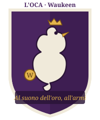
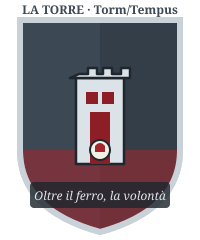
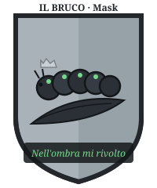
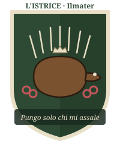
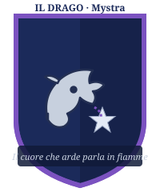
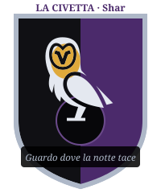
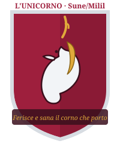
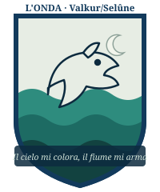

# Parte 2D — Le 8 Contrade: Stemmi, Motti, Canti, Rivalità

> Allegato di `...P2D-PALIO-DM-MASTER-REFERENCE.md`. Gli **stemmi** sono **originali**
> (`P2D-Palio-Allegati/stemmi/`) e **non riproducono** quelli reali di Siena: scudi,
> livree e simboli faerûniani sono propri della campagna; le **figure** sono icone
> game-icons.net in CC BY 3.0, ricolorate (attribuzione in `stemmi/CREDITS.md`). I **motti** qui usati sono **originali**, *ispirati* alla
> tradizione senese (fatti storici di pubblico dominio) ma **riscritti** per la campagna.
> Le divinità sono **faerûniane** (conversione da Golarion).

Ogni scheda: **patrono/fazione · divinità · colori · anima del rione · rivale · fantino
tipico · CANTO (con effetto meccanico) · aggancio a Rethmar (Meraviglia)**.

---

## Tavola sinottica

| Contrada | Divinità | Patrono (campagna) | Voto Consiglio | Meraviglia d'assedio |
|---|---|---|---|---|
| **L'Oca** | Waukeen | Lady Kaal | Resa | — (vittoria Oca = resa) |
| **La Torre** | Torm/Tempus | Jarmaath + Sorvane | Difesa | Golem d'Assedio |
| **Il Bruco** | Mask | Varis "Seta-Argento" | *(esterno)* | Piaga Chimica dei Canali |
| **L'Istrice** | Ilmater/Chauntea | Cap. Lorana (profughi) | Difesa (non uff.) | Mythal della Selva Viva |
| **Il Drago** | Mystra | Maester Pyriel | Astensione | Quasi-Mythal Perfetto (anti-drago) |
| **La Civetta** | Shar | Conte Valerius | *(esterno)* | Muri Illusori |
| **L'Unicorno** | Sune/Milil | Aldric Thornwall | Volatile | Arpa della Tempesta Bardica |
| **L'Onda** *(NEW)* | Valkur/Selûne | Gonfaloniere + Gilda dei Barcaioli | *(host city)* | La Marea Montante (flotta + piena) |

> **Halveth (corrotto)** non ha contrada: **finanzia l'Oca**. Smascherarlo = effetto uguale
> alla sua rimozione dal Consiglio (INTEGRAZIONE §2).

---

## 1 · L'OCA — *"Al suono dell'oro, all'armi"*

- **Divinità**: Waukeen (commercio, ricchezza). **Colori**: porpora e oro, bordati di bianco perla.
- **Patrono**: **Lady Kaal**, Presidente del Consiglio. **Anima**: aristocrazia terriera e
  banchieri; il rione più ricco, dai palazzi ordinati e freddi.
- **Rivale**: la Torre. **Fantino tipico**: **Cavaliere** mercenario d'élite, speroni d'oro.
- **CANTO — "L'Aria dei Conti"**: melodia elegante, quasi liturgica del mercato.
  *Effetto*: se vinto, apre un **partito commerciale** extra (oro/mercenari); tema
  **disfattista** — può infliggere **−1 Morale** a un rione a scelta ("Rethmar è già persa").
- **A Rethmar**: se l'Oca **vince il Palio → il Consiglio vota RESA** (branch disastro,
  CONSEGUENZE §Oca). Nessuna Meraviglia.
- **Nota Salvatore**: Kaal non è una vigliacca — è una contabile del dolore. Ha *già
  calcolato* quanti moriranno in un assedio e ha deciso di non pagare quel prezzo. Darle
  torto richiede darle **numeri migliori**, non insulti.

## 2 · LA TORRE — *"Oltre il ferro, la volontà"*

- **Divinità**: Torm (dovere) / Tempus (guerra). **Colori**: acciaio brunito e scarlatto, bordati d'argento.
- **Patrono**: **Lord Jarmaath** (militare) + **Cap. Brenna Sorvane** (milizia).
  **Anima**: veterani, fabbri d'armi, milizia pesante; taverne che sanno di fumo e olio d'armi.
- **Rivale**: l'Oca. **Fantino tipico**: **Cavaliere** d'acciaio, iper-disciplinato.
- **CANTO — "Inno delle Cento Asce"** *(eco di Hammerfist!)*: marziale, batte come un tamburo.
  *Effetto*: se vinto, **+1 Morale** e ai difensori evocati dà **+ vs paura**; ai PG reduci
  di Hammerfist: **+2 al canto** (riconoscono l'inno).
- **A Rethmar**: **unica** contrada che risveglia i **Golem d'Assedio** (Meraviglia canonica).
  Voto **Difesa compatta**; +cavalleria pesante di Channathgate.

## 3 · IL BRUCO — *"Nell'ombra mi rivolto"*

- **Divinità**: Mask (ombre, furto, segreti — **già in campagna**, arco Zalkatar/Artemis).
  **Colori**: argento sericeo e nero-fumo, listati di verde-veleno.
- **Patrono**: **Maestro Varis "Seta-Argento"** (mercato nero). **Anima**: ricettatori,
  contrabbandieri, la mala urbana; vicoli dove ogni porta ha due chiavi.
- **Rivale**: la Civetta. **Fantino tipico**: **Ladro** spietato, aghi nel nerbo.
- **CANTO — "Filastrocca del Nervo"**: allegra e minacciosa; i bambini la cantano, i sicari
  la fischiano. *Effetto*: se vinto, **Scosso** al rivale + i PG ottengono una **dritta**
  (dove colpirà il sabotaggio nemico).
- **A Rethmar**: **Piaga Chimica dei Canali** (chiuse alchemiche gnomiche: fuoco liquido nei
  fossati) + sabotaggio logistico dell'orda. **Prezzo**: Varis vuole contrabbandare **statue
  pietrificate** fuori dalle mura (aggancio Il Collezionista).

## 4 · L'ISTRICE — *"Pungo solo chi mi assale"*

- **Divinità**: Ilmater (sofferenza) / Chauntea (comunità). **Colori**: verde legnoferro e bruno
  di terra, bordati d'avorio; nello stemma, **catene spezzate** di rosso Ilmater (i
  profughi liberati) su campagna di bruno di terra.
- **Patrono**: **Capitana Lorana** e gli ~800 **profughi di Tretino/Drellin**. **Anima**:
  disperati accampati nei sobborghi, guardati con sospetto dai ricchi; il rione che non
  dovrebbe nemmeno avere un cavallo.
- **Rivale**: l'Oca (che li vorrebbe cacciare). **Fantino tipico**: un giovane profugo che
  monta **a pelo**, spinto dalla disperazione — o un Ranger.
- **CANTO — "Il Lamento del Traghetto"**: struggente, in minore; parla dei morti di
  Drellin's Ferry. *Effetto*: se vinto, **+2 Morale** e **cura 1d8 "morale"** al rione;
  fa **piangere la piazza** (Diplomazia +2 verso i popolani per una scena).
- **A Rethmar**: **Mythal della Selva Viva** (radici/spine dalle mura, trincee semoventi) +
  **800 profughi** a tenaglia. Se l'Istrice **vince**, Lorana ottiene **seggio permanente** → voto Difesa.
- **⚠️ Sub-ramo Ghostlord (+600 non-morti "buoni") — condizionale e gated**: il Ghostlord
  **non aiuta i profughi** (non gliene importa: è un lich). Canalizza la Selva Viva **solo se
  i PG hanno già stretto il PATTO** in `...P3-Ghostlord-LICH-ALLEANZA-TESTO.md` — cioè
  possiedono la sua **filatteria** e lo trattano da **alleato, non da schiavo soggiogato**.
  Motivo in-fiction: è un **lich druidico**, affine a un Mythal *di natura*, e onora il patto
  (non la pietà). Senza quel ramo, la Selva Viva funziona **coi soli arcidruidi del Circolo
  degli Otto** — nessun +600. Se il Ghostlord è ostile/soggiogato/insultato, **niente
  contributo** (e, come da suo arco, l'Orda guadagna semmai ondate di non-morti).
- **Nota Salvatore**: la loro forza è la disperazione, che è anche la loro rovina — il
  fantino profugo potrebbe **uccidere** un rivale per vendetta, non solo disarcionarlo.

## 5 · IL DRAGO — *"Il cuore che arde parla in fiamme"*

- **Divinità**: Mystra (magia). **Colori**: blu notte e argento, listati di
  viola arcano; nello stemma, una testa di drago che soffia verso la **stella d'oro di Mystra**.
- **Patrono**: **Maester Pyriel** (sapere/accademia). **Anima**: speziali, alchimisti,
  maghi di corte; il rione profuma di zolfo e pergamena.
- **Rivale**: la Civetta (che ruba i loro segreti). **Fantino tipico**: un Magus, o un
  fantino dopato con **pozioni alchemiche illegali** di potenziamento.
- **CANTO — "Le Sette Note della Trama"**: eterea, in scala arcana; chi ha ranghi in
  Sapienza Magica la canta meglio. *Effetto*: se vinto, **+ vs magia** ai difensori e
  rende **−1/−2** più facili le disruzioni rituali (Fase 2 di Rethmar).
- **A Rethmar**: **Quasi-Mythal Perfetto** — cupola argentea che **inchioda a terra i
  draghi** (Abithriax/Tyrgarun) e scherma i bombardamenti. **−1 GS** ondate aeree Fase 1.

## 6 · LA CIVETTA — *"Guardo dove la notte tace"*

- **Divinità**: Shar (perdita, vendetta, segreti). **Colori**: nero e viola di Shar, listati
  d'argento freddo; nello stemma, la civetta davanti al **disco nero di Shar**.
- **Patrono**: **Conte Valerius** (nobiltà decaduta). **Anima**: burocrati, spie,
  parassiti di corte; palazzi che cadono a pezzi dietro facciate d'oro.
- **Rivale**: il Bruco e il Drago. **Fantino tipico**: un Investigatore/sicario nobiliare,
  che **distrae gli arbitri** con la dialettica prima della Mossa.
- **CANTO — "La Ninna dell'Ombra"**: sussurrata, ipnotica. *Effetto*: se vinto, riduce la
  **Percezione** degli avversari (spie e alfieri rivali) per una scena — copre i sabotaggi.
- **A Rethmar**: **Muri Illusori del Disorientamento** (mura in posizioni errate) — potenti
  **ma** Valerius resta un traditore: se non ricattato/neutralizzato, in Fase 2/3 può
  **aprire una breccia**. Esito **ambiguo** (CONSEGUENZE §Civetta).

## 7 · L'UNICORNO — *"Ferisce e sana il corno che porto"*

- **Divinità**: Sune (bellezza) / Milil (canto). **Colori**: cremisi di Sune e argento di
  Milil; nello stemma, il **corno dorato** che dà il nome al distretto.
- **Patrono**: **Aldric Thornwall** (gilde/artigiani). **Anima**: sarti, falegnami,
  menestrelli; il rione più bello e il più codardo — vuole solo che la guerra "passi oltre".
- **Rivale**: nessuna fissa — **ago della bilancia**. **Fantino tipico**: un Bardo o un
  acrobata circense abilissimo a **schivare** le nerbate.
- **CANTO — "L'Aria del Corno"**: dolce, virtuosistica; il capolavoro dei bardi cittadini.
  *Effetto*: se vinto, **cura 1d8 morale** a tutto il rione e concede **Ispirare Coraggio**
  di massa; è il **canto-chiave** per la Meraviglia dell'Arpa.
- **A Rethmar**: **Arpa della Tempesta Bardica** (onda sonora sulle mura: + vs paura,
  fulmini sonici) + logistica/fortificazioni immense.

## 8 · L'ONDA *(NUOVA)* — *"Il cielo mi colora, il fiume mi arma"*

- **Divinità**: Valkur (marinai, vento favorevole) / Selûne (luna, navigazione).
  **Colori**: verde-fiume e argento lunare, bordati di blu profondo; nello stemma, un
  **cavallone** che si leva su tre onde sotto una **falce d'oro di Selûne**.
- **Patrono**: il **Gonfaloniere di Channathgate** e la **Gilda dei Barcaioli** — è la
  **contrada di casa**, l'unica non legata a una fazione di Rethmar. Molti barcaioli
  dell'Onda sono **gli stessi che traghettarono i profughi** giù dal Cannath: legame
  segreto con l'Istrice.
- **Anima**: barcaioli, pescatori, portuali, sognatori del fiume; gente allegra e
  scaramantica che legge il tempo nel cielo. **Rivale**: nessuna storica (sono "di tutti e
  di nessuno") — ma **disprezzano l'Oca** che specula sui dazi del porto.
- **Fantino tipico**: un giovane barcaiolo temerario, leggerissimo (bonus Cavalcare su
  fondo bagnato), o un chierico di Valkur che "sente il vento".
- **CANTO — "La Barcarola del Guado"**: ritmo di remi, ritornello che tutta la piazza sa
  cantare. *Effetto*: se vinto, **+2 Morale** *contagioso* (può estendersi anche all'Istrice
  se alleate); protegge dai **temi acquatici** (annegamento, fuoco liquido) in corsa se
  piove/fango.
- **A Rethmar — Meraviglia: "LA MAREA MONTANTE"**: l'Onda arma la **flotta fluviale** di
  Channathgate — chiatte da guerra e zattere-ariete che **scendono il Cannath** fino a
  Rethmar (corrente a favore, ~1 giorno) portando **rifornimenti e ~250 marinai-arcieri**;
  e i barcaioli **aprono le chiuse a monte** per **allagare le vie d'approccio** dell'orda
  ai guadi (le colonne di giganti/lucertoloidi restano impantanate). *Effetto assedio*:
  **−1 GS Fase 1** (approccio allagato) **+ rifornimenti garantiti** (come Thornwall) **+
  via di fuga/evacuazione fluviale** per i civili (riduce la pressione di Fase 3).
  Se l'Onda **vince**, il Gonfaloniere **firma subito il Decreto d'Intervento** (è la
  contrada che controlla porto e magazzini): sblocco logistico immediato.
- **Perché è bella per i PG**: l'Onda è la scelta "**salvare tutti**" — meno spettacolare
  in battaglia dei Golem, ma è l'unica Meraviglia che **evacua i civili** e apre la strada
  a un **finale senza massacro**. Tema Salvatore: la vittoria più silenziosa è salvare chi
  non combatte.

---

## Rivalità (mappa dei coltelli)

```
        OCA ⟺ TORRE            (ricchezza vs acciaio)
        OCA ⟶ ISTRICE          (i ricchi vogliono cacciare i profughi)
   BRUCO ⟺ CIVETTA             (due mafie per lo stesso mercato)
   DRAGO ⟺ CIVETTA             (chi ruba i segreti a chi)
        ONDA ⟶ OCA             (dazi del porto)
   UNICORNO = neutrale         (si vende al vincitore)
   ONDA ~ ISTRICE              (alleanza segreta dei salvati)
```

Usa le rivalità per i **partiti**: proporre a un rione di **far perdere il suo nemico** è
spesso più efficace che offrirgli di vincere.

---

## Livree di Channathgate (palette canonica)

Dal 2026-08-09 gli scudi **non usano più le livree di Siena**: ogni distretto ha una
livrea propria, derivata dalla **divinità patrona** e dal **nome faerûniano del
quartiere**. Nessuna combinazione coincide con quelle delle 17 contrade reali (chiude il
punto 3 della checklist di bonifica in `...P2D-PALIO-VERIFICA-LEGALE-IP.md` §7).

| Contrada · Distretto | Livrea | Campo | Secondario | Bordo / liste | Metallo figura |
|---|---|---|---|---|---|
| Oca · *The Golden Plume* | porpora e oro, bordata di bianco perla | `#4a2560` / `#3e1e52` | `#d9a63c` oro | `#f0eada` perla | `#f0eada` |
| Torre · *The Iron Bastion* | acciaio brunito e scarlatto, bordata d'argento | `#3c4854` / `#333e48` | `#a6242c` scarlatto | `#c9d2d8` argento | `#dce3e8` |
| Bruco · *The Silver Weft* | argento sericeo e nero-fumo, listata di verde-veleno | `#a9b2b8` / `#97a1a8` | `#23272b` nero-fumo | `#74d98a` veleno | `#2b3036` |
| Istrice · *The Quill-Wood Refuge* | verde legnoferro e bruno di terra, bordata d'avorio | `#2e4a34` / `#27402c` | `#7a5230` bruno | `#e8dfc6` avorio | `#7a5230` |
| Drago · *The Spell-Wyrm Spires* | blu notte e argento, listata di viola arcano | `#1b2a5a` / `#16224a` | `#c7d0de` argento | `#7b52c0` viola | `#c7d0de` |
| Civetta · *The Whispering Shadows* | nero e viola di Shar, listata d'argento freddo | `#101014` | `#4b2a6b` viola Shar | `#aeb8c8` argento | `#e4e8f0` |
| Unicorno · *The Gilded Horn* | cremisi di Sune e argento di Milil, oro dell'arpa | `#9e1f3d` / `#8a1a35` | `#dfa93b` oro arpa | `#d7dce2` argento | `#f2f4f7` |
| Onda · *The Tidal Crest* | verde-fiume e argento lunare, bordata di blu profondo | `#e7ede4` cielo | `#2e8c7e`·`#1d6b63`·`#124240` onde | `#123a5c` blu | `#e7ede4` |

**Rosso Ilmater** `#c4565a` è usato solo per le catene spezzate dell'Istrice.

**Oro araldico** `#dfa93b` (lumeggiato `#8a6416`) lega quattro scudi con lo stesso metallo:
becco e zampe dell'Oca (*beccata e membrata d'oro*), stella di Mystra, falce di Selûne,
corno dell'Unicorno. **La Civetta resta interamente d'argento**: il disco facciale dorato è
stato provato e scartato dal DM — su Shar il contrasto argento-su-nero regge meglio da solo. La Torre è **muragliata**: i giunti dei conci
sono in `#8d9aa6`, cioè un argento più scuro di quello della torre — la regola araldica del
*masoned*, che dà la trama senza introdurre un colore nuovo.

> **Nota di canone**: stella di Mystra e falce di Selûne sono canonicamente **d'argento**
> (Selûne *è* la luna d'argento). Qui sono d'oro per scelta del DM: l'oro su blu notte è la
> coppia più leggibile dell'armoriale, e risolve la falce che sul campo chiaro dell'Onda
> spariva. Per tornare al canone basta rimettere `fill="#e3eaf6"` e `fill="#f2f5ec"`.

---

## Nota grafica — le figure degli stemmi

Dal 2026-08-10 le **figure** degli otto scudi sono icone di **game-icons.net**, ricolorate
nella livrea del distretto e inserite negli scudi originali della campagna. Attribuzione
completa e testi di licenza: **`P2D-Palio-Allegati/stemmi/CREDITS.md`**.

> *Icons made by Lorc, Delapouite and Caro Asercion — https://game-icons.net — CC BY 3.0*

| Contrada · Distretto | Icona | Autore |
|---|---|---|
| Oca · *The Golden Plume* | `goose` | Delapouite |
| Torre · *The Iron Bastion* | `white-tower` | Lorc |
| Bruco · *The Silver Weft* | `caterpillar` | Delapouite |
| Istrice · *The Quill-Wood Refuge* | `porcupine` | Caro Asercion |
| Drago · *The Spell-Wyrm Spires* | `spiked-dragon-head` | Delapouite |
| Civetta · *The Whispering Shadows* | `barn-owl` | Caro Asercion |
| Unicorno · *The Gilded Horn* | `unicorn` | Delapouite |
| Onda · *The Tidal Crest* | `big-wave` | Lorc |

I file sorgente stanno in `P2D-Palio-Allegati/stemmi/game-icons/` insieme ai due testi di
licenza. In archivio anche `stone-tower` (Lorc), variante non usata per la Torre.

**Restano originali della campagna** — e fuori da questa attribuzione — la sagoma dello
scudo, le livree, i cartigli dei motti e i simboli faerûniani sovrapposti: moneta di
Waukeen, guanto di Torm, stella di Mystra, disco di Shar, falce di Selûne, catene spezzate
dell'Istrice, corno dorato dell'Unicorno.

**Come si sostituisce una figura**: in ogni file la figura è isolata fra i marcatori
`<!-- FIGURA ... -->` e `<!-- /FIGURA -->`, e il gruppo esterno porta il `fill` della
livrea — quindi **un `<path>` incollato lì dentro eredita il colore giusto senza altre
modifiche**. Le icone game-icons hanno `viewBox="0 0 512 512"`: va scartato il riquadro di
fondo `M0 0h512v512H0z` e ricalcolato il `transform` di scala.

**Manuale completo della pipeline**: `P2D-Palio-Allegati/stemmi/PROCEDURA.md` — anatomia
dello scudo, calcolo di scala e posizione delle icone, tecnica delle dorature, contratto del
cartiglio, e i comandi di verifica (`tools/measure_shields.py`, `tools/build_armorial.py`,
`golarion/build_golarion_shields.py`).

## Serie alternativa — Golarion / Pathfinder

`P2D-Palio-Allegati/stemmi/golarion/` contiene gli **stessi otto scudi** con il pantheon di
Golarion al posto di quello faerûniano: Abadar, Iomedae/Gorum, Norgorber, Sarenrae/Erastil,
Nethys, Calistria, Shelyn, Gozreh/Desna. Stesse figure, **stesse meccaniche 3.5** — cambiano
solo divinità, livrea e simbolo in campo. Mappatura, livree e note di licenza Paizo:
`golarion/README.md`. Rigenerabile con `golarion/build_golarion_shields.py`.

Serve a due cose: girare l'arco in un tavolo Pathfinder senza riscrivere nulla, e — visto che
AVVENTURA §1 dichiara le divinità faerûniane «riconvertite da Golarion» — **documentare il
pantheon di partenza**, che non era scritto da nessuna parte.

## Nota IP (ripetuta qui per chiarezza)
Nomi delle contrade e riferimenti al Palio = **fatti storico-culturali** citati come
ispirazione. **Motti e stemmi di questo documento sono originali** (riscritti/ridisegnati):
si evita così qualsiasi riproduzione dell'iconografia moderna tutelata dal *Consorzio per
la Tutela del Palio di Siena*. Uso non commerciale, da tavolo.
