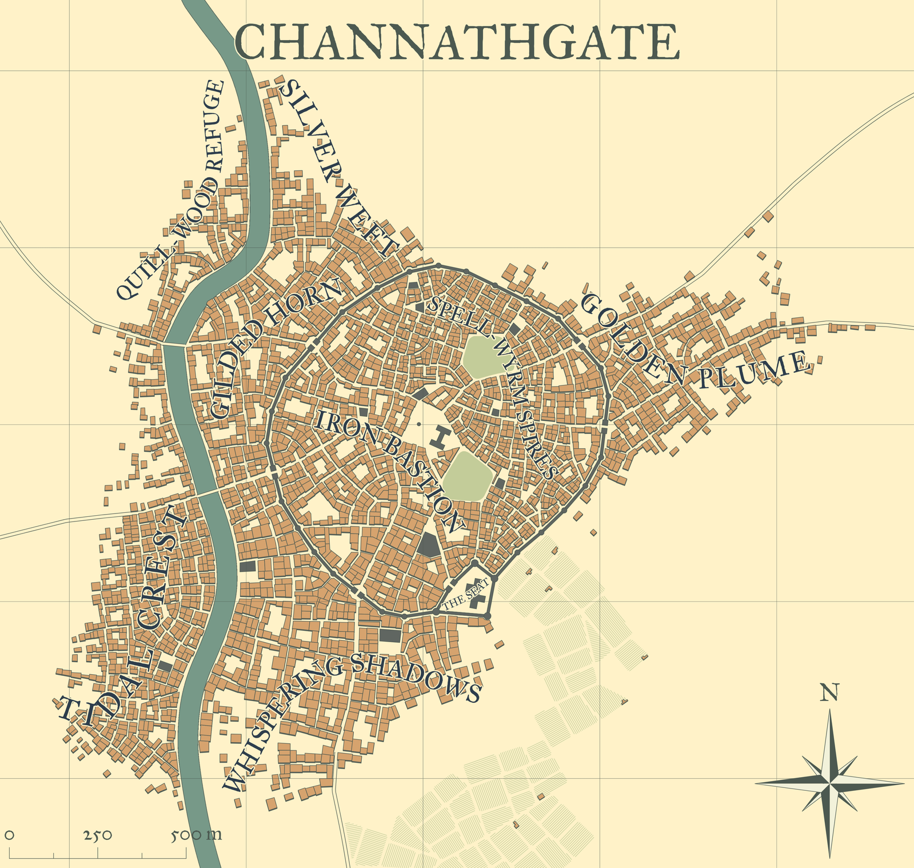

# Channathgate, la Porta del Cannath

> *C'è un'ora, nella piana rovente tra il fiume e il deserto, in cui la luce
> smette di essere luce e diventa oro battuto. È l'ora in cui Channathgate si
> sveglia. Come le città dei racconti che i mercanti sussurrano nelle mille e
> una notte di carovana — minareti di pietra chiara, cupole che bevono il
> tramonto, bazar che profumano di zafferano e di ferro — e insieme come
> l'ultimo bastione levantino di un regno in guerra: perché oltre la foschia
> di calore, a nord, marcia un'orda, e questa piana calda e polverosa sta al
> fronte come i campi che dividono la città della torre bianca dalla fortezza
> in rovina sull'altra riva. Otto rioni, un fiume, una piazza a ventaglio.
> E domani, novanta secondi che valgono una guerra.*

Naviga i capitoli qui sopra: sono i master integrali, in ordine di gioco.
