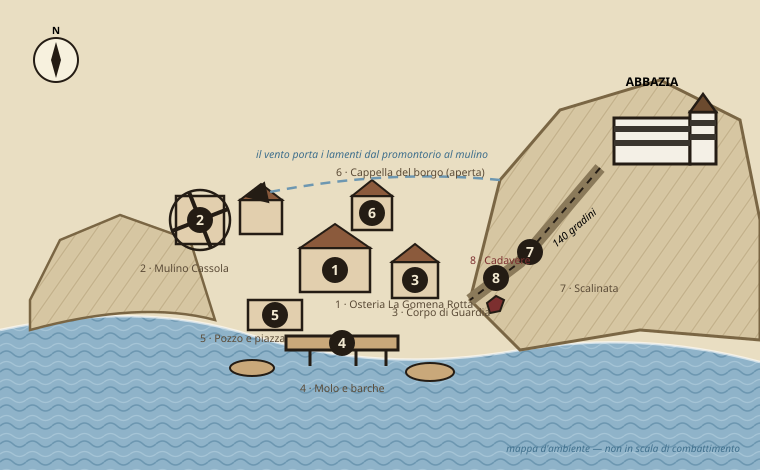
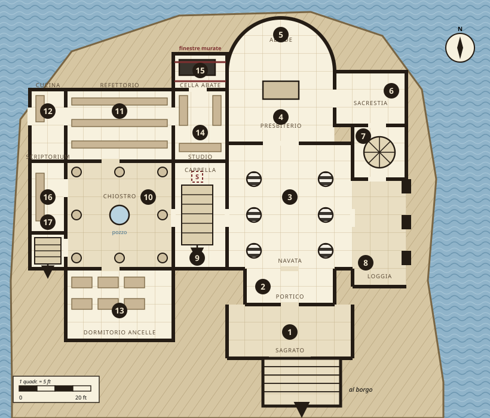
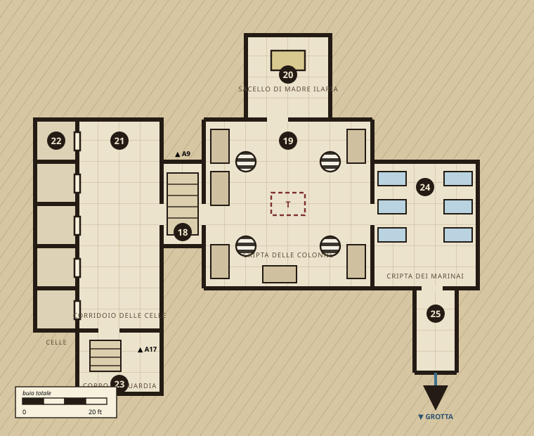
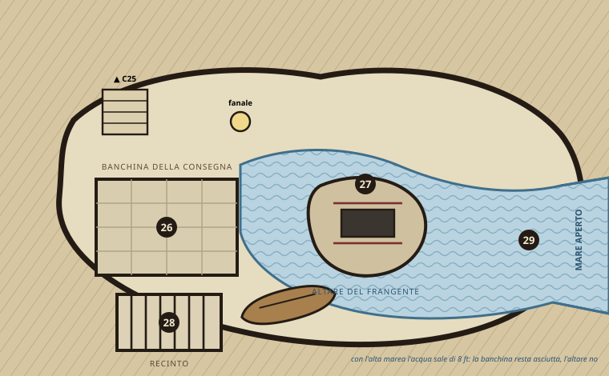

# L'Abbazia della Rotta Sicura

*One-shot investigativa e d'incursione per D&D 3.5 — Vènere Bassa, il promontorio e ciò che vi si fa di notte*

{{note
**Sistema:** D&D 3.5 (it)
**Party:** 4 PG di 7°–8° — guerriero, mago, ladro, chierico
**EL:** 6–11
**Durata:** una sessione lunga (7–8 h) o due sedute
**Aree:** 29 su quattro livelli + borgo
**Tono:** orrore gotico costiero, indagine, incursione
}}

{{note
⚠ **Nota di tono — leggila prima di portare questo al tavolo.**
La premessa riguarda un culto che uccide ragazzi e bambini. Il documento è costruito su una regola precisa: **le vittime bambine non compaiono mai in scena.** Il loro destino arriva solo tramite prove documentali (un registro, un inventario, un paio di scarpe), la testimonianza di un fantasma e il coro dei sommersi — che non ha volto, non parla e non si combatte. I prigionieri vivi, salvabili, sono giovani adulti (17–24 anni) e un'ancella anziana. Non è pudore: l'implicazione regge la tensione per tutta la sessione, la descrizione esplicita la spegne in dieci minuti e mette a disagio metà tavolo. Se un giocatore chiede apertamente il dettaglio, la risposta di gioco corretta è il registro, non la scena.
}}

## La verità

L'Abbazia della Rotta Sicura sorge sul promontorio sopra Vènere Bassa, borgo di pescatori di circa trecento anime. È dedicata al **Nocchiero**, divinità del mare benevola verso i naviganti, e da nove anni la dirige **Padre Anselmo Grifo**. L'abbazia raccoglie le **Ancelle della Rotta**: figli e figlie che le famiglie del borgo affidano al santuario perché siano consacrati al dio, con l'onore e il sollievo economico che ne derivano. Nessuna Ancella è mai tornata a casa. Le famiglie ricevono lettere. Le lettere le scrive l'abate.

Sotto la copertura ci sono tre cose intrecciate:

- **Padre Anselmo è un vampiro.** Lo è da sette anni. La chiesa resta chiusa di giorno perché lui non può attraversarla; le funzioni pubbliche sono al tramonto, e questo al borgo sembra soltanto una devozione austera. Serve la **Signora del Frangente**, entità marina divorante, ma il suo culto personale è sopravvivenza: gli serve sangue e gli serve che nessuno guardi.
- **Le Tre Sorelle del Frangente** — un concilio di megere che vive nella grotta sotto il promontorio — officiano il rito vero. Ogni luna nuova un'Ancella viene gettata dalla scogliera durante l'alta marea. Le Sorelle in cambio garantiscono all'abate mare calmo per gli approdi, presagi e la protezione che lo tiene nascosto. Sono loro il partner più antico e più pericoloso.
- **I corsari della *Zanna di Bruma***, capitanati da **Ghebro Malaluna**, comprano ogni mese le Ancelle che non servono al rito e le rivendono lungo la costa. Pagano in oro, argento e pietre. È da qui che arriva la ricchezza incongrua dell'abbazia.

Il sistema regge da nove anni per una ragione sola: **le tre parti si tengono in ostaggio a vicenda**. L'abate teme le megere, le megere disprezzano i corsari, i corsari non sanno cosa sia davvero l'abate. I PG che capiscono questo possono vincere senza combatterli tutti e tre — ed è il modo previsto.

### Perché adesso

Tre settimane fa **Madre Ilaria Sonda**, la vecchia responsabile delle Ancelle, ha capito e ha tentato di far fuggire due ragazzi. È morta sulla scogliera. Il suo cadavere è quello che il mare ha restituito. Da allora il sigillo di silenzio delle Sorelle si è incrinato: **di notte, dal promontorio, si sentono lamenti**, e il vento li porta esattamente su un punto del borgo — il mulino dei Cassola.

## Tavola I — Vènere Bassa e il promontorio

## Tavola II — Abbazia, livello 0 (chiesa e canonica)

## Tavola III — Livello −1: cripta e blocco delle celle

## Tavola IV — Livello −2: la Grotta della Consegna

## Il cast

{{note
**Padre Anselmo Grifo — Abate** Umano vampiro, chierico 7 · **GS 9** · MN Medio (non-morto, aumentato)
**PF** 45 (7d12) · **Iniz** +6 · **Vel** 9 m · **CA** 23 (contatto 12, colto alla sprovvista 21)
**BAB** +5 · **Att** schianto +9 (1d6+6 più risucchio di energia) o mazzafrusto +1 +10 (1d8+5)
**TS** Temp +5, Rifl +6, Vol +10 · **For** 18 **Des** 14 **Cos** — **Int** 15 **Sag** 20 **Car** 18
**Speciali** RD 10/argento e magia, guarigione rapida 5, resistenza a scacciare +4, resistenza al freddo e all'elettricità 10, forma gassosa, ragno rampicante, forma alternativa (pipistrello, nebbia), *dominare* (Vol CD 18), *figli della notte*, risucchio di energia (2 livelli negativi, Temp CD 18)
**Incantesimi** (chierico 7, domini Male e Acqua): *bane, doom, cause fear* / *hold person, silence, spiritual weapon* / *bestow curse, dispel magic, animate dead* / *divine power, freedom of movement, inflict critical wounds*
**Debolezze** luce solare diretta (distrutto nel round successivo all'esposizione), **acqua corrente (3d6/round, distrutto dopo 3 round consecutivi)**, paletto di legno, respinto da simbolo sacro presentato (Vol CD 25), non può entrare in un'abitazione senza invito
**Tattica** Non combatte mai per primo. Parla, mente, *domina* il PG con il TS Volontà più basso, e se le cose si mettono male fugge in forma gassosa verso la cella (15). Non scende mai in G27 durante l'alta marea, e i PG possono capire perché.
}}

{{note
**Le Tre Sorelle del Frangente — concilio di megere** **Grinza** (megera acquatica, GS 4) · **Còlpa** (megera verde, GS 5) · **Marèa** (annis, GS 6)
**Concilio** (le tre entro 9 m l'una dall'altra, LI 9): *animate dead, bestow curse, control weather, dream, forcecage, mind blank, mirage arcana, veil, vision*
**EL da concilio riunito: 10.** Contro 4 PG di 7° è quasi certamente letale.
**Uso previsto:** **non si presentano mai tutte e tre insieme** se il gruppo non ha alleati. La notte della consegna Marèa è in G27 e Grinza in acqua (EL 8); Còlpa arriva al terzo round dell'ultimo scontro **solo se i PG hanno ignorato tutti i segnali**. Se il gruppo ha liberato i prigionieri o ha messo abate e corsari l'uno contro l'altro, il concilio si dissolve e le megere fuggono in mare: è una vittoria legittima e va concessa.
}}

{{note
**Madre Ilaria Sonda — fantasma (alleata)** Umana fantasma, chierica 5 · **GS 7** · NB · **PF** 27 · **CA** 15 (contatto 15)
**Speciali** incorporea, manifestazione, *tocco corruttore* 1d6, *gemito spaventoso* (Vol CD 16), *malvolenza* (Vol CD 16) — **non usa nessuna di queste se non viene attaccata**
**Vincolo** È morta tentando di far fuggire due Ancelle. Non può lasciare il sacello (20) finché i corpi delle vittime restano nella grotta o finché il rito non è spezzato.
**Cosa dà, e a quale prezzo:** parla solo a chi presenta un simbolo sacro o supera **Diplomazia CD 18** (CD 13 se i PG le mostrano un oggetto delle Ancelle preso dalle celle). Ogni domanda le costa: dopo tre risposte svanisce fino al giorno seguente. **Scegliete bene le domande** — dillo esplicitamente ai giocatori.
**Le tre risposte migliori:** (a) l'abate non è vivo e teme l'acqua corrente; (b) sotto il pavimento della cappella c'è la botola, e dietro il corpo di guardia ci sono i vivi; (c) l'altare si sommerge al colmo della marea, e ciò che vi è legato sopra muore lì.
}}

{{note
**Tiberio Sarda — fantasma di corsaro (ostile-utile)** Umano fantasma, ladro 4 · **GS 6** · NM · **PF** 22 · **CA** 16 (contatto 16)
Ammutinato, gettato in mare da Malaluna due anni fa. Odia i corsari più di quanto odi i vivi. Attacca al primo round; si ferma se qualcuno pronuncia il nome di Ghebro Malaluna (**Sapienza (locali) CD 15**, o basta averlo sentito in osteria). Poi contratta: rivela il **segnale del fanale** (tre lampi lunghi, due corti) in cambio della promessa che Malaluna muoia. Se i PG mentono, tornerà.
}}

{{note
**Ghebro Malaluna — capitano della Zanna di Bruma** Umano guerriero 6/ladro 2 · **GS 8** · NM
**PF** 58 · **CA** 20 · **Att** sciabola +1 +13/+8 (1d6+6, 18-20) e pugnale +11 (1d4+2)
**TS** Temp +8, Rifl +8, Vol +3 · **Speciali** attacco furtivo +1d6, schivare prodigioso
**Seguito** 6 corsari (umano guerriero 3, GS 2, PF 22, CA 16, scimitarra +6 1d6+3, balestra leggera +5) e 2 arcieri (umano ladro 3, GS 3, arco corto +6 1d6, attacco furtivo +2d6)
**Il fulcro:** Malaluna non sa cosa sia l'abate. Crede di comprare schiavi da un prete corrotto. **Sapienza (nobiltà) o Raggirare CD 20** per convincerlo del contrario; se ci riescono, i corsari si voltano contro l'abbazia e l'EL del finale crolla di due punti. Questa è la soluzione che il documento vuole premiare.
}}

### Il borgo

| PNG | Ruolo | Cosa sa | Leva |
|---|---|---|---|
| **Dama Orsola Rive** · guerriero 5 | Capoguardia | Cinque scomparsi in due anni; l'abate le ha sempre mostrato lettere | Sua nipote **Cinzia** è nella cella 3. Non lo sa |
| **Berto Cassola** | Mugnaio | Dal mulino si sentono i lamenti quando il vento gira a maestrale | Suo figlio **Merlo** è nella cella 1 |
| **Nenno Braca** | Oste | Tutte le dicerie; i corsari bevono da lui quando toccano terra | Vende informazioni, non lealtà |
| **Madama Vela** · adepto 4 | Reclutatrice delle Ancelle | **Complice consapevole.** Sceglie chi va | Vigliacca: crolla con Intimidire CD 18. Se scoperta, avvisa l'abate entro 1 ora |
| **Fra' Timoteo** · chierico 2 | Giovane canonico | **Innocente.** Sa solo che l'abate scende di notte e che le nuove Ancelle non le rivede | La via d'ingresso legittima all'abbazia. Se muore per mano dei PG, il borgo si rivolta contro di loro |

## Atto I — Vènere Bassa

**Obiettivo minimo dell'atto:** i PG devono uscirne con *due* fatti: che le Ancelle non tornano, e che i rumori notturni vengono dal promontorio, non dal mare.

### Ganci d'apertura (usane uno, gli altri diventano scene)

- **L'ingaggio.** Dama Orsola paga 300 mo perché qualcuno scopra cosa tiene sveglia la famiglia Cassola. Motivazione dichiarata: ordine pubblico. Motivazione vera: sua nipote è entrata in abbazia sei settimane fa e la lettera che le è arrivata usa una parola che Cinzia non avrebbe mai scritto.
- **Il cadavere.** Il mare ha restituito un corpo alla base della scogliera (B8 in Tavola I). Donna, cinquant'anni, abito da ancella. **Guarire CD 15:** le fratture sono da caduta, non da annegamento; è caduta viva. **Guarire CD 20:** ha segni di dita sulle caviglie. È Madre Ilaria.
- **Le dicerie.** I PG sostano alla *Gomena Rotta* e la sala parla da sola.

### Dicerie all'osteria (1d8 — due sono false, deliberatamente)

| d8 | Diceria | Vero? |
|---|---|---|
| 1 | La chiesa non apre mai prima del tramonto, nemmeno per un funerale | Vero |
| 2 | Le Ancelle scrivono a casa, ma la calligrafia è sempre la stessa | Vero |
| 3 | D'inverno una nave senza fanali attracca sotto il capo, e non attracca da nessuna parte | Vero |
| 4 | Il vecchio abate era peggio di questo | Falso — depistaggio |
| 5 | Sotto l'abbazia c'è una grotta che il mare riempie e svuota | Vero |
| 6 | I lamenti sono foche: capita ogni anno a questa stagione | Falso — versione ufficiale della guardia |
| 7 | Madama Vela ha comprato una casa nuova e non fa niente per campare | Vero |
| 8 | L'abate non mangia in pubblico da nove anni | Vero |

### Il mulino (B2, Tavola I)

> *Il maestrale entra dalla feritoia di ponente e passa nella tramoggia, e quando passa porta con sé un suono che non è vento. Non sono parole. È qualcosa a metà fra un inno e un lamento, cantato da più voci che non respirano nei punti giusti.*

{{note
**Ascoltare CD 12** di notte con maestrale: il coro. **Ascoltare CD 20**: le voci ripetono sempre le stesse sette note. **Sapienza (religione) CD 18**: è l'inno d'ingresso del Nocchiero, cantato al contrario. **Uso successivo:** chi lo riconosce può intonarlo in G27. Il coro dei sommersi risponde, e per 1 round tutte le megere presenti sono *scosse* (nessun TS). Vale una volta sola. **Sopravvivenza CD 15** triangolando dal mulino: la sorgente è a mezza costa del promontorio, sotto l'abbazia — non nella chiesa.
}}

## Atto II — L'abbazia di giorno

Fra' Timoteo accoglie i visitatori. La canonica (10–17) è aperta e pulita. La chiesa (1–9) è chiusa a chiave "per lavori alla volta". L'abate riceve solo dopo il tramonto.

{{note
**Il conto che non torna (Cercare / Osservare, uno basta):**
- **Refettorio (11), Osservare CD 14** — la tavola è apparecchiata per ventidue. In dormitorio (13) i pagliericci sono nove.
- **Cucina (12), Cercare CD 12** — le provviste sono per pochi, ma la dispensa contiene vino e spezie da nave, non da borgo.
- **Scriptorium (16), Cercare CD 16** — le lettere alle famiglie sono *brutte copie*. Tutte della stessa mano. **Falsificare CD 15** per confermarlo. Questa è la prova che convince Dama Orsola.
- **Studio dell'Abate (14), Cercare CD 20** — **il registro**. Due colonne: nomi e date d'ingresso, nomi e date con accanto solo una lettera — **F** (frangente) o **Z** (*Zanna di Bruma*) e una cifra in monete. Trentuno nomi in nove anni. Undici hanno meno di dodici anni segnati accanto. *Il registro è l'unico luogo in cui questo compare. Non descrivere altro.*
- **Cella dell'Abate (15)** — porta sbarrata, **finestre murate dall'interno**, nessun letto, un cassone di terra battuta lungo sette piedi. **Sapienza (religione) CD 15**: è un giaciglio da vampiro. **Aprire il cassone di giorno significa vincere l'avventura senza combattere l'abate** — e va concesso, se i PG ci arrivano. Costa loro l'elemento sorpresa sugli altri due nemici.
}}

## Atto III — Sotto

Si scende dalla botola in cappella (9 → 18) o dalla scala di servizio (17 → 23, ma sbuca *dentro* il corpo di guardia).

#### C18 Vestibolo

Grata di ferro. **Scassinare CD 25**, o la chiave in sacrestia (6). **Ascoltare CD 13:** da ovest, qualcuno tossisce.

#### C19 Cripta delle Colonne

Otto sarcofagi, quattro pilastri a fasce che ripetono la navata sopra.

{{note
**Trappola (T):** fossa di 20 ft, 2d6 — Cercare CD 21, Disattivare CD 20, Rifl CD 20. Scarica nella scala 25: è una scorciatoia, non una condanna. Alghe secche sul bordo lo segnalano. **Incontro (EL 6):** 3 *wight* nei sarcofagi centrali. Un round di preavviso (i coperchi si spostano). Sono ex-Ancelle. Se qualcuno le chiama per nome — i nomi sono nel registro — perdono un round.
}}

#### C20 Sacello di Madre Ilaria

L'unico ambiente ancora consacrato del sotterraneo. Nessun non-morto vi entra, l'abate compreso. **È il rifugio sicuro dell'avventura** e i PG devono capirlo: descrivi il wight che si ferma sulla soglia.

{{note
Vedi il blocco di Madre Ilaria. **Tre domande, poi svanisce.** Tesoro: reliquiario d'argento (800 mo), 2 *fiale d'acqua santa*.
}}

#### C21 Corridoio delle Celle

Trenta metri, cinque grate sulla parete ovest. Il pavimento è pulito: qualcuno passa ogni giorno.

{{note
**Osservare CD 10:** ciotole vuote davanti a due celle, non alle altre tre. Chi era nelle altre tre non c'è più.
}}

#### C22 Le Celle

> *Cinque nicchie chiuse da sbarre. In tre non c'è nulla che valga la pena descrivere. Nelle altre due qualcosa si muove e si tira indietro dalla luce.*

**Cella 1 — Merlo Cassola**, 22, figlio del mugnaio. Disidratato, −4 a For e Des, 3 pf.

**Cella 3 — Cinzia Rive**, 19, nipote della capoguardia. In condizioni migliori: lucida, furiosa, e ha contato i giorni. **Sa che stanotte c'è la consegna.**

**Cella 4 — Sorella Bertrada**, 41, ancella anziana, rinchiusa da due settimane per aver fatto domande. Conosce la disposizione della canonica e il segnale del fanale.

**Cella 5 — Naspo**, 17, mozzo catturato in mare dai corsari, non del borgo. Vale 200 mo per Malaluna.

{{note
**Grate:** Scassinare CD 20, Forza CD 24. Chiavi nel corpo di guardia (23). **Vincolo di scena:** i quattro prigionieri non possono combattere e non possono correre a lungo (Cos ridotta, velocità 6 m). Portarli fuori **è** il conflitto del terzo atto, non un premio automatico. Il percorso sicuro è 21 → 18 → 9 → chiesa → sagrato; il percorso rapido è 21 → 23 → 17, ma passa dal corpo di guardia.
}}

#### C23 Corpo di Guardia

**Incontro (EL 7):** 4 corsari (guerriero 3) e **Grinza** la megera acquatica (GS 4), lasciata dalle Sorelle a sorvegliare la merce. Il suo *sguardo mortale* (Tempra CD 15) è la minaccia vera.

{{note
Chiavi delle celle appese; una cassa con 400 mo in argento; un fanale schermato (serve per il segnale in G26).
}}

#### C24 Cripta dei Marinai

Loculi allagati. **Incontro (EL 5):** 6 *lacedon*. Facoltativo — tagliali se il gruppo è già logoro. **Tiberio Sarda** si manifesta qui.

#### C25 Scala alla Grotta

Sessanta scalini scavati, umidi, con la marea che si sente salire. Ogni dieci scalini il rumore cambia: usalo come orologio narrativo.

## Atto IV — La Notte della Consegna

> *Il fanale sulla banchina lampeggia tre volte lunghe e due corte. Dalla bocca della grotta entra una lancia a remi, e dietro di essa il mare comincia a salire.*

### Orologio della notte — otto passi

Fai avanzare l'orologio di un passo ogni 10 minuti di gioco reale, **e di un passo extra ogni volta che i PG fanno rumore** (campana suonata, combattimento non silenziato, allarme dato da Madama Vela).

| Passo | Ora | Marea | Evento |
|---|---|---|---|
| 1 | 22:00 | bassa | L'abate scende in 27. Le Sorelle preparano l'altare |
| 2 | 23:00 | montante | I prigionieri vengono spostati dalle celle (22) al recinto (28) |
| 3 | 00:00 | montante | Il fanale dà il segnale. La lancia entra da 29 |
| 4 | 01:00 | alta | Trattativa fra Malaluna e l'abate sulla banchina (26) |
| 5 | 02:00 | alta | Pagamento e imbarco. **Ultimo momento utile per salvare chi va sulla nave** |
| 6 | 02:30 | colmo | Il rito sull'altare (27). L'acqua arriva alla mensa |
| 7 | 03:00 | colmo | **L'altare è sommerso.** Chi vi è legato annega |
| 8 | 03:30 | calante | Tutti se ne vanno. L'abbazia riapre all'alba come se nulla fosse |

### Il fatto tattico che decide lo scontro

{{note
⚠ **L'altare (27) è battuto da acqua corrente al colmo della marea.** Un vampiro immerso in acqua corrente subisce 3d6 per round ed è distrutto dopo tre round consecutivi. Padre Anselmo lo sa e resta sempre sulla banchina (26). Spingerlo, attirarlo o legarlo sull'altare al passo 6–7 **lo uccide senza bisogno di superarne la RD**.
Perché funzioni servono tre semine: la nota nella cella dell'abate (15), la terza risposta di Madre Ilaria (20), e la scala 25 dove i PG sentono l'acqua salire. Se ne hai piazzate meno di due, il tavolo non ci arriverà e lo scontro diventa una guerra d'attrito contro RD 10 e guarigione rapida 5 — che a 7° livello è un massacro.
}}

### Composizione dello scontro finale

| Scenario | Nemici presenti | EL | Come ci si arriva |
|---|---|---|---|
| **A — Frontale** (peggiore) | Abate + Marèa + Grinza + Malaluna + 6 corsari | 12 | I PG scendono senza aver liberato nessuno né parlato con nessuno. **Sconsigliato: TPK probabile** |
| **B — Standard** | Abate + Marèa + 4 corsari | 10 | I PG hanno liberato i prigionieri e Malaluna è già ripartito o esita |
| **C — Cuneo** (previsto) | Abate + Marèa; i corsari combattono *a fianco* dei PG | 9 | Malaluna ha scoperto cosa compra. Raggirare/Sapienza CD 20, o Tiberio come testimone |
| **D — Marea** (ottimale) | Marèa e Grinza soltanto | 8 | L'abate è stato distrutto nel cassone (15) di giorno, o spinto sull'altare al passo 7 |

### Tre finali progettati

- **Il sigillo.** Abate distrutto, megere in fuga in mare, prigionieri liberi. Il borgo scopre tutto. Dama Orsola deve decidere cosa dire a undici famiglie. **Non risolverlo tu: lasciala chiedere ai PG.**
- **Il patto.** I PG lasciano andare Malaluna in cambio dei prigionieri sulla nave. Salvano tutti i vivi, e un corsaro schiavista continua a navigare la costa. Aggancio perfetto se questa one-shot diventa un arco.
- **Il silenzio.** I PG uccidono l'abate ma non trovano il registro. L'abbazia viene affidata a Fra' Timoteo, che non sa nulla, e Madama Vela resta libera. Il rito riprende in altra forma entro un anno.

## Regola dei tre indizi

Ogni rivelazione necessaria ha tre canali indipendenti. Se il tavolo ne manca uno, non è un problema. Se ne manca tre, hai sbagliato tu.

| Rivelazione | Canale 1 | Canale 2 | Canale 3 |
|---|---|---|---|
| Le Ancelle non tornano | Dicerie 2 e 7 in osteria | Lettere in brutta copia (16) | Berto e Orsola, indipendentemente |
| Esiste un sotterraneo | Coro udibile al mulino | Botola in cappella (9) | Sorella Bertrada, se liberata prima |
| L'abate è un vampiro | Cassone e finestre murate (15) | Prima risposta di Madre Ilaria (20) | Non mangia mai in pubblico (diceria 8) + non entra in C20 |
| Ci sono prigionieri vivi | Ciotole nel corridoio (21) | Tosse udibile dal vestibolo (18) | Registro: nomi senza lettera accanto (14) |
| Stanotte c'è la consegna | Registro: cadenza mensile (14) | Cinzia lo dice appena liberata | Tiberio e il segnale del fanale (24) |
| L'acqua corrente uccide l'abate | Bestiario / Sapienza (religione) CD 15 | Terza risposta di Madre Ilaria | L'abate non scende mai in 27 con l'alta: osservabile |

## Tesoro ed esperienza

| Dove | Contenuto | Valore |
|---|---|---|
| Studio dell'abate (14) | Registro (prova, non tesoro), 600 mo in argento, *perla di potere I liv.* | ~1.600 mo |
| Sacello (20) | Reliquiario d'argento, 2 acque sante, *mantello di resistenza +1* | ~1.800 mo |
| Corpo di guardia (23) | 400 mo, fanale schermato, chiavi | 400 mo |
| Cripta delle colonne (19) | 8 stemmi d'argento, *anello di protezione +1* | ~2.200 mo |
| Padre Anselmo | *Camicia di maglia +1*, *mazzafrusto +1*, simbolo profano (400 mo) | ~4.700 mo |
| Malaluna (se sconfitto) | *Sciabola +1*, cassa del pagamento: 2.000 mo, 4 gemme da 500 | ~6.300 mo |
| Grotta (27) | *Bacchetta di cura ferite leggere* (26 cariche) fra le offerte | ~700 mo |

**Totale se ripuliscono tutto:** ~17.700 mo, in linea con la ricchezza attesa per un party di 7°–8° che affronta una serie di incontri EL 6–10. **Se scelgono il finale "il patto"** perdono la cassa di Malaluna: la scelta morale ha un prezzo numerico, ed è giusto così.

**PX indicativi** (4 PG di 7°): Atto I ~600 a testa in premi di ruolo e indagine (non da combattimento); Atto III ~1.400; Atto IV ~2.000–2.600 secondo lo scenario. Sufficiente per l'8° livello, non per il 9°.

## Modi di fallimento al tavolo

| Modo di fallimento | Sintomo | Causa | Mitigazione |
|---|---|---|---|
| **TPK sull'abate** | RD 10/argento e magia + guarigione rapida 5 + risucchio di energia: il party si consuma senza scalfirlo | Scenario A raggiunto senza semine | Verifica prima della sessione che almeno due delle tre semine dell'acqua corrente siano state colpite. Se no, fai scendere l'abate in 27 di sua iniziativa al passo 6 |
| **Concilio completo** | EL 10 di sole megere con *forcecage*: fine partita | Le tre Sorelle presenti insieme | Còlpa entra **solo** se i PG hanno ignorato ogni segnale. È una valvola, non un evento programmato |
| **Indagine a vuoto nell'Atto I** | Un'ora di gioco senza progressi, il tavolo si annoia | Tutti gli indizi dietro prove di abilità | Diceria 1, 2 e 8 sono gratuite: le dice Nenno senza che nessuno tiri. Se dopo 40 minuti non c'è progresso, Berto Cassola bussa alla porta dell'osteria |
| **Il registro non viene trovato** | Il finale "il silenzio" per omissione, non per scelta | Cercare CD 20 in un'unica stanza | Sorella Bertrada sa dov'è. Cinzia sa che esiste. Il registro è recuperabile anche dopo lo scontro finale |
| **Prigionieri usati come sacchi** | I PG li lasciano in cella "per dopo" e li ritrovano morti al passo 7 | Nessun costo percepito all'attesa | Al passo 2 li spostano nel recinto (28). Descrivi il rumore delle grate che si aprono: è il timer che diventa udibile |
| **Fra' Timoteo ucciso** | Il borgo diventa ostile e l'Atto IV perde ogni appoggio | Party trigger-happy in casa altrui | Timoteo è disarmato, apre lui la porta e chiede scusa per l'abate. Rendi visibilmente costoso colpirlo |
| **Il materiale sensibile guasta la serata** | Silenzio imbarazzato, un giocatore si sfila | Descrizione esplicita del destino dei bambini | Tutto passa dal registro (14) e dal coro senza volto. Se qualcuno spinge per il dettaglio, la risposta è la riga del registro, letta e basta |
| **Session overrun** | Si arriva all'Atto IV alle due di notte, esausti | Quattro atti in una seduta | Punto di taglio previsto: fine Atto III con i prigionieri liberati. L'Atto IV è una seconda seduta autosufficiente |

## Decisioni di progettazione (ADR)

{{note
**ADR-01 — Il nemico non è uno, sono tre, e si tengono in ostaggio.**
*Contesto:* un solo villain a GS 9 contro 4 PG di 7° è o banale o letale, senza vie di mezzo.
*Decisione:* abate, megere e corsari sono tre fazioni con interessi divergenti.
*Conseguenze:* lo scontro finale ha quattro configurazioni di EL diverso (8–12) determinate dalle scelte dei PG, non dal DM. In cambio devi tenere traccia di tre agende: la tabella dell'orologio serve a questo.
}}

{{note
**ADR-02 — La debolezza dell'acqua corrente è la soluzione progettata, non un trucco.**
*Decisione:* la topografia (abbazia sul mare, grotta di marea, altare sommergibile) esiste *per* questa regola SRD del vampiro.
*Conseguenze:* l'avventura premia l'osservazione più della potenza di fuoco. Il prezzo è che va seminata in tre punti; senza semine, la geografia diventa decorazione e lo scontro degenera in attrito.
}}

{{note
**ADR-03 — Le vittime bambine restano fuori scena.**
*Decisione:* compaiono solo in un registro, in un inventario e in un coro senza volto; i personaggi salvabili e interpretabili sono giovani adulti.
*Conseguenze:* l'orrore resta implicito e sostenibile per una serata intera. Perdi la scena shock; guadagni che il tavolo arrivi alla fine. **Questa decisione non è negoziabile in gioco** — se un giocatore insiste, la risposta di gioco è la riga del registro.
}}

{{note
**ADR-04 — Ogni PNG del borgo ha un parente nelle celle.**
*Decisione:* nipote della capoguardia, figlio del mugnaio, collega di Bertrada.
*Conseguenze:* l'indagine dell'Atto I ha un ritorno emotivo nell'Atto III senza bisogno di legare i PG al borgo con un background. Costo: se i PG falliscono, il fallimento è nominativo. Assicurati che il tavolo lo voglia.
}}

{{note
**ADR-05 — Bestiario limitato all'SRD 3.5.**
*Decisione:* vampiro, fantasma, wight, lacedon, megera acquatica, megera verde, annis, concilio, classi PNG — tutto SRD/OGL 1.0a.
*Conseguenze:* nessuna sostituzione necessaria in caso di pubblicazione. Vedi la sezione licenze: è l'unico punto in cui questo documento può ancora contaminarsi.
}}

## Igiene di licenza — leggi prima di committare

Questo è il punto in cui l'esperienza dell'arco del Palio è direttamente rilevante. Il documento è **già pulito**, ma solo perché è stato scritto per esserlo:

| Elemento | Stato | Nota |
|---|---|---|
| Creature (vampiro, fantasma, wight, lacedon, megere, concilio) | ✅ SRD 3.5 / OGL 1.0a | Nessuna creatura da Monster Manual II, Draconomicon o supplementi |
| Classi PNG (chierico, guerriero, ladro, adepto) | ✅ SRD | Adepto è nel SRD come classe PNG |
| Oggetti magici | ✅ SRD | Tutti dalla tabella oggetti SRD |
| **Divinità** | ⚠️ deliberatamente generiche | **"Il Nocchiero"** e **"la Signora del Frangente"** sono invenzioni di questo documento. **Non usare Valkur né Umberlee nel testo committato**: sono Forgotten Realms non-SRD, e sono esattamente la classe di contaminazione già trovata nell'audit del modulo |
| Toponimi | ⚠️ da decidere | Vènere Bassa e l'Abbazia della Rotta Sicura sono inventati. **Non chiamarla Porto Venere nel testo pubblicato**: il luogo reale va bene come riferimento visivo per te, non come nome proprio nel prodotto |
| Tavole SVG | ✅ originali | Nessun asset di terzi, nessuna dipendenza, nessun font non di sistema. Nessuna immagine AI, quindi nessun obbligo di disclosure su DriveThruRPG |

**Se finisce in RumblingStone:** il ramo FR può usare i nomi di Faerûn ma ricade sotto il DMs Guild Community Content Agreement, incompatibile con MIT, GPL e CC BY. Tieni i due rami separati **dal primo commit**, non dopo. Per le tavole SVG isolate, CC BY 4.0 o MIT vanno bene; **GPL-3.0 su un'opera testuale resta l'errore da correggere**, qui come nel repo principale.

## Piano di adozione in tre fasi

### Fase 1 — Audit / verifica pre-sessione

- Chi ha argento o armi magiche nel party? Senza almeno due fonti di danno che superino RD 10/argento e magia, lo scenario A è un TPK matematico, non una sfida.
- Il chierico può scacciare a livello effettivo 7? L'abate ha resistenza a scacciare +4: contro un chierico di 7° funziona solo con un buon tiro.
- Fonti di luce e scurovisione: tutto il livello −1 è buio totale e nessun incontro è stato bilanciato assumendo visione universale.
- Verifica il consenso del tavolo sul tema. Una riga, prima di iniziare: *"c'è un culto che uccide ragazzi; niente sarà mostrato in scena, ma sarà chiaro cosa è successo"*. Se qualcuno esita, la one-shot funziona identica sostituendo le vittime con marinai catturati.
- Decidi in anticipo **quale finale sei disposto a concedere** se i PG risolvono tutto di giorno aprendo il cassone (15). La risposta corretta è: concederlo.

### Fase 2 — Esecuzione

- **Atto I, 60–75 min.** Cancello d'uscita: il gruppo sa che le Ancelle non tornano *e* che i suoni vengono dal promontorio. Se a 60 minuti manca uno dei due, Berto Cassola arriva e lo dice in faccia.
- **Atto II, 45–60 min.** Cancello: almeno una prova documentale (lettere o registro) e almeno un sospetto sulla natura dell'abate.
- **Atto III, 90–120 min.** Cancello: prigionieri liberati o localizzati. Punto di taglio naturale per una seconda seduta.
- **Atto IV, 75–90 min.** Avvia l'orologio della notte e dichiaralo ai giocatori: il timer va giocato con le carte scoperte.

### Fase 3 — Validazione

- **Agency:** almeno una fazione delle tre deve essere stata aggirata, corrotta o evitata invece che combattuta. Se il gruppo le ha combattute tutte e tre ed è sopravvissuto, hai tirato troppo morbido; se è morto, non hai seminato abbastanza.
- **Comprensione:** a fine partita chiedi perché la chiesa restasse chiusa di giorno. Se nessuno risponde "perché l'abate è un vampiro", i canali della Tavola dei tre indizi hanno fallito e vanno rinforzati prima di riproporla.
- **Peso morale:** il finale scelto è stato una decisione discussa o un ripiego? Se nessuno ha esitato davanti alla proposta di Malaluna, la trattativa non è stata resa abbastanza allettante.
- **Riusabilità:** se questa one-shot deve poter confluire in RumblingStone, verifica *prima* del commit che nel testo non siano rientrati nomi di Faerûn per abitudine di scrittura. È il modo più comune in cui la contaminazione torna dentro.

— *Il maestrale entra nella tramoggia del mulino e ne esce cantando. Non sono foche.* —
