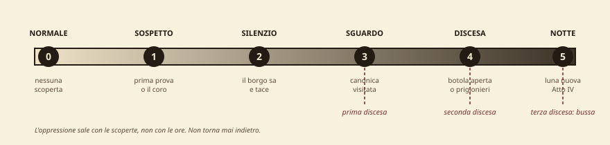

# Appendice B — Il borgo, l'oppressione e il bestiario

*Complemento a *L'Abbazia della Rotta Sicura* e all'Appendice A — struttura d'atmosfera, storia e governo, dettaglio sensoriale, bestiario, prove, misteri, protocollo di playtest*

{{note
**Aggiunge:** scala d'oppressione a 6 stadi
**Storia e governo del borgo**
**39 schede sensoriali**
**13 blocchi di bestiario SRD**
**5 prove strutturate · 6 misteri**
}}

{{note
⚠ **La cosa più importante di questo documento, in una riga.** La scala dell'oppressione avanza sulle *scoperte*, non sul tempo. Un gruppo che indaga bene fa scendere il buio più in fretta di un gruppo che perde tempo. Questo è deliberato: l'orrore deve essere la ricompensa della bravura, non la punizione della lentezza. Se lo leghi all'orologio, ottieni l'effetto opposto e i giocatori impareranno a non fare nulla.
}}

## La Scala dell'Oppressione

| St. | Come ci si arriva | Il borgo | L'abbazia | Effetto meccanico |
|---|---|---|---|---|
| **0** | Stato iniziale | Rumoroso, ospitale, indifferente. Le barche escono, i bambini giocano sul molo | Chiusa e ordinata. Timoteo saluta chiunque | Nessuno |
| **1** | Prima prova documentale *oppure* il coro udito al mulino | Le conversazioni si abbassano quando i PG entrano, poi riprendono | Identica — ed è questo a inquietare | Nessuno |
| **2** | Berto o Orsola hanno parlato apertamente, *oppure* le ventidue croci notate | Le porte si chiudono al tramonto. Nessuno nomina l'abbazia. Le madri chiamano dentro i figli un'ora prima | Timoteo comincia a fare domande alle Ancelle e non ottiene risposte | +2 alle CD di Diplomazia nel borgo dopo il tramonto |
| **3** | I PG hanno visitato la canonica, *oppure* Madama Vela è stata interrogata | Qualcuno lascia una ciotola di sale sulla soglia dei PG. Nessuno ammette di averlo fatto | Le nove Ancelle non sono più in chiostro. Lo studio (14) viene chiuso a chiave se non lo era | **Prima discesa** (sotto). Orologio +1 per ogni azione rumorosa |
| **4** | Botola aperta, *oppure* un prigioniero visto o liberato | Le barche restano a secco. La Gomena Rotta chiude presto. Scàbbio rifiuta ogni noleggio | La chiesa non apre più nemmeno al tramonto. Le funzioni sono sospese «per lutto» | **Seconda discesa.** Ogni PNG del borgo ha −4 alla reazione iniziale |
| **5** | Luna nuova: parte l'orologio della notte | Buio totale. Nessuna finestra illuminata. I cani sono chiusi in casa e non abbaiano | Tutto il personale è sotto. Sopra non c'è nessuno | **Terza discesa.** L'orologio della notte è attivo |

### Le tre discese

Padre Anselmo scende al borgo tre volte, e ogni volta è più vicino. Non sono incontri: sono scene. **Non tirare iniziativa in nessuna delle tre** a meno che non siano i PG ad attaccare.

#### Prima discesa — stadio 3, nessuno lo vede

> *La mattina sulla soglia dell'osteria c'è del sale grosso disposto in una linea sottile, che nessuno ricorda di aver versato. Il cane dei Cassola, che dorme sempre fuori, stanotte era in cucina e non ha voluto uscire. Una delle imposte al primo piano è aperta verso l'interno: dall'esterno non si apre.*

**Solo indizi.** Nessuna prova richiesta per notare il sale e il cane; **Osservare CD 15** per l'imposta. **Sapienza (religione) CD 14:** il sale sulla soglia è un rimedio popolare contro i non-morti, e qualcuno del borgo lo pratica ancora senza sapere perché.

#### Seconda discesa — stadio 4, qualcuno lo intravede

> *Chi è di guardia la vede: una figura scura scende la scalinata a una velocità che non ha senso, e a metà del secondo pianerottolo la vede scendere senza toccare i gradini. Poi si ferma. Resta immobile per il tempo di tre respiri, rivolta verso il borgo. Poi non c'è più.*

**Osservare CD 18** per chi è sveglio; automatico per chi è di guardia sul molo o alla finestra. **Non si avvicina.** Sta contando le finestre illuminate. Se i PG lo inseguono, non lo raggiungono: al piede della scalinata non c'è nessuno e la sabbia non ha impronte.

**Effetto:** chiunque lo veda deve superare **TS Volontà CD 14** o restare *scosso* per 10 minuti. Non è un attacco: è la prima volta che il tavolo capisce con cosa ha a che fare.

#### Terza discesa — stadio 5, bussa

{{note
⚠
> *Tre colpi. Non forti. La voce che arriva dall'altra parte della porta è cortese, calma, e chiama ciascuno di voi per nome. Dice che è venuto a chiarire un malinteso, che la porta è chiusa e che lui non entrerebbe mai in casa d'altri senza essere invitato. Poi aspetta. Sa aspettare bene.*
**Questa è la scena chiave dell'intera avventura** e regge su una regola SRD: **un vampiro non può entrare in un'abitazione se non vi è invitato**. Padre Anselmo lo sa, i PG probabilmente lo hanno letto nel sacello (20) o nella cella (15), e adesso è dall'altra parte di due dita di legno a parlare con voce ragionevole.
**Cosa fa:** offre un patto. Che se ne vadano, con l'ingaggio di Orsola raddoppiato, e le nove Ancelle vive verranno rimandate a casa entro un mese. **Percepire Intenzioni CD 22**: dice la verità sulle nove. Non dice nulla delle undici che non ci sono più.
**Cosa non fa:** non forza la porta, non attacca, non alza la voce. Se i PG aprono, entra. Se qualcuno pronuncia una formula d'invito anche per scherzo, entra. **Chiedi esplicitamente «aprite?» e conta fino a tre in silenzio.**
**Se rifiutano:** ringrazia, augura la buonanotte, e all'orologio della notte si aggiungono due passi perché ora sa esattamente dove sono e quanti sono.
}}

## Vènere Bassa — storia, governo, contado

### Chi governa

Vènere Bassa è un **villaggio franco** della **Signoria di Càlmara**, città portuale quaranta miglia a settentrione. Lo statuto le riconosce di non avere signore residente, in cambio di un tributo annuale e dell'obbligo di ospitare la flotta di Càlmara in caso di guerra. Guerre non ce ne sono da trent'anni.

Formalmente il potere è del **castellano ser Aldemaro Fusco**, che risiede alla Torre del Guado a otto miglia, è gottoso, ha sessant'anni e considera l'incarico una punizione. Scende a Vènere Bassa due volte l'anno per le tasse. **Non si muoverà per delle voci**: serve una prova scritta e un morto con un nome.

Nella pratica il borgo è retto da tre poteri che si guardano:

- **L'Abbazia.** Possiede i due mulini, i diritti di pesca su due cale e il terzo del pescato di levante. È il creditore di metà delle famiglie. **Questo, e non la fede, è il motivo per cui nessuno fa domande.**
- **La Corporazione dei Pescatori**, guidata da **Maestra Rufa Scàbbio**, 68 anni, zia del barcaiolo. Sa contare e sa tacere. Se i PG le portano una prova, può indire l'assemblea del borgo — che è l'unico modo di ottenere venti uomini armati di rampino.
- **La guardia**, quattro uomini e Dama Orsola. Rappresenta Càlmara e non ha alcun potere sull'abbazia, che gode di immunità ecclesiastica. Orsola lo sa e lo odia.

### Cronologia

| Quando | Cosa | Chi lo sa oggi |
|---|---|---|
| ~800 anni fa | Sul capo esiste un santuario dedicato a una divinità marina divorante. Il promontorio ne porta il nome | Nessuno. Ricavabile in B5 e da Vecchia Nuta |
| 412 anni fa | Il Primo Abate fonda l'abbazia *per sigillare la grotta*, non per santificare il capo | Madre Ilaria (20), l'archivio (17) |
| 380 anni fa | Si costruisce la chiesa a fasce sopra il sacello antico | Conoscenza comune |
| 260 anni fa | Statuto di villaggio franco sotto Càlmara | Conoscenza comune |
| 60 anni fa | Naufragio della *Santa Croce*: 34 morti in una notte. Nasce la Notte dei Lumi | Conoscenza comune; i nomi in B6 |
| 31 anni fa | La grande mareggiata distrugge il vecchio molo. Nel rifarlo si scopre la bocca della grotta, e la si dimentica | Vecchio Scàbbio, che c'era |
| **9 anni fa** | **Muore di febbre l'abate Corradino. Arriva Padre Anselmo. Cominciano le Ancelle. Malaluna perde la patente** | Nessuno collega le quattro cose |
| 3 settimane fa | Madre Ilaria tenta di far fuggire due Ancelle e cade dalla scalinata | Il borgo sa che è morta. Nessuno sa come |

{{note
**Il nodo dei nove anni fa.** Quattro eventi nello stesso anno, e nessun PNG li mette in fila. Il momento in cui un giocatore lo fa ad alta voce è il momento migliore della sessione: non anticiparlo, e quando succede fermati e lascia parlare il tavolo.
}}

### Il contado — cosa c'è entro un giorno

| Luogo | Distanza | Cosa offre | Perché non risolve il problema |
|---|---|---|---|
| **Càlmara**, città portuale | 40 mi · 2 giorni | Giustizia, magistrati, un tempio vero, magia acquistabile fino al 3° livello | Quattro giorni di andata e ritorno. La consegna è stanotte |
| **Torre del Guado** | 8 mi · 3 ore | Ser Aldemaro e sei soldati | Non muove un dito senza prova scritta. Con le brutte copie (16) manda i sei uomini *domani* |
| **Saline di Mezzo** | 3 mi · 1 ora | Il salinaio ricorda che l'abbazia compra sale in quantità assurde per nove persone | È un indizio, non un aiuto. Ma è il quarto canale sul commercio marittimo |
| **Bosco di Salicorno** | 5 mi · 2 ore | **Vecchia Nuta**, erborista, druida 3, esiliata dal borgo vent'anni fa per «malocchio» | Non salirà mai all'abbazia. Ma vedi sotto: è la quarta leva |
| **Lo Scoglio Nero** | 1 mi al largo | Il paiolo del concilio delle Sorelle | Ci si arriva solo in barca, e nessun pescatore ci va. Vedi mistero M6 |
| **La strada costiera** | — | Unica via di terra | Frana con la pioggia. Se piove, il borgo è isolato e ser Aldemaro non arriva |

{{note
**Vecchia Nuta — la quarta leva** Umana druida 3 · NN · 71 anni · vive nel Bosco di Salicorno
**Cosa sa:** che le tre Sorelle esistono, come si chiamano, e che un concilio si scioglie se lo si separa. Da vent'anni tiene lontana dal bosco la loro influenza con un rito di confine.
**Cosa dà:** **tre corone di salicornia**. Chi ne indossa una è immune al primo effetto da concilio che lo colpisca nelle 24 ore (una volta ciascuna). Non le regala: chiede che qualcuno del borgo venga a dirle, a voce, che l'esilio è finito.
**Cosa non fa:** non combatte, non sale all'abbazia, non lascia il bosco. Ha settantun anni e ha già dato. **Perché esiste:** è l'unico canale di lore fuori dall'abbazia. Un gruppo che sbaglia tutte le prove dentro l'abbazia può ancora capire cosa sta affrontando parlando con lei.
}}

### Calendario e feste

- **Benedizione delle Barche** (primo plenilunio di primavera). L'abate scende al borgo — *di notte*, «perché il mare si benedice al buio». Nessuno ha mai trovato strano che una benedizione si faccia al buio. È la spiegazione ufficiale delle sue discese.
- **Notte dei Lumi** (anniversario della *Santa Croce*). Si accendono ventidue lanterne sul molo per i dispersi in mare. Erano trentaquattro. Nessuno sa più perché siano diventate ventidue — sono le stesse ventidue croci sul pozzo. Vedi mistero M2.
- **Luna nuova.** Non è una festa. Le barche restano a secco e nessuno lo ha mai deciso.

## Il dettaglio sensoriale — regola d'uso

{{note
⚠ **La regola in quattro righe.**
1. Tre sensi per area, mai di più: **occhi, orecchie, pelle-o-naso**. Circa dodici parole ciascuno.
1. Quello che sta nelle tre colonne **è gratis**: lo dici entrando, senza prove.
1. Quello che sta nella quarta colonna **non lo dici mai** spontaneamente: è la scoperta, e appartiene a chi tira il dado o fa la domanda giusta.
1. Se ti accorgi di stare leggendo un paragrafo, hai già sbagliato. Le tre righe sono un innesco, non una descrizione.
La quarta colonna è la parte utile di queste tabelle. Senza di essa l'atmosfera divora l'indagine: il DM racconta tutto e ai giocatori non resta niente da trovare.
}}

### Il borgo

| Luogo | Occhi | Orecchie | Pelle / naso | Cosa NON dire |
|---|---|---|---|---|
| **1** Osteria | Travi incatramate, una gomena spezzata inchiodata sopra il bancone | Voci che si abbassano di un tono quando entrate | Odore di pesce affumicato e catrame caldo | Che i tre boccali capovolti in un angolo sono dei corsari |
| **2** Mulino | Pale ferme controvento, imposte chiuse in pieno giorno | Il vento che entra nella tramoggia e ne esce cambiato | Farina secca in gola; sale nell'aria a mezzo miglio dal mare | Che il suono sono voci, e quante sono |
| **3** Corpo di guardia | Quattro lance appoggiate al muro, nessuna consumata dall'uso | Una donna che riordina le stesse carte da mezz'ora | Fumo di torba, umido di muro nord | Che Orsola ha una lettera di sua nipote sotto le carte |
| **4** Moli | Barche tirate a secco e capovolte, in un giorno di bonaccia | Scafi che battono piano contro il legno | Alghe marce sotto il sole, corda bagnata | Che le barche si tirano a secco solo di luna nuova |
| **5** Piazza e pozzo | Croci di marinaio incise nella pietra del pozzo, di mani diverse | Secchio, catena, e nessun bambino | Acqua dolce che sa vagamente di ferro | Che le ultime tre croci sono più piccole delle altre |
| **6** Cappella del borgo | Una barca rovesciata al posto dell'altare. Porta spalancata | Un vecchio che prega ad alta voce, senza vergogna | Cera d'api, legno vecchio, aria che circola | Il confronto con l'abbazia: lascia che lo faccia il tavolo |
| **7** Scalinata | Centoquaranta gradini senza parapetto sul lato mare | Il rumore del borgo che sparisce dopo il primo pianerottolo | Il vento cambia direzione a metà salita | La scheggiatura e il lembo di stoffa al secondo pianerottolo |
| **8** Il ritrovamento | Un telo cerato, e sotto una forma | Gabbiani, molti, che nessuno scaccia | Odore che non è di pesce | Che le fratture sono da caduta e non da annegamento |
| **9** Casa di Vela | Imposte dipinte di verde, uniche nel borgo | Silenzio: nessuno passa da questa strada | Calce nuova, ancora umida | Le nove ricevute firmate dall'abate |
| **10** Bocca della grotta | Un arco nero alla base della scogliera, largo dodici piedi | Il respiro della risacca dentro la roccia, ritmico | Aria fredda che esce, non entra | Il palo del fanale appena dentro l'imboccatura |

### L'abbazia — livello 0

| Area | Occhi | Orecchie | Pelle / naso | Cosa NON dire |
|---|---|---|---|---|
| **1** Sagrato | Pietra battuta, il vuoto su tre lati, le porte chiuse | Il vento copre ogni altro suono | Sale sulle labbra entro dieci secondi | I due solchi paralleli consumati nel selciato |
| **2** Portico | Due battenti borchiati, un'acquasantiera | Il vento cade di colpo entrando sotto la volta | Pietra fredda; l'acquasantiera è asciutta al tatto | Che l'incrostazione è sale marino, e i graffi vanno da dentro a fuori |
| **3** Navata | Sei colonne a fasce bianche e nere, panche lucide | Il mare, attutito, da tre lati contemporaneamente | Niente incenso. Niente cera. Solo aria ferma | La sedia con schienale alto rivolta verso il portale |
| **4** Presbiterio | Un altare sulla roccia viva, una statua alta sette piedi | Silenzio più pieno che nel resto della chiesa | Un chierico sente che qualcosa *preme* | Che l'area è profanata — finché non lo dice la meccanica |
| **5** Abside | Una trifora aperta sul nulla, novanta piedi sopra l'acqua | La risacca arriva su di un ritardo che non torna | Vento salato addosso, dentro una chiesa | Il bassorilievo sotto l'intonaco |
| **6** Sacrestia | Armadi, un leggio, un registro rilegato | Una porta che sbatte piano da qualche parte | Odore di lana bagnata, in una stanza asciutta | I quattro sai umidi di acqua di mare |
| **7** Campanile | Scala a chiocciola, muri spessi tre piedi | Le campane sopra non suonano nemmeno col vento | Corrente fredda che sale, non scende | Che la fune è tagliata, e il taglio è netto |
| **8** Loggia | Quattro pilastri e poi il precipizio | Il vento fischia fra i pilastri su due note | Spruzzi che arrivano fin quassù con l'alta marea | La scarpa sotto il terzo pilastro |
| **9** Cappella | Una lastra tombale liscia al centro, senza nome | Un fruscio d'aria a livello del pavimento | Le candele piegano tutte nello stesso verso | Che sotto c'è una botola |
| **10** Chiostro | Cielo aperto, un pozzo, nove ragazze che ricamano | Voci normali. Qualcuno ride. È peggio così | Sole tiepido, primo posto caldo dell'abbazia | Che l'acqua del pozzo è salmastra |
| **11** Refettorio | Tre tavole lunghe, apparecchiate | Nessuno mangia a quest'ora | Odore di minestra d'orzo, poca per lo spazio | Che i coperti sono ventidue |
| **12** Cucina | Un paiolo grande, ceste, scaffali pieni | Gocciolio regolare da un rubinetto di legno | Spezie che non c'entrano niente con questa costa | Che il paiolo è annerito fuori e non dentro |
| **13** Dormitorio | Nove pagliericci, ventidue cassette lungo il muro | Silenzio pulito, di stanza in ordine | Lavanda secca; sotto, qualcosa di stantio | Che tredici cassette non sono mai state svuotate |
| **14** Studio | Uno scrittoio, due scaffali, una porta chiusa a chiave | Dal chiostro arrivano le voci delle Ancelle | Inchiostro fresco e polvere di carta | Il registro, e cosa contiene |
| **15** Cella dell'abate | Chiavistello all'esterno. Finestre murate. Nessun letto | Nulla. È l'unica stanza in cui non arriva il mare | Terra umida e sabbia. Freddo di cantina | Cosa sia il cassone lungo sette piedi |
| **16** Scriptorium | Due scrittoi, risme, calamai allineati | Penne che nessuno usa | Colla animale, pergamena | Che le lettere sono tutte della stessa mano |
| **17** Scala di servizio | Una porta rinforzata in fondo a un corridoio | Con l'orecchio al legno: passi, e una voce che conta | Aria che viene dal basso, e sa di acqua ferma | Che conta fino a cinque, e cinque sono le celle |

### Il sotterraneo

| Area | Occhi | Orecchie | Pelle / naso | Cosa NON dire |
|---|---|---|---|---|
| **18** Vestibolo | Una grata di ferro, oltre la quale la torcia non arriva | Gocciolio ritmico, e sotto qualcosa di più lento | Aria ferma, otto gradi più fredda | Che il suono più lento è un respiro |
| **19** Cripta delle Colonne | Quattro pilastri a fasce, gli stessi della navata | L'eco restituisce una stanza più grande di quella che vedete | Pietra asciutta, polvere che non si alza | La trappola, e quale sarcofago si muove |
| **20** Sacello | Un reliquiario d'argento non ossidato dopo quattrocento anni | Il gocciolio si ferma sulla soglia | L'unico posto caldo del sotterraneo | Che è consacrato, e che i non-morti non entrano |
| **21** Corridoio | Cinque grate sulla parete di ponente. Pavimento pulito | Qualcuno tossisce, e smette subito | Odore di corpi vivi tenuti a lungo nello stesso posto | Quali celle hanno la ciotola davanti |
| **22** Celle | Nicchie con le sbarre. In tre non c'è niente | Un movimento che si ritrae dalla luce | Freddo, umido, e paglia vecchia | Chi sono, finché non parlano |
| **23** Corpo di guardia | Un tavolo, dadi, una cassa. Chiavi appese al muro | Voci d'uomini, e una terza voce che non è d'uomo | Vino, sudore, e un odore d'alga che non c'entra | Che la terza voce è Grinza |
| **24** Cripta dei Marinai | Dodici loculi, e in ognuno due dita d'acqua salata | Sciabordio, a quaranta piedi sopra il mare | Salmastro fortissimo. Bruciore agli occhi | Che i loculi non sono vuoti |
| **25** Scala alla grotta | Sessanta gradini scavati che scendono nel buio | Ogni dieci gradini il rumore dell'acqua cambia | L'aria diventa più calda scendendo, non più fredda | A che punto della marea siete |
| **26** Banchina | Pietra squadrata, bitte di ferro, un fanale schermato | Remi, lontani, dentro la roccia | Vento che tira verso l'esterno | Perché nessun corsaro va oltre il bordo della banchina |
| **27** Altare del Frangente | Uno sperone di roccia con sopra una mensa di pietra nera | L'acqua batte sotto lo sperone con un colpo secco | Freddo che aumenta man mano che ci si avvicina | A che altezza arriva l'acqua al colmo della marea |
| **28** Recinto | Pali infissi nella roccia, sbarre, un cancello | Nulla. Chi ci sta dentro ha imparato a non fare rumore | Paglia bagnata | Quante persone ci sono, finché non le contano |
| **29** Bocca di mare | Un'apertura di luce diversa in fondo alla caverna | Il mare aperto, improvvisamente vicino | Aria pulita, per la prima volta da un'ora | Se la lancia dei corsari è già dentro |

## Appendice I — Bestiario

Tutto SRD 3.5. La riga in rosso è ciò che questa creatura fa *in questa avventura*, che è l'unica cosa che il manuale non può dirti.

{{note
**Scheletro umano · GS 1/3** NM Medio non-morto · **PF** 6 (1d12) · **CA** 15 · **Iniz** +5
**Att** artiglio +1 (1d4+1) o scimitarra +1 (1d6+1) · **TS** Temp +0, Rifl +2, Vol +2
RD 5/contundente, immune al freddo, tratti dei non-morti A3, sei esemplari. Con A4 profanata hanno +1 e +2 pf per DV. Riconsacrare l'altare li riporta a livello base: è la ricompensa concreta per il chierico.
}}

{{note
**Wight · GS 3** ML Medio non-morto · **PF** 26 (4d12) · **CA** 15 · **Iniz** +1
**Att** schianto +3 (1d4+1 più risucchio di energia) · **TS** Temp +1, Rifl +2, Vol +4
**Risucchio di energia:** 1 livello negativo, Tempra CD 14 per non renderlo permanente. Chi muore diventa un wight sotto il loro controllo C19, tre esemplari, ex Ancelle. Danno un round di preavviso (i coperchi si spostano). Chiamarle per nome — i nomi sono nel registro — le fa perdere un round. È l'unico modo di combatterle senza che faccia solo schifo.
}}

{{note
**Lacedon (ghoul acquatico) · GS 1** CM Medio non-morto · **PF** 13 (2d12) · **CA** 14 · **Vel** 9 m, nuotare 9 m
**Att** morso +2 (1d6+1 più paralisi) e 2 artigli +0 (1d3 più paralisi)
**Paralisi:** Tempra CD 12, 1d6+2 round. Gli elfi sono immuni. Fetore, Tempra CD 12 C24, sei esemplari. La paralisi contro 4 PG è il singolo pericolo più subdolo dell'avventura: due PG paralizzati e il combattimento è finito. Tieni aperta la ritirata verso 19 e usane quattro invece di sei se il gruppo è già logoro.
}}

{{note
**Skum · GS 2** ML Medio mostruoso (acquatico) · **PF** 13 (2d8+4) · **CA** 14 · **Vel** 6 m, nuotare 12 m
**Att** 2 artigli +4 (1d4+2) e morso +2 (1d6+1) · **TS** Temp +5, Rifl +3, Vol +3
Anfibio, scurovisione 18 m Quattro esemplari in G27. Combattono in acqua e trascinano: prova contrapposta di Lottare per portare un PG sott'acqua. Sono la ragione per cui i PG non devono finire in acqua nello scontro finale.
}}

{{note
**Grinza — megera acquatica · GS 4** CM Medio mostruoso · **PF** 26 (4d8+8) · **CA** 14 · **Vel** 9 m, nuotare 12 m
**Att** 2 artigli +6 (1d4+4) · **TS** Temp +3, Rifl +3, Vol +4 · RI 14
**Sguardo mortale:** chiunque entro 9 m la veda, Tempra CD 13 o −2d6 Forza. **Orrore:** chi la vede, Tempra CD 13 o *indebolito* 3d6 round C23, di guardia alle celle. Lo sguardo mortale è a *vista*, non un attacco: combatterla al buio con luce controllata dimezza il pericolo. Un ladro furbo lo capisce da solo.
}}

{{note
**Còlpa — megera verde · GS 5** NM Medio mostruoso · **PF** 45 (9d8+9) · **CA** 22 · **Vel** 9 m, nuotare 9 m
**Att** 2 artigli +11 (1d4+4) · **TS** Temp +4, Rifl +6, Vol +7 · RI 18, RD 5/freddo ferro
**Poteri:** *dancing lights, disguise self, ghost sound, invisibility, pass without trace, tongues, water breathing*, forza innaturale, imitazione perfetta di voci La valvola di sicurezza. Entra **solo** se i PG hanno ignorato ogni segnale. Se entra, usa *disguise self* e imita la voce di un prigioniero: è più efficace di qualunque artiglio.
}}

{{note
**Marèa — annis · GS 6** CM Grande mostruoso · **PF** 51 (7d8+21) · **CA** 20 · **Vel** 12 m
**Att** 2 artigli +11 (1d6+7) e morso +9 (1d6+3) · **TS** Temp +5, Rifl +5, Vol +6
RD 2/—, RI 19 · **Stritolare** 2d6+10 se colpisce con entrambi gli artigli · *disguise self, fog cloud* 3/giorno Officia il rito in G27. Lo stritolare su un PG di 7° livello fa in media 17 danni per round: non lasciarla mai colpire due volte lo stesso bersaglio senza che il tavolo lo veda arrivare. È lei che ha lasciato i segni sulle caviglie di Madre Ilaria.
}}

{{note
**Concilio delle Sorelle** Tre megere entro 9 m l'una dall'altra, LI 9:
*animate dead, bestow curse* (Vol CD 17), *control weather, dream, forcecage, mind blank, mirage arcana* (Vol CD 18), *veil, vision*
Ogni potere 1/giorno; occorre un'azione di round completo di tutte e tre **EL 10 riunito.** Le corone di salicornia di Vecchia Nuta annullano il primo effetto da concilio su chi le porta. *Forcecage* è l'incantesimo che chiude la partita: se lo usi, usalo per separare, non per eliminare.
}}

{{note
**Corsaro · GS 2** Umano guerriero 3 · **PF** 22 · **CA** 16 · **Iniz** +2
**Att** scimitarra +6 (1d6+3, 18-20) o balestra leggera +5 (1d8, 19-20)
**TS** Temp +4, Rifl +3, Vol +1 Sei esemplari. **Scossi** (−2 a tutto) se entro 6 m da una megera. Non superano mai la banchina. Si arrendono se Malaluna cade o si volta: non sono fanatici, sono impiegati.
}}

{{note
**Arciere corsaro · GS 3** Umano ladro 3 · **PF** 15 · **CA** 17 · **Iniz** +4
**Att** arco corto +6 (1d6, ×3) · attacco furtivo +2d6, schivare prodigioso
**TS** Temp +2, Rifl +7, Vol +2 Due esemplari, sulla lancia. Sparano dal buio: i PG con torcia sono bersagli e loro no. Spegnere le luci è una scelta tattica valida e va premiata.
}}

{{note
**Guardia del borgo · GS 1/2** Umano guerriero 1 · **PF** 9 · **CA** 15 · **Att** lancia +3 (1d8+1) Quattro, più Orsola. Non sono soldati: se muore uno, gli altri tre scappano a meno che Orsola non sia in vista.
}}

{{note
**Ancella · GS 1/3** Umana popolano 1 · **PF** 4 · **CA** 11 · nessun attacco significativo Le nove vive in A10; le quattro prigioniere in C22. **Non combattono e non corrono a lungo** (velocità 6 m dopo la prigionia). Sono un carico, ed è questo il punto.
}}

{{note
**Rimandi** **Padre Anselmo Grifo** (vampiro, chierico 7, GS 9): documento principale.
**Madre Ilaria** e **Tiberio Sarda** (modello fantasma): documento principale.
**Ghebro Malaluna**, **Sedda Corvara**, **Ostro il Muto**: Appendice A.
}}

## Appendice II — Incontri e prove

### Tutti gli incontri

| # | Area | Composizione | EL | Terreno | Vittoria alternativa |
|---|---|---|---|---|---|
| I1 | 3 · Navata (notte) | 6 scheletri | 5 | Colonne = copertura, linea di vista spezzata | Riconsacrare A4 prima. Oppure passare dalla loggia (8) e non entrare mai |
| I2 | 19 · Cripta | 3 wight | 6 | Pilastri, sarcofagi, la fossa | Chiamarle per nome e non profanare i sarcofagi: restano immobili |
| I3 | 23 · Corpo di guardia | 4 corsari + Grinza | 7 | Stanza chiusa, chiavi al muro | Entrare dalla botola (9) e prendere le chiavi mentre sono altrove |
| I4 | 24 · Cripta marinai | 6 lacedon | 5 | Loculi allagati, spazio stretto | **Facoltativo.** Tagliabile per intero |
| I5 | 15 · Cella (giorno) | Padre Anselmo inerte | — | Stanza buia, cassone | È già la vittoria alternativa |
| I6 | 26–27 · Grotta | Vedi tabella scenari A–D | 8–12 | Acqua, marea, banchina, sperone | L'altare al passo 7. La trattativa con Malaluna. Le campane in 18 |
| I7 | 1 · Sagrato | Anselmo + 1d3 skum (solo scenario A) | 10 | Vento, parapetto, novanta piedi di vuoto | Luce solare all'alba, se resistono fino a quel momento |

### Le cinque prove

D&D 3.5 non ha un sistema di sfide di abilità. Queste non sono sottosistemi: sono scene con condizione di vittoria, costo del fallimento e costo del tempo dichiarati in anticipo.

| Prova | Obiettivo | Prove ammesse | Successo | Fallimento |
|---|---|---|---|---|
| **P1 · La discesa con i prigionieri** · (dopo C22) | Portare 4 persone indebolite fuori dall'abbazia | 3 successi su 5 tentativi. Equilibrio CD 12 · Guarire CD 13 · Diplomazia CD 12 (calmarli) · Nascondersi CD 15 · Forza CD 14 (portarne uno) | Escono. Orologio +1 | Escono comunque, ma orologio +3 e uno dei quattro è a 1 pf |
| **P2 · La trattativa** · (passo 4) | Portare Malaluna a ≥ 13 sulla tabella di reazione | Tiro di reazione modificato (Appendice A). Diplomazia, Percepire Intenzioni, Sapienza (nobiltà). **Le leve valgono più delle prove** | Scenario C: i corsari cambiano lato | Scenario B. Nessuna penalità aggiuntiva: si combatte e basta |
| **P3 · Interrompere il rito** · (passi 6–7) | Liberare chi è legato all'altare prima del colmo | Corsa · Nuotare CD 15 · Scassinare CD 18 o Forza CD 20 (i ceppi) · Concentrazione se sotto attacco | La vittima è libera. Se Marèa è ancora sull'altare, ci resta lei | Il rito si compie. Le Sorelle ottengono un round di *control weather*: la grotta si riempie di 2 ft d'acqua in più |
| **P4 · Convincere il borgo** · (qualsiasi momento) | Ottenere uomini armati | Serve **una prova materiale**, non una prova di abilità: brutte copie (16), registro (14) o ricevute (9). Poi Diplomazia CD 15 con Orsola o CD 18 con Maestra Rufa | 4 guardie (Orsola) o 20 pescatori con rampini (Rufa), disponibili al piede della scalinata | Nessun aiuto. Il borgo aspetta di vedere come va |
| **P5 · La porta** · (terza discesa) | Non invitarlo dentro | **Nessun tiro.** È una decisione | Non entra. Orologio +2 | Entra. Combattimento in uno spazio chiuso, contro un GS 9, senza acqua corrente nel raggio di mezzo miglio |

## Appendice III — I sei misteri

{{note
⚠ **Regola d'ingaggio.** Ogni mistero qui sotto sfocia in una leva, un canale d'indizio o un vantaggio che *esistono già*. Nessuno di essi apre una linea narrativa nuova. Se ne aggiungi altri, tienili a questa regola: un mistero che non alimenta niente è un debito che paghi al tavolo, perché il gruppo lo inseguirà comunque.
}}

{{note
**M1 · Il sarcofago di Corradino** — C19
**Cosa vedono:** uno degli otto sarcofagi ha la data di nove anni fa, mentre gli altri sette sono di secoli fa.
**La verità:** l'abate predecessore, morto «di febbre» nella stessa stagione in cui arrivò Anselmo. Il corpo è dentro, con due fori alla base del collo e sepolto senza i riti dovuti (**Guarire CD 15** o **Sapienza (religione) CD 15**).
**Cosa dà:** canale n. 4 sulla natura dell'abate, e il pezzo che permette a un giocatore di mettere in fila i quattro eventi di nove anni fa.
**Se ignorato:** nulla. Gli altri tre canali reggono.
}}

{{note
**M2 · Ventidue croci, trentaquattro morti** — borgo, B5
**Cosa vedono:** sul pozzo ci sono ventidue croci di marinaio, ma nel registro dei defunti (B6) i morti della *Santa Croce* sono trentaquattro. E ogni Notte dei Lumi si accendono ventidue lanterne, non trentaquattro.
**La verità:** le croci non sono per i naufraghi. Sono per le Ancelle, e le incidono le madri. Ventidue è il numero delle scomparse fino a tre anni fa; le ultime tre croci, più piccole, sono recenti. Nessuno al borgo sa dire quando la tradizione ha cambiato significato — perché è cambiata di nascosto.
**Cosa dà:** fa salire l'oppressione allo stadio 2 senza bisogno di parlare con Berto o Orsola. Ed è la scena che dice al tavolo che il borgo sa, e ha smesso di dirselo.
**Se ignorato:** lo stadio 2 arriva comunque per altre vie.
}}

{{note
**M3 · Il pozzo salmastro** — A10
**Cosa vedono:** il pozzo del chiostro dà acqua salmastra a duecentonovanta piedi sul mare, e la fune è lunga quaranta piedi, non trecento.
**La verità:** comunica con la cripta (19). **Sapienza (dungeon) CD 16** per capirlo.
**Cosa dà:** una **terza via di discesa** (Scalare CD 15, serve corda), stretta e silenziosa, che evita sia la botola sia il corpo di guardia. È il premio più concreto dell'esplorazione diurna.
**Se ignorato:** restano le due vie note.
}}

{{note
**M4 · Non c'è uno specchio** — tutta l'abbazia
**Cosa vedono:** niente. È un'assenza, e le assenze i giocatori le notano solo se qualcuno gliele nomina. In sacrestia c'è un chiodo con l'alone di qualcosa di rettangolare che non c'è più.
**La verità:** Anselmo ha fatto togliere ogni superficie riflettente dell'abbazia nove anni fa. Le Ancelle si pettinano guardandosi nel fondo di un catino d'acqua.
**Cosa dà:** canale n. 5 sulla natura dell'abate — e l'unico che si possa cogliere senza tirare, solo pensandoci.
**Se ignorato:** nulla. **Ma se un giocatore lo nota da solo, dagli un punto azione o quello che usi**: è esattamente il tipo di attenzione che questa avventura vuole premiare.
}}

{{note
**M5 · Il secondo registro** — Sedda Corvara
**Cosa vedono:** in trattativa, Sedda controlla una cifra su un libriccino che non è il registro di bordo.
**La verità:** tiene una contabilità privata da otto mesi. Non per ricatto: per poter dimostrare un giorno di non aver voluto.
**Cosa dà:** **prova documentale n. 3**, indipendente dall'abate e da Vela. Se i PG perdono il registro dell'abate, questo salva l'accusa. E ottenerlo significa che Sedda si è schierata.
**Se ignorato:** restano registro e ricevute.
}}

{{note
**M6 · Il paiolo sullo Scoglio Nero** — 1 miglio al largo
**Cosa vedono:** di notte, dalla loggia (8) o dal molo, una luce verde bassa sullo scoglio dove non abita nessuno (**Osservare CD 16**).
**La verità:** è il paiolo del concilio. Distruggerlo (durezza 8, 30 pf, o immergerlo in acqua santa) **impedisce alle tre Sorelle di formare concilio per una settimana**.
**Cosa dà:** se i PG ci arrivano prima dell'Atto IV, il concilio è escluso a priori e lo scenario A smette di essere letale. È l'unica azione preventiva davvero decisiva dell'avventura.
**Se ignorato:** il concilio resta possibile, ed è la valvola che deve restare chiusa. **Costo:** due ore di barca e un'uscita notturna in mare, cioè due passi dell'orologio e Vecchio Scàbbio da convincere. Non è gratis, ed è giusto così.
}}

## Protocollo di playtest

{{note
⚠ **Premessa onesta.** Questo materiale **non è playtestato**. Nessun numero qui dentro è stato verificato al tavolo, e l'audit del tuo repo principale segnalava già il playtest come la lacuna più grande. Quello che segue non sostituisce una sessione reale: serve a fare in modo che la prima sessione reale produca *dati* invece che impressioni.
}}

### Fase A — Dry-run solitario (90 minuti, senza giocatori)

Leggi solo le chiavi, mai le note di design, e rispondi sì/no. Ogni **no** è un intervento da fare prima della sessione.

| # | Verifica | Criterio |
|---|---|---|
| 1 | Leggendo solo l'Atto I, sai dire quale scena inizia la partita? | Se no: scegli il gancio ora, non al tavolo |
| 2 | Un DM che non ha scritto questo troverebbe il registro in A14? | Servono almeno due percorsi verso quella stanza |
| 3 | Sai dire a memoria le tre semine dell'acqua corrente? | Se ne ricordi meno di due, aggiungine una in A15 |
| 4 | Sai dire in quale area si scopre che l'abate è un vampiro, senza guardare? | Cinque canali: cassone, Ilaria, non mangia, Corradino, gli specchi |
| 5 | Hai deciso cosa fai se aprono il cassone di giorno? | La risposta corretta è: glielo concedi |
| 6 | Hai un piano se il party ignora l'abbazia e va dritto in barca alla grotta? | Scenario A, e lo sanno |
| 7 | Le statistiche di Padre Anselmo sono state ricontrollate sul Manuale dei Mostri? | **Sono derivate, non verificate.** Fallo |
| 8 | Hai calcolato il danno medio di Marèa per round contro la CA del party? | Se supera il 30% dei pf del bersaglio, riduci a un artiglio nel primo round |
| 9 | Sai a che stadio dell'oppressione sei a fine Atto II? | Dovrebbe essere 2 o 3 |
| 10 | Hai stampato la tabella della marea per i giocatori? | Va giocata a carte scoperte |
| 11 | Sai quali quattro PNG hanno un parente nelle celle? | Orsola, Berto, Bertrada, la ciurma |
| 12 | Hai la riga di consenso pronta per l'inizio? | Una frase, prima del gioco, sul tema delle vittime |

### Fase B — Scheda di raccolta (da compilare durante la sessione)

Una riga per evento significativo. Compilala tu, non delegarla: dieci righe valgono più di tre pagine di appunti a memoria il giorno dopo.

| Ora reale | Atto / area | Cosa è successo | Indizio colto? Quale canale? | Stadio opp. | Il tavolo era: annoiato / attento / teso |
|---|---|---|---|---|---|
|   |   |   |   |   |   |
|   |   |   |   |   |   |
|   |   |   |   |   |   |
|   |   |   |   |   |   |
|   |   |   |   |   |   |

### Fase C — Criteri di accettazione

Numerici, verificabili, e falsificabili. Se non li superi, il materiale va corretto — non i giocatori.

| Criterio | Soglia | Se fallisce |
|---|---|---|
| Durata Atto I | ≤ 75 minuti | Riduci le dicerie da 8 a 5 e fai arrivare Berto a 40 minuti |
| Rivelazioni colte (su 6, tabella tre indizi) | ≥ 4 | I canali mancati vanno spostati su prove passive o su PNG che parlano |
| Morti da marea | 0 | Il preavviso di 10 minuti non è arrivato: rendilo un evento scriptato, non descrittivo |
| Fazioni aggirate o corrotte invece che combattute | ≥ 1 su 3 | Le leve non sono visibili. Fai avanzare Sedda per prima **sempre** |
| Round dello scontro finale | 4–8 | Sopra 8 è attrito: hai lasciato il party contro RD 10 e guarigione rapida 5 |
| Nessun PG raggiunge 0 pf per due round consecutivi senza opzioni | — | Rivedi la composizione dello scenario in tabella A–D |
| Il tavolo sa dire a fine partita perché la chiesa restava chiusa | ≥ 2 giocatori su 4 | Rinforza i canali sull'abate: sono cinque e ne è passato meno di uno |
| Almeno un giocatore ha esitato davanti alla proposta di Malaluna | — | La trattativa non è abbastanza allettante. Alza l'offerta o abbassa le loro risorse |

## Decisioni di progettazione (aggiunte)

{{note
**ADR-10 — L'oppressione avanza sulle scoperte, non sul tempo.**
*Contesto:* un orologio d'atmosfera legato alle ore punisce l'esplorazione, cioè esattamente il comportamento che questa avventura vuole ottenere.
*Decisione:* la scala sale quando i PG capiscono qualcosa. L'orologio della notte, separato, resta legato al tempo ma parte solo allo stadio 5.
*Conseguenze:* due contatori invece di uno, e devi tenerli distinti. In cambio l'orrore diventa la ricompensa della bravura. Se li unisci, i giocatori impareranno che indagare fa peggiorare le cose.
}}

{{note
**ADR-11 — Le tre discese sono scene, non incontri.**
*Decisione:* nessuna delle tre prevede iniziativa a meno che non siano i PG ad attaccare. La terza si regge sulla regola SRD dell'invito.
*Conseguenze:* il vampiro accumula minaccia senza consumare risorse del party, e alla terza discesa i giocatori hanno una decisione vera invece di un tiro. Costo: se un party attacca alla seconda discesa, Anselmo se ne va in forma gassosa e tu devi essere disposto a lasciarlo andare.
}}

{{note
**ADR-12 — Quarta colonna obbligatoria nelle tabelle sensoriali.**
*Contesto:* il rischio del dettaglio atmosferico è che il DM racconti anche la scoperta.
*Decisione:* ogni scheda ha una colonna «cosa NON dire» che è vincolante quanto le altre tre.
*Conseguenze:* le tabelle raddoppiano di larghezza e diventano meno stampabili su A4 verticale. È il prezzo giusto: senza quella colonna l'atmosfera divora l'indagine.
}}

{{note
**ADR-13 — Il contado esiste per dire di no.**
*Contesto:* aggiungere luoghi circostanti rischia di dare al party una via d'uscita facile («andiamo a chiamare la città»).
*Decisione:* ogni luogo del contado offre qualcosa e ha una ragione strutturale per non risolvere il problema: distanza, burocrazia, età, esilio, frane.
*Conseguenze:* il mondo è più grande e il problema resta dei PG. Vecchia Nuta è l'unica eccezione parziale, e dà un consumabile limitato, non una soluzione.
}}

### Licenze

Tutto SRD 3.5 / OGL 1.0a: scheletro, wight, ghoul (lacedon), skum, sea hag, green hag, annis, regola del concilio, classi PNG guerriero/ladro/druido/popolano/esperto. Nessuna creatura da supplementi. Nessun toponimo, divinità o PNG di Faerûn. Càlmara, la Signoria, la Torre del Guado, il Bosco di Salicorno e lo Scoglio Nero sono invenzioni di questo testo. L'unica tavola è SVG originale.

— *Bussa tre volte, non forti, e vi chiama per nome. Poi aspetta. Sa aspettare molto bene.* —
