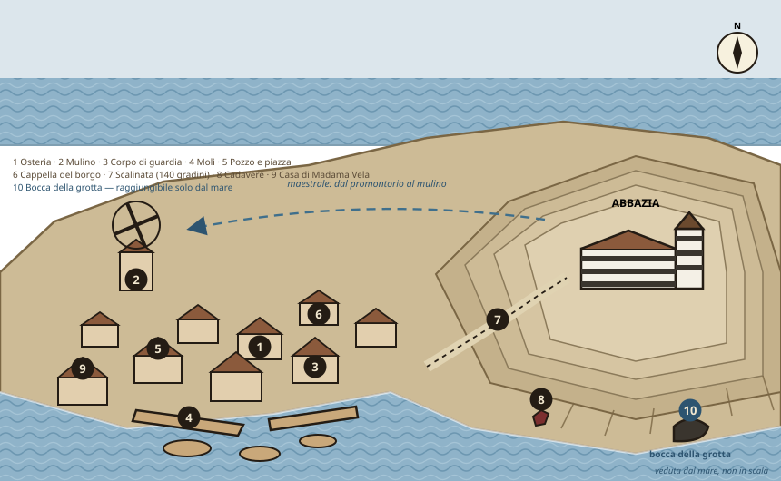
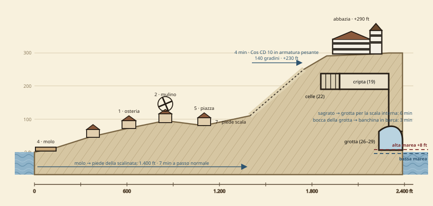

# Appendice A — I corsari, il borgo e il livello 0

*Complemento a *L'Abbazia della Rotta Sicura* — fazione corsara espansa, due nuove tavole del promontorio, chiave completa delle aree 1–17*

{{note
**Da usare con:** il documento principale
**Aggiunge:** 17 aree descritte, 10 luoghi del borgo, 4 PNG corsari
**Sostituisce:** Tavola I e blocco «Il conto che non torna»
}}

{{note
⚠ **Errata sul documento principale.** Due correzioni che cambiano il gioco, non solo il testo:
- **Naspo (cella 5) non è un prigioniero neutro.** Nel testo originale era «un mozzo catturato in mare». Da qui in avanti è un **mozzo della *Zanna di Bruma***, venduto all'abate da Ostro il Muto all'insaputa del capitano. È l'ordigno che spacca la ciurma. Se hai già giocato l'Atto III con la versione vecchia, Naspo può semplicemente *riconoscere* i corsari quando arrivano in G26: funziona uguale.
- **La fune delle campane (A7) è tagliata.** Il documento principale dava per scontato che si potesse suonare. Non si può, e il perché è un indizio (vedi A7).
}}

## Tavola I-a — Il promontorio, veduta dal mare

## Tavola I-b — Profilo laterale: quote, distanze e tempi

{{note
**Perché due tavole e non una.** La I-a serve ai giocatori: si mostra, si guarda, comunica il colpo d'occhio e rivela che esiste una bocca di grotta sul mare. La I-b serve a te: quote, distanze e tempi sono gli unici numeri che ti permettono di dire *no, non ci arrivate in tempo* senza inventare. **Tieni la I-b coperta.**
}}

## Chiave dei luoghi del borgo

#### B1 Osteria La Gomena Rotta

> *Sala bassa, travi incatramate, e sopra il bancone una gomena spezzata inchiodata al muro come un trofeo. Nenno Braca non chiede mai chi siete. Chiede quanto restate.*

**Nenno Braca**, oste, umano esperto 4. Non è amico di nessuno e per questo sa tutto. Vende dicerie a 5 mo l'una e non ha mai mentito a un cliente pagante — è il suo unico principio.

{{note
**Dicerie:** Nenno regala le voci 1, 2 e 8 senza tiri. Per le altre serve **Raccogliere Informazioni CD 12** (2 ore, 5 mo) o pagarlo direttamente. **Osservare CD 14:** in un angolo ci sono tre boccali capovolti su un tavolo che nessuno occupa. Nenno li tiene lì per i corsari. Chiedendoglielo, mente male: **Percepire Intenzioni CD 10**. **Il letto:** 5 mo a notte. Chi dorme qui con vento di maestrale sente il coro (Ascoltare CD 16, +4 se una finestra è aperta a ponente).
}}

#### B2 Mulino Cassola

**Berto Cassola**, mugnaio, e sua moglie **Nadia**. Non dormono da tre settimane. Berto è oltre la paura: è arrivato alla rabbia, e chiederà ai PG di portarlo con loro. **Lasciaglielo chiedere e lasciaglielo negare** — è il modo più rapido per far capire al tavolo che il borgo non può risolversi da solo.

{{note
Vedi il documento principale per la meccanica del coro e delle sette note. **Aggiunta:** Berto ha una **mappa dei venti** disegnata a carbone su una tavola, con nove anni di annotazioni. **Sopravvivenza CD 12** incrociando le date: i lamenti si sentono **solo nelle notti di luna nuova**. È il modo più pulito per far capire al tavolo che c'è una cadenza mensile, e stanotte è luna nuova.
}}

#### B3 Corpo di Guardia

**Dama Orsola Rive**, capoguardia, umana guerriero 5, e quattro guardie (guerriero 1). Il presidio copre un borgo che non ha mai avuto problemi: le guardie sono pescatori con una lancia.

{{note
**Cosa può darti Orsola:** 300 mo d'ingaggio, l'uso del corpo di guardia come base, e — **solo dopo aver visto le brutte copie delle lettere (A16)** — due guardie in appoggio. Non salirà mai all'abbazia senza una prova che possa mostrare a un magistrato: è una funzionaria, non un'eroina. **Se i PG le portano Cinzia viva**, li segue ovunque e chiede di essere presente all'arresto. **Se le portano il registro con undici nomi sotto i dodici anni**, smette di essere una funzionaria.
}}

#### B4 Moli e barche

**Vecchio Scàbbio**, barcaiolo, umano esperto 3, sordo da un orecchio e furbo da entrambi.

{{note
**La via di mare.** Scàbbio noleggia una lancia a 20 mo, 50 se capisce che si va verso il capo, e **non ci va di notte a nessun prezzo** — a meno di Diplomazia CD 22 o 200 mo. Da lì la **bocca della grotta (10)** è a tre minuti di voga. **Questa è la seconda via d'ingresso al livello −2** e taglia fuori l'intera abbazia: il gruppo può arrivare in G26 senza mai entrare in chiesa. Costo: nessun prigioniero liberato, niente registro, e lo scenario finale peggiore. **Non impedirla. Falla costare.** **Sapienza (locali) o Professione (marinaio) CD 13:** le barche del borgo sono tutte tirate a secco nelle notti di luna nuova. Nessuno lo ha deciso: si fa e basta.
}}

#### B5 Pozzo e piazza

Il cuore del borgo. Di giorno mercato, di sera vuota. Sul muro del pozzo, incise da mani diverse in anni diversi, ci sono ventidue croci di marinaio.

{{note
**Osservare CD 12:** le ultime tre croci sono recenti e più piccole delle altre. **Chiedendo in giro (gratis):** le fanno le madri delle Ancelle. Nessuna sa dire perché lo fa. È il gesto che il borgo compie al posto di un funerale che nessuno gli ha concesso.
}}

#### B6 Cappella del borgo

Una stanza sola, con una barca rovesciata al posto dell'altare. **Sempre aperta.** Ci scende **Fra' Timoteo** tre volte a settimana a dire messa, perché l'abbazia — dice — è troppo faticosa per i vecchi.

{{note
**Il contrasto è l'indizio.** La cappella del borgo non chiude mai; la chiesa dell'abbazia non apre mai. Se il tavolo non lo nota, fallo dire a una vecchia sui gradini. Timoteo qui è disponibile, cordiale e completamente all'oscuro. Da lui si ottiene gratis: il nome dell'abate, l'orario delle funzioni (sempre dopo il tramonto), e l'ammissione che «le Ancelle nuove restano in clausura il primo anno». **Percepire Intenzioni CD 5:** ci crede davvero.
}}

#### B7 La Scalinata

Centoquaranta gradini scavati nella roccia, senza parapetto sul lato mare, con tre pianerottoli.

{{note
Salita: 4 minuti a passo normale; **Costituzione CD 10** per chi porta armatura pesante, altrimenti *affaticato* in cima. Scendere portando un prigioniero indebolito: velocità dimezzata, **Equilibrio CD 12** ai pianerottoli se piove. **Come zona d'inseguimento** (prove contrapposte di Corsa/Equilibrio), mai come arena d'iniziativa. **Osservare CD 15** sul secondo pianerottolo: la pietra è scheggiata e c'è un lembo di stoffa incastrato. È il punto da cui è caduta Madre Ilaria — e le schegge sono orientate verso l'alto: è stata spinta.
}}

#### B8 Il punto del ritrovamento

Base della scogliera, raggiungibile a piedi con la bassa marea (**Scalare CD 10**) o in barca.

{{note
**Guarire CD 15:** fratture da caduta, non da annegamento — è caduta viva. **Guarire CD 20:** segni di dita sulle caviglie, troppo lunghe per una mano umana. Sono di Marèa. **Cercare CD 18** fra gli scogli: la chiave della sacrestia (A6), che Madre Ilaria aveva sottratto. Chi la trova entra in chiesa senza scassinare.
}}

#### B9 Casa di Madama Vela

Nuova, con le imposte dipinte, in un borgo dove nessun altro ha imposte dipinte. **Madama Vela**, reclutatrice, umana adepto 4.

{{note
**Intimidire CD 18** o **Raggirare CD 20**: crolla e confessa di essere pagata a testa. Non sa cosa succede alle Ancelle e non ha mai voluto saperlo. **Conseguenza obbligatoria:** se viene interrogata e lasciata libera, **avvisa l'abbazia entro un'ora** e l'orologio della notte avanza di due passi. Se viene consegnata a Orsola, non avvisa nessuno ma il borgo saprà entro sera che i PG stanno indagando — e l'abate ha orecchie al borgo. **Cercare CD 15** in casa: 280 mo, e una borsa con nove ricevute firmate dall'abate, una per ogni Ancella. **Sono la prova documentale alternativa al registro.**
}}

#### B10 La bocca della grotta

Un arco nero alla base della scogliera, sul versante di levante. Visibile solo dal mare.

{{note
Con l'alta marea l'apertura si riduce a due piedi sopra il pelo dell'acqua: passa una lancia a remi con gli uomini sdraiati, non una barca a vela. Con la bassa è larga dodici piedi. **Professione (marinaio) CD 15** per entrare senza urtare; fallendo, 1d6 alla barca e rumore (l'orologio avanza di un passo). **Il fanale di segnalazione** è issato su un palo appena dentro l'imboccatura. Chi conosce il codice — tre lampi lunghi, due corti — può **convocare la lancia dei corsari quando vuole**. È una delle tre leve sulla fazione corsara.
}}

### Dicerie aggiuntive sui corsari (1d6, alla Gomena Rotta)

| d6 | Diceria | Vero? |
|---|---|---|
| 1 | Il capitano aveva una patente regolare, e gliel'hanno tolta per una nave che non doveva affondare | Vero — è il perno del personaggio |
| 2 | La sua ciurma non scende mai a terra tutta insieme: sei restano sempre a bordo | Vero |
| 3 | Ne ha buttato uno in mare due anni fa, davanti a tutti, e da allora nessuno gli parla dietro | Vero — è Tiberio |
| 4 | Paga in argento vecchio, di conio che non si vede da cinquant'anni | Falso — paga in oro nuovo, ed è questo che dovrebbe insospettire |
| 5 | Ha una donna a bordo che sa leggere e tiene i conti meglio di un banchiere | Vero — è Sedda |
| 6 | I suoi uomini non entrano nella grotta oltre la banchina. Nemmeno lui | Vero — e vale come regola meccanica |

## La fazione corsara — *Zanna di Bruma*

Nel documento principale i corsari avevano una funzione (il cuneo dello scenario C) e nessuna vita. Qui hanno tre cose che li rendono giocabili: **un debito**, **una frattura interna** e **una superstizione con effetto meccanico**.

### Cosa vuole davvero Malaluna

Non l'oro. La **patente corsara**. Ghebro Malaluna era un corsaro regolare al servizio di una città costiera; nove anni fa affondò una nave che secondo il suo mandato non doveva affondare, e la patente gli fu revocata. Da allora è un pirata, cioè un uomo che può essere impiccato invece che processato. Ha quarantasei anni, una nave che ha bisogno di carenaggio, ventisei uomini da sfamare e nessun porto in cui entrare alla luce del sole.

Il commercio con l'abbazia è l'unica linea che rende abbastanza da tenere la *Zanna* in mare. E Malaluna si è raccontato una storia per poterlo fare: **l'abate gli mostra ogni mese dei contratti firmati**. Consacrati che si vendono per debito, indenturati, gente che ha scelto. Malaluna sa leggere poco e firma tutto. È un uomo che ha bisogno che le carte siano vere, e per questo **ha smesso di scendere sottocoperta a guardare il carico**.

{{note
⚠ **La leva psicologica, in una riga:** Malaluna non va convinto che l'abate sia un mostro. Va costretto a guardare. Ogni approccio che gli mette davanti una *persona* invece di un argomento funziona meglio di venti punti di Diplomazia.
}}

### Il cast della ciurma

{{note
**Ghebro Malaluna — capitano** Umano guerriero 6/ladro 2 · **GS 8** · NM · 46 anni
**PF** 58 · **CA** 20 · **Att** sciabola +1 +13/+8 (1d6+6, 18-20) e pugnale +11 (1d4+2)
**TS** Temp +8, Rifl +8, **Vol +3** · attacco furtivo +1d6, schivare prodigioso
**Abilità** Professione (marinaio) +12, Intimidire +11, Percepire Intenzioni +6, Raggirare +5
**Legame:** la *Zanna di Bruma* e i ventisei uomini che ci stanno sopra.
**Difetto:** ha bisogno che i documenti siano in regola per continuare a dormire.
**Non sa:** che l'abate è un non-morto; che Ostro ha venduto Naspo; che ciò che paga finisce in parte sull'altare e non sulla sua nave.
**Tattica:** combatte solo se accerchiato o tradito. Preferisce ritirarsi sulla lancia: ha già perso una nave, non ne perde un'altra per una rissa in una grotta. **Volontà +3 è il suo punto debole** in ogni senso.
}}

{{note
**Sedda Corvara — quartiermastro e navigatrice** Umana ladro 6 · **GS 6** · NN · 34 anni
**PF** 31 · **CA** 18 · **Att** stocco +7 (1d6+1, 18-20), balestra a mano +8 (1d4)
**Abilità** Cercare +11, Percepire Intenzioni +10, Diplomazia +9, Professione (marinaio) +11, Decifrare Scritture +8 · attacco furtivo +3d6
**La frattura.** Sedda tiene i conti della nave e, da otto mesi, **una seconda contabilità privata**: date, teste, cifre. Non per ricatto — per poter dimostrare un giorno di non aver voluto. Vuole scendere a terra e non sa come si fa a smettere di essere una pirata.
**Come ingaggiarla:** è l'unica della ciurma che parla per prima. Se i PG sbarcano in G26 senza attaccare, è lei che avanza. **Diplomazia CD 15**, o CD 10 se qualcuno le dice che il carico comprende bambini: lei lo sospetta già e sta aspettando che glielo dica qualcun altro.
**Cosa dà:** il suo registro (prova documentale n. 3, indipendente da abate e Vela), l'ora esatta della consegna, e — se convinta — **testimonia davanti alla ciurma**, che è ciò che conta davvero.
}}

{{note
**Ostro il Muto — nostromo** Umano barbaro 5 · **GS 5** · CM · muto per una ferita alla gola, non per nascita
**PF** 52 · **CA** 17 · **Att** ascia bipenne +11 (1d12+7, ×3) · ira 2/giorno
**TS** Temp +8, Rifl +2, Vol +2 · movimento veloce, schivare prodigioso
**Il problema.** Ostro pensa che Malaluna sia diventato debole e che la patente sia una fantasia da vecchio. Vuole la nave. Otto mesi fa ha **venduto Naspo all'abate di sua iniziativa**, incassando 200 mo e dicendo alla ciurma che il ragazzo era caduto in mare.
**Cosa succede se Naspo compare vivo davanti alla ciurma:** per il codice della *Zanna*, vendere uno dei propri è la sola cosa che si paga con la corda. Ostro attacca — non i PG: **Malaluna**, perché è l'unico modo che ha di arrivare vivo a domattina. La ciurma si divide in due metà uguali. **Questo è il singolo evento più potente che i PG possano innescare in tutta l'avventura.**
}}

{{note
**La ciurma** **A terra la notte della consegna:** Malaluna, Sedda, Ostro, 6 corsari (guerriero 3, GS 2) e 2 arcieri (ladro 3, GS 3).
**A bordo:** 16 marinai (esperto 1–2), non combattenti significativi. Non intervengono mai in grotta.
**Codice della Zanna** (Sapienza (locali) CD 12, o gratis da Nenno): tre regole sole — si divide in parti uguali, non si ruba a un compagno, **non si vende uno dei propri**. Il codice è l'unica cosa che questi uomini rispettino, e i PG possono usarlo come un'arma.
}}

### La superstizione, e la sua regola

{{note
**Nessun corsaro oltrepassa la banchina (26).** Non si avvicinano all'altare (27), non guardano l'acqua più a lungo del necessario, e se una delle Sorelle si mostra, la ciurma arretra verso la lancia senza ordine. Meccanicamente: **ogni corsaro che si trovi entro 6 metri da una megera è *scosso*** (−2 a tiri per colpire, TS e prove) finché non si allontana. Malaluna e Ostro sono esenti; Sedda no, e lo sa.
**Uso tattico per i PG:** attirare le megere sulla banchina neutralizza metà della forza corsara senza colpire nessuno. Un ladro con Sapienza (locali) può dedurlo osservando come si dispongono gli uomini.
}}

### La nave

| Voce | Dato | Uso in gioco |
|---|---|---|
| Tipo | Brigantino a due alberi, 90 ft | Troppo grande per la grotta: entra solo la lancia |
| Equipaggio | 26 (10 a terra la notte della consegna) | Il grosso della forza non partecipa mai |
| Ancoraggio | Cala a mezzo miglio a nord del capo, senza fanali | Osservare CD 18 dalla loggia (A8) di notte: una sagoma senza luci |
| Armamento | 2 baliste leggere | Irrilevanti in grotta. Rilevanti se i PG tentano un abbordaggio: non farlo, non è questa avventura |
| Stato | Scafo che ha bisogno di carenaggio da due anni | Ragione economica del commercio con l'abbazia; argomento di trattativa |
| Lancia | A remi, 8 posti | Unico mezzo che entra in G29 |

### Le tre leve — e cosa serve per tirarle

| Leva | Cosa serve | Effetto |
|---|---|---|
| **Naspo vivo** | Liberarlo dalla cella 5 e portarlo dove la ciurma lo veda | Ostro si ammutina contro Malaluna. La forza corsara si divide 5/5 e smette di essere un problema dei PG |
| **Sedda persuasa** | Diplomazia CD 15 (CD 10 se le si parla dei bambini), oppure mostrarle il registro dell'abate | Testimonia davanti alla ciurma. Malaluna perde la copertura documentale su cui regge la sua storia. Scenario C |
| **Tiberio manifestato** | Convincere il fantasma (C24) a salire in G26 | La ciurma vede l'uomo che Malaluna ha ucciso. −4 al morale, i corsari non attaccano per 1d3 round. **Ma Tiberio pretende che Malaluna muoia:** se i PG lo tradiscono, lo scenario C si chiude |

### Reazione di Malaluna (tira 1d20 + modificatori)

| Modificatore | Valore |
|---|---|
| I PG hanno attaccato per primi | −10 |
| I PG mostrano il registro dell'abate o le ricevute di Vela | +4 |
| Sedda ha già parlato | +6 |
| Naspo è presente e vivo | +8 |
| I PG offrono di testimoniare per il ripristino della patente | +5 |
| I PG offrono solo oro | −2 (lo insulta) |
| Un prigioniero è già a bordo della lancia | −3 |

| Risultato | Reazione |
|---|---|
| ≤ 5 | **Ostile.** Attacca per coprire la ritirata verso la lancia. Scenario A o B |
| 6–12 | **Esita.** Ordina di non attaccare e chiede una prova. Concede un round di parole. Se i PG non hanno niente, torna ostile |
| 13–18 | **Guarda.** Scende sottocoperta della lancia e apre il carico. Da questo momento non lavora più per l'abate. Neutrale |
| ≥ 19 | **Si volta.** Scenario C: i corsari combattono a fianco dei PG contro l'abate e le megere |

### Cosa fanno i corsari negli altri finali

- **Se l'abate è già morto quando arrivano:** Malaluna capisce che la fonte è finita. Non combatte, tratta. Vuole i prigionieri come merce o un compenso per il viaggio a vuoto. È qui che nasce il finale «il patto».
- **Se i PG hanno ucciso Ostro prima:** la ciurma è più compatta e più leale a Malaluna. Reazione −3 a tutti i tiri, ma nessun ammutinamento.
- **Se i PG non li incontrano affatto** (via mare, tempi sbagliati, abate distrutto di giorno): la *Zanna di Bruma* arriva, non trova nessuno, riparte. Nella coda dell'avventura, tre settimane dopo, c'è una nave che risale la costa cercando chi le ha chiuso la linea di rifornimento.

## Chiave delle aree — Tavola II, livello 0

**La chiesa (1–9) è chiusa a chiave dall'alba al tramonto. La canonica (10–17) è aperta.** Questa è la separazione che struttura l'Atto II: i PG possono girare mezza abbazia legalmente e si sbatteranno contro una porta chiusa a metà indagine.

#### A1 Sagrato

> *La scalinata finisce su una piattaforma di pietra battuta. Da tre lati non c'è niente: solo il vuoto e novanta piedi d'aria salata. La chiesa vi si posa sopra a fasce bianche e nere, e le porte sono chiuse.*

Area aperta, 40×15 ft, parapetto alto 3 ft sul lato mare.

{{note
**Vento:** −2 Ascoltare, −2 attacchi a distanza oltre 30 ft. **Parapetto:** copertura +4 CA. **Caduta:** 90 ft, 4d6 non letali in acqua più Nuotare CD 15. **Osservare CD 14:** il selciato davanti alle porte è consumato in due solchi paralleli larghi tre piedi. Qui si trascina qualcosa di pesante, regolarmente, e non verso l'interno. **È l'arena dello scontro finale nello scenario A.** Se i PG ci arrivano di notte, la fuga è solo verso il basso.
}}

#### A2 Portico

Vano voltato di 30×10 ft davanti al portale.

{{note
**Portale:** due battenti borchiati. Chiuso di giorno. Scassinare CD 22, durezza 5, 20 pf, Rompere CD 23. La chiave è in sacrestia (6) o fra gli scogli (borgo, B8). **Acquasantiera:** asciutta e incrostata di sale. **Sapienza (religione) CD 12:** non è evaporata, è stata svuotata e riempita d'acqua di mare. Chi ci intinge le dita si sporca soltanto. **Osservare CD 18:** l'architrave ha graffi profondi e paralleli, tutti diretti dall'interno verso l'esterno.
}}

#### A3 Navata

> *Sei colonne a fasce alterne di marmo bianco e ardesia nera. Le panche sono lucide d'uso, la polvere sul pavimento è zero, e non c'è una sola candela accesa.*

40×35 ft, volta a 30 ft, sei colonne.

{{note
**Colonne:** copertura +4 CA, interrompono la linea di vista. **Vetrata sud:** durezza 1, 3 pf; frantumarla apre un varco sulla loggia (8) e fa 1d4 a chi la attraversa in movimento. **Osservare CD 13:** c'è una sola sedia con schienale alto, addossata alla colonna più lontana dall'ingresso, orientata verso il portale e non verso l'altare. Chi ci siede guarda chi entra. **Incontro notturno (EL 5):** 6 scheletri fra le panche, immobili finché qualcuno oltrepassa la terza coppia di colonne. Di giorno la navata è vuota e sicura.
}}

#### A4 Presbiterio

Il nucleo antico. L'altare poggia sulla roccia viva. Alle spalle, una statua del Nocchiero alta sette piedi, con la mano tesa verso il mare.

{{note
**Area profanata** (effetto permanente di *profanare*): non-morti +1 a attacchi, danni e TS, +2 pf per DV; scacciare a −3 al livello effettivo. **Comunicalo al chierico appena entra** — un chierico che scopre di essere depotenziato solo tirando è un chierico frustrato. **La statua, Osservare CD 12:** il volto e la mano tesa sono corrosi dal sale come se stessero in mezzo alle onde, mentre il resto è intatto. Qualcuno ci versa sopra acqua di mare, spesso. **Cercare CD 20 sotto la mensa:** una spirale concentrica incisa nella roccia viva, molto più antica dell'altare che la copre. **Riconsacrare** l'area richiede *consacrare* o un rito di 10 minuti con acqua santa e Sapienza (religione) CD 20. **Vale la pena farlo prima di scendere:** annulla i bonus dei non-morti in tutta la chiesa.
}}

#### A5 Abside

Una trifora gotica aperta sul vuoto, novanta piedi sopra l'acqua.

{{note
**Osservare CD 22** (CD 18 con luce radente): sotto l'intonaco affiora un bassorilievo che non è del Nocchiero — una figura femminile che emerge dalle onde, il volto scalpellato via. **Sapienza (storia) o (religione) CD 20:** l'abbazia è stata costruita *sopra* qualcosa, non *per* qualcosa. **Osservare CD 18 di notte verso nord:** a mezzo miglio, una sagoma senza fanali. È la *Zanna di Bruma* alla fonda.
}}

#### A6 Sacrestia

20×15 ft. Armadi, un leggio, il registro dei defunti.

{{note
**Cercare CD 16:** nell'armadio di fondo ci sono **quattro sai da ancella ancora umidi di acqua salata**, piegati con cura. Non piove da nove giorni. **Cercare CD 20:** la chiave della grata del vestibolo (C18) e quella del portale. **Registro dei defunti:** 10 minuti di lettura. Conferma l'esistenza della cripta. L'ultima pagina elenca trentaquattro nomi con una sola data — il naufragio della *Santa Croce*, sessant'anni fa. **Trappola se il culto è allertato:** ago avvelenato sull'armadio, Cercare CD 21, Disattivare CD 20, 1d6 For / 1d6 For, Tempra CD 12.
}}

#### A7 Campanile, base

15×15 ft, muri spessi 3 ft, scala a chiocciola.

{{note
**La fune delle campane è tagliata a dieci piedi d'altezza**, e il taglio è netto e recente. **Osservare CD 10** per notarlo, gratis se qualcuno prova a suonare. **Perché conta:** le campane erano l'allarme del borgo. Qualcuno ha deciso che l'abbazia non potesse più chiamare aiuto — o che nessuno potesse chiamarlo *da dentro*. Madre Ilaria ha tentato di suonarle la notte in cui è morta. **Ripristinarla:** Salire CD 15 e un'azione di round completo. Suonate, le campane si sentono al borgo: Orsola sale con quattro guardie in 12 minuti (vedi Tavola I-b). **E l'orologio della notte avanza di due passi.** È una scelta, non un pulsante gratuito. **Livelli superiori:** alloggio del custode, archivio, cella campanaria — vedi la Tavola III del documento principale.
}}

#### A8 Loggia sul Mare

15×30 ft, coperta, aperta sul precipizio fra quattro pilastri.

{{note
**Vento forte:** −4 agli attacchi a distanza; effetti di fuoco a distanza deviati al 50%. **Pilastri:** copertura +4. **Percorso di fiancheggiamento:** collega il campanile alla navata senza passare dal portico. Permette di aggirare l'incontro in A3. Lascia che funzioni. **Osservare CD 15 verso il mare con l'alta marea:** luci fredde si muovono *sotto* la superficie, in formazione. Sono skum al servizio delle Sorelle. **Sotto il terzo pilastro, Cercare CD 14:** una scarpa da bambino, di quelle che si portano da fermi, mai da camminare. È infilata nella fessura fra il pilastro e il parapetto, come se qualcuno l'avesse nascosta lì. *Descrivi l'oggetto e fermati. Non aggiungere niente.*
}}

#### A9 Cappella laterale

10×20 ft, una lastra tombale liscia al centro del pavimento, senza nome.

{{note
**Tre indizi ridondanti per la botola:** Osservare CD 12 (corrente d'aria fredda, le candele piegano tutte nello stesso verso); Cercare CD 15 (usura circolare attorno alla lastra); il registro dei defunti in B6. Senza nessun indizio: Cercare CD 25. **Aprire:** Forza CD 18, o CD 13 in due. Rumoroso: Ascoltare CD 5 in tutta la chiesa, e l'orologio avanza di un passo se qualcuno è sveglio.
}}

#### A10 Chiostro

> *Un cortile quadrato con un pozzo al centro e un portico su tutti e quattro i lati. È l'unico posto dell'abbazia in cui si veda il cielo e in cui qualcuno sorrida.*

30×30 ft a cielo aperto, colonnato perimetrale. Qui i PG incontrano Fra' Timoteo e le **nove Ancelle attuali** (adepto 1 e popolani 1, età 15–24).

{{note
**Le nove Ancelle sono vive, ignare e in pericolo.** Non sanno nulla, non hanno mai visto la chiesa aperta e credono che le altre siano partite per un altro santuario. **Diplomazia CD 14** con una di loro: «le nuove arrivano sempre di luna nuova, e la mattina dopo Madre Ilaria non c'era». **Il pozzo, Cercare CD 15:** l'acqua è salmastra. Un pozzo a 290 piedi sul livello del mare non dovrebbe esserlo. **Sapienza (dungeon) CD 16:** comunica con una cavità sottostante — e il fondo è a soli 40 piedi, non 290. **Uso tattico:** il pozzo è una via di discesa alternativa verso C19 (Scalare CD 15, corda necessaria). Stretta, silenziosa, e i PG possono trovarla da soli.
}}

#### A11 Refettorio

30×20 ft, tre tavole lunghe.

{{note
**Osservare CD 14:** la tavola è apparecchiata per **ventidue**. Nel dormitorio (13) i pagliericci sono **nove**. Se qualcuno lo fa notare a Fra' Timoteo, lui risponde con assoluta sincerità che si è sempre fatto così, e per la prima volta si sente dire una cosa che non sa spiegare. **È il momento in cui Timoteo diventa un alleato utilizzabile.** **Cercare CD 12:** sotto una panca, iniziali graffiate nel legno da mani diverse. Ventidue serie. Quattordici sono anche nel registro dell'abate, in colonna F o Z.
}}

#### A12 Cucina e dispensa

10×20 ft.

{{note
**Cercare CD 12:** le provviste ordinarie bastano per nove persone. Ma la dispensa contiene vino forte, spezie e zucchero di canna — merce da nave, non da borgo. **Sapienza (locali) o Valutare CD 14:** roba che si trova solo in porti che stanno a sei giorni di navigazione. Qualcuno riceve regali da chi viene dal mare. **Osservare CD 16:** il paiolo grande è annerito all'esterno in modo irregolare — è stato usato per portare acqua di mare, non per cucinare.
}}

#### A13 Dormitorio delle Ancelle

30×20 ft, nove pagliericci, ventidue cassette personali.

{{note
**Tredici cassette appartengono a persone che non ci sono più** e nessuno le ha svuotate. **Cercare CD 10** per aprirne una: un pettine, un nastro, una lettera cominciata e mai finita. **Prendere un oggetto da una di queste cassette abbassa a CD 13 la prova di Diplomazia per parlare con Madre Ilaria in C20.** Dillo per suggerimento, non per regola: descrivi la cassetta con il nome inciso e lascia che sia un giocatore a raccoglierla. **Cercare CD 18 sotto il quarto pagliericcio:** un coltello da cucina affilato su un lato solo, nascosto da qualcuno che aveva capito e non ha fatto in tempo.
}}

#### A14 Studio dell'Abate

10×20 ft. Uno scrittoio, due scaffali, una finestra che dà sul chiostro. **Chiusa a chiave** (Scassinare CD 20); Timoteo non ha la chiave e lo dice senza malizia.

{{note
**Cercare CD 20 — il registro.** Due colonne. Nomi e date d'ingresso; nomi, date e accanto una sola lettera: **F** o **Z**, con una cifra in monete. Trentuno nomi in nove anni. Undici righe riportano un'età sotto i dodici anni. *Questo è l'unico punto dell'avventura in cui compare questa informazione. Leggila come è scritta e passa oltre.* **Cercare CD 24 (o dopo aver trovato il registro, CD 15):** una cartella di contratti firmati con una croce. Sono i documenti che Malaluna riceve ogni mese. **Falsificare CD 12** per capire che sono tutti della stessa mano — la stessa delle lettere in A16. **Questa cartella è l'oggetto più prezioso dell'avventura**, e non vale una moneta: mostrarla a Malaluna vale +4 alla reazione.
}}

#### A15 Cella dell'Abate

> *La porta è sbarrata dall'esterno con un chiavistello, il che è strano perché di solito i chiavistelli servono a tenere qualcosa fuori. Dentro non c'è un letto. Le finestre sono murate, e la malta è stata stesa dall'interno.*

{{note
**Contenuto:** un cassone di legno lungo sette piedi, pieno di terra battuta mescolata a sabbia di mare. Nessun letto, nessuna candela, nessuno specchio. **Sapienza (religione) CD 15:** è un giaciglio da vampiro. **Aprirlo di giorno** significa trovare Padre Anselmo *inerte*: paletto di legno nel cuore (azione di round completo, tocco automatico), o trascinare il cassone al sole sul sagrato. **Questa è una vittoria legittima e va concessa senza penalità narrative.** Il costo lo paga il gruppo dopo: senza l'abate, le Sorelle e i corsari non si annullano a vicenda, e lo scontro in grotta diventa scenario D. **Se i PG ci arrivano di notte, il cassone è vuoto** — e questo, da solo, dice loro dov'è.
}}

#### A16 Scriptorium

10×20 ft, due scrittoi, calamai, risme.

{{note
**Cercare CD 16 — le brutte copie.** Trentuno lettere alle famiglie, in bella e in brutta, tutte della stessa mano. Alcune sono **datate prima** del giorno in cui l'Ancella sarebbe partita. **Falsificare CD 15** per confermarlo tecnicamente. **È la prova che convince Dama Orsola**, e quindi la prova che dà ai PG quattro guardie e una legittimità. **Cercare CD 20:** un foglio scartato con sette note musicali scritte in caratteri liturgici. Sono le stesse sette note del coro udibile al mulino, trascritte al rovescio.
}}

#### A17 Scala di servizio

Chiocciola stretta che scende al corpo di guardia (C23).

{{note
**Chiusa da una porta rinforzata**, Scassinare CD 22, chiave addosso all'abate. **Ascoltare CD 15** con l'orecchio alla porta: passi regolari, due volte al giorno, e una voce che conta ad alta voce fino a cinque. **Attenzione:** è la via *rapida* al livello −1, ma sbuca **dentro** il corpo di guardia, in mezzo a quattro corsari e a Grinza. La botola in cappella (9) è più lenta e infinitamente più sicura. Se il gruppo sceglie questa, non avvertirlo: l'informazione c'è ed è in C21 (le ciotole) e in A6 (la chiave della grata). Chi non indaga paga.
}}

## Modi di fallimento — fazione corsara e livello 0

| Modo di fallimento | Sintomo | Causa | Mitigazione |
|---|---|---|---|
| **I corsari restano comparse** | Otto sagome che tirano d'iniziativa e muoiono | Nessuna leva tirata prima dell'Atto IV | Sedda avanza per prima e parla, sempre, in ogni scenario tranne A. Un round di dialogo è garantito |
| **Naspo mai liberato** | La leva più forte non si attiva | Cella 5 in fondo al corridoio, liberata per ultima o mai | Naspo è l'unico che urla quando sente aprirsi la grata: Ascoltare CD 5 dal vestibolo. Sorella Bertrada lo nomina se liberata prima |
| **Malaluna ucciso al primo round** | Sparisce l'intera trattativa, resta uno scontro | Party che apre il fuoco su un pirata a vista | Malaluna entra in scena **disarmato, con le carte in mano**, al passo 4. Chi spara a un uomo che tiene dei documenti lo fa consapevolmente |
| **La via di mare bypassa metà avventura** | Il gruppo noleggia una barca e salta all'Atto IV | La bocca della grotta è troppo comoda | Scàbbio non ci va di notte sotto CD 22 / 200 mo. Chi ci arriva comunque trova lo scenario A: nessun prigioniero, nessuna prova, nessun alleato. È una scelta, e ha un prezzo visibile |
| **La chiesa chiusa blocca l'Atto II** | Il gruppo sbatte contro il portale e si ferma | Un'unica serratura CD 22 | Tre vie: chiave in sacrestia via canonica, chiave fra gli scogli (borgo 8), pozzo del chiostro (Scalare CD 15). Timoteo, se convinto, apre lui |
| **Le nove Ancelle vive vengono dimenticate** | Muoiono fuori campo o restano un dettaglio | Non sono un obiettivo dichiarato | Se lo scontro finale si accende, l'abate manda a prenderle. Chi non le ha messe al sicuro se le ritrova come ostaggi |
| **Timoteo usato come chiave e poi scartato** | PNG interessante consumato in due minuti | Serve solo ad aprire porte | Al passo 5 dell'orologio Timoteo capisce da solo, e la sua reazione — restare o denunciare — è una scena. Non risolverla tu |
| **La scarpa in B8 diventa una scena** | Il tavolo si raggela | Descrizione insistita | Una frase, l'oggetto, silenzio. Se nessuno reagisce, si va avanti: non è un indizio necessario |

## Decisioni di progettazione (aggiunte)

{{note
**ADR-06 — I corsari sono la fazione recuperabile, non la fazione debole.**
*Contesto:* tre nemici tutti irriducibili producono una sola linea di gioco, il combattimento.
*Decisione:* Malaluna ha un movente (la patente), una copertura psicologica (i contratti falsi) e una frattura interna (Ostro). Le megere e il vampiro restano irriducibili.
*Conseguenze:* il tavolo ha una fazione con cui si può parlare, e la trattativa diventa una via al successo tanto quanto l'acqua corrente. Il prezzo è che devi tenere traccia della tabella di reazione e non decidere in anticipo da che parte starà.
}}

{{note
**ADR-07 — La superstizione della ciurma come regola, non come colore.**
*Decisione:* nessun corsaro supera la banchina; ogni corsaro entro 6 m da una megera è *scosso*.
*Conseguenze:* i PG possono neutralizzare metà della forza nemica manovrando invece che combattendo, e possono *dedurlo osservando*. In cambio, G27 diventa uno spazio in cui restano solo i mostri e i PG: la geometria dello scontro finale è fissata da questa regola.
}}

{{note
**ADR-08 — Due tavole del promontorio con destinatari diversi.**
*Decisione:* I-a per i giocatori (colpo d'occhio, rivela la bocca della grotta), I-b per il DM (quote, distanze, tempi).
*Conseguenze:* l'orologio della notte diventa arbitrabile con dei numeri invece che a occhio. Costo: due tavole da mantenere allineate se cambi la topografia.
}}

{{note
**ADR-09 — La cella dell'abate resta una scorciatoia vincente.**
*Contesto:* aprire il cassone di giorno salta l'intero scontro finale con il GS 9.
*Decisione:* la scorciatoia resta, senza penalità narrative, ma cambia lo scenario finale in D e toglie l'abate come contrappeso alle megere.
*Conseguenze:* l'indagine viene premiata in modo tangibile. Se ti sembra che «rovini l'avventura», è il segnale che l'avventura si reggeva sul boss e non sull'indagine — e non è così.
}}

### Licenze — nessuna variazione

Tutto il materiale aggiunto è SRD 3.5 / OGL 1.0a: guerriero, ladro, barbaro, esperto, popolano, adepto. Nessuna creatura nuova. Le due tavole sono SVG originali, nessun asset di terzi. **Restano fuori**, come nel documento principale, ogni nome di divinità o toponimo di Faerûn: il Nocchiero, la Signora del Frangente, Vènere Bassa e la *Zanna di Bruma* sono invenzioni di questo testo e non hanno vincoli.

— *Malaluna non chiede mai cosa c'è nelle casse. Chiede se le carte sono in ordine, e le carte sono sempre in ordine.* —
