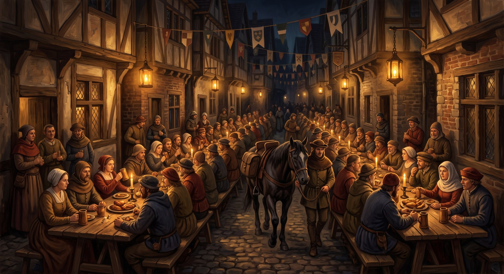
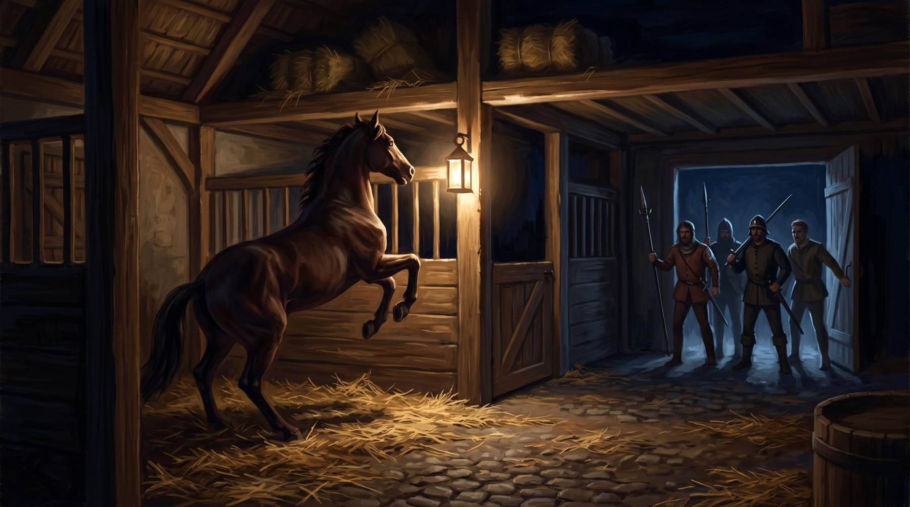

# Giorno 2 — I Partiti e la Cena

**Sessione 2 di 3 · 3–4 ore**
Serve: questo file, `REGOLE-DELLA-CORSA-PF1E.md` §3 e §4, `STATBLOCCHI-PF1E.md`
§2–§4, la mappa delle stalle (`ALLEGATI/mappe/tarsilia-stalle.md` e l'SVG in
`rendered/`).

| § | Cosa |
|---|---|
| 0 | Quickstart della serata |
| 1 | Mattino: le prove in pista |
| 2 | I Partiti — il mercato del grano |
| 2-bis | La tavola di fuori (dove stanno i cinque mentre Vanna tratta) |
| 3 | Il duello dei canti |
| 4 | La Cena della vigilia |
| 5 | L'uomo con la fascia grigia (beat di Nocca) |
| 6 | Notte: l'assalto alle stalle |
| 7 | Chiusura, px, **4° livello**, ponte |
| 8 | Contingenze |

---

## §0 · Quickstart della serata

**Il problema della serata**: da qui in avanti la contrada non può più vincere da
sola. Servono patti — e ogni patto costa qualcosa che i PG credono di potersi
permettere.

**Il colpo della serata**: alle stalle, dopo mezzanotte. Non vengono a uccidere il
cavallo: vengono a **rovinargli i garretti**, che è peggio, perché un cavallo zoppo
si può ancora far correre e nessuno se ne accorge finché non cade in curva.

**Come finisce**: con i PG in piedi in una stalla e qualcosa di rotto. Poi il **4°
livello**.

**Contatori all'inizio**: quelli usciti dal Giorno 1.

---

## §1 · Mattino — le prove in pista

Mezz'ora di tavolo, non di più. La Ruota è aperta ai fantini per due giri di prova
a contrada; c'è mezza città sui gradini a guardare gratis.

**Cosa ci si guadagna** — Nocca (o chi corre) fa **una** prova di Cavalcare CD 15:

- **Successo**: ha preso le misure. **+1** a tutti i tiri della Curva Nord in Corsa.
- **Successo di 10+**: anche **+1** alla Curva Sud, e capisce una cosa sul proprio
  cavallo che nessun altro sa *(scegli tu cosa: scarta a destra, non parte se non
  sente il tamburo, si calma se gli parli sotto voce)*.
- **Fallimento**: niente. E la piazza lo ha visto sbandare.
- **Fallimento di 5+**: cade in prova. Nessun danno serio, **Morale −1**, e da questo
  momento tre osterie danno l'Istrice per ultimi.

**Ombra, in contemporanea**: Addestrare Animali CD 14 per capire in che stato è
davvero il cavallo. Riuscendo, sa che ha bisogno di **ferri nuovi** — 12 mo dal
maniscalco della Torre, che li fa bene, o 4 dal maniscalco del Bruco,
che li fa in fretta. *(Il secondo li fa storti. Non per malizia: ha ottant'anni.)*

**Chi altro c'è in pista**: Barbanera prova due volte e se ne va; il fantino della
Oca prova sei volte e fa il tempo migliore; Peleo Vanni misura le curve con
una corda annodata e prende appunti, e se i PG gli hanno pagato le 150 mo, adesso è
il momento in cui consegna il foglio.

---

## §2 · I Partiti — il mercato del grano

Mezzogiorno. Gli otto Capitani entrano nel mercato coperto del grano, che per un'ora
è chiuso a chiunque altro. La milizia sta alle porte e non lascia entrare nemmeno i
tenenti.

> **Read-aloud (lead: Game of Thrones — il tavolo come campo di battaglia).**
>
> *Dentro fa fresco e c'è odore di grano vecchio, che è un odore dolce e un po'*
> *marcio. Le bilance grandi sono state coperte con dei teli, e sui teli qualcuno ha*
> *appoggiato otto boccali. Nessuno si siede. Sedersi vorrebbe dire aver deciso da*
> *che parte del tavolo stare.*
>
> *Attu parla per primo e parla di piogge. Barbanera non lo guarda. Vesca arriva per*
> *ultima e si mette vicino alla porta, il che vuol dire che ha già fatto i suoi*
> *conti fuori.*
>
> *Poi qualcuno dice: «Allora?» — e comincia.*

### Come si gioca

**Cinquanta minuti, e il timer è in-fiction.** Metti una sveglia da cucina: quando
suona, **la campana di mezzogiorno chiude il mercato del grano** e i Capitani escono,
patti o non patti. Non è una scorciatoia del DM: è il regolamento del Drappo, e i
giocatori possono usarlo a loro favore tirando per le lunghe.

Il Capitano dei PG (Vanna) è dentro; gli altri cinque sono fuori — e **fuori
succedono cose adesso, non dopo**: il duello dei canti del §3 comincia **in
parallelo**, nelle osterie, mentre la trattativa è in corso.<!-- storico --> *(Playtest alfa, serata
2: con i Partiti giocati in blocco, cinque giocatori sono rimasti fuori scena per
settantadue minuti.)*<!-- /storico -->

> ⚠️ Se il tavolo ha sei giocatori e ne isoli uno per un'ora, hai perso la serata.
> Taglia ogni cinque minuti: dentro / fuori / dentro. Tesio può ascoltare da fuori
> con *individuazione dei pensieri* (ma la parete è di pietra: serve la porta aperta,
> cioè serve che qualcuno la faccia aprire).

**Dove stanno i cinque fuori**: a una tavola sotto il portico, descritta nel
§2-bis. Il taglio di cinque minuti è una sua regola, e a farlo è l'uomo che la
regge.

**Le tre offerte sul tavolo** (dettaglio in `CONTRADE-DI-TARSILIA.md` §3):

| Chi | Chiede | Offre | La trappola |
|---|---|---|---|
| **Attu** (Oca) | ostacolare l'Onda alla curva nord | cancella un terzo del debito | vale **solo se l'Oca arriva prima**. Percepire Intenzioni CD 20 per accorgersene, oppure **leggere il foglio** — che è lì, e nessuno lo legge mai |
| **Barbanera** (Onda) | niente, se non che l'Istrice non aiutino Attu | scorta ai battellieri per il cavallo e la stalla, stanotte | mantiene alla lettera e non oltre: se il patto dice «alla stalla», al fantino non ci pensa nessuno |
| **Vesca** (Bruco) | il ritiro, ancora | il contratto di ieri, immutato | nessuna. E questo è il problema |

**Meccanica**: `REGOLE-DELLA-CORSA-PF1E.md` §4. Ogni patto stretto **si scrive su un
foglietto** e resta al centro del tavolo fino alla fine del modulo.

**Le altre quattro contrade** trattano fra loro anche se i PG non fanno niente. Al
termine dell'ora, annuncia due patti che sono stati stretti senza di loro:

1. **Torre ↔ Drago**: si lasciano strada a vicenda. Innocuo.
2. **Oca ↔ Civetta**: Attu ha comprato qualcosa. Non si sa cosa.
   *(È l'informazione su Nocca. Emerge in §5.)*

**Se i PG non stringono nessun patto**: legittimo, e va premiato con la sola cosa che
la solitudine dà — **nessuno può tradirli**. Morale **+1**, e in Corsa nessuna
contrada ha un obbligo verso di loro, ma nemmeno un motivo per prenderli di mira per
primi.

---

### §2-bis · La tavola di fuori

**A cosa serve.** Nel playtest alfa, coi Partiti giocati in blocco, cinque giocatori
sono rimasti fuori scena per settantadue minuti. Il §2 li manda al duello dei canti e
vuole un taglio ogni cinque minuti, ma non dice dove stanno quando sono fuori. Stanno
qui: a una tavola, con un uomo che la regge e una regola che fa da sola il lavoro del
timer da cucina. Ogni cinque minuti la tavola si rimescola, e il taglio cade nel mondo
invece che nella voce del DM.

**Si gioca solo se serve.** Se i Partiti scorrono e nessuno si annoia, salta tutto: il
timer del §2 basta. Quando la si gioca, dura **un taglio per volta e mai di più**, e non
allunga la serata: la fascia 0:30-1:20 di `07-GUIDA-DM-PASSO-PASSO.md` §4 resta quella.

> **Read-aloud (lead: Andor — la macchina del regolamento).**
>
> *Sotto il portico hanno apparecchiato una tavola tonda per chi non può entrare.*
> *Dodici sedie, dodici tazze, e davanti a ogni tazza un cartellino col numero. La*
> *tisana è di salice e non è calda.*
>
> *A capotavola siede un uomo con un cappello da cerimoniere, di feltro, troppo alto*
> *per il portico. Tiene sul palmo una clessidra da cinque minuti e non la guarda: la*
> *ascolta. Appena prima dell'ultimo granello la gira.*
>
> *«Cinque minuti», dice. «Ne mancano sempre cinque. È il regolamento.»*
>
> *In fondo uno scrivano dorme col mento nell'inchiostro. Nessuno gli ha chiesto di*
> *svegliarsi.*

**Chi c'è.** Dodici sedie: i cinque PG fuori e un tenente per ognuna delle altre sette
contrade, senza nome (se serve, pescalo da `09-KIT-ANTI-IMPROVVISAZIONE.md` §1). A
capotavola, e **mai spostato**, il Maestro di Tavola.

- **Il Maestro di Tavola** è il funzionario che applica il regolamento di `09-KIT` §3
  (esperto 2, Sapienza nobiltà +6, Diplomazia +5), ed è lo stesso uomo che si rivede
  alla Cena. Parla come chi legge un'ordinanza anche quando chiede il sale. Dà del voi
  a tutti. Non si arrabbia e non si corrompe: si convince con una carta, e a questo
  tavolo la carta è **l'articolo giusto**. Il tic è quello del kit: cita il numero
  dell'articolo e lo sbaglia.
- **Lo scrivano che dorme** è della Civetta (`04-LUOGHI-E-INTRIGO.md` §4). Vedi *Il
  Dormiente*.

**Il regolamento.** Sta inchiodato a un pilastro del portico, a quattro passi dalla
tavola, in lettere piccole e fitte, coi numeri veri. Leggerlo non vuole una prova: ci
vogliono quattro passi e un minuto, e chi ci va lo racconta agli altri. È un Fatto, e
un Fatto non si tira.

| Il Maestro dice | Il pilastro dice | Che cosa fa al tavolo |
|---|---|---|
| «Articolo 9» | **Art. 5.** Al campanello tutti si alzano e prendono la sedia a sinistra. Le tazze restano dove sono. | **Ogni cinque minuti il tavolo si rimescola.** Il campanello lo suona lui quando gira la clessidra: è il taglio del §2, dentro / fuori / dentro. |
| «Articolo 12» | **Art. 21.** Con chi si aveva accanto prima non si parla. | Niente conciliaboli: ognuno deve lavorarsi un vicino nuovo. Chi parla col vecchio vicino paga il giro, una moneta d'argento nel piatto del Maestro, che la conta a voce alta. |
| «Articolo 31» | **Art. 13.** Le porte del mercato si aprono per ventilare e lasciano passare soltanto ciò che si legge ad alta voce. | Vedi *La porta*. L'art. 31, quello che il Maestro cita, dice che i cavalli non entrano nel mercato. |

**Chi si siede accanto a chi.** A ogni giro lo decidi tu, guardando la griglia di
`05-INIZIAZIONE-E-EVENTI-PG.md` §5: chi non ha ancora avuto la sua scena sta accanto a
chi ha qualcosa da dirgli. I tenenti parlano poco e dicono una cosa sola ciascuno,
quella che la loro contrada vuole che si sappia. Chi esce dal portico, per esempio
Berenice verso il duello dei canti del §3, lascia la sedia. Al ritorno ne trova una
libera, mai la sua, e davanti a sé la tazza di un altro.

**La porta.** Una volta per Partiti, se un PG dice **articolo tredici**, o ne cita il
contenuto con il numero giusto, il Maestro risponde «Articolo trentuno, sì», perché
sbaglia il numero anche mentre approva, e apre la porta del mercato per il tempo di un
respiro. Il tavolo di fuori può far passare **un foglietto, dodici parole al massimo**.
Il Maestro lo legge a tutti quelli di dentro, con la sua voce da ordinanza, perché
l'articolo lo vuole letto ad alta voce. Quello che il foglietto dice, lo sentono i
sette Capitani insieme a Vanna.

| Capitano | Come prende il foglietto |
|---|---|
| **Attu** | Sorride. La sua clausola piccola è scritta per chi non legge. Se il foglietto dice di leggere il foglio, il sorriso si ferma, e il patto resta quello che è |
| **Barbanera** | Non alza la testa e scrive qualcosa |
| **Vesca** | Guarda Vanna, non il foglietto |

Se il foglietto rivela qualcosa che un PG teneva per sé, vale la nota di regia di
`05-INIZIAZIONE-E-EVENTI-PG.md` §4-bis: il segreto è del giocatore, e l'ha speso lui.

**Il Dormiente.** Al secondo, al terzo e al quarto giro lo scrivano si sveglia a metà,
dice **una frase** con la voce impastata e si riaddormenta senza ricordare niente. La
frase è una diceria: 1d6 dalla tabella di `04-LUOGHI-E-INTRIGO.md` §5, senza ripetere.
Contano come le dicerie del giorno, e non se ne tira un'altra. **Tu sai quali sono
false** (la 3 e la 4); il tavolo no, e lo scrivano non si smentisce mai, perché dorme.
Chi lo sveglia di proposito si sente citare l'articolo che protegge i funzionari a
riposo, e la frase successiva non arriva.

**Se qualcuno inventa un articolo** («quello sul bere in piedi»), il Maestro lo cerca
sul pilastro e non lo trova. Dice che non c'è ancora. Dalla seduta dopo c'è, con un
numero sbagliato, e costa una moneta d'argento.

**Perché esiste, se glielo chiedono.** Il Maestro lo dice come si dice il prezzo del
pane: *«Il regolamento è più vecchio del Drappo. Lo scrissero dopo che due tenenti,
sempre seduti accanto, combinarono un patto che costò a un rione la sua stalla. Da
allora nessuno resta seduto abbastanza da fidarsi.»*

**La fine.** Quando suona davvero il timer da cucina, cioè la campana di mezzogiorno
del §2, il Maestro lascia cadere l'ultimo granello. Poi chiude la mano sulla
clessidra. *«Ecco. Cinque minuti.»*

**Cosa lascia indietro, e cosa non è.**

- **Non porta un indizio e non aggiunge un falso indizio.** Di falso indizio ce n'è uno
  per modulo, e sono i quattro quaranta (`10-DOSSIER-DELLE-PISTE.md` §7). Il numero
  sbagliato del Maestro si smaschera leggendo il pilastro, e le dicerie sono quelle
  della tabella. Per questo i numeri di questa tavola evitano di proposito i quaranta.
- **Non costa niente di tracciato.** Nessun contatore scende per colpa della tavola: il
  peggio è una moneta d'argento e una tisana di corteccia.
- **Torna alla Cena.** Chi ha corretto il Maestro con garbo lo ritrova a sera, e lui
  lo saluta per nome. È l'unico a Tarsilia che lo fa, e per un funzionario è una
  dichiarazione d'amicizia. Lo sfogo sul 4705 resta quello del `10-DOSSIER` §6, e lo
  dice a chi ha vicino.

---

## §3 · Il duello dei canti

Pomeriggio, nelle osterie, e poi la sera in piazza. **Meccanica**:
`REGOLE-DELLA-CORSA-PF1E.md` §3.

**Tre duelli disponibili**, uno per osteria. Berenice può farli tutti e tre; se ne
fa tre e ne perde due, il Morale scende più di quanto sarebbe sceso restando a casa.
Dillo esplicitamente al giocatore: **è una scommessa, e deve saperlo**.

| Dove | Contro | Intrattenere del rivale | Se vincono |
|---|---|---|---|
| **La Cesta Rotta** (osteria dei battellieri) | il cantore dell'Onda, che è ubriaco | +6 | qui si vince facile, e vale poco: **Morale +1** |
| **Il Fondaco** (osteria dei tintori) | **il coro del Bruco**, sei voci | +11 *(coro: +2 in più)* | **Morale +2** e il fantino rivale scosso. Perdere qui fa male |
| **Il teatro sul ponte** | **Lino Rasca** in persona, Leocorno | +14 | vedi sotto |

**Il duello con Rasca** non è un duello. Rasca è il pittore del Drappo e l'uomo per
cui Berenice ha lasciato il Leocorno tre anni fa. Se lei sale sul palco, lui
smette di cantare a metà strofa e le fa una domanda davanti a duecento persone.

> **Regia — è una scena di Berenice, e gli altri cinque guardano.** La domanda la
> decidi tu in base a come il giocatore ha interpretato la D del Giorno 1. Che sia
> una domanda a cui *non si può rispondere bene*. Poi:
> - se Berenice risponde e canta: **Morale +2** e Rasca le dice una cosa sul Drappo
>   di quest'anno che al Giorno 3 vale tutto (`03-GIORNO-3` §8);
> - se Berenice scende dal palco: **Morale −1**, e Rasca la cerca lui, alla Cena.
>   Il che è meglio.

---

## §4 · La Cena della vigilia

Tramonto. Tutto il rione mangia nei vicoli, su tavole di assi appoggiate ai
cavalletti, sotto le bandiere. Ottanta persone, sei portate di niente, e il cavallo
che passa in mezzo alle tavole perché è tradizione che passi.

> **Read-aloud (lead: LotR — la festa prima della battaglia).**
>
> *Le tavole partono dall'oratorio e finiscono dove finisce il rione, e non sono
> dritte, perché il vicolo non è dritto. Hanno acceso le lampade a resina, quella
> buona, quella che si vende: stasera si brucia il guadagno di tre giorni per fare
> luce, e nessuno lo dice.*
>
> *Nonna Grasa ha messo davanti a ognuno di voi un piatto più pieno degli altri.*
> *Voleva farlo di nascosto e l'hanno vista tutti.*
>
> *Poi il cavallo entra dal fondo, condotto a mano, e ottanta persone smettono di*
> *masticare nello stesso momento.*

**Cosa succede alla Cena** — quattro cose, in quest'ordine, con spazio in mezzo:

1. **Il brindisi del Capitano.** Vanna deve parlare. Diplomazia o Intimidire CD 14 →
   **Morale +1**; con 20+ → **+2**. Fallire non toglie niente: il rione applaude lo
   stesso, e questo è peggio.
2. **Vesca arriva alla Cena.** Da sola, di nuovo, e stavolta con il foglio aperto in
   mano. Chiede di parlare **al rione**, non alla dirigenza. Se i PG la lasciano
   parlare: metà del rione vorrebbe accettare, e si vede. **Morale −2**, ma i PG
   scoprono chi, nel rione, è già dall'altra parte. Se non la lasciano parlare:
   Morale invariato, e qualcuno dirà per anni che la dirigenza aveva paura.
3. **Il fieno.** A metà cena, il carrettiere che rifornisce la stalla manda a dire
   che il fieno di domani non arriva: il Bruco ha comprato tutto il carico.
   Ombra ha due ore per trovarne altrove (Diplomazia CD 15 con i battellieri se c'è
   il patto con Barbanera; Sopravvivenza CD 16 per tagliarne di fresco; 30 mo per
   comprarlo dalla Torre).
4. **Rasca**, se Berenice è scesa dal palco (§3), la trova qui. Cinque minuti, due
   sedie, tutto il tavolo in ascolto.

---

## §5 · L'uomo con la fascia grigia

**Beat di Nocca.** Da giocare quando il giocatore di Nocca si allontana dalla Cena,
oppure — se non si allontana mai — quando va a controllare il cavallo.

Si chiama **Ferrante**. Non è un sicario: è un allibratore di Cassomir che tre mesi
fa ha pagato quaranta monete d'argento perché Nocca non corresse una corsa in un
paese a valle, e Nocca ha corso, e ha vinto, e Ferrante ha perso il lavoro.

> **FERRANTE (basso, stanco, senza minaccia):** *«Non voglio le monete. Le monete non
> risolvono niente adesso. Voglio che tu dica alla tua Capitana quello che hai fatto.
> Davanti a lei. Poi facciamo come vuoi tu.»*

Ferrante ha già venduto la storia alla Civetta, che l'hanno venduta ad
Attu (§2). **Attu la userà comunque**, al Giorno 3, con o senza il permesso di
nessuno. L'unica variabile è se l'Istrice lo sanno prima.

| Cosa fa Nocca | Effetto |
|---|---|
| **Lo dice alla dirigenza, stasera** | **Onore +2**. Al Giorno 3 la rivelazione di Attu non fa danno: il rione lo ha già saputo dalla contrada |
| Paga Ferrante e tace | Onore invariato. Al Giorno 3 la rivelazione costa **Morale −3** nel momento peggiore |
| Minaccia Ferrante (Intimidire CD 17) | Ferrante se ne va. **Onore −2**: il fantino ha scoperto che si può risolvere così |
| Lo uccide | Un'altra sessione, un altro modulo, e nessuno dei sei tornerà quello di prima |

---

## §6

 · Notte — l'assalto alle stalle

**Quando**: dopo mezzanotte, quando la Cena è finita e in giro c'è solo chi è di
guardia. Mappa: `ALLEGATI/mappe/` → *le stalle dell'Istrice*, 21 × 15 quadretti, 1,5 m
per quadretto.

**Chi arriva**: **Sfregio** (`STATBLOCCHI-PF1E.md` §3) con **quattro bravacci del
canale**. Sfregio è un adepto di Norgorber che fa il lavoro sporco per chi paga; non
lavora per Vesca, lavora per il *mediatore* di Vesca, e questa differenza domani
permetterà a Vesca di dire il vero giurando di non saperne niente.

**L'obiettivo non è uccidere.** In ordine di preferenza:
1. **azzoppare il cavallo** — pasta corrosiva sui garretti, agisce in sei ore;
2. se non ci riescono, **avvelenare l'acqua** (veleno lento, il cavallo rende metà);
3. se non ci riescono, **prendersi Nocca** e portarlo via.

> **Read-aloud (lead: Salvatore — il buio che si muove).**
>
> *La prima cosa che cambia è l'odore. C'è l'aceto sopra la paglia, e l'aceto in una
> stalla non ci va.*
>
> *Poi Regina, la mula, comincia a battere lo zoccolo contro l'asse. Uno, due, tre.
> Ha ventidue anni e non si è mai spaventata di niente.*
>
> **Che fate?**

### Incontro — GS 5

*(a cinque giocatori: tre bravacci; a quattro: due bravacci e Sfregio senza il
veleno da contatto)*

| Chi | GS | pf | CA | Note |
|---|---|---|---|---|
| **Sfregio**, ladro 4 | 3 | 26 | 18 | attacco furtivo +2d6, **pasta corrosiva**, fugge a 8 pf |
| 4 × **bravaccio del canale**, guerriero 1 | 1/2 cad. | 13 | 16 | mazza e coltello, combattono per la paga |

### Tattiche, round per round — dal punto di vista di Sfregio

- **Round 1 (prima dell'iniziativa, se non lo scoprono)**: entra dalla **botola del
  fienile** (G4 sulla mappa) mentre i bravacci fanno rumore alla porta sul canale
  (B9). Il rumore è l'operazione: lui non ha nessuna intenzione di combattere.
- **Round 2**: scende nel box del cavallo (H12) e applica la pasta. Serve **1 round
  intero** e il cavallo deve stare fermo: Addestrare Animali del cavallo... ovvero,
  Sfregio tira **Cavalcare +9 come prova di Destrezza per calmarlo, CD 15**. Se
  fallisce, il cavallo urla e sveglia tutto il vicolo.
- **Round 3+**: se lo scoprono, **non ingaggia**. Lancia la fiaschetta d'olio nella
  paglia (fuoco, §sotto), va di soppiatto verso la finestra alta (O3) e prova a
  uscire. Fugge appena scende sotto **8 pf**, sempre, anche a metà lavoro.
- **I bravacci** invece combattono, perché sono pagati a serata e la paga la vogliono.
  Si arrendono se ne cadono due, oppure a un Intimidire CD 14 fatto da un PG che
  abbia appena messo giù uno di loro.

### L'ambiente fa la metà del lavoro

| Elemento | Effetto |
|---|---|
| **Paglia asciutta** (tutto il piano terra) | prende fuoco al primo olio o incantesimo di fuoco. Da lì: 1d6 a round a chi ci sta, e il **fumo** riempie la stalla in 3 round (Tempra CD 15 a round o soffocare, −2 a tutto) |
| **Il fienile** (soppalco a 3 m) | ci si sale con una scala a pioli (2 round) o Scalare CD 12. Da lassù si vede tutto e si cade male (1d6 + prono) |
| **I box** | pareti di assi alte 1,5 m: **copertura**, e si scavalcano con Acrobazia CD 10 |
| **Il cavallo** | se il combattimento gli si avvicina, tira calci: **1d4+2** a chiunque stia adiacente a fine round, amici compresi, finché Ombra non lo calma (Addestrare Animali CD 15) |
| **Regina la mula** | è nel box accanto. Se qualcuno la libera, si mette in mezzo al corridoio e nessuno passa. Un DM generoso gliela lascia fare |

### Come può andare a finire

| Esito | Conseguenza |
|---|---|
| **Fermano Sfregio prima della pasta** | il cavallo sta bene. **Morale +2** |
| **La pasta viene applicata e nessuno se ne accorge** | il cavallo zoppica in Corsa: **Ritmo −3**. Ombra può scoprirlo la mattina con Guarire CD 18 o Addestrare Animali CD 16 → *ristorare inferiore* di Melchio annulla metà del malus (Ritmo −1) |
| **Avvelenano l'acqua** | **Ritmo −2**, e *ritardare veleno* di Ombra lo annulla del tutto se lo lancia entro l'alba |
| **Prendono Nocca** | il Giorno 3 comincia con un salvataggio in una tintoria, all'alba. È scritto in `03-GIORNO-3` §1-bis |
| **Sfregio viene catturato vivo** | non parla. Ma addosso ha una **ricevuta** con il timbro di un mediatore, e quel mediatore lavora per tre contrade su otto |
| **La stalla brucia** | il rione accorre e la spegne. **Morale +1** (hanno visto la dirigenza dentro le fiamme), il cavallo sta bene, e la contrada perde 60 mo di attrezzi |

> **La sconfitta non è il TPK.** Se i PG cadono tutti, i bravacci non finiscono
> nessuno: prendono quello che sono venuti a prendere e se ne vanno. Ci si sveglia
> all'alba, feriti, con un cavallo zoppo e la Corsa fra sei ore. Si gioca lo stesso.

---

## §7 · Chiusura, px, 4° livello

### Punti esperienza

| Cosa | px totali |
|---|---|
| I Partiti (per ogni patto stretto o rifiutato consapevolmente) | 400 cad., max 1.200 |
| Duelli dei canti | 300 cad. |
| La scena con Rasca, giocata fino in fondo | 600 |
| La Cena e il fieno risolto | 400 |
| Il beat di Nocca, qualunque scelta | 600 |
| Assalto alle stalle (GS 5) | 1.600 |
| **Totale sessione** | **≈ 4.500–5.500** |

### Avanzamento

**Alla fine di questa sessione i sei salgono al 4° livello**, comunque sia andata.
Ogni scheda ha in fondo la riga «al 4° livello» — se il tavolo preferisce, il DM
applica gli avanzamenti standard: +1 a una caratteristica, un dado vita, i gradi di
abilità, il talento se il livello lo dà.

> **Scorciatoia**: se manca tempo, applica solo dado vita, +1 caratteristica e il
> nuovo slot incantesimi. Il resto si sistema fra una sessione e l'altra.

### Tesoro

Addosso ai bravacci: **48 mo** in monete miste e quattro coltelli decenti. Su
Sfregio: **pasta corrosiva** (1 dose residua, 150 mo di valore e nessuno che la
compri alla luce del sole), **2 pozioni di *cura ferite leggere***, la **ricevuta
del mediatore**, e uno **scudiscio da corsa di ottima fattura** — che Sfregio non
usa e che quindi qualcuno gli ha dato.

### Ponte al Giorno 3

> *All'alba, quando il rione arriva per la benedizione, la stalla è già pulita.
> Qualcuno l'ha pulita mentre voi eravate seduti per terra a riprendere fiato, e non
> ha chiesto niente, e adesso non c'è più.*

---

## §8 · Contingenze

**1 · Nessuno va in stalla.** Ombra dorme lì per contratto di scheda, ma un giocatore
può decidere di no. Allora il colpo riesce, il cavallo zoppica e la sessione 3
comincia con la scoperta all'alba. Non punire: **rendilo interessante** — è la
sessione in cui la contrada corre con un cavallo rotto e vince lo stesso, o non
vince.

**2 · Aspettano l'assalto con una trappola.** Ottimo. Fai tirare l'iniziativa a loro
per primi, dài **+2 alla CA** a chi è in copertura preparata e togli l'attacco
furtivo di Sfregio nel primo round. Un party che si prepara **deve** vincere più
facilmente: è il patto.

**3 · Vanno loro al Bruco, di notte.** Vesca è sveglia, in tintoria, e
sta lavorando. Lascia che la trovino così. Non nega niente e non ammette niente:
dice che di Sfregio non sa nulla, ed è vero. Se lo dice guardando in faccia Melchio
(Percepire Intenzioni +9), il giocatore ci crederà, e avrà ragione.

**4 · Denunciano tutto alla milizia.** Ubalda Trenchi apre un'inchiesta, che è la
cosa più lenta di Tarsilia. Manda due miliziani a fare la guardia alla stalla:
sono di guardia **fuori**, e Sfregio entra dal fienile lo stesso. Riducili a 3
bravacci — la milizia ne ferma uno per strada.

**5 · Il tavolo si diverte troppo alla Cena.** Lasciali. La Cena è la scena che
la gente ricorderà fra un anno. Se le stalle slittano in apertura del Giorno 3, la
sessione 3 regge: taglia il corteo (§2 del Giorno 3) e vai.
