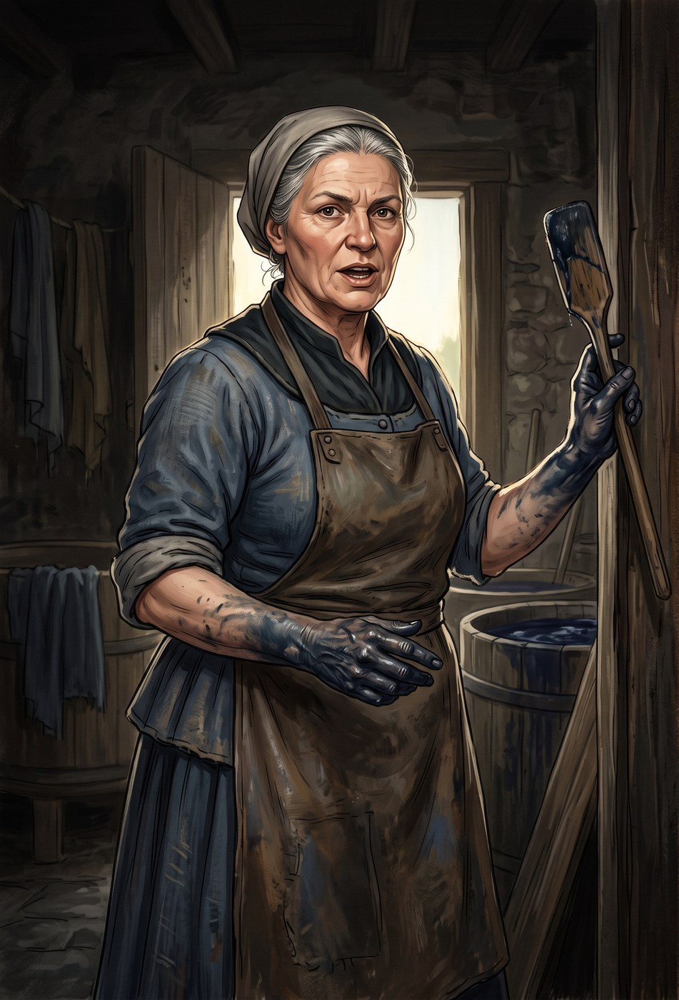
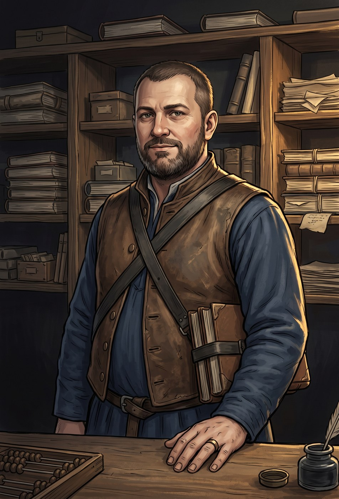
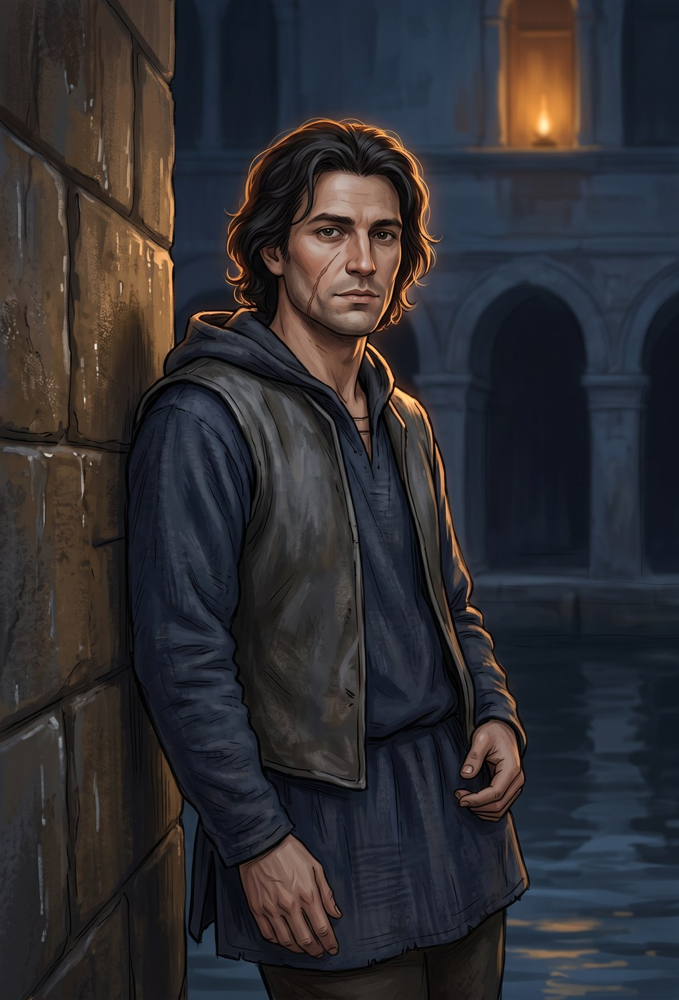

# Le agende — chi fa cosa, e a che ora

> **A cosa serve.** Un modulo d'intrigo si regge su una cosa sola: **gli avversari
> hanno un piano che va avanti anche quando i PG guardano da un'altra parte**. Qui
> c'è quel piano, ora per ora, per tutte e tre le giornate — più cosa succede se i
> giocatori lo smontano prima del previsto.
>
> Il DM legge il §1 e il §5 una volta. Il resto si consulta.

| § | Cosa |
|---|---|
| 1 | Ottavia Vesca — il piano completo, ora per ora |
| 2 | Sfregio — l'esecutore |
| 3 | Corvino Salle — il mediatore, l'anello che manca |
| 4 | Gerlando Attu — l'altra agenda |
| 5 | Il giro del mondo: cosa succede se i PG non fanno niente |
| 6 | Contromosse: se i giocatori smontano il piano troppo presto |
| 7 | Incontri scalabili — 4, 5, 6, 7 giocatori |
| 7-bis | **Quanto dura davvero uno scontro** — danno medio del gruppo, round previsti, chi rischia |
| 7-ter | **L'audit della ricchezza** — con quanto entrano e con quanto escono |

---

## §1 · Ottavia Vesca — Capitana del Bruco

**Vuole**: il bosco di spini, per rimettere al lavoro ottanta tintori fermi da
quattro anni.
**Teme**: di essere quella che ha sciolto una contrada. Lo è, e lo sa.
**Non vuole**: che qualcuno muoia. Su questo non transige, e più avanti le costerà.

> **La regola che rende Vesca un buon villain**: ha ragione. Non un po': ha
> *ragione*. Se il tavolo la odia, il DM sta sbagliando qualcosa — va sopportata, non
> odiata.

### Il piano in tre righe

1. Convincere l'Istrice a ritirarsi con un'offerta **vera e buona** (G1).
2. Se rifiutano, rendere impossibile che corrano — **senza sangue** — comprando il
   fieno, i ferri, e infine il cavallo (G2).
3. Se anche questo fallisce, correre e vincere, che è quello che ha sempre saputo
   fare (G3).

Il pezzo che **non** è suo è Sfregio. Vesca ha detto al mediatore *«che non corrano»*
e non ha chiesto come. È vigliaccheria, non innocenza, e va giocata così.

### Giorno 1

| Ora | Vesca | Dove | Se i PG ci sono |
|---|---|---|---|
| alba | firma il contratto d'assunzione per gli ottanta tintori, in bianco | tintoria | — |
| mattina | **va all'oratorio dell'Istrice, a piedi, sola** | oratorio | `01-GIORNO-1` §3 |
| mezzogiorno | parla con Attu: gli chiede di **non** anticipare il Peso all'Istrice | banco dell'Oca | Percezione CD 16 dal porticato per vederli insieme |
| pomeriggio | manda a dire al mediatore: *«che non corrano»* | Il Fondaco | Sirena Occo lo sa entro sera |
| tramonto | assiste alla Sorte in silenzio. **Non truffa** | la Ruota | se i PG barano, lei se ne accorge (Percezione +9) e non dice niente |
| notte | **non fa niente**. Dorme | casa sua | — |

### Giorno 2

| Ora | Vesca | Dove | Contromossa dei PG |
|---|---|---|---|
| mattina | compra **tutto il carico di fieno** di Bolsa | mercato | comprarlo prima (30 mo) o trovarne altrove |
| mattina | manda il vecchio Cima a offrire ferri a 4 mo | stalla dell'Istrice | Artigianato CD 15 per vedere che sono storti |
| mezzogiorno | ai Partiti **ripete l'offerta**, immutata | mercato del grano | `02-GIORNO-2` §2 |
| pomeriggio | il coro del Bruco canta al Fondaco | osteria | il duello dei canti |
| sera | **va all'ospizio con due sacchi di carbone**, sola | ospizio | `05-INIZIAZIONE` §4, Melchio |
| sera tardi | alla Cena, chiede di parlare **al rione** | vicoli dell'Istrice | `02-GIORNO-2` §4.2 |
| **notte** | **dorme, e non sa cosa sta succedendo alla stalla** | casa sua | l'assalto è di Salle, non suo |

### Giorno 3

| Ora | Vesca | Dove |
|---|---|---|
| alba | benedizione del cavallo del Bruco. Non ci crede e ci va lo stesso | oratorio del Bruco |
| mattina | corteo. Sfila per ultima, come da regolamento della contrada in carica | la Ruota |
| mezzogiorno | Stacco. Il suo fantino, «il Muto», **non commette una sola irregolarità** | le funi |
| terzo giro | quando cede il transennato, **Vesca scende dal palco e va a tirare fuori la gente**. Di persona | curva nord |
| sera | qualunque sia l'esito, all'ospizio arriva un carro di carbone. Senza biglietto | ospizio |

> **Il momento che decide come il tavolo la ricorderà**: al terzo giro, mentre la sua
> contrada può vincere, Vesca scende. **Falla scendere sempre.** Anche se i PG non se
> ne accorgono — anzi: soprattutto se non se ne accorgono, perché qualcuno glielo
> racconterà dopo.

---

## §2 · Sfregio — l'esecutore

Statblocco: `STATBLOCCHI-PF1E.md` §3. **Non conosce Vesca** e non l'ha mai vista.

**Vuole**: essere pagato e non lasciare tracce. **Teme**: le prigioni di terra —
c'è stato quattro anni a Cassomir.

| Quando | Cosa fa |
|---|---|
| G1 notte | entra in città. Dorme al Fondaco, angolo, non beve |
| G2 giorno | studia la stalla **tre volte**: mattina, pomeriggio, tramonto. Un PG di guardia con Percezione **CD 18** lo nota alla seconda |
| G2 notte | l'assalto (`02-GIORNO-2` §6). Obiettivi in ordine: garretti → acqua → rapire Nocca |
| G3 | **se ne va prima dell'alba**, riuscito o no. Se lo hanno catturato, non parla |

**Cosa ha addosso e perché conta**: la **ricevuta del mediatore** — un pezzo di carta
con un timbro a cera e tre lettere, `C·S·M`. È l'unico filo che porta a Salle, e
Salle è l'unico che porta a Vesca. **Sfregio non lo sa**: crede che il timbro sia di
una compagnia di trasporti.

---

## §3 · Corvino Salle — il mediatore

*Il personaggio che il modulo non mostra mai in scena, se i PG non lo cercano.*

Quarantotto anni, uomo di mezzo, sta a Cassomir e viene a Tarsilia due volte l'anno.
Compra incarichi e li rivende, tenendosi la metà. Ha **tre clienti** in città e Vesca
è solo uno.

- **Vuole**: che nessuno sappia per chi lavora, perché è l'unica cosa che vende.
- **Teme**: la Sovrintendente, che gli ha già chiuso una volta l'ufficio.
- **Come lo si trova**: la ricevuta (`C·S·M`) + Conoscenze (locali) CD 18, oppure
  Sirena Occo per un'informazione, oppure i battellieri della Cesta Rotta per 20 mo.
- **Cosa succede se lo trovano**: nega tutto, con calma, e **paga**. Offre 300 mo
  perché la cosa finisca lì. Se i PG accettano, il modulo prosegue e loro hanno un
  segreto scomodo. Se rifiutano, Salle lascia la città entro un'ora — e allora Vesca
  scopre da sé cosa era stato fatto in suo nome, e **quello** è il momento migliore
  del modulo per farle dire qualcosa di vero.

> **Se i PG portano la prova a Vesca al Giorno 3**: lei non si difende. Chiede di
> vedere la ricevuta, la legge due volte, e poi va lei stessa dalla Sovrintendente. Il
> Bruco viene **squalificato**. E l'Istrice si trova a correre contro sei contrade e a
> dover spiegare al proprio rione perché ha appena tolto il lavoro a ottanta tintori.

---

## §4 · Gerlando Attu — l'altra agenda

Non è alleato di nessuno. Vuole vincere il terzo Drappo di fila e ha impegnato più
di quanto ammetta per comprare **Fumo di Sera** — il cavallo grigio, duecento monete
d'oro pagate a Cassomir.

| Giornata | Cosa fa | Il punto debole |
|---|---|---|
| G1 | offre l'anticipo del Peso a Vanna, con la clausola | se i PG **leggono il foglio**, la clausola è lì, scritta piccola |
| G2 | compra da Sirena Occo la storia delle quaranta monete di Nocca | Percezione CD 15 per vederli parlare al mercato del grano |
| G3 mattina | usa la storia in pubblico (`03-GIORNO-3` §3) | se Nocca ha confessato, la carta è bruciata |
| G3 corsa | il suo fantino scudiscia alla Curva Sud, dove il palco non vede | un PG che *testimonia* dal palco (Percepire Intenzioni CD 15) |
| G3 sera | se ha perso: **la piena**. Cinquecento sacchi di grano assicurato e il fiume che sale | è rovinato, e nessuno se ne accorgerà per mesi |

---

## §5 · Il giro del mondo — se i PG non fanno niente

Serve per due motivi: se il tavolo si blocca, e per sapere **cosa raccontano i PNG**
di ciò che è successo altrove.

**Fine Giorno 1, se i PG sono stati fermi**: il Peso non è consegnato → ammissione con
riserva (`01-GIORNO-1` §8.3). Il cavallo assegnato è **La Storta**. Il rione lo viene
a sapere alla Zoppa e **Morale −1**.

**Fine Giorno 2, se i PG sono stati fermi**: il fieno non arriva, i ferri sono storti
(**Ritmo −2** cumulativo), Sfregio riesce (**Ritmo −3**), il duello dei canti lo
vince il Bruco (**Morale −1**). Il cavallo dell'Istrice arriva alla Corsa a
**Ritmo −7**. **Non è ancora perso**: con Morale basso e cavallo rotto, il terzo posto
resta possibile con due tiri fortunati, ed è esattamente il tipo di finale che un
tavolo racconta per anni.

**Fine Giorno 3, se i PG sono stati fermi**: vince l'Oca. L'Istrice viene accorpata.
Il decreto si legge lo stesso.

**Cosa succede comunque, ovunque siano i PG:**

| Quando | Fatto | Chi lo racconta |
|---|---|---|
| G1 sera | l'Oca e la Civetta si parlano | i battellieri |
| G2 mattina | il cavallo del Drago si azzoppa in prova, da solo | tutta la città |
| G2 sera | due della Torre e due del Drago fanno a botte fuori dal Fondaco | la milizia |
| G3 alba | il pittore Rasca non ritira il compenso | il tesoriere del comune |
| G3 sera | il fiume sale di un palmo | i pali del pontile |

---

## §6 · Contromosse — se il piano viene smontato troppo presto

Succederà: sei giocatori svegli bruciano un piano in una serata. **Non barare per
salvarlo.** Usa una di queste, che sono conseguenze e non toppe.

| Se i PG… | Allora |
|---|---|
| **catturano Sfregio al G2** | il piano di Salle finisce. Ma la contrada ha in casa un uomo che nessuno può denunciare senza spiegare come l'hanno preso — e Trenchi della Torre fa domande |
| **smascherano Vesca al G2** | il Bruco viene squalificato e ottanta tintori restano fermi. Il G3 diventa: correre contro sei, e reggere lo sguardo del proprio rione, che con la Corsa non c'entra niente |
| **accettano l'offerta di Vesca** | `01-GIORNO-1` §8.1. Il modulo continua e migliora |
| **comprano tutto prima** (fieno, ferri, informazioni) | ottimo: hanno speso la cassa della contrada. Al G3 non ci sono soldi per il corteo, e la sbandierata parte con **−2** |
| **uccidono qualcuno** | Ubalda Trenchi apre un'inchiesta. Un PG in cella al G3, e la contrada corre in cinque |
| **vanno da Salle al G1**, prima di tutto | Salle non ha ancora ricevuto l'incarico. Nega, ed è **vero**. I PG bruciano una giornata e imparano una lezione sul tempismo |

---

## §7 · Incontri scalabili

**Regola generale**: il modulo è tarato su **sei PG di 3°**. Le colonne danno la
composizione equivalente per gli altri numeri. I gradi di sfida seguono le tabelle
PF1e (px per GS, non «un mostro in più a caso»).

### 7.1 · La rissa alla fontana — `01-GIORNO-1` §6

| Giocatori | Composizione | px | GS eff. |
|---|---|---|---|
| **4** | 3 × tintore (esperto 1) | 405 | 2 |
| **5** | 4 × tintore | 540 | 3 |
| **6** | 5 × tintore | 675 | 3 |
| **7** | 6 × tintore + **Pico** (guerriero 1) | 1.010 | 4 |

*Danno non letale in ogni caso. Se si estrae una lama vera, tutti si fermano.*

### 7.2 · L'assalto alle stalle — `02-GIORNO-2` §6

| Giocatori | Composizione | px | GS eff. |
|---|---|---|---|
| **4** | Sfregio + 2 bravacci; **niente pasta corrosiva** (Salle ha pagato meno) | 1.200 | 4 |
| **5** | Sfregio + 3 bravacci | 1.400 | 4 |
| **6** | Sfregio + 4 bravacci | 1.600 | 5 |
| **7** | Sfregio + 5 bravacci + **un secondo scassinatore** (ladro 2, GS 1) | 2.200 | 6 |

**Se i PG hanno preparato la stalla** (trappole, guardie, la mula sciolta): togli un
bravaccio e dài a Sfregio **−2 alla Furtività** del primo round. Un party che si
prepara deve vincere più facilmente: è il patto.

### 7.3 · Il salvataggio in tintoria — `03-GIORNO-3` §1-bis

| Giocatori | Composizione | Nota |
|---|---|---|
| **4** | 1 bravaccio (Pico) | se lo hanno curato al G1, apre la porta e basta |
| **5** | 2 bravacci | |
| **6** | 2 bravacci + il capo-tino, che urla e chiama | |
| **7** | 3 bravacci + il capo-tino | |

### 7.4 · La curva nord — `03-GIORNO-3` §6

Non è un incontro: è un **hazard con vittime**. Scala sul numero di PG perché scala
sulle azioni disponibili.

| Giocatori | Persone sotto il transennato | Azioni necessarie per salvarle tutte |
|---|---|---|
| **4** | 6 | 2 |
| **5** | 8 | 3 |
| **6** | 11 | 4 |
| **7** | 14 | 5 |

**Ogni azione spesa qui è un'azione tolta al terzo giro.** È il costo, ed è
dichiarato al tavolo prima della scelta.

### 7.5 · Se il tavolo è di quinto livello invece che di terzo

Capita, se il gruppo arriva da un'altra avventura. Tre correzioni e basta:

1. **Sfregio** diventa ladro 6 (GS 5): +2 attacco, 40 pf, attacco furtivo +3d6.
2. **I bravacci** diventano guerrieri 2 (GS 1): 20 pf, CA 18.
3. **Tutte le CD non di combattimento salgono di 2**, tranne quelle del rito
   d'Investitura, che restano facili di proposito.

---

## §7-bis · Quanto dura davvero uno scontro — l'aritmetica

> **Perché c'è.** Il §7 dice **quanto è grosso** un incontro (px e GS). Non dice la
> cosa che il DM vuole sapere prima di sedersi: **quanti round dura**, e **chi
> rischia di cadere**. Il formato viene dai master della campagna
> (`07_il Portale Della Forgia Eterna/ARC07-DEF-1` §8, «Analisi DPR»), applicato qui.
>
> ⚠️ **Nessun numero nuovo**: tutto è calcolato dagli statblocchi di
> `STATBLOCCHI-PF1E.md` e dalle schede di `PREGEN-SEI-SCHEDE-PF1E.md`. Sono medie
> di tavolo, non fisica: servono a decidere il ritmo, non a sostituire i dadi.

### Il gruppo — danno medio per round, contro CA 16

| PG | Cosa fa davvero | Danno medio/round |
|---|---|---|
| **Vanna** — spada lunga +8 (1d8+3), con Attacco Poderoso +7 (1d8+5) | l'unica che regge la prima fila | **~5,5** |
| **Nocca** — spada corta +7, due armi +5/+5 | ⚠️ **non è un picchiatore**: il suo scudiscio serve a *rallentare*, non a uccidere | ~2,5 |
| **Ombra** — dardo acido, contatto +3 (1d6+1), **7 al giorno** | il contatto ignora l'armatura: contro i bravacci corazzati è il suo colpo migliore | ~2,7 |
| **Tesio** — balestra +3 (1d8) | il danno è l'ultima cosa che sa fare | ~1,8 |
| **Berenice** — spada lunga +2, **e l'esibizione** | il buff vale **più del suo attacco**: +1 a colpire e +1 ai danni su cinque persone | ~1,6 · **+2 al gruppo** |
| **Melchio** — scimitarra +3, e 4 canalizzazioni da 2d6 | tiene in piedi gli altri: 7 punti a testa, quattro volte | ~1,8 |
| **Gruppo intero (6)** | | **≈ 17-18/round** |

### I tre momenti duri

| Scontro | pf da togliere | **Round previsti** | Chi rischia |
|---|---|---|---|
| **La rissa alla fontana** (5 tintori, pf 6, CA 12) | 30, e sono CA 12: si colpisce quasi sempre | **2 round** | nessuno: è **danno non letale**, e si fermano appena vedono una lama vera |
| **L'assalto alle stalle** (Sfregio 26 pf CA 18 + 4 bravacci 13 pf CA 16) | 78 | **5-6 round** — è il vero scontro del modulo | vedi sotto ⚠ |
| **La curva nord** | — | non è un incontro: è un **hazard a costo di azioni** (§7.4) | chi resta sul transennato |

### ⚠️ Le tre cose che l'aritmetica dice e la lettura no

1. **Tesio è il bersaglio, ed è un bersaglio fragile**: CA 12 e 20 pf. Sfregio con
   attacco furtivo fa in media **10,5** a colpo. **Due colpi e Tesio è a terra** — e
   Sfregio è precisamente il tipo che sceglie il bersaglio giusto. Non è un difetto
   da correggere: è la ragione per cui il gruppo deve **coprirlo**, e va giocata.
2. **I bravacci fanno più danno di quanto sembri**: 4 × mazza pesante +4 (1d8+2) =
   circa **12 punti a round** distribuiti. Il gruppo ne incassa ~18 in tutto per
   round: al terzo round qualcuno è sotto metà, ed è lì che serve Melchio.
3. **Sfregio non muore, se ne va.** Ha Riflessi +8, Schivare prodigioso e Furtività
   +19 in movimento: se lo si porta sotto metà, **esce**. Un DM che lo tiene in
   piedi fino a zero sta giocando un altro personaggio.

### Se il tavolo è più piccolo o più grande

Il §7 scala il **numero** dei nemici. L'aritmetica scala con lui: con **4 giocatori**
il gruppo fa ~11-12 a round e l'assalto passa a **7 round** — troppo. **Per questo il
§7 toglie la pasta corrosiva e un bravaccio**: non è generosità, è il conto.

---

## §7-ter · L'audit della ricchezza — con quanto entrano, con quanto escono

> **Perché c'è.** Un modulo di tre giorni che parte da un problema di **soldi** (il
> Peso di contrada) deve saper dire quanto denaro passa davvero per le mani del
> gruppo — se non altro perché qualcuno continuerà a giocare quei personaggi.
> Formato preso dagli audit della campagna (`ARC07-TESORO-WBL-AUDIT.md`), che
> chiudono con la regola *«ricchezza d'uscita = ingresso dell'arco dopo»*.

**Riferimento PF1e**: un PG di **3° livello** sta a **~3.000 mo** di equipaggiamento.
Le sei pregenerate ci stanno dentro: **il Drappo non è un modulo che arricchisce**, ed
è una scelta.

### Quello che entra

| Da dove | Quanto | Nota |
|---|---|---|
| La brocca del rione | **140 monete d'argento** = 14 mo | è il punto di partenza, e **non è del gruppo**: è della contrada |
| La cassa sotto le bandiere (`04-LUOGHI` §1.1) | **220 mo in argento vecchio** | va **trovata**, non regalata. È la via più pulita al Peso |
| Montepremi della Corsa | **500** primo · **200** secondo · **100** terzo | **alla contrada**, non ai PG |
| La ricevuta di Sfregio venduta alla Civetta | **300 mo** | ⚠️ o vale molto di più **tenuta in tasca**: è la scelta, non il prezzo |
| Il Drappo | **non ha prezzo e non si vende** | chi ci prova trova la città chiusa |

### Quello che esce

| Per cosa | Quanto |
|---|---|
| **Il Peso di contrada** | **100 mo** — è il muro del Giorno 1, e assorbe quasi tutto |
| Fieno, ferri, informazioni (se li comprano prima del Bruco) | 30-50 mo |
| Sirena Occo | ⚠️ **non si paga in monete**: si paga in informazioni, e quel prezzo torna al Giorno 3 |
| Il corteo del Giorno 3 | se hanno svuotato la cassa, la sbandierata parte a **−2** (`06-VILLAIN` §6) |

### Il conto, e la cosa che dice

> **Un gruppo che gioca bene esce dal Drappo con quasi gli stessi soldi con cui è
> entrato**, e con una contrada che non è stata accorpata.

È il punto del modulo: qui **la ricchezza non è il premio**. Il premio è un rione che
esiste ancora, un cavallo, e sei persone che nel rione hanno un nome. Se il DM
prosegue con questi PG, li consegna **al 4° livello, con l'equipaggiamento di
partenza** — `[INFERRED: nessuna riga del modulo assegna oggetti magici ai PG, e i
premi sono tutti di contrada]`.

⚠️ **Se invece il gruppo ha venduto la ricevuta** (300 mo) **e tenuto per sé il
montepremi**, sono ~800 mo divisi in sei: **poco più di 130 a testa**. Non cambia il
loro livello di potere; cambia **come li guarda il rione**, ed è quello che va
giocato.

